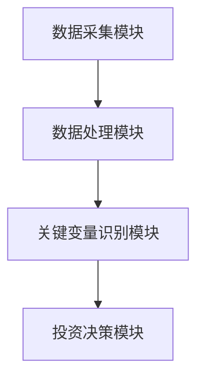
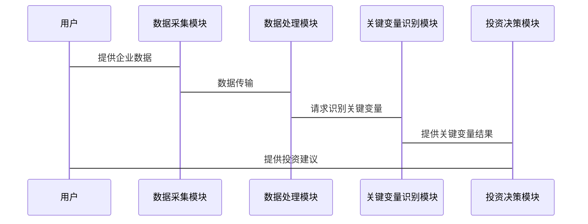

                 

# 芒格的"关键变量"理论：找出决定投资成败的核心因素

## 关键词：芒格，关键变量，投资决策，系统架构，数学模型

## 摘要：芒格的“关键变量”理论是一种通过识别和分析影响投资决策的关键因素，以优化投资策略和提高投资成功率的方法。本文将逐步分析该理论的核心概念、数学模型、系统架构以及实际应用案例，帮助读者理解如何在投资中应用这一理论。

---

## 第1章：芒格及其投资哲学概述

### 1.1 芒格的生平与投资理念

**1.1.1 芒格的生平简介**

查理·芒格（Charlie Munger）是世界著名投资者、伯克希尔哈撒韦公司副董事长，被誉为“投资圣人”。他出生于1924年，早年毕业于哈佛大学，后转向法律专业，并在加州建立了成功的法律实践。芒格的职业生涯不仅限于法律，他还是伯克希尔哈撒韦公司的重要决策者，与沃伦·巴菲特（Warren Buffett）共同创立了价值投资的理念。

**1.1.2 芒格的投资理念**

芒格的投资理念以“价值投资”为核心，强调购买那些市场价格低于其内在价值的股票。他主张投资者应该深入研究企业的基本面，关注企业的长期盈利能力、管理团队、财务状况等因素。芒格的“关键变量”理论正是这一理念的延伸，强调在投资决策中抓住那些能够显著影响企业价值的关键因素。

---

## 第2章：关键变量理论的核心概念与框架

### 2.1 关键变量的定义与特征

**2.1.1 关键变量的定义**

关键变量是指在投资决策过程中，能够对投资结果产生重大影响的少数重要因素。这些变量通常是企业经营中的关键因素，如市场需求、成本结构、竞争优势等。

**2.1.2 关键变量的特征对比**

| 特征 | 关键变量 | 非关键变量 |
|------|-----------|-------------|
| 影响力 | 高        | 低          |
| 可控性 | 高/低     | 低          |
| 数据可得性 | 高       | 低/高       |
| 时间敏感性 | 高       | 低          |

**2.1.3 关键变量的分类**

关键变量可以分为三类：

1. **财务变量**：如收入、利润、现金流等。
2. **经营变量**：如市场份额、竞争优势、管理能力等。
3. **外部变量**：如宏观经济环境、政策法规等。

---

## 第3章：关键变量的识别与量化方法

### 3.1 关键变量的识别流程

**3.1.1 投资目标的确定**

在进行投资之前，明确投资目标是关键。例如，投资者可能希望寻找具有稳定收益和高增长潜力的企业。

**3.1.2 变量的筛选与初步识别**

通过分析企业的财务报表、行业报告等，识别出可能影响企业价值的关键变量。

**3.1.3 变量的验证与确认**

通过进一步研究和数据分析，验证初步识别的变量是否确实是关键因素。

---

## 第4章：关键变量理论的数学模型与算法

### 4.1 关键变量的量化与评估

**4.1.1 因子分析模型**

因子分析是一种常用的心理学和统计学方法，用于识别数据中的潜在变量。在投资领域，我们可以使用因子分析来识别影响企业价值的关键变量。

**因子分析模型公式：**

$$
\mathbf{y} = \mathbf{B} \mathbf{f} + \mathbf{u}
$$

其中：
- $\mathbf{y}$ 是观测变量的向量。
- $\mathbf{B}$ 是因子载荷矩阵。
- $\mathbf{f}$ 是因子向量。
- $\mathbf{u}$ 是误差向量。

### 4.2 关键变量的动态调整与优化

**4.2.1 模型的优化与迭代**

通过不断收集新数据和反馈，对模型进行优化和迭代，以提高其准确性和适用性。

**动态调整公式示例：**

$$
\text{新权重} = \text{旧权重} + \alpha \times (\text{新数据影响} - \text{旧权重})
$$

其中，$\alpha$ 是调整系数，通常在0到1之间。

---

## 第5章：关键变量理论的系统架构与实现

### 5.1 系统分析与架构设计

**5.1.1 系统功能设计**

- 数据采集模块：收集企业的财务数据、行业数据等。
- 数据处理模块：对数据进行清洗和预处理。
- 关键变量识别模块：通过算法识别关键变量。
- 投资决策模块：基于关键变量进行投资决策。

**系统架构图（Mermaid）：**

### 5.2 系统接口与交互设计

**5.2.1 系统接口设计**

- 数据输入接口：接收企业的财务数据。
- 模型调用接口：调用因子分析模型进行关键变量识别。
- 结果输出接口：输出投资建议。

**系统交互流程（Mermaid）：**

---

## 第6章：关键变量理论的项目实战与案例分析

### 6.1 项目实战：分析某行业关键变量

**6.1.1 项目介绍**

假设我们选择一个行业（如科技行业），目标是识别影响该行业企业价值的关键变量。

**6.1.2 数据收集与处理**

收集该行业的财务数据、市场数据、行业报告等，清洗数据并进行预处理。

**6.1.3 模型构建与分析**

使用因子分析模型识别关键变量，例如，发现研发投入、市场份额、利润率是关键变量。

**6.1.4 投资决策**

基于关键变量的分析结果，制定投资策略，例如，投资那些研发投入高、市场份额大且利润率稳定的公司。

---

## 第7章：关键变量理论的总结与扩展

### 7.1 理论总结与反思

**7.1.1 理论总结**

芒格的“关键变量”理论提供了一种在复杂投资环境中优化决策的方法，通过识别关键变量，投资者可以更有效地评估企业的价值和风险。

**7.1.2 投资实践中的应用**

关键变量理论不仅适用于股票投资，还可以应用于其他类型的投资，如房地产、私募股权等。

---

## 结语

芒格的“关键变量”理论为我们提供了一种系统化的方法来优化投资决策。通过识别和分析关键变量，投资者可以更准确地评估企业的价值，制定更科学的投资策略。这一理论不仅适用于股票投资，还可以扩展到其他领域，具有广泛的应用前景。

---

**关键词：芒格，关键变量，投资决策，系统架构，数学模型**

