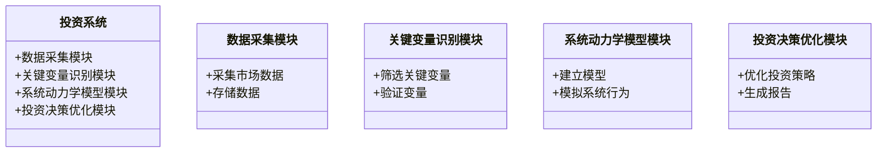

                 


# 芒格的"关键变量"识别在复杂系统投资中的运用

> 关键词：芒格投资理念，关键变量识别，复杂系统，系统动力学，Python建模，投资决策优化

> 摘要：本文详细阐述了芒格的关键变量识别方法在复杂系统投资中的应用，从理论基础到实际案例，结合系统动力学模型和Python代码实现，帮助投资者优化决策过程。

---

# 第1章 芒格的投资理念与关键变量识别

## 1.1 芒格的投资哲学

### 1.1.1 芒格的"关键变量"概念

芒格的"关键变量"识别方法是其投资体系的核心，强调在复杂系统中找到那些能够解释大部分系统行为的少数变量。例如，在分析一家公司的财务状况时，利润、收入和成本可能是关键变量。

### 1.1.2 芒格投资体系的核心思想

芒格的投资方法强调长期价值和安全边际，通过识别关键变量来评估公司的内在价值和潜在风险。这种方法帮助投资者在复杂市场中做出更明智的决策。

### 1.1.3 关键变量识别在投资中的重要性

关键变量识别能够帮助投资者抓住影响系统的主要因素，避免被次要信息干扰，从而提高投资决策的准确性和效率。

---

## 1.2 关键变量识别的定义与特征

### 1.2.1 关键变量的定义

关键变量是那些对系统行为有重大影响的因素，能够解释和预测系统的大部分变化。例如，在经济周期中，GDP增长率和失业率可能是关键变量。

### 1.2.2 关键变量的特征对比

| 特征 | 关键变量 | 次要变量 |
|------|----------|----------|
| 影响力 | 高       | 低       |
| 相关性 | 高       | 低       |
| 可测量性 | 高       | 中       |

### 1.2.3 关键变量与次要变量的区别

关键变量通常具有高度的影响力和相关性，而次要变量则对系统行为影响较小。例如，在股票市场中，行业趋势可能是关键变量，而公司的短期财务数据可能是次要变量。

---

## 1.3 关键变量识别的步骤与方法

### 1.3.1 确定研究目标

明确研究目标是关键变量识别的第一步。例如，研究目标可能是预测某公司的未来收益。

### 1.3.2 数据收集与分析

通过收集相关数据，分析变量之间的关系，找出对目标影响最大的变量。例如，通过回归分析确定收入、成本和利润的关系。

### 1.3.3 变量筛选与验证

使用统计方法和领域知识进行变量筛选，验证关键变量的有效性和准确性。例如，使用方差分析筛选出对利润影响最大的变量。

---

# 第2章 复杂系统的定义与特点

## 2.1 复杂系统的定义

复杂系统是指由多个相互作用的组成部分构成，表现出非线性、不确定性、动态性和适应性的系统。例如，金融市场就是一个复杂的系统，受到多种因素的影响。

## 2.2 复杂系统的动态特征

### 2.2.1 系统的非线性特征

复杂系统的变量之间通常存在非线性关系，例如，收入增加不一定导致利润线性增加。

### 2.2.2 系统的反馈机制

系统内部的反馈机制可以是正反馈或负反馈，影响系统的稳定性和变化趋势。例如，股价上涨吸引更多投资者，形成正反馈。

### 2.2.3 系统的不确定性

复杂系统中存在许多不确定性因素，例如，政策变化和市场波动，这些因素难以预测和量化。

## 2.3 复杂系统的模型化

### 2.3.1 系统模型的分类

复杂系统的模型可以分为线性模型、非线性模型和网络模型等。例如，股票价格模型可以是非线性的。

### 2.3.2 系统模型的构建步骤

1. 确定目标和范围
2. 收集相关数据
3. 选择合适的模型类型
4. 参数估计和模型验证
5. 模拟和分析

### 2.3.3 系统模型的验证与优化

通过历史数据验证模型的准确性，调整参数和结构以提高模型的预测能力。

---

## 2.4 本章小结

复杂系统具有非线性、动态性和不确定性的特点，关键变量识别在复杂系统的分析中尤为重要。通过建立系统模型，可以更好地理解和预测系统的行为。

---

# 第3章 系统动力学模型与关键变量识别

## 3.1 系统动力学模型的定义

系统动力学模型是一种描述系统中变量随时间变化的数学模型，常用于分析复杂系统的动态行为。例如，用于分析公司利润的变化趋势。

## 3.2 系统动力学模型的构建

### 3.2.1 确定系统变量

首先，明确系统中的变量，例如，收入、成本、利润等。

### 3.2.2 建立变量之间的关系

通过分析变量之间的关系，建立数学方程。例如，利润 = 收入 - 成本。

### 3.2.3 确定模型参数

通过历史数据估计模型参数，例如，收入增长率。

---

## 3.3 系统动力学模型的实现

### 3.3.1 使用Python建立系统动力学模型

通过Python编程实现系统动力学模型，例如，使用微分方程模拟利润的变化。

```python
import numpy as np
import matplotlib.pyplot as plt

def system_dynamics_model(t, initial_profit, growth_rate):
    t_steps = len(t)
    profit = np.zeros(t_steps)
    profit[0] = initial_profit
    for i in range(1, t_steps):
        profit[i] = profit[i-1] * (1 + growth_rate)
    return profit

t = np.linspace(0, 10, 100)
initial_profit = 100
growth_rate = 0.05

profit = system_dynamics_model(t, initial_profit, growth_rate)
plt.plot(t, profit)
plt.xlabel('Time')
plt.ylabel('Profit')
plt.title('System Dynamics Model')
plt.show()
```

### 3.3.2 系统动力学模型的验证

通过历史数据验证模型的准确性，调整参数以提高预测能力。

---

## 3.4 关键变量识别的数学模型

### 3.4.1 关键变量识别的数学方法

通过统计方法和领域知识，识别对系统行为影响最大的变量。例如，使用主成分分析（PCA）筛选关键变量。

### 3.4.2 关键变量识别的算法实现

```python
from sklearn.decomposition import PCA

# 假设数据集为X，包含多个变量
pca = PCA(n_components=2)
principal_components = pca.fit_transform(X)
```

---

## 3.5 本章小结

系统动力学模型和数学方法是关键变量识别的重要工具，通过建立模型和分析数据，可以更准确地识别关键变量，优化投资决策。

---

# 第4章 投资系统架构设计

## 4.1 投资系统的功能设计

### 4.1.1 系统目标

通过系统化的分析和建模，识别关键变量，优化投资决策。

### 4.1.2 功能模块

1. 数据采集模块
2. 关键变量识别模块
3. 系统动力学模型模块
4. 投资决策优化模块

### 4.1.3 领域模型（mermaid类图）



---

## 4.2 系统架构设计

### 4.2.1 系统架构图（mermaid架构图）


---

## 4.3 本章小结

通过系统的架构设计，可以更好地组织和管理投资分析过程，提高关键变量识别和投资决策的效率。

---

# 第5章 项目实战：复杂系统的投资分析

## 5.1 实战背景

在当前复杂的经济环境下，投资者需要通过识别关键变量来优化投资策略。例如，分析宏观经济指标和行业趋势，识别影响股票价格的关键因素。

## 5.2 实战步骤

### 5.2.1 数据采集与预处理

收集相关数据，进行清洗和预处理。例如，收集过去5年的GDP增长率、失业率和股票价格数据。

### 5.2.2 关键变量识别

通过统计分析和领域知识，筛选出影响股票价格的关键变量，例如GDP增长率和失业率。

### 5.2.3 建立系统动力学模型

使用Python建立模型，模拟股票价格的变化趋势。

### 5.2.4 投资决策优化

基于模型分析结果，优化投资策略，制定买入或卖出决策。

---

## 5.3 实战案例分析

### 5.3.1 数据采集与处理

```python
import pandas as pd
import numpy as np

# 假设数据集为df，包含GDP增长率、失业率和股票价格
df = pd.read_csv('data.csv')
df = df.dropna()
```

### 5.3.2 关键变量识别

```python
from sklearn.feature_selection import SelectKBest, f_regression

selector = SelectKBest(score_func=f_regression, k=2)
selected_features = selector.fit_transform(df[['GDP增长率', '失业率', '其他变量']], df['股票价格'])
```

### 5.3.3 建立系统动力学模型

```python
def stock_price_model(t, initial_price, gdp_growth, unemployment_rate):
    t_steps = len(t)
    price = np.zeros(t_steps)
    price[0] = initial_price
    for i in range(1, t_steps):
        price[i] = price[i-1] * (1 + gdp_growth * (1 - unemployment_rate))
    return price

t = np.linspace(0, 10, 100)
initial_price = 100
gdp_growth = 0.03
unemployment_rate = 0.05

stock_price = stock_price_model(t, initial_price, gdp_growth, unemployment_rate)
plt.plot(t, stock_price)
plt.xlabel('Time')
plt.ylabel('Stock Price')
plt.title('Stock Price Model')
plt.show()
```

### 5.3.4 投资决策优化

基于模型分析结果，制定买入或卖出决策，优化投资组合。

---

## 5.4 本章小结

通过实战案例分析，展示了关键变量识别在投资决策中的实际应用，帮助投资者在复杂系统中做出更明智的决策。

---

# 第6章 总结与展望

## 6.1 总结

芒格的关键变量识别方法在复杂系统投资中的应用，能够帮助投资者抓住影响系统的主要因素，优化投资决策过程。通过系统动力学模型和数学方法，可以更准确地分析和预测系统行为。

## 6.2 展望

未来的研究可以进一步探讨关键变量识别在更多复杂系统中的应用，开发更高效的算法和工具，帮助投资者在复杂市场中取得更好的投资效果。

---

# 第7章 最佳实践 tips

## 7.1 投资者需要注意的事项

1. 持续学习和更新关键变量的识别方法。
2. 注意数据的质量和来源，确保分析的准确性。
3. 结合实际情况，灵活调整投资策略。

## 7.2 关键变量识别的注意事项

1. 避免过度依赖单一变量，保持多变量的综合分析。
2. 定期验证模型的准确性和适用性。
3. 考虑系统的动态性和不确定性，避免线性思维。

## 7.3 推荐的拓展阅读

1. 芒格的《穷查理芒格》
2. 系统动力学相关书籍
3. 数据科学与机器学习在金融中的应用

---

# 结语

通过芒格的关键变量识别方法，投资者可以在复杂系统中找到影响投资决策的主要因素，优化投资策略，提高投资收益。希望本文的内容能够为投资者提供有价值的参考和启发，帮助他们在复杂市场中做出更明智的投资决策。

