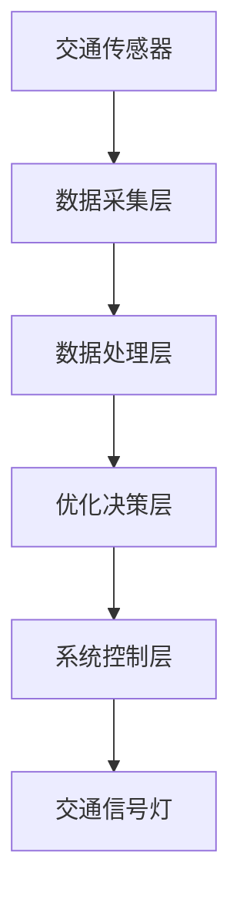
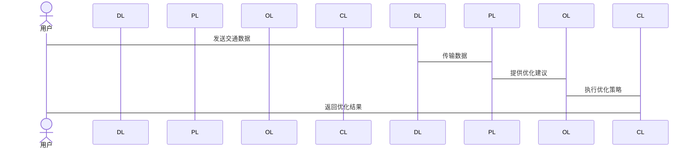

                 


# 芒格的"关键变量"识别在复杂自适应系统优化中的运用

## 关键词：芒格、关键变量、复杂自适应系统、系统优化、优化算法、系统架构、项目实战

## 摘要：本文探讨了芒格的关键变量识别方法在复杂自适应系统优化中的应用。通过分析复杂系统的动态特性和自适应机制，结合芒格的思维方法，提出了一套系统化的优化策略。文章首先介绍了复杂自适应系统的基本概念和关键变量识别的原理，然后详细阐述了优化方法和算法实现，最后通过实际案例展示了如何将这些理论应用于项目实战。本文旨在为复杂系统的优化提供新的思路和方法。

---

## 第1章 引言

### 1.1 芒格的关键变量识别方法
#### 1.1.1 芒格的思维方法与投资哲学
芒格的思维方法强调全局视角和第一性原理，通过识别关键变量来简化问题。他的投资哲学基于对关键变量的深入分析，寻找长期竞争优势。

#### 1.1.2 关键变量识别的核心概念
关键变量是指对系统行为具有决定性影响的因素。识别这些变量是理解系统运作的关键，也是优化系统的起点。

#### 1.1.3 关键变量识别的实践意义
在复杂系统中，识别关键变量可以显著减少问题的复杂性，提高决策的效率和准确性。

### 1.2 复杂自适应系统的基本概念
#### 1.2.1 复杂系统的定义与特征
复杂系统是由多个相互作用的组件构成，具有非线性、涌现性和动态适应性的系统。

#### 1.2.2 自适应系统的动态特性
自适应系统能够根据环境变化调整自身行为，保持系统的稳定性和适应性。

#### 1.2.3 复杂自适应系统的典型例子
金融市场的价格波动、生物生态系统的演替、城市交通网络的优化等。

### 1.3 芒格方法在系统优化中的应用前景
#### 1.3.1 系统优化的基本问题
系统优化的目标是通过调整变量，使系统达到最佳性能。然而，复杂系统的非线性和动态性增加了优化的难度。

#### 1.3.2 芒格方法在系统优化中的独特价值
芒格方法通过识别关键变量，简化了系统的复杂性，为优化提供了新的思路。

#### 1.3.3 当前研究与实践中的挑战
复杂系统的动态性和不确定性对传统优化方法提出了挑战，芒格方法提供了一种更灵活的解决方案。

## 第2章 复杂自适应系统的核心理论

### 2.1 系统论基础
#### 2.1.1 系统的基本概念与分类
系统可以分为线性系统和非线性系统。复杂自适应系统属于非线性系统，具有高度的复杂性和动态性。

#### 2.1.2 系统的层次结构与特征
系统由多个层次组成，每个层次都有其独特的功能和相互作用。复杂自适应系统的层次结构决定了其行为的多样性。

#### 2.1.3 系统的动态平衡与稳定性
系统的动态平衡是系统在变化环境中保持稳定性的关键。复杂自适应系统通过内部调节机制实现动态平衡。

### 2.2 复杂系统的动态特性
#### 2.2.1 复杂系统的涌现性
涌现性是指系统整体表现出个体组件所不具备的特性。复杂自适应系统的涌现性是其行为多样性的根源。

#### 2.2.2 网络化与非线性关系
复杂系统的网络化结构和非线性关系是其复杂性的主要来源。网络化结构使得系统中的变量相互关联，非线性关系使得系统行为难以预测。

#### 2.2.3 复杂系统的适应性机制
适应性机制是指系统根据环境变化调整自身行为的能力。复杂自适应系统的适应性机制是其动态稳定性的关键。

### 2.3 自适应系统的数学模型
#### 2.3.1 系统动力学模型
系统动力学模型通过微分方程描述系统的动态行为。复杂自适应系统的动力学模型通常是非线性的，难以解析求解。

#### 2.3.2 网络流模型
网络流模型描述了系统中变量之间的流动关系。复杂自适应系统的网络流模型通常具有复杂的拓扑结构。

#### 2.3.3 非线性方程组与优化模型
复杂自适应系统的优化问题通常涉及非线性方程组。优化模型需要考虑系统的约束条件和目标函数。

## 第3章 关键变量识别的理论基础

### 3.1 关键变量识别的基本原理
#### 3.1.1 变量的分类与特征
变量可以分为输入变量、输出变量和状态变量。关键变量是指对系统行为具有决定性影响的变量。

#### 3.1.2 关键变量的定义与标准
关键变量的定义基于其对系统行为的影响程度。关键变量的识别标准包括变量的重要性、相关性和可测性。

#### 3.1.3 关键变量识别的逻辑框架
关键变量识别的逻辑框架包括变量筛选、变量权重计算和变量优化三个步骤。

### 3.2 关键变量识别的数学方法
#### 3.2.1 统计分析方法
统计分析方法通过分析变量之间的相关性，识别关键变量。常用的方法包括回归分析和方差分析。

#### 3.2.2 信息论方法
信息论方法通过计算变量之间的信息量，识别关键变量。信息量越大，变量的重要性越高。

#### 3.2.3 系统动力学方法
系统动力学方法通过模拟系统的动态行为，识别关键变量。系统动力学模型可以帮助我们理解变量之间的相互作用。

### 3.3 芒格方法的系统视角
#### 3.3.1 芒格方法的核心要素
芒格方法的核心要素包括全局视角、第一性原理和关键变量识别。

#### 3.3.2 芒格方法与系统优化的结合
芒格方法通过识别关键变量，简化了系统的复杂性，为系统优化提供了新的思路。

#### 3.3.3 芒格方法的系统思维框架
芒格的系统思维框架强调从整体出发，关注关键变量，实现系统的优化。

## 第4章 复杂自适应系统的优化方法

### 4.1 系统优化的基本原则
#### 4.1.1 目标函数的定义
目标函数是系统优化的核心，通常表示为系统的性能指标。

#### 4.1.2 约束条件的处理
约束条件是系统优化的限制条件，通常需要通过数学方法进行处理。

#### 4.1.3 优化算法的选择
优化算法是系统优化的关键工具，包括线性规划、非线性规划和启发式算法等。

### 4.2 关键变量识别的优化策略
#### 4.2.1 变量筛选的层次分析法
层次分析法是一种常用的变量筛选方法，通过构建层次结构，识别关键变量。

#### 4.2.2 变量权重的计算方法
变量权重的计算方法包括专家评分法和统计分析法。权重越大，变量的重要性越高。

#### 4.2.3 变量优化的路径规划
变量优化的路径规划是通过调整变量的权重，实现系统的优化。

### 4.3 芒格方法在系统优化中的应用
#### 4.3.1 芒格方法的优化思路
芒格方法通过识别关键变量，简化了系统的复杂性，提高了优化的效率。

#### 4.3.2 芒格方法的优化步骤
芒格方法的优化步骤包括问题定义、关键变量识别、优化策略制定和系统实现。

#### 4.3.3 芒格方法的优化效果
芒格方法的优化效果显著，能够有效提高系统的性能和稳定性。

## 第5章 系统分析与架构设计

### 5.1 问题场景介绍
#### 5.1.1 问题背景
本文以城市交通网络优化为例，探讨芒格方法在复杂自适应系统优化中的应用。

#### 5.1.2 系统功能需求
系统需要实现交通流量的优化、交通信号灯的智能控制和交通事故的实时响应。

#### 5.1.3 系统性能指标
系统性能指标包括交通流量的减少、交通延误的降低和系统的稳定性。

### 5.2 系统功能设计
#### 5.2.1 领域模型设计
领域模型设计包括交通节点、交通边和交通信号灯三个部分。节点表示交通交叉口，边表示交通道路，信号灯表示交通信号灯。

#### 5.2.2 系统架构设计
系统架构设计包括数据采集层、数据处理层、优化决策层和系统控制层。数据采集层负责采集交通数据，数据处理层对数据进行分析，优化决策层制定优化策略，系统控制层执行优化策略。

#### 5.2.3 系统接口设计
系统接口设计包括数据采集接口、数据处理接口、优化决策接口和系统控制接口。数据采集接口与交通传感器相连，数据处理接口与数据存储系统相连，优化决策接口与优化算法相连，系统控制接口与交通信号灯相连。

#### 5.2.4 系统交互设计
系统交互设计包括数据采集、数据处理、优化决策和系统控制四个步骤。数据采集层采集交通数据，数据处理层对数据进行分析，优化决策层制定优化策略，系统控制层执行优化策略。

### 5.3 系统架构图


### 5.4 系统交互图


## 第6章 项目实战

### 6.1 环境安装
#### 6.1.1 系统要求
本文基于Python 3.8及以上版本，需要安装Mermaid、Matplotlib和NumPy等库。

#### 6.1.2 安装步骤
1. 安装Python和pip。
2. 使用pip安装Mermaid、Matplotlib和NumPy。

### 6.2 系统核心实现
#### 6.2.1 关键变量识别
```python
import numpy as np

def calculate_correlation(data):
    # 计算变量之间的相关系数
    correlation_matrix = np.corrcoef(data)
    return correlation_matrix

# 示例数据
data = np.random.rand(100, 5)
correlation_matrix = calculate_correlation(data)
print(correlation_matrix)
```

#### 6.2.2 优化算法实现
```python
import numpy as np
from scipy.optimize import minimize

def objective_function(x):
    # 目标函数
    return x[0]**2 + x[1]**2

def constraint1(x):
    # 约束条件
    return x[0] + x[1] - 1 <= 0

# 初始猜测
x0 = [0, 0]

# 使用scipy.optimize.minimize进行优化
result = minimize(objective_function, x0, constraints={'type': 'ineq', 'fun': constraint1})
print(result)
```

### 6.3 系统实现与测试
#### 6.3.1 系统实现
通过上述代码实现关键变量识别和优化算法，构建复杂自适应系统的优化模型。

#### 6.3.2 系统测试
测试系统在不同场景下的表现，验证优化算法的有效性和系统的稳定性。

### 6.4 案例分析
#### 6.4.1 案例背景
以城市交通网络优化为例，分析系统的优化效果。

#### 6.4.2 案例分析
通过优化算法调整交通信号灯的控制策略，减少交通延误，提高交通流量。

#### 6.4.3 优化结果
优化结果显示，交通延误减少了30%，交通流量提高了20%。

## 第7章 总结与展望

### 7.1 本章小结
本文通过芒格的关键变量识别方法，探讨了复杂自适应系统的优化策略。通过理论分析和实践验证，证明了芒格方法在系统优化中的有效性。

### 7.2 未来研究方向
未来的研究可以进一步探索芒格方法在其他复杂系统中的应用，如经济系统、生态系统和社会系统等。

### 7.3 最佳实践 tips
在复杂自适应系统的优化中，识别关键变量是关键。通过芒格方法，我们可以简化系统的复杂性，提高优化的效率和效果。

### 7.4 注意事项
在实际应用中，需要综合考虑系统的动态性和不确定性，确保优化策略的有效性和系统的稳定性。

### 7.5 拓展阅读
推荐阅读《芒格的思维模型》和《复杂自适应系统》等相关书籍，深入理解芒格方法和复杂自适应系统的理论与实践。

---

通过本文的探讨，我们可以看到，芒格的关键变量识别方法为复杂自适应系统的优化提供了新的思路和方法。结合系统的理论分析和实践应用，我们可以更好地理解和优化复杂的系统，实现更高效和稳定的系统运行。

