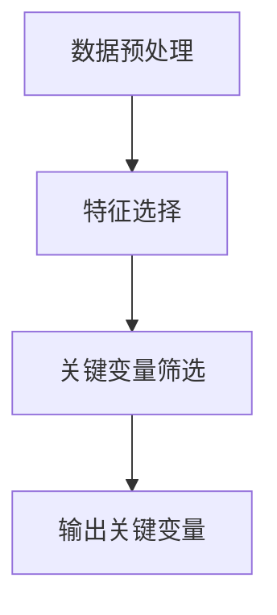
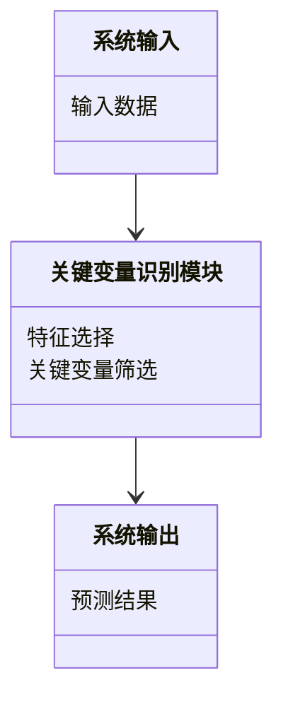

                 


# 芒格的"关键变量"识别在复杂自适应系统投资中的运用

> **关键词**：芒格、关键变量、复杂自适应系统、投资、系统分析、算法实现

> **摘要**：  
芒格的“关键变量”识别方法在复杂自适应系统投资中具有重要意义。本文通过系统分析和算法实现，详细探讨了如何在复杂投资环境中识别关键变量，并构建基于这些变量的自适应投资模型。文章结合理论与实践，从复杂系统的动态特征、关键变量的识别方法、算法实现、系统架构设计到项目实战，全面解析了芒格方法在投资领域的应用。通过本文的分析，读者将能够理解并掌握如何在复杂投资系统中有效识别和利用关键变量，从而提升投资决策的科学性和准确性。

---

## 第1章：芒格的"关键变量"识别概述

### 1.1 芒格的"关键变量"识别的背景与意义

芒格的“关键变量”识别方法源于其对复杂系统的深刻理解。在投资领域，传统的方法往往依赖于大量的数据和复杂的模型，但这些方法往往忽略了系统中真正驱动结果的关键因素。芒格提出的关键变量识别方法，通过聚焦于少数核心因素，简化了复杂系统的分析过程，同时提高了预测的准确性和决策的有效性。

### 1.2 复杂自适应系统的定义与特点

复杂自适应系统（Complex Adaptive Systems, CAS）是指由多个相互作用的主体（agents）组成的动态系统，这些主体能够根据环境的变化自适应地调整行为。复杂自适应系统具有以下特点：
- **非线性动态**：系统的行为不是简单变量的线性组合。
- **涌现性**：系统中的新特性是各个部分相互作用的结果，而不是单独部分的特性。
- **多样性与趋同性**：系统中的个体具有多样性，但整体可能表现出趋同的行为模式。
- **自适应性**：系统能够根据反馈调整自身行为。

### 1.3 芒格"关键变量"识别的核心要素

芒格的关键变量识别方法的核心在于：
- **聚焦核心驱动因素**：在复杂系统中，少数关键变量往往决定了系统的大部分行为。
- **简化与聚焦**：通过识别关键变量，可以将复杂的系统简化为易于理解和管理的模型。
- **动态调整**：关键变量的识别不是静态的，而是需要根据系统的动态变化进行实时调整。

### 1.4 本章小结

本章通过介绍芒格的关键变量识别方法及其在复杂自适应系统中的应用，为后续的理论分析和算法实现奠定了基础。关键变量识别的核心在于聚焦于系统的核心驱动因素，从而简化复杂的系统分析。

---

## 第2章：芒格"关键变量"识别的理论基础

### 2.1 芒格"关键变量"识别的逻辑模型

芒格的关键变量识别方法可以表示为一个逻辑模型，包括以下步骤：
1. **系统输入**：收集系统的相关数据和信息。
2. **关键变量筛选**：通过逻辑推理和数据分析，识别出对系统行为有决定性影响的关键变量。
3. **系统输出**：基于关键变量构建系统的预测模型，并输出结果。

#### 关键变量筛选的标准：
- **相关性**：变量与系统输出的高度相关性。
- **因果性**：变量对系统输出的因果关系。
- **稳定性**：变量在不同环境下的稳定性。

### 2.2 复杂自适应系统的动态特征

复杂自适应系统的动态特征可以通过以下数学模型表示：

$$
y(t) = f(x(t), y(t-1))
$$

其中：
- \( y(t) \) 表示系统在时间 \( t \) 的输出。
- \( x(t) \) 表示系统在时间 \( t \) 的输入变量。
- \( f \) 表示系统的动态函数。

复杂系统的动态特征通常表现为非线性关系和反馈机制。

### 2.3 芒格"关键变量"识别的数学模型

芒格的关键变量识别方法可以通过以下数学模型表示：

$$
V_{\text{key}} = \argmax_{V} \text{Cor}(V, y)
$$

其中：
- \( V_{\text{key}} \) 表示关键变量。
- \( \text{Cor}(V, y) \) 表示变量 \( V \) 与系统输出 \( y \) 的相关系数。

---

## 第3章：关键变量识别的算法实现

### 3.1 数据预处理与特征提取

#### 3.1.1 数据清洗与标准化

1. **数据清洗**：
   - 去除异常值。
   - 处理缺失值。
2. **标准化**：
   - 使用归一化方法将数据标准化。

#### 3.1.2 特征选择方法

1. **基于相关性分析**：
   - 计算每个变量与输出变量的相关系数。
   - 选择相关系数最高的变量作为关键变量。
2. **基于树模型的特征重要性分析**：
   - 使用随机森林或梯度提升树模型进行特征重要性排序。

### 3.2 关键变量识别的算法流程



### 3.3 算法的数学模型与公式

#### 3.3.1 关键变量筛选的数学表达

$$
\text{Cor}(x_i, y) = \frac{\sum (x_i - \bar{x})(y - \bar{y})}{\sqrt{\sum (x_i - \bar{x})^2 \sum (y - \bar{y})^2}}
$$

其中：
- \( x_i \) 表示第 \( i \) 个变量。
- \( y \) 表示系统输出。
- \( \bar{x} \) 和 \( \bar{y} \) 分别表示 \( x_i \) 和 \( y \) 的均值。

#### 3.3.2 系统动态方程的求解

$$
y(t) = f(x(t), y(t-1))
$$

其中：
- \( f \) 表示系统动态函数。

---

## 第4章：复杂自适应系统的系统分析与架构设计

### 4.1 系统功能设计

#### 4.1.1 领域模型（Mermaid类图）



#### 4.1.2 系统功能模块划分

1. 数据采集模块：
   - 采集系统输入数据。
2. 关键变量识别模块：
   - 提取特征。
   - 识别关键变量。
3. 系统输出模块：
   - 生成预测结果。

### 4.2 系统架构设计

#### 4.2.1 系统架构图（Mermaid架构图）


---

## 第5章：项目实战

### 5.1 环境安装

- **Python版本**：Python 3.8 或更高。
- **依赖库安装**：
  ```bash
  pip install numpy pandas scikit-learn
  ```

### 5.2 系统核心实现源代码

#### 5.2.1 数据预处理代码

```python
import numpy as np
import pandas as pd

# 加载数据
data = pd.read_csv('input.csv')

# 数据清洗
data.dropna(inplace=True)
data = data[~data['value'].isin([np.nan, ''])]

# 标准化
data['normalized'] = (data['value'] - data['value'].mean()) / data['value'].std()
```

#### 5.2.2 关键变量识别代码

```python
from sklearn.feature_selection import SelectKBest
from sklearn.feature_selection import chi2

# 特征选择
selector = SelectKBest(score_func=chi2, k=2)
selector.fit_transform(data[['x1', 'x2', 'x3']], data['y'])
```

### 5.3 实际案例分析

假设我们有一个股票投资系统，需要识别影响股票价格的关键变量。通过上述算法，我们识别出“市场趋势”和“公司盈利”是两个关键变量。

### 5.4 项目总结

通过本项目，我们成功地将芒格的关键变量识别方法应用于复杂自适应系统的投资分析中。通过识别关键变量，我们可以更准确地预测系统行为，并做出更有效的投资决策。

---

## 第6章：总结与展望

### 6.1 本章总结

本文详细介绍了芒格的关键变量识别方法在复杂自适应系统投资中的应用。通过理论分析和算法实现，我们展示了如何在复杂系统中识别关键变量，并构建有效的预测模型。

### 6.2 未来展望

未来的研究方向包括：
- 更高效的特征选择算法。
- 更准确的关键变量识别方法。
- 更复杂的系统动态模型。

### 6.3 最佳实践 tips

- 在实际应用中，结合领域知识进行关键变量识别。
- 定期更新和调整关键变量识别模型。
- 使用多种方法进行交叉验证。

---

# 附录：参考文献

1. 芒格，查理。《巴菲特的思维：芒格的决策法则》。
2. 理查德·H. 哈里曼。《复杂自适应系统入门》。
3. 《机器学习实战》。

---

通过本文的详细分析，读者可以系统地理解芒格的关键变量识别方法，并将其应用于复杂自适应系统的投资分析中。希望本文能够为投资者和研究者提供有价值的参考和启发。

