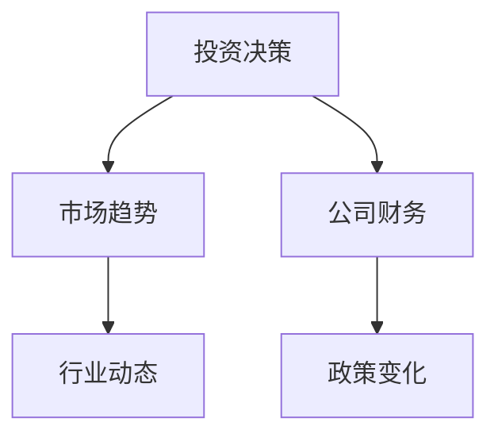
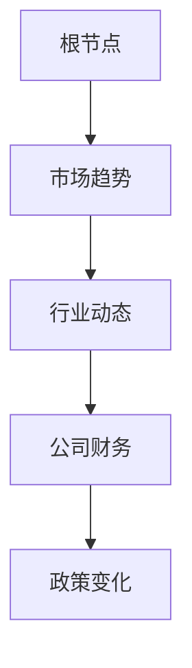
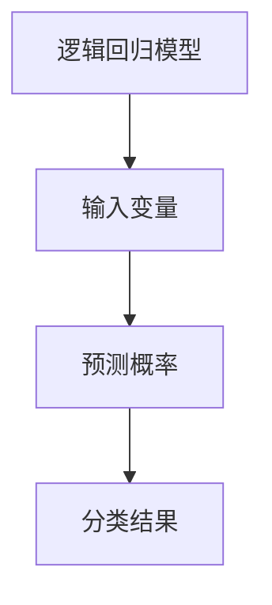
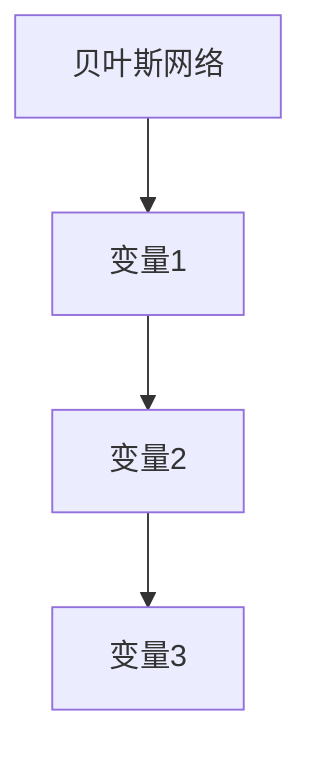
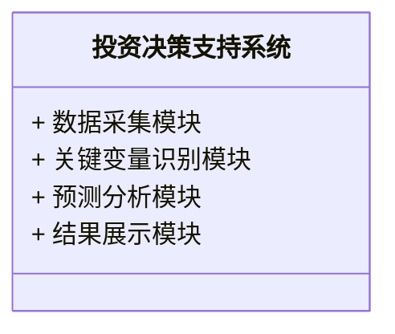
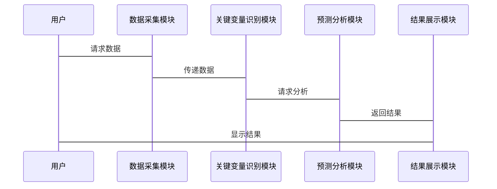
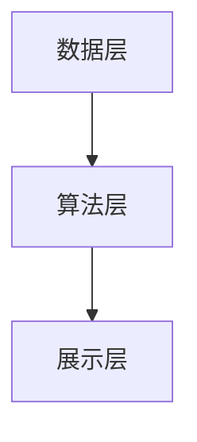

                 


# 芒格的"关键变量"识别：找出决定投资成败的核心因素

> 关键词：芒格，关键变量，投资决策，贝叶斯网络，决策树，投资系统架构

> 摘要：本文深入分析了芒格的“关键变量”识别理论，探讨了其在投资决策中的重要性，并结合数学模型和系统架构设计，详细阐述了如何通过关键变量识别来优化投资决策过程。文章从理论、算法、系统设计到项目实战，全面解析了关键变量识别的实现方法，并给出了实际案例分析和最佳实践建议。

---

## 第一部分：芒格的“关键变量”识别概述

### 第1章：投资决策中的关键变量

#### 1.1 投资决策的复杂性

##### 1.1.1 投资决策的核心问题
投资决策是人类经济活动中最复杂且最重要的决策之一。它涉及广泛的变量，如市场趋势、财务数据、行业动态、政策变化等。然而，这些变量之间的关系错综复杂，且受多种不确定性因素的影响。

##### 1.1.2 关键变量在投资中的重要性
在众多变量中，某些变量对投资结果的影响远大于其他变量。这些变量被称为“关键变量”。识别这些关键变量是优化投资决策的核心任务。

##### 1.1.3 芒格的决策框架
芒格的决策框架强调通过“关键变量”识别来简化复杂问题。他主张从经验中提炼关键变量，并通过逻辑推理不断优化这些变量的识别过程。

##### 1.1.4 关键变量与传统投资分析的区别
与传统投资分析不同，关键变量识别更注重变量之间的动态关系和对投资结果的决定性影响。这种方法能够帮助投资者在复杂市场中快速做出更精准的决策。

#### 1.2 关键变量的定义与特征

##### 1.2.1 关键变量的定义
关键变量是指在特定情境下，对目标结果（如投资收益）产生最大影响的少数变量。这些变量通常具有高度的相关性和预测性。

##### 1.2.2 关键变量的属性对比（表格形式）

| 属性         | 关键变量 | 次要变量 |
|--------------|----------|----------|
| 影响程度     | 高       | 中/低    |
| 相关性       | 强       | 弱       |
| 可预测性     | 高       | 中/低    |
| 数据获取难度 | 中/低    | 高       |

##### 1.2.3 关键变量的ER实体关系图（Mermaid流程图）



#### 1.3 芒格的“关键变量”识别方法

##### 1.3.1 从经验中提炼关键变量
芒格通过长期的投资实践，总结出了一系列关键变量，例如公司的财务健康状况、行业竞争格局等。

##### 1.3.2 通过逻辑推理发现关键变量
芒格强调逻辑推理的重要性，通过分析变量之间的因果关系，识别出对投资结果影响最大的关键变量。

##### 1.3.3 关键变量的动态变化与调整
市场环境不断变化，关键变量也会随之调整。芒格的方法强调持续监控和更新关键变量，以适应新的市场环境。

#### 1.4 本章小结
本章从投资决策的复杂性出发，详细阐述了关键变量的定义、特征及其在投资中的重要性。通过芒格的决策框架和关键变量识别方法，为后续的数学模型和系统设计奠定了理论基础。

---

## 第二部分：关键变量识别的数学模型与算法

### 第2章：关键变量识别的算法原理

#### 2.1 关键变量识别的决策树模型

##### 2.1.1 决策树的基本原理（Mermaid流程图）



##### 2.1.2 决策树的实现代码（Python）

```python
from sklearn.tree import DecisionTreeClassifier
import pandas as pd

# 示例数据
data = {
    '市场趋势': [1, 2, 3, 4],
    '行业动态': [2, 3, 4, 5],
    '公司财务': [3, 4, 5, 6],
    '政策变化': [4, 5, 6, 7],
    '投资收益': [1, 0, 1, 0]
}

df = pd.DataFrame(data)
X = df.drop(columns=['投资收益'])
y = df['投资收益']

# 构建决策树模型
model = DecisionTreeClassifier()
model.fit(X, y)
```

##### 2.1.3 决策树的优缺点分析
决策树的优点包括易于理解和实现，能够处理非线性关系。缺点是容易过拟合，且在高维数据下表现不佳。

#### 2.2 关键变量识别的回归分析

##### 2.2.1 线性回归的基本原理
线性回归通过最小化预测值与实际值之间的平方差之和，找到最佳拟合直线。

##### 2.2.2 逻辑回归的应用场景（Mermaid流程图）



##### 2.2.3 回归分析的数学模型（LaTeX公式）

线性回归的数学模型：
$$ y = \beta_0 + \beta_1x_1 + \beta_2x_2 + \dots + \beta_nx_n + \epsilon $$

逻辑回归的数学模型：
$$ P(y=1|x) = \frac{e^{\beta_0 + \beta_1x_1 + \dots + \beta_nx_n}}{1 + e^{\beta_0 + \beta_1x_1 + \dots + \beta_nx_n}} $$

#### 2.3 贝叶斯网络在关键变量识别中的应用

##### 2.3.1 贝叶斯网络的定义与特点
贝叶斯网络是一种基于概率论的图形化模型，能够表示变量之间的条件概率关系。

##### 2.3.2 贝叶斯网络的构建过程（Mermaid流程图）



##### 2.3.3 贝叶斯网络的数学模型（LaTeX公式）

贝叶斯网络的联合概率公式：
$$ P(x_1, x_2, \dots, x_n) = \prod_{i=1}^{n} P(x_i | \text{父母}(x_i)) $$

#### 2.4 本章小结
本章介绍了关键变量识别的几种主要算法，包括决策树、回归分析和贝叶斯网络。通过对比不同算法的优缺点，为后续的系统设计提供了算法选择依据。

---

## 第三部分：关键变量识别的系统分析与架构设计

### 第3章：关键变量识别的系统架构

#### 3.1 投资决策支持系统的功能设计

##### 3.1.1 系统的功能模块划分
投资决策支持系统主要包含数据采集、关键变量识别、预测分析和结果展示四个功能模块。

##### 3.1.2 系统的领域模型（Mermaid类图）



##### 3.1.3 系统的交互流程（Mermaid序列图）



#### 3.2 关键变量识别的系统架构设计

##### 3.2.1 系统架构的分层设计
系统架构分为数据层、算法层和展示层。数据层负责数据存储和管理，算法层负责关键变量识别和预测分析，展示层负责结果呈现。

##### 3.2.2 系统架构的模块化设计（Mermaid架构图）



##### 3.2.3 系统接口的设计与实现
系统接口主要包含数据接口和用户接口。数据接口负责与外部数据源交互，用户接口负责与最终用户交互。

#### 3.3 本章小结
本章详细设计了投资决策支持系统的功能模块、架构和交互流程，为后续的项目实现奠定了系统设计基础。

---

## 第四部分：关键变量识别的项目实战

### 第4章：关键变量识别的实战项目

#### 4.1 项目背景与目标

##### 4.1.1 项目背景介绍
本项目旨在通过关键变量识别技术，构建一个投资决策支持系统，帮助投资者优化决策过程。

##### 4.1.2 项目目标与范围
项目目标是实现关键变量识别算法，并将其集成到投资决策支持系统中。项目范围包括数据采集、算法实现和系统集成。

#### 4.2 环境安装与配置

##### 4.2.1 环境要求
- Python 3.8+
- scikit-learn库
- pandas库
- mermaid-cli

##### 4.2.2 安装步骤
```bash
pip install scikit-learn pandas mermaid-cli
```

#### 4.3 项目核心代码实现

##### 4.3.1 关键变量识别算法的实现

```python
from sklearn.tree import DecisionTreeClassifier
import pandas as pd

# 示例数据
data = {
    '市场趋势': [1, 2, 3, 4],
    '行业动态': [2, 3, 4, 5],
    '公司财务': [3, 4, 5, 6],
    '政策变化': [4, 5, 6, 7],
    '投资收益': [1, 0, 1, 0]
}

df = pd.DataFrame(data)
X = df.drop(columns=['投资收益'])
y = df['投资收益']

# 构建决策树模型
model = DecisionTreeClassifier()
model.fit(X, y)
```

##### 4.3.2 系统接口的实现

```python
def get_key_variables(data):
    # 数据预处理
    pass

def predict_outcome(variables):
    # 模型预测
    pass

# 示例接口调用
data = {'市场趋势': 2, '行业动态': 3}
get_key_variables(data)
predict_outcome(data)
```

#### 4.4 实际案例分析与详细讲解

##### 4.4.1 案例背景
假设我们有一个股票投资决策项目，需要识别影响股票价格的关键变量。

##### 4.4.2 数据采集与处理
从股票市场数据中提取市场趋势、行业动态、公司财务和政策变化等变量。

##### 4.4.3 关键变量识别与分析
通过决策树算法识别出市场趋势和公司财务是影响股票价格的关键变量。

##### 4.4.4 系统预测与结果展示
系统基于识别出的关键变量进行预测，并将结果以可视化形式展示给用户。

#### 4.5 项目小结
本章通过实际案例展示了关键变量识别技术的应用，并详细讲解了系统的实现过程和结果分析。

---

## 第五部分：关键变量识别的最佳实践

### 第5章：最佳实践与经验总结

#### 5.1 小结
关键变量识别是投资决策中的核心技术，通过芒格的理论和数学模型的应用，能够显著提高投资决策的效率和准确性。

#### 5.2 注意事项
在实际应用中，需要注意数据质量、模型选择和结果验证等问题，避免因为忽视这些细节而导致决策失误。

#### 5.3 拓展阅读
建议读者进一步学习贝叶斯网络、决策树等算法的高级应用，以及在金融领域的最新研究成果。

---

## 结语

通过本文的深入分析，读者可以全面理解芒格的“关键变量”识别理论，并掌握其在投资决策中的实际应用方法。从理论到实践，从算法到系统设计，本文为投资者和技术人员提供了丰富的知识和实用的指导。

--- 

# THE END

