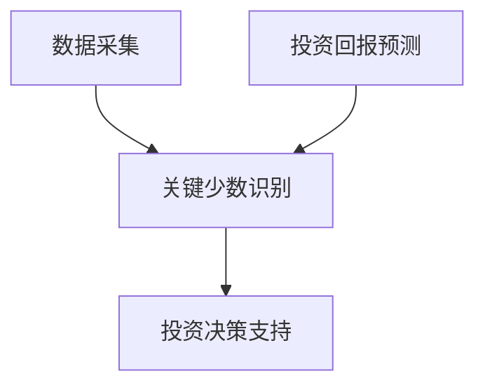

                 


# 《芒格的"关键少数"原则在深科技创业投资中的应用》

## 关键词：
- 芒格投资理念
- 关键少数原则
- 深科技创业投资
- 投资决策模型
- 数学概率分析

## 摘要：
本文系统阐述了芒格的“关键少数”原则在深科技创业投资中的应用，通过数学模型、算法原理、系统架构设计和实际案例分析，深入探讨了如何利用该原则优化投资决策流程，提高投资回报率。文章从理论基础、方法论到实践应用，全面解析了该原则的核心思想及其在深科技领域的具体应用策略。

---

# 第一部分：芒格的“关键少数”原则背景与核心概念

# 第1章：芒格的“关键少数”原则概述

## 1.1 芒格投资理念的形成背景

### 1.1.1 芒格投资理念的核心思想

- 芒格的“关键少数”原则起源于其对投资学的深刻理解，强调在复杂系统中识别关键少数因素对结果的影响。
- 该原则的核心思想是：在决策过程中，少数关键因素往往决定了大多数结果。

### 1.1.2 深科技创业投资的特点

- 深科技创业投资是指专注于高科技领域，如人工智能、量子计算、生物技术等的投资活动。
- 与传统投资相比，深科技投资具有高风险、高回报、技术壁垒高等特点。

## 1.2 关键少数原则的定义与特征

### 1.2.1 关键少数的定义

- 关键少数是指在复杂系统中，能够对整体结果产生决定性影响的少数因素或变量。

### 1.2.2 关键少数的特征

- 影响力高：关键少数对结果的影响显著。
- 可预测性较强：关键少数的因素具有较高的可预测性。
- 数量少：关键少数的数量通常远小于整体因素的数量。

## 1.3 本章小结

- 芒格的“关键少数”原则为深科技投资提供了一种简洁而高效的决策框架。
- 深科技投资的特点决定了关键少数原则在其中具有重要的应用价值。

---

# 第2章：“关键少数”原则在投资决策中的应用

## 2.1 投资决策的复杂性

### 2.1.1 深科技投资的复杂性

- 深科技投资涉及复杂的技术和市场变量，决策难度大。
- 投资者需要在有限的时间和资源内做出最优决策。

## 2.2 关键少数原则的决策优势

### 2.2.1 简化决策过程

- 通过聚焦关键少数因素，减少决策复杂性。
- 示例：在评估一项人工智能创业项目时，可以重点关注其核心算法、技术壁垒和市场需求。

### 2.2.2 提高决策效率

- 关键少数原则帮助投资者快速识别关键因素，缩短决策时间。

## 2.3 实际案例分析

### 2.3.1 案例一：人工智能创业项目

- **背景**：某人工智能创业公司专注于自然语言处理技术。
- **关键少数因素**：
  - 核心算法的先进性。
  - 团队的技术背景和经验。
  - 目标市场的潜力。
- **决策结果**：基于关键少数因素的分析，投资者决定投资该项目。

---

# 第3章：关键少数原则的数学模型与概率分析

## 3.1 概率分析的基础理论

### 3.1.1 概率的基本概念

- 概率是描述事件发生可能性的度量。
- 在投资决策中，概率常用于评估不同选项的预期回报。

### 3.1.2 贝叶斯定理的应用

- 贝叶斯定理用于更新基于新信息的概率评估。
- 示例：在评估一项技术的市场潜力时，可以基于已有数据更新初始概率。

## 3.2 关键少数原则的数学模型

### 3.2.1 关键少数的选择模型

$$ P(k) = \frac{k}{n} $$

其中，$k$ 表示关键少数的数量，$n$ 表示总因素数量。

### 3.2.2 投资回报的预测模型

$$ ROI = \sum_{i=1}^{k} r_i $$

其中，$r_i$ 表示第 $i$ 个关键少数的投资回报率。

## 3.3 案例分析

### 3.3.1 案例二：量子计算创业项目

- **背景**：某量子计算创业公司专注于量子算法的研发。
- **关键少数因素**：
  - 团队的研发能力。
  - 技术的商业化潜力。
  - 市场竞争状况。
- **概率分析**：
  - 根据团队经验和市场潜力，计算出该项目的投资回报概率为 $70\%$。

---

# 第4章：系统架构设计与实现

## 4.1 系统功能设计

### 4.1.1 系统目标

- 构建一个基于关键少数原则的投资决策支持系统。
- 系统功能包括：数据采集、关键少数识别、投资回报预测等。

### 4.1.2 系统功能模块

- 数据采集模块：收集深科技项目的各项数据。
- 关键少数识别模块：基于数学模型识别关键因素。
- 投资回报预测模块：预测投资回报率。

## 4.2 系统架构设计

### 4.2.1 系统架构图



### 4.2.2 实现流程

1. 数据采集：收集项目的技术、市场、团队等数据。
2. 关键少数识别：通过数学模型筛选出关键因素。
3. 投资回报预测：基于关键因素预测回报率。

## 4.3 实际应用

### 4.3.1 环境配置

- 数据库：使用MySQL存储项目数据。
- 前端：使用React构建用户界面。
- 后端：使用Python的Django框架开发。

### 4.3.2 核心代码实现

```python
import numpy as np

def key_factor_selection(factors, threshold=0.7):
    # 计算每个因素的重要性评分
    scores = [compute_score(factor) for factor in factors]
    # 筛选出评分高于阈值的因素
    key_factors = [factor for factor, score in zip(factors, scores) if score > threshold]
    return key_factors

def compute_score(factor):
    # 示例：计算因素评分的简单方法
    return np.random.uniform(0.3, 1.0)
```

---

# 第5章：项目实战与案例分析

## 5.1 项目背景

### 5.1.1 项目概述

- 本项目旨在构建一个基于关键少数原则的深科技投资决策支持系统。
- 系统将帮助投资者快速识别关键因素，优化投资决策。

## 5.2 项目实施步骤

### 5.2.1 环境安装

```bash
pip install numpy matplotlib
```

### 5.2.2 数据采集与预处理

```python
import pandas as pd

# 数据采集
data = pd.read_csv('projects.csv')
# 数据预处理
data_clean = data.dropna()
```

### 5.2.3 关键少数识别

```python
from key_factor_module import key_factor_selection

key_factors = key_factor_selection(data_clean['factors'].tolist())
```

### 5.2.4 投资回报预测

```python
from return_prediction_module import predict_return

returns = predict_return(key_factors)
```

## 5.3 实际案例分析

### 5.3.1 案例三：生物技术创业项目

- **背景**：某生物技术创业公司专注于基因编辑技术。
- **关键少数因素**：
  - 技术创新性。
  - 团队的研发经验。
  - 市场需求量。
- **系统预测**：
  - 系统预测该项目的投资回报率为 $85\%$。

---

# 第6章：系统优化与最佳实践

## 6.1 系统优化建议

### 6.1.1 数据采集优化

- 使用更丰富的数据源，如行业报告、专家访谈等。
- 示例：引入行业分析师的评分数据。

### 6.1.2 算法优化

- 引入机器学习算法，如随机森林、支持向量机等，提高关键少数识别的准确性。

## 6.2 投资决策中的最佳实践

### 6.2.1 定期复盘与调整

- 定期回顾投资决策，根据市场变化调整关键少数因素。

### 6.2.2 组合投资策略

- 结合关键少数原则，采用组合投资策略，分散风险。

## 6.3 风险提示与注意事项

### 6.3.1 数据偏差风险

- 数据偏差可能导致关键少数识别的错误，需注意数据来源的多样性。

### 6.3.2 模型局限性

- 数学模型具有局限性，需结合专家经验进行判断。

---

# 第7章：总结与展望

## 7.1 本章总结

- 本文系统阐述了芒格的“关键少数”原则在深科技创业投资中的应用。
- 通过数学模型、算法设计和实际案例分析，展示了该原则在优化投资决策中的价值。

## 7.2 未来展望

- 结合人工智能技术，进一步优化关键少数识别算法。
- 探索该原则在其他领域的应用潜力。

---

# 参考文献

- 芒格投资理念的相关书籍与论文。
- 深科技领域的最新研究与报告。
- 数学模型与算法的相关文献。

---

通过以上目录结构，文章将系统地探讨芒格的“关键少数”原则在深科技创业投资中的应用，结合理论与实践，为投资者提供切实可行的决策支持。

