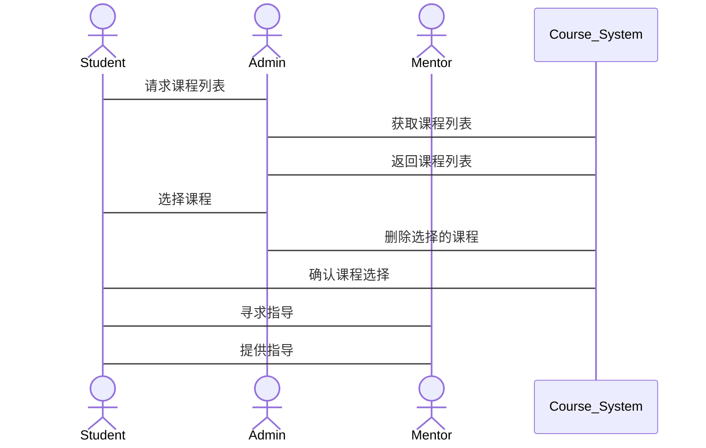

                 


# 芒格的"关键少数"原则在量子科技人才培养投资中的应用

> 关键词：芒格，关键少数，量子科技，人才培养，投资策略

> 摘要：芒格的"关键少数"原则是一种在复杂系统中识别和优化关键因素的方法，其核心思想是抓住少数关键要素以实现整体目标的最大化。本文将探讨如何将这一原则应用于量子科技领域的人才培养和投资策略中，分析其在量子科技领域的独特优势和实际应用价值。通过详细阐述关键少数原则的理论基础、量子科技的特殊性、投资策略的制定与优化，以及系统架构的设计与实施，本文旨在为量子科技领域的投资者和教育机构提供一种高效的人才培养和投资方法。

---

# 第一章：芒格的"关键少数"原则与量子科技的结合

## 1.1 芒格的"关键少数"原则概述

### 1.1.1 关键少数原则的定义
芒格的"关键少数"原则是一种以效率为导向的管理哲学，其核心思想是：在任何系统中，少数关键因素（关键少数）通常决定了整体的结果。通过识别和优化这些关键因素，可以实现系统性能的最大化。这一原则在管理学、投资学等领域得到了广泛应用。

### 1.1.2 关键少数原则的核心思想
- **聚焦关键因素**：在复杂的系统中，大多数结果是由少数关键因素决定的。
- **杠杆效应**：优化关键少数因素可以产生指数级的改进效果。
- **简化与高效**：通过关注关键少数，避免资源的浪费，提高效率。

### 1.1.3 关键少数原则在管理中的应用
- **资源分配**：优先投资关键领域，优化资源配置。
- **问题解决**：快速定位关键问题，集中力量解决问题。
- **战略制定**：制定基于关键因素的战略规划。

### 1.2 量子科技的概述

#### 1.2.1 量子科技的基本概念
量子科技是基于量子力学原理发展起来的新兴技术，主要涵盖以下几个领域：
- **量子计算**：利用量子叠加和量子纠缠实现超高速计算。
- **量子通信**：利用量子纠缠实现安全的通信。
- **量子传感**：利用量子效应提高传感器的精度和灵敏度。

#### 1.2.2 量子科技的核心领域
- **量子计算**：通过量子位（qubit）实现并行计算，解决复杂问题。
- **量子通信**：实现信息的量子加密传输。
- **量子传感**：应用于导航、医学成像等领域。

#### 1.2.3 量子科技的发展现状
量子科技是当前科技领域的前沿领域，具有重要的战略意义。各国政府和企业都在加大对量子科技的投入，以期在全球竞争中占据优势。

### 1.3 关键少数原则与量子科技的结合

#### 1.3.1 关键少数原则在量子科技中的应用背景
量子科技是一个高度复杂和专业的领域，其发展依赖于少数关键人才和核心技术。通过关键少数原则，可以识别和优化这些关键因素，推动量子科技的快速发展。

#### 1.3.2 量子科技人才培养的核心问题
- **人才稀缺性**：量子科技领域的人才数量有限，且培养难度大。
- **知识复杂性**：量子科技涉及复杂的物理和数学知识，需要高度专业化的培训。
- **资源分配**：如何高效分配资源，培养高质量的人才。

#### 1.3.3 关键少数原则在量子科技投资中的潜在价值
- **优化投资方向**：通过关键少数原则，识别最有潜力的量子科技领域和人才，集中资源进行投资。
- **提升投资效率**：通过聚焦关键少数，提高投资的回报率。
- **降低风险**：通过优化关键因素，降低投资失败的风险。

---

## 第二章：关键少数原则的理论基础

### 2.1 关键少数原则的核心概念

#### 2.1.1 关键少数的定义与特征
- **定义**：关键少数是指在系统中具有决定性作用的少数因素。
- **特征**：
  - 少数性：关键少数的数量通常占系统总因素的20%左右。
  - 杠杆性：优化关键少数因素可以带来整体系统的显著改进。
  - 稳定性：关键少数因素在系统中具有稳定性，不易受到外界干扰。

#### 2.1.2 关键少数原则的数学模型
关键少数原则的数学模型可以表示为：
$$ P = \sum_{i=1}^{n} w_i x_i $$
其中，$P$ 是系统的整体性能，$w_i$ 是第 $i$ 个因素的权重，$x_i$ 是第 $i$ 个因素的值。

#### 2.1.3 关键少数原则的适用条件
- 系统具有复杂性。
- 系统中存在少数关键因素。
- 关键因素对整体结果具有决定性影响。

### 2.2 量子科技人才的核心特征

#### 2.2.1 量子科技人才的能力结构
- **量子计算能力**：理解量子计算的基本原理，掌握量子算法设计。
- **量子通信能力**：熟悉量子通信的原理和应用。
- **量子传感能力**：掌握量子传感技术及其应用。

#### 2.2.2 量子科技人才的成长路径
1. **学术背景**：通常具有物理学、计算机科学或数学的博士学位。
2. **实践经验**：参与量子科技相关的科研项目或企业研发。
3. **持续学习**：量子科技发展迅速，人才需要不断更新知识。

#### 2.2.3 量子科技人才的稀缺性
- **全球范围内的稀缺性**：量子科技是一个新兴领域，专业人才数量有限。
- **培养难度大**：需要深厚的专业知识和实践能力。

---

## 第三章：关键少数原则在量子科技投资中的应用

### 3.1 投资策略的制定

#### 3.1.1 关键少数原则在投资中的应用逻辑
- **识别关键领域**：通过关键少数原则，识别量子科技中的关键领域和核心技术。
- **优化投资组合**：集中资源投资于最有潜力的领域和企业。
- **风险控制**：通过优化关键因素，降低投资风险。

#### 3.1.2 量子科技投资的核心要素
- **技术壁垒**：企业的核心技术是否具有竞争力。
- **人才团队**：企业的核心团队是否具备顶尖的专业能力。
- **市场需求**：量子科技的应用场景是否具有广阔的市场需求。

#### 3.1.3 投资组合的优化策略
- **集中投资**：将资源集中在少数关键领域和企业。
- **动态调整**：根据市场变化和企业发展情况，动态调整投资组合。
- **风险分散**：通过投资于不同的关键领域，分散投资风险。

### 3.2 投资决策的数学模型

#### 3.2.1 关键少数原则的数学表达
$$ P = \sum_{i=1}^{n} w_i x_i $$
其中，$w_i$ 是第 $i$ 个因素的权重，$x_i$ 是第 $i$ 个因素的值。

#### 3.2.2 量子科技投资的收益与风险分析
- **收益分析**：通过关键少数原则，集中投资于具有高潜力的领域，预期收益较高。
- **风险分析**：量子科技领域存在较高的技术风险和市场风险，但通过优化关键因素，可以有效降低风险。

#### 3.2.3 投资组合优化的算法实现
以下是一个简单的投资组合优化算法实现：

```python
import numpy as np

# 假设我们有n个投资选项，每个选项的收益和风险如下
n = 5
returns = [0.1, 0.15, 0.12, 0.08, 0.2]
risks = [0.2, 0.3, 0.25, 0.15, 0.4]

# 通过关键少数原则，选择收益和风险比值最小的选项
min_ratio = min([(risks[i]/returns[i]) for i in range(n)])
selected_index = [i for i in range(n) if (risks[i]/returns[i]) == min_ratio]

print("selected index:", selected_index)
print("selected return:", returns[selected_index[0]])
print("selected risk:", risks[selected_index[0]])
```

---

## 第四章：量子科技人才培养的系统架构设计

### 4.1 人才培养的目标与路径

#### 4.1.1 量子科技人才培养的目标设定
- **短期目标**：培养一批具备量子科技基础知识的专业人才。
- **长期目标**：培养能够引领量子科技发展的顶尖人才。

#### 4.1.2 人才培养的关键环节
1. **课程设计**：设计符合量子科技发展趋势的课程体系。
2. **实践训练**：提供量子科技相关的实验和实践机会。
3. **导师指导**：由顶尖量子科技专家进行一对一指导。

#### 4.1.3 人才培养的系统化方法
- **模块化教学**：将量子科技知识分解为多个模块，逐步教授。
- **案例教学**：通过实际案例分析，提升学生的实践能力。

### 4.2 量子科技人才培养的系统架构设计

#### 4.2.1 问题场景介绍
量子科技人才培养面临以下问题：
- **知识更新快**：量子科技发展迅速，课程内容需要不断更新。
- **实践机会少**：学生缺乏实践量子科技的机会。
- **资源分配不均**：资源集中在少数顶尖高校，普通高校缺乏相关资源。

#### 4.2.2 项目介绍
本项目旨在通过关键少数原则，设计一个高效的量子科技人才培养系统，包括课程设计、实践训练和导师指导三个核心模块。

#### 4.2.3 系统功能设计

##### 4.2.3.1 领域模型（Mermaid 类图）
```mermaid
classDiagram

    class Quantum_Talent_System {
        + courses: list
        + practices: list
        + mentors: list
        + students: list
    }

    class Course {
        + name: string
        + content: string
        + difficulty: int
    }

    class Practice {
        + name: string
        + description: string
        + duration: int
    }

    class Mentor {
        + name: string
        + expertise: string
    }

    class Student {
        + name: string
        + level: int
    }

    Quantum_Talent_System o-> Course
    Quantum_Talent_System o-> Practice
    Quantum_Talent_System o-> Mentor
    Quantum_Talent_System o-> Student
```

#### 4.2.4 系统架构设计

##### 4.2.4.1 系统架构图（Mermaid 架构图）
```mermaid
archimate
title Quantum_Talent_System Architecture

actor Students
actor Mentors
actor Admin

Mentors --|> Mentor_DB
Students --|> Student_DB
Admin --|> Course_DB
Admin --|> Practice_DB

Mentor_DB --> Mentor_System
Student_DB --> Student_System
Course_DB --> Course_System
Practice_DB --> Practice_System

Mentor_System --|> Talent_System
Student_System --|> Talent_System
Course_System --|> Talent_System
Practice_System --|> Talent_System
```

#### 4.2.5 系统接口设计

##### 4.2.5.1 系统接口设计（Mermaid 序列图）


---

## 第五章：量子科技人才培养投资的实战案例

### 5.1 实战案例分析

#### 5.1.1 案例背景介绍
某量子科技公司计划投资于量子计算领域的人才培养，希望通过关键少数原则，优化投资策略，提升人才质量。

#### 5.1.2 投资策略的制定与实施
1. **识别关键领域**：量子计算领域的核心技术是量子算法设计和量子芯片研发。
2. **优化投资组合**：集中资源投资于量子算法设计和量子芯片研发领域。
3. **动态调整**：根据市场变化和企业发展情况，动态调整投资组合。

#### 5.1.3 投资效果分析
- **收益**：通过集中投资，公司在量子算法设计和量子芯片研发领域取得了显著进展。
- **风险控制**：通过优化关键因素，降低了投资风险。

### 5.2 项目小结

#### 5.2.1 项目总结
通过关键少数原则，公司在量子科技人才培养投资中取得了显著效果，提升了人才质量，降低了投资风险。

#### 5.2.2 经验总结
- **聚焦关键领域**：集中资源投资于关键领域，提升投资效率。
- **动态调整**：根据市场变化和企业发展情况，动态调整投资策略。
- **注重人才培养**：通过优化关键因素，提升人才培养质量。

---

## 第六章：量子科技人才培养投资的未来展望

### 6.1 量子科技发展的未来趋势

#### 6.1.1 量子计算的未来发展
量子计算技术将更加成熟，应用领域将不断扩展。

#### 6.1.2 量子通信的未来发展
量子通信技术将逐步实现商业化应用，推动信息安全领域的革命。

#### 6.1.3 量子传感的未来发展
量子传感技术将在导航、医学成像等领域发挥重要作用。

### 6.2 关键少数原则的未来发展

#### 6.2.1 关键少数原则在量子科技中的应用前景
- **更广泛的应用**：关键少数原则将在量子科技的更多领域得到应用。
- **更深层次的优化**：关键少数原则将帮助量子科技实现更深层次的优化。

#### 6.2.2 关键少数原则与其他管理原则的结合
- **与敏捷管理的结合**：通过关键少数原则，实现敏捷管理的优化。
- **与数据驱动的管理结合**：通过关键少数原则，实现数据驱动的管理优化。

---

## 第七章：总结与展望

### 7.1 全文总结

#### 7.1.1 量子科技的重要性
量子科技是未来科技发展的核心领域，具有重要的战略意义。

#### 7.1.2 关键少数原则的应用价值
通过关键少数原则，可以优化量子科技的人才培养和投资策略，提升整体效率。

### 7.2 未来展望

#### 7.2.1 量子科技的未来发展
量子科技将不断突破技术瓶颈，推动社会的进步。

#### 7.2.2 关键少数原则的未来发展
关键少数原则将在更多领域得到应用，推动管理学的进一步发展。

---

# 结语

芒格的"关键少数"原则在量子科技人才培养投资中的应用，不仅为量子科技的发展提供了新的思路，也为其他高科技领域的人才培养和投资策略提供了重要的借鉴。通过聚焦关键因素，优化资源配置，我们可以更高效地推动量子科技的发展，为人类社会的进步做出更大的贡献。

--- 

通过以上思考和分析，我们得出结论：芒格的"关键少数"原则在量子科技人才培养投资中的应用具有重要的现实意义和实践价值。通过识别和优化关键因素，我们可以更高效地推动量子科技的发展，为人类社会的进步做出更大的贡献。

