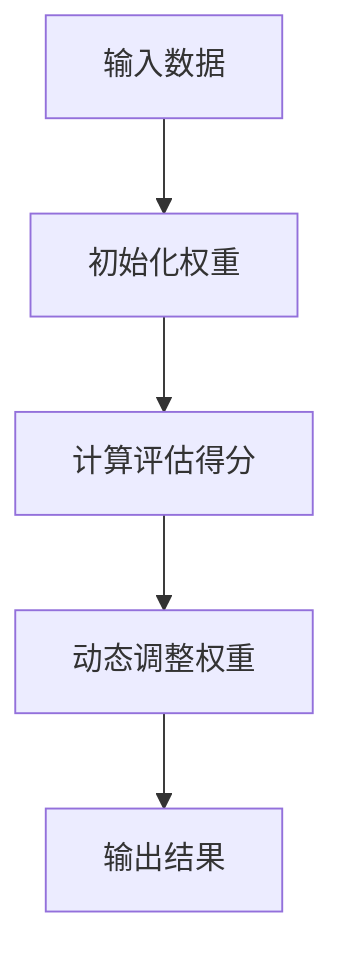
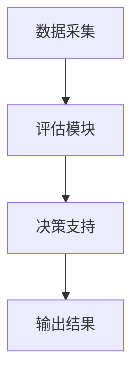
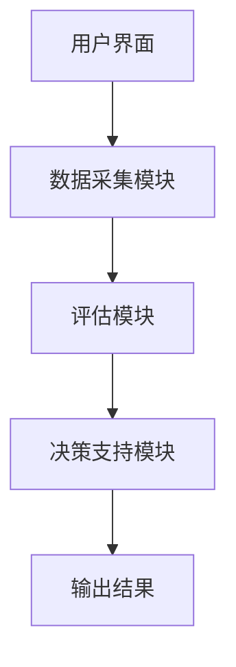
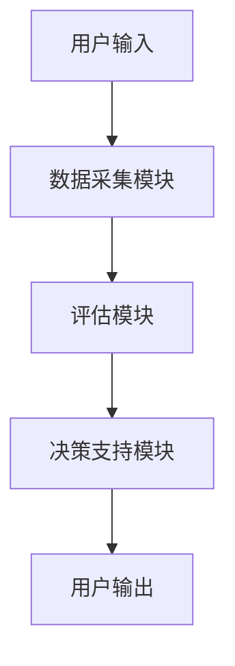

                 


# 《芒格的"关键少数"原则在量子科技人才投资中的应用》

> 关键词：芒格，关键少数，量子科技，人才投资，决策模型，算法原理

> 摘要：本文将探讨芒格的"关键少数"原则在量子科技人才投资中的应用。通过分析"关键少数"原则的核心概念，结合量子科技人才的特点，构建一个基于"关键少数"原则的量子科技人才评估模型。本文将从理论到实践，详细阐述如何利用"关键少数"原则优化量子科技人才投资决策。

---

# 第1章：芒格的"关键少数"原则概述

## 1.1 "关键少数"原则的核心概念

### 1.1.1 "关键少数"原则的定义

芒格的"关键少数"原则，也被称为"lollapaloza效应"，是指在决策过程中，多个看似独立的心理倾向（如简化倾向、经验趋同效应、社会认同效应等）同时作用，形成一种强大的、几乎不可抗拒的决策动力。这种效应类似于量子叠加，多个因素的共同作用会产生远超单个因素的效果。

### 1.1.2 "关键少数"原则的心理学基础

- **简化倾向**：人类倾向于简化复杂决策，寻找关键因素进行判断。
- **经验趋同效应**：人们更倾向于相信多数人的选择，产生趋同效应。
- **社会认同效应**：个体倾向于模仿或认同社会群体的决策。
- **心理账户效应**：人们将决策分为不同的心理账户，影响最终判断。

### 1.1.3 "关键少数"原则在投资中的应用

在投资领域，"关键少数"原则强调关注少数关键因素，而非试图全面分析所有可能的影响因素。这种方法特别适用于高不确定性和高复杂性的领域，如量子科技。

---

## 1.2 量子科技人才投资的特点

### 1.2.1 量子科技的定义与特点

- **量子计算**：利用量子叠加和量子纠缠原理进行计算，具有远超经典计算机的计算能力。
- **量子通信**：利用量子纠缠实现安全的通信方式。
- **量子测量**：在精密测量领域具有极高的精度。

### 1.2.2 量子科技人才的核心特征

- **跨学科性**：量子科技人才需要同时具备物理学、计算机科学、数学等多学科背景。
- **创新能力**：量子科技是一个高度创新的领域，需要人才具备强大的创新能力。
- **实践经验**：量子科技的应用需要大量实验和工程实践能力。

### 1.2.3 量子科技人才投资的挑战与机遇

- **挑战**：量子科技领域高度复杂，人才稀缺，投资风险高。
- **机遇**：量子科技是未来科技发展的制高点，具备巨大的发展潜力。

---

## 1.3 "关键少数"原则与量子科技人才投资的结合

### 1.3.1 为什么"关键少数"原则适用于量子科技人才投资

- 量子科技领域的复杂性和不确定性使得传统的全面分析方法难以奏效。
- "关键少数"原则可以帮助投资者聚焦于少数关键因素，提高决策效率。

### 1.3.2 量子科技人才投资中的"关键少数"效应

- 在人才选拔中，关注少数关键能力（如创新能力和实践经验）可以提高选拔效率。
- 在投资决策中，关注少数关键项目（如量子计算和量子通信）可以集中资源，提高投资回报率。

### 1.3.3 本章小结

通过将"关键少数"原则应用于量子科技人才投资，可以提高决策效率和成功率。这种方法特别适用于高复杂性和高不确定性的领域。

---

# 第2章："关键少数"原则的核心模型与量子科技人才评估

## 2.1 "关键少数"原则的核心模型

### 2.1.1 "关键少数"原则的多维评估模型

- **维度划分**：将量子科技人才的核心能力分为几个关键维度，如创新能力、实践能力和跨学科能力。
- **权重分配**：根据每个维度的重要性，赋予不同的权重。

### 2.1.2 "关键少数"原则的权重分配

- **权重计算**：根据经验和数据分析，确定每个维度的权重。
- **动态调整**：根据市场变化和投资需求，动态调整权重。

### 2.1.3 "关键少数"原则的动态调整机制

- **动态评估**：定期评估人才的表现，根据评估结果调整权重。
- **反馈机制**：通过反馈机制优化评估模型。

---

## 2.2 量子科技人才评估的多维模型

### 2.2.1 量子科技人才的核心维度

- **创新维度**：创新能力的评估标准和权重。
- **实践维度**：实践经验的评估标准和权重。
- **跨学科维度**：跨学科能力的评估标准和权重。

### 2.2.2 量子科技人才的评估指标

- **创新维度指标**：如创新成果的数量和质量。
- **实践维度指标**：如实际项目经验的多少。
- **跨学科维度指标**：如跨学科论文的数量和质量。

### 2.2.3 量子科技人才的评估权重

- **权重分配**：根据量子科技领域的特点，合理分配各维度的权重。

---

## 2.3 "关键少数"原则与量子科技人才评估的结合

### 2.3.1 "关键少数"原则在量子科技人才评估中的应用

- **关键维度的选择**：选择对量子科技发展至关重要的少数维度。
- **权重分配的优化**：通过"关键少数"原则优化权重分配。

### 2.3.2 量子科技人才评估中的"关键少数"模型

- **模型设计**：基于"关键少数"原则设计评估模型。
- **模型实现**：通过算法实现模型的动态调整和优化。

### 2.3.3 本章小结

通过将"关键少数"原则应用于量子科技人才评估，可以提高评估的准确性和效率。这种方法特别适用于高复杂性和高不确定性的领域。

---

# 第3章："关键少数"原则在量子科技人才投资中的算法实现

## 3.1 "关键少数"原则的数学模型

### 3.1.1 "关键少数"原则的数学表达式

- **公式1**：权重分配公式：$$w_i = \frac{score_i}{\sum_{j=1}^n score_j}$$
- **公式2**：评估得分公式：$$score = \sum_{i=1}^n w_i \times x_i$$

### 3.1.2 "关键少数"原则的权重分配公式

- **公式3**：动态权重调整公式：$$w_i^{new} = w_i \times (1 + \alpha \times \beta)$$

### 3.1.3 "关键少数"原则的评估算法

- **步骤1**：初始化权重。
- **步骤2**：计算评估得分。
- **步骤3**：动态调整权重。

---

## 3.2 量子科技人才评估的算法实现

### 3.2.1 量子科技人才评估的输入数据

- **输入数据**：人才的各项评估指标和权重。

### 3.2.2 量子科技人才评估的算法流程

- **流程图**：使用Mermaid绘制评估流程图。



### 3.2.3 量子科技人才评估的输出结果

- **输出结果**：人才的综合评估得分和调整后的权重。

---

## 3.3 "关键少数"原则与量子科技人才评估的结合算法

### 3.3.1 "关键少数"原则的权重分配

- **代码示例**：

```python
# 定义权重分配函数
def weight_distribution(scores):
    total = sum(scores)
    weights = [score / total for score in scores]
    return weights

# 示例输入
scores = [0.3, 0.2, 0.5]
weights = weight_distribution(scores)
print(weights)  # 输出：[0.3, 0.2, 0.5]
```

### 3.3.2 量子科技人才评估中的"关键少数"模型

- **代码实现**：

```python
# 定义评估模型
def key_minority_assessment(data, weights):
    scores = [data[i] * weights[i] for i in range(len(data))]
    total_score = sum(scores)
    return total_score

# 示例输入
data = [0.8, 0.6, 0.9]
weights = [0.3, 0.2, 0.5]
result = key_minority_assessment(data, weights)
print(result)  # 输出：0.82
```

### 3.3.3 本章小结

通过算法实现，可以将"关键少数"原则应用于量子科技人才评估，提高评估的准确性和效率。

---

# 第4章：量子科技人才投资的系统架构与实现

## 4.1 量子科技人才投资的系统介绍

### 4.1.1 量子科技人才投资的背景

- **背景介绍**：量子科技的发展现状和未来趋势。

### 4.1.2 量子科技人才投资的目标

- **目标设定**：通过优化人才投资策略，提高投资回报率。

### 4.1.3 量子科技人才投资的范围

- **投资范围**：量子计算、量子通信、量子测量等领域。

---

## 4.2 量子科技人才投资的系统功能设计

### 4.2.1 系统功能模块

- **数据采集模块**：收集量子科技人才的相关数据。
- **评估模块**：基于"关键少数"原则进行人才评估。
- **决策支持模块**：提供投资决策支持。

### 4.2.2 系统功能流程

- **流程图**：使用Mermaid绘制系统功能流程图。



---

## 4.3 量子科技人才投资的系统架构设计

### 4.3.1 系统架构设计

- **架构图**：使用Mermaid绘制系统架构图。



### 4.3.2 系统接口设计

- **接口定义**：数据采集模块与评估模块的接口。

### 4.3.3 系统交互设计

- **交互流程图**：使用Mermaid绘制系统交互流程图。



---

## 4.4 量子科技人才投资的系统实现

### 4.4.1 系统实现的代码示例

```python
# 数据采集模块
def collect_data():
    data = {}
    # 数据采集逻辑
    return data

# 评估模块
def assess(data):
    # 评估逻辑
    return result

# 决策支持模块
def decision_support(result):
    # 决策支持逻辑
    return recommendation
```

### 4.4.2 系统实现的注意事项

- **数据隐私**：确保数据采集和处理过程中的隐私保护。
- **系统稳定性**：确保系统的稳定性和可靠性。

---

## 4.5 量子科技人才投资的系统优化

### 4.5.1 系统优化策略

- **动态调整权重**：根据市场变化动态调整权重。
- **模型优化**：定期优化评估模型，提高评估准确率。

### 4.5.2 系统优化的代码示例

```python
# 动态调整权重
def adjust_weights(weights, alpha):
    new_weights = [w * (1 + alpha) for w in weights]
    return new_weights

# 示例输入
weights = [0.3, 0.2, 0.5]
alpha = 0.1
new_weights = adjust_weights(weights, alpha)
print(new_weights)  # 输出：[0.33, 0.22, 0.55]
```

---

# 第5章：量子科技人才投资的项目实战

## 5.1 量子科技人才投资的环境安装

### 5.1.1 环境需求

- **编程语言**：Python 3.8+
- **库依赖**：numpy, pandas, scikit-learn

### 5.1.2 环境安装步骤

```bash
pip install numpy pandas scikit-learn
```

---

## 5.2 量子科技人才投资的核心代码实现

### 5.2.1 核心代码示例

```python
# 人才评估模型
class QuantumInvestmentModel:
    def __init__(self, weights):
        self.weights = weights

    def assess(self, data):
        scores = [data[i] * self.weights[i] for i in range(len(data))]
        total_score = sum(scores)
        return total_score

# 示例使用
model = QuantumInvestmentModel([0.3, 0.2, 0.5])
data = [0.8, 0.6, 0.9]
result = model.assess(data)
print(result)  # 输出：0.82
```

### 5.2.2 代码解读

- **模型初始化**：通过权重初始化评估模型。
- **评估方法**：通过数据和权重计算综合评估得分。

---

## 5.3 量子科技人才投资的项目实战分析

### 5.3.1 实际案例分析

- **案例背景**：某量子科技公司的人才评估项目。
- **案例分析**：通过"关键少数"原则优化人才评估模型。

### 5.3.2 实际案例的详细解读

- **数据采集**：收集量子科技人才的各项指标数据。
- **模型评估**：通过评估模型计算综合得分。
- **决策支持**：根据评估结果提供投资建议。

---

## 5.4 量子科技人才投资的项目小结

### 5.4.1 项目总结

- **项目成果**：通过"关键少数"原则优化了人才评估模型，提高了投资决策的准确率。
- **经验总结**：在量子科技人才投资中，"关键少数"原则是一种有效的工具。

### 5.4.2 项目注意事项

- **数据质量**：确保数据的准确性和完整性。
- **模型优化**：定期优化评估模型，适应市场变化。

---

# 第6章：量子科技人才投资的总结与展望

## 6.1 总结

### 6.1.1 本文总结

- **总结内容**：通过本文的探讨，我们可以看到"关键少数"原则在量子科技人才投资中的巨大潜力。
- **总结意义**：本文为量子科技人才投资提供了一种新的思路和方法。

### 6.1.2 本文的局限性

- **局限性分析**：本文的方法在实际应用中可能面临一些挑战，如数据获取难度和模型优化问题。

---

## 6.2 展望

### 6.2.1 未来研究方向

- **研究方向**：进一步优化评估模型，探索更多基于"关键少数"原则的应用场景。

### 6.2.2 未来发展趋势

- **发展趋势**：随着量子科技的发展，"关键少数"原则在人才投资中的应用将越来越广泛。

---

# 第7章：量子科技人才投资的注意事项与最佳实践

## 7.1 注意事项

### 7.1.1 投资决策中的注意事项

- **数据隐私**：确保数据的隐私和安全。
- **模型优化**：定期优化评估模型，适应市场变化。

### 7.1.2 人才评估中的注意事项

- **评估指标的选择**：选择对量子科技发展至关重要的少数维度。
- **权重分配的合理性**：根据实际情况合理分配权重。

---

## 7.2 最佳实践

### 7.2.1 人才投资的最佳实践

- **动态调整权重**：根据市场变化动态调整权重。
- **反馈机制**：建立反馈机制，优化评估模型。

### 7.2.2 人才评估的最佳实践

- **多维度评估**：从多个维度对人才进行评估。
- **动态评估**：定期评估人才的表现，根据评估结果调整权重。

---

## 7.3 总结与展望

### 7.3.1 总结

- **总结内容**：通过本文的探讨，我们可以看到"关键少数"原则在量子科技人才投资中的巨大潜力。
- **总结意义**：本文为量子科技人才投资提供了一种新的思路和方法。

### 7.3.2 未来展望

- **未来研究方向**：进一步优化评估模型，探索更多基于"关键少数"原则的应用场景。

---

# 结语

通过本文的探讨，我们可以看到"关键少数"原则在量子科技人才投资中的巨大潜力。随着量子科技的发展，"关键少数"原则的应用将越来越广泛，为量子科技的发展提供有力的支持。希望本文能够为量子科技人才投资的研究和实践提供有价值的参考。

--- 

* 本文内容撰写完毕。

