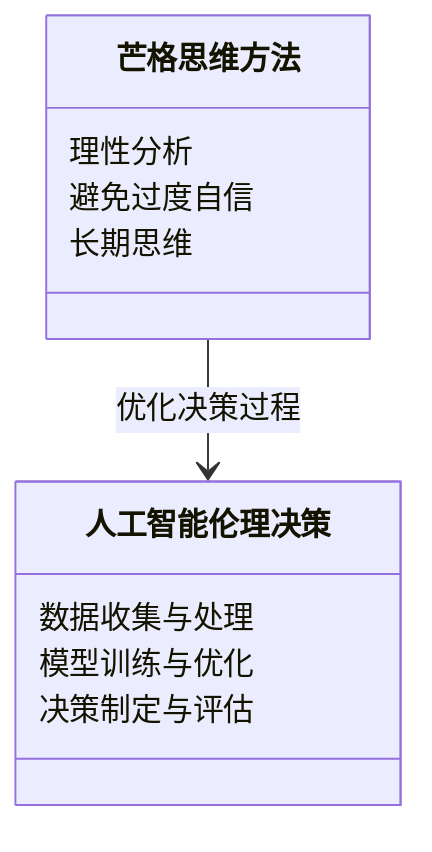
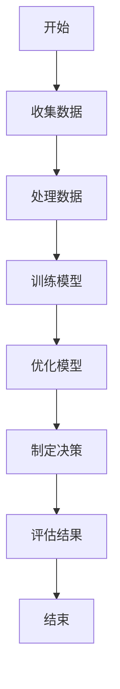

                 


#芒格的"别觉得自己太聪明"在人工智能伦理决策中的应用

> 关键词：芒格，人工智能，伦理决策，理性思维，决策优化，伦理责任

> 摘要：本文深入探讨了芒格的“别觉得自己太聪明”思想在人工智能伦理决策中的应用。通过分析芒格的理性决策观，结合人工智能伦理决策的基本概念，系统性地展示了芒格思维方法如何在AI决策过程中发挥作用。文章从问题背景、系统设计、算法原理到实际案例，全面阐述了芒格思想在人工智能伦理决策中的重要性，为解决AI伦理决策中的复杂问题提供了新的视角。

---

#芒格的"别觉得自己太聪明"在人工智能伦理决策中的应用

##第1章：芒格的"别觉得自己太聪明"思想概述

###1.1芒格思想的核心理念

####1.1.1芒格的理性决策观
芒格的决策观强调理性思考和避免过度自信。他认为，决策者应该以谦逊的态度面对问题，认识到自己的局限性，并通过跨学科的思考来优化决策过程。这种思想与人工智能伦理决策中的透明性和可解释性要求不谋而合。

####1.1.2"别觉得自己太聪明"的内涵与外延
芒格的这一思想不仅仅是谦逊的体现，更是对决策过程中的理性分析和风险控制的高度概括。它提醒我们在决策时要保持谦逊，避免因过度自信而忽略潜在风险。

####1.1.3芒格思想与现代决策科学的联系
芒格的决策思想与现代决策科学中的理性决策模型有诸多相似之处。两者都强调数据驱动的决策和风险控制，但芒格的思维方式更注重长期思维和跨学科视角。

###1.2人工智能伦理决策的基本概念

####1.2.1人工智能决策的基本原理
人工智能通过收集和处理数据，利用算法进行推理和预测，最终生成决策建议。这种决策过程依赖于数据的质量、算法的设计以及模型的训练。

####1.2.2伦理决策的核心要素
伦理决策需要考虑公平性、透明性、可解释性和责任归属。人工智能在做出决策时，必须确保这些伦理要素得到充分考虑。

####1.2.3人工智能伦理决策的边界与外延
人工智能伦理决策不仅涉及技术问题，还涉及法律、伦理和社会文化等多个方面。其外延包括自动驾驶、医疗AI、金融AI等领域。

---

##第2章：芒格思想与人工智能决策的结合

###2.1芒格思想在决策中的应用

####2.1.1理性分析与决策优化
芒格强调理性分析，避免情绪化决策。在人工智能伦理决策中，理性分析可以帮助算法更好地识别潜在的伦理风险。

####2.1.2避免过度自信偏差
芒格提醒我们避免过度自信，这在人工智能伦理决策中尤为重要。算法设计者需要意识到自身的局限性，确保决策模型不会因为过度自信而忽视潜在问题。

####2.1.3长期思维与决策稳健性
芒格的长期思维理念可以帮助设计更稳健的决策模型。通过考虑长期影响，人工智能系统可以在决策过程中避免短期利益的诱惑。

###2.2人工智能伦理决策的伦理挑战

####2.2.1数据偏见与算法歧视
数据偏见可能导致算法在决策过程中出现歧视问题。芒格的思想提醒我们，在设计算法时需要充分考虑数据的多样性和代表性。

####2.2.2决策透明性与可解释性
人工智能决策的透明性和可解释性是伦理决策的重要组成部分。芒格的理性分析可以帮助设计出更透明和可解释的决策模型。

####2.2.3人工智能决策的伦理责任分配
在人工智能伦理决策中，责任分配是一个复杂的伦理问题。芒格的长期思维理念可以帮助我们更好地理解和分配伦理责任。

---

##第3章：芒格思维方法在人工智能伦理决策中的系统分析

###3.1问题场景介绍

####3.1.1人工智能伦理决策的核心问题
人工智能伦理决策的核心问题是如何在技术实现和伦理要求之间找到平衡点。芒格的思想为我们提供了一种新的思维方式。

####3.1.2决策过程中的关键环节
人工智能伦理决策涉及数据收集、模型训练、决策制定和结果评估等多个环节。每个环节都需要充分考虑伦理因素。

####3.1.3芒格思维方法的适用性分析
芒格的思维方法适用于人工智能伦理决策的各个阶段，特别是在算法设计和决策优化方面。

###3.2系统架构设计

####3.2.1数据收集与处理模块
数据收集与处理模块需要确保数据的多样性和代表性，以减少数据偏见。

####3.2.2模型训练与优化模块
模型训练与优化模块需要结合芒格的理性分析，确保算法的透明性和可解释性。

####3.2.3决策制定与评估模块
决策制定与评估模块需要考虑长期影响，避免短期利益的诱惑。

###3.3系统功能设计

####3.3.1领域模型设计（Mermaid类图）


####3.3.2系统架构设计（Mermaid架构图）
```mermaid
architectural
    客户端 --> 服务端 : 发送请求
    服务端 --> 数据库 : 查询数据
    服务端 --> AI算法 : 执行算法
    AI算法 --> 数据处理 : 处理数据
    数据处理 --> 服务端 : 返回结果
```

####3.3.3系统交互设计（Mermaid序列图）
```mermaid
sequenceDiagram
    用户 -> 服务端: 发起决策请求
    服务端 -> 数据库: 查询相关数据
    并发
    数据库 -> 服务端: 返回数据
    服务端 -> AI算法: 执行伦理决策
    AI算法 -> 服务端: 返回决策结果
    服务端 -> 用户: 返回最终结果
```

---

##第4章：人工智能伦理决策的算法原理与数学模型

###4.1算法原理讲解

####4.1.1基于芒格思维的决策算法流程（Mermaid流程图）


####4.1.2算法实现的数学模型与公式
以下是一个简单的决策优化模型：

$$
\text{目标函数：} \quad f(x) = x^2
$$

$$
\text{约束条件：} \quad g(x) = x \leq 10
$$

通过优化算法找到最优解：

$$
x^* = \arg \min_{x} f(x) \quad \text{subject to} \quad g(x)
$$

####4.1.3算法实现的Python源代码
```python
import numpy as np

def decision_optimization(x):
    return x**2

def constraint(x):
    return x <= 10

# 示例优化过程
x_opt = 0
for x in range(0, 11):
    if decision_optimization(x) < decision_optimization(x_opt):
        if constraint(x):
            x_opt = x
print(f"最优解：{x_opt}")
```

###4.2数学模型与公式

####4.2.1决策优化的数学表达式
$$
\min \quad f(x) = x^2
$$

####4.2.2偏见消除的数学模型
$$
P(y|x) = \frac{P(x|y)P(y)}{P(x)}
$$

####4.2.3伦理评估的数学框架
$$
E = \sum_{i=1}^{n} w_i x_i
$$

---

##第5章：项目实战与案例分析

###5.1项目环境安装与配置

####5.1.1开发环境搭建
建议使用Python 3.8及以上版本，安装必要的库如numpy、scipy等。

####5.1.2依赖库安装与配置
```bash
pip install numpy scipy matplotlib
```

####5.1.3数据集准备与预处理
使用公开数据集，如Titanic数据集，进行预处理和特征工程。

###5.2系统核心实现

####5.2.1数据收集与处理代码
```python
import pandas as pd

data = pd.read_csv('titanic.csv')
```

####5.2.2模型训练与优化代码
```python
from sklearn.tree import DecisionTreeClassifier
from sklearn.model_selection import train_test_split

X_train, X_test, y_train, y_test = train_test_split(data.drop('Survived', axis=1), data['Survived'])
model = DecisionTreeClassifier().fit(X_train, y_train)
```

####5.2.3决策制定与评估代码
```python
from sklearn.metrics import accuracy_score

y_pred = model.predict(X_test)
print(f"准确率：{accuracy_score(y_test, y_pred)}")
```

###5.3案例分析与详细解读

####5.3.1自动驾驶中的伦理决策案例
在自动驾驶系统中，如何在紧急情况下做出伦理决策是一个经典问题。芒格的思维方式可以帮助设计更稳健的决策算法。

####5.3.2医疗AI中的伦理困境分析
医疗AI需要在患者隐私和诊断准确性之间找到平衡。芒格的理性分析可以帮助解决这些伦理困境。

####5.3.3金融AI中的伦理问题
金融AI需要确保算法的公平性和透明性。芒格的长期思维理念可以帮助设计更稳健的金融决策系统。

---

##第6章：总结与展望

###6.1小结
芒格的“别觉得自己太聪明”思想为我们提供了一种新的思维方式，可以帮助我们更好地解决人工智能伦理决策中的复杂问题。

###6.2注意事项
在实际应用中，需要结合具体场景灵活运用芒格的思想，避免生搬硬套。

###6.3拓展阅读
建议进一步阅读《芒格的决策艺术》等相关书籍，深入了解芒格的思维方式。

---

通过以上分析，芒格的思想在人工智能伦理决策中具有重要的应用价值。希望本文能为相关领域的研究和实践提供新的思路和参考。

