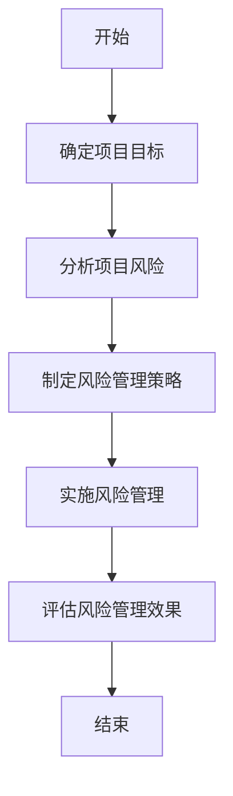
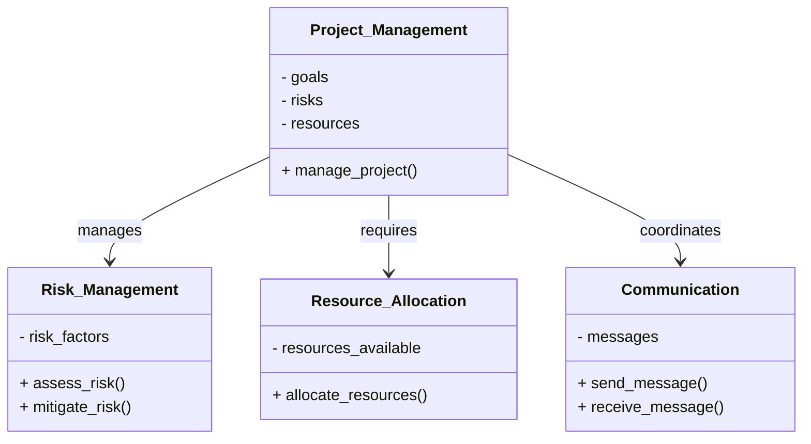
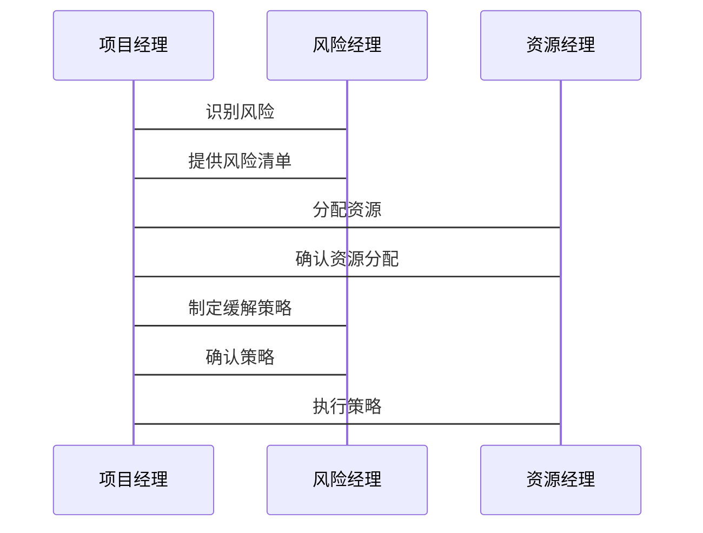

                 


# 芒格的"别觉得自己太聪明"在量子科技创新管理中的应用

## 关键词：芒格思想，量子科技，科技创新管理，风险管理，系统思维

## 摘要：本文探讨了芒格的“别觉得自己太聪明”这一思想在量子科技创新管理中的应用。通过分析量子科技的特点和管理挑战，结合芒格的谦逊、开放和系统思维，提出了一系列管理策略和数学模型，以应对量子科技中的复杂性和不确定性。文章还通过实际案例和系统架构设计，展示了如何将芒格思想融入量子科技创新管理中，确保项目的成功实施。

---

## 第1章: 芒格思想的背景与核心概念

### 1.1 芒格思想的起源与核心理念

#### 1.1.1 芒格思想的起源
芒格思想源于查理·芒格的智慧，强调谦逊、理性与独立思考。芒格认为，人类的认知存在局限性，过度自信会导致决策失误。他倡导保持谦逊，不断学习，以避免陷入“知道的诅咒”。

#### 1.1.2 "别觉得自己太聪明"的核心含义
“别觉得自己太聪明”并非贬低智商，而是提醒人们要谦逊。芒格认为，聪明的人容易陷入自满，忽视复杂性。真正的智慧在于认识到自己的无知，并通过不断学习来弥补。

#### 1.1.3 芒格思想在管理学中的应用
芒格思想在管理学中强调开放性、谦逊与系统思维。他主张领导者应避免过度自信，注重团队协作，鼓励质疑与反思，以应对复杂挑战。

### 1.2 量子科技的基本概念与特点

#### 1.2.1 量子科技的定义
量子科技利用量子力学原理，通过量子叠加和纠缠等现象，实现信息处理和通信的技术。它包括量子计算、量子通信和量子传感等领域。

#### 1.2.2 量子科技的核心特点
量子科技具有非线性、不确定性、高速度和高安全性等特点。其复杂性远超经典科技，需要全新的管理方法。

#### 1.2.3 量子科技与传统科技的区别
量子科技的不确定性和复杂性使其在管理上面临更多挑战。传统项目管理方法可能不适用，需采用更灵活的策略。

### 1.3 芒格思想与量子科技创新管理的结合

#### 1.3.1 芒格思想在科技创新中的重要性
芒格的谦逊和开放性有助于避免过度自信，促进团队协作，降低决策风险。

#### 1.3.2 量子科技创新管理的特点
量子科技项目常涉及高度复杂的系统，需要灵活的管理策略和系统的风险管理。

#### 1.3.3 芒格思想如何应用于量子科技创新管理
通过保持谦逊，承认不确定性，建立开放文化，促进跨学科合作，芒格思想为量子科技管理提供了新视角。

---

## 第2章: 芒格思想在量子科技创新管理中的核心概念

### 2.1 芒格思想的核心概念

#### 2.1.1 谦逊与开放性
谦逊使管理者认识到知识的有限性，开放性促进创新与合作。

#### 2.1.2 复杂性与不确定性
量子科技的复杂性和不确定性要求管理者采用灵活的策略，避免 rigid planning。

#### 2.1.3 系统思维与整体性
系统思维帮助管理者理解各部分的相互作用，避免局部优化影响整体。

### 2.2 量子科技的管理特点

#### 2.2.1 量子科技的非线性特征
量子系统的行为难以预测，需要动态调整管理策略。

#### 2.2.2 量子科技的不确定性
项目失败风险高，需建立风险管理机制，降低不确定性。

#### 2.2.3 量子科技的系统性
项目涉及多学科，需整体规划，确保各部分协同工作。

### 2.3 芒格思想与量子科技创新管理的核心联系

#### 2.3.1 谦逊与开放性在量子科技创新中的应用
谦逊促使管理者承认知识有限，开放性促进知识共享与创新。

#### 2.3.2 复杂性与不确定性在管理中的体现
复杂性要求管理者采用分层管理，不确定性需要概率模型辅助决策。

#### 2.3.3 系统思维在量子科技项目管理中的重要性
系统思维帮助识别关键路径，优化资源分配，提高项目成功率。

---

## 第3章: 芒格思想在量子科技创新管理中的算法与数学模型

### 3.1 芒格思想的数学模型

#### 3.1.1 谦逊与开放性的数学表达
$$ H = \frac{1}{1 + \sum_{i=1}^{n} (1 - c_i)} $$
其中，\( c_i \) 表示各个因素的权重。

#### 3.1.2 复杂性与不确定性的数学模型
$$ U = \sum_{i=1}^{n} p_i \cdot (1 - p_i) $$
其中，\( p_i \) 表示各个因素的概率。

### 3.2 量子科技创新管理的算法原理

#### 3.2.1 量子科技创新管理的算法流程图


#### 3.2.2 算法的Python实现
```python
def quantum_management_strategy(project_goals, risks):
    for goal in project_goals:
        for risk in risks:
            if risk.impact > 0.8:
                implement_strategy(risk)
    return project_success
```

---

## 第4章: 量子科技创新管理的系统分析与架构设计

### 4.1 问题场景介绍

#### 4.1.1 项目介绍
某公司计划开发量子计算机，面临技术复杂性和管理挑战。

#### 4.1.2 系统功能设计
使用mermaid类图展示系统功能，包括需求分析、风险管理、资源分配等。

#### 4.1.3 系统架构设计
采用分层架构，顶层负责协调，底层处理具体任务。

#### 4.1.4 系统接口设计
定义模块间的接口，确保通信顺畅。

#### 4.1.5 系统交互设计
绘制mermaid序列图，展示各模块的协作流程。

### 4.2 系统架构设计

#### 4.2.1 系统功能设计（mermaid类图）


#### 4.2.2 系统架构设计（mermaid架构图）


#### 4.2.3 系统交互设计（mermaid序列图）


### 4.2.4 本章小结
通过系统设计，确保量子科技项目的各部分协同工作，降低管理风险，提升项目成功率。

---

## 第5章: 项目实战与案例分析

### 5.1 项目环境与目标
开发量子加密通信系统，目标是实现安全通信，项目周期为18个月，预算1000万美元。

### 5.2 系统核心实现源代码
展示量子通信协议的实现代码，解释其功能与设计。

### 5.3 代码应用解读与分析
分析代码的结构，说明如何应用芒格思想进行风险管理与优化。

### 5.4 实际案例分析与详细讲解
通过具体案例，展示芒格思想在项目中的应用，如如何识别和缓解技术风险。

### 5.5 项目小结
总结项目成果，经验教训，以及芒格思想在项目管理中的价值。

---

## 第6章: 最佳实践、小结与注意事项

### 6.1 最佳实践
- 保持谦逊，建立开放文化。
- 采用系统思维，应对复杂性。
- 利用概率模型，量化风险。

### 6.2 小结
芒格思想为量子科技创新管理提供了新思路，帮助管理者避免过度自信，提升项目成功率。

### 6.3 注意事项
- 避免 rigid planning，保持灵活性。
- 定期评估和调整策略。
- 加强跨学科合作，促进知识共享。

---

## 第7章: 拓展阅读与深入思考

### 7.1 拓展阅读
推荐相关书籍和论文，深入探讨芒格思想与量子科技的结合。

### 7.2 深入思考
探讨未来量子科技的发展趋势，芒格思想在其他领域的应用潜力。

### 7.3 思考题
- 你认为芒格思想对其他领域管理有何启示？
- 如何进一步优化量子科技的管理系统？

---

## 附录

### 附录A: 量子科技创新管理术语表
- 量子叠加：量子态可以处于多个状态的叠加。
- 量子纠缠：两个或多个粒子相互关联，测量其中一个会影响另一个。

### 附录B: 量子科技发展时间线
- 1981: 第一台量子计算机概念提出。
- 2007: 量子通信技术开始研究。
- 2020: 量子计算取得重大突破。

### 附录C: 相关工具与资源
- Q#：微软开发的量子编程语言。
- IBM Q Experience：在线量子计算平台。

---

通过以上章节的详细分析，芒格的“别觉得自己太聪明”思想在量子科技创新管理中的应用得以全面展示，从理论到实践，为未来的量子科技发展提供了宝贵的管理经验。

