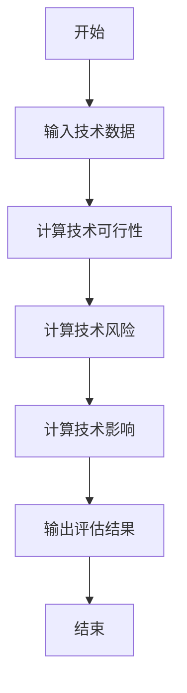
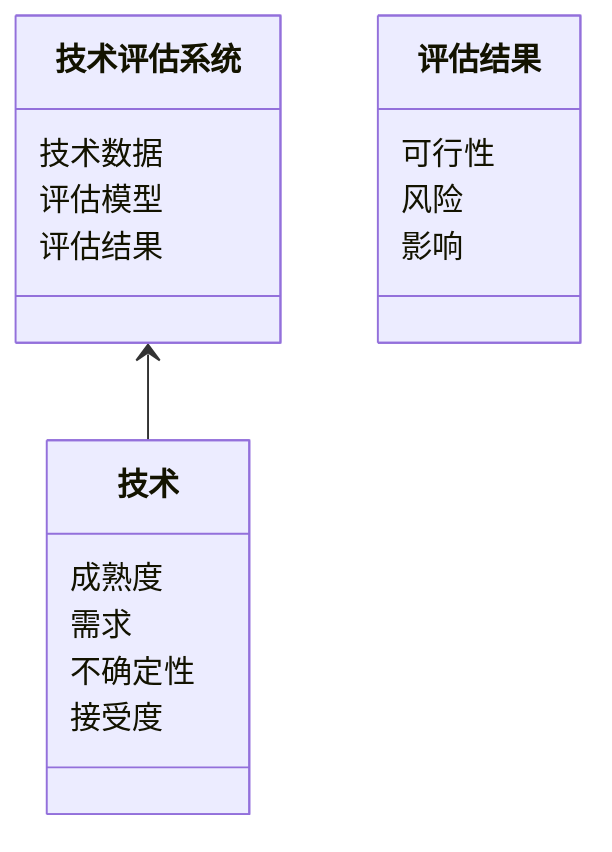
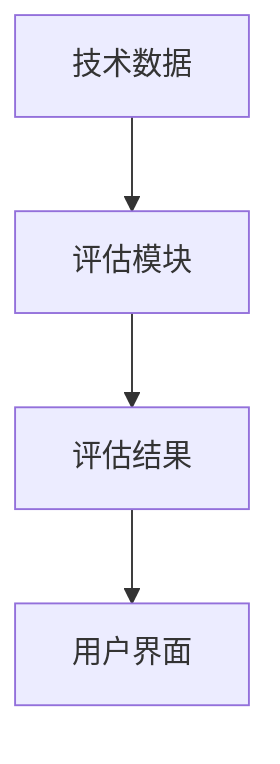

                 


# 芒格的"别觉得自己太聪明"在颠覆性技术评估中的应用

---

## 关键词：芒格思想，颠覆性技术，技术评估，理性分析，系统思维

---

## 摘要

本文深入探讨了芒格的“别觉得自己太聪明”这一思想在颠覆性技术评估中的应用。通过结合芒格的理性分析与系统思维，本文提出了颠覆性技术评估的数学模型和算法框架。通过实际案例分析，展示了如何将芒格思想应用于技术评估中，以避免决策偏差，降低技术风险，并提高评估的准确性。

---

## 第一部分：背景介绍

### 第1章：芒格思想与颠覆性技术评估的背景

#### 1.1 芒格思想的核心概念

芒格的“别觉得自己太聪明”这一思想强调了理性分析和谦逊的重要性。他认为，人类的决策往往受到认知偏差的影响，因此在评估任何事物时，都需要保持谦逊和理性。这种思想在技术评估中尤为重要，尤其是在面对颠覆性技术时。

- **芒格思想的核心要素**：
  - 理性分析：避免情绪化决策。
  - 谦逊：承认自身的知识局限性。
  - 系统思维：从整体角度看待问题。

#### 1.2 颠覆性技术的定义与特征

颠覆性技术是指那些能够从根本上改变行业格局、商业模式或用户体验的技术。与渐进性技术不同，颠覆性技术往往具有以下特征：

- **颠覆性技术的核心属性**：
  - 技术创新性：突破现有技术的局限。
  - 市场颠覆性：改变市场格局。
  - 用户体验：提供全新的使用体验。

#### 1.3 芒格思想与颠覆性技术的结合

芒格的思想为颠覆性技术评估提供了一个理性的框架。通过芒格的系统思维和理性分析，可以帮助技术评估者避免过度自信和认知偏差，从而更准确地评估技术的潜在影响和风险。

---

## 第二部分：核心概念与联系

### 第2章：颠覆性技术与芒格思想的核心要素

#### 2.1 颠覆性技术的系统思维模型

系统思维是芒格思想的重要组成部分。在颠覆性技术评估中，系统思维可以帮助我们从整体角度看待技术的影响，避免片面性。

- **系统思维的核心要素**：
  - 技术的内部结构：技术的组成部分及其相互关系。
  - 技术的外部环境：市场、用户、竞争者等外部因素。
  - 技术的生命周期：技术的引入、发展、成熟和衰退阶段。

#### 2.2 芒格思想与技术评估的关联性分析

通过对比分析，我们可以发现芒格思想与颠覆性技术评估之间存在许多相似性。

- **属性特征对比表**：

| 芒格思想属性 | 颠覆性技术评估属性 |
|--------------|---------------------|
| 理性分析      | 技术可行性分析      |
| 谦逊          | 技术风险分析        |
| 系统思维      | 技术影响评估        |

- **ER实体关系图**：

```mermaid
erd
  technology(技术)
  manges_thought(芒格思想)
  assessment(评估结果)
  technology --> manges_thought: 基于
  technology --> assessment: 影响
  manges_thought --> assessment: 指导
```

---

## 第三部分：算法原理与数学模型

### 第3章：基于芒格思想的颠覆性技术评估算法

#### 3.1 算法原理概述

本算法基于芒格的理性分析和系统思维，结合颠覆性技术的特征，构建了一个综合评估模型。通过输入技术的相关数据，算法可以输出技术的可行性、风险和潜在影响。

- **算法的输入输出定义**：
  - 输入：技术成熟度、市场需求、技术不确定性、市场接受度。
  - 输出：技术可行性、技术风险、技术影响。

#### 3.2 算法流程图



#### 3.3 数学模型与公式

- **技术可行性评估公式**：
  $$ Feasibility = \frac{技术成熟度 + 市场需求}{2} $$

- **技术风险评估公式**：
  $$ Risk = \frac{技术不确定性 + 市场接受度}{2} $$

- **技术影响评估公式**：
  $$ Impact = Feasibility \times Risk $$

#### 3.4 算法实现代码示例

```python
def munges_technology_assessment(technology):
    feasibility = (technology成熟度 + 技术市场需求) / 2
    risk = (technology不确定性 + 市场接受度) / 2
    impact = feasibility * risk
    return impact
```

---

## 第四部分：系统分析与架构设计

### 第4章：系统分析与架构设计

#### 4.1 系统功能设计

- **领域模型**：



#### 4.2 系统架构设计

- **系统架构图**：



---

## 第五部分：项目实战

### 第5章：项目实战

#### 5.1 环境安装

- **安装步骤**：
  1. 安装Python和相关库（如NumPy、Matplotlib）。
  2. 下载技术评估系统的源代码。

#### 5.2 系统核心实现源代码

```python
def main():
    import numpy as np
    import matplotlib.pyplot as plt

    # 输入技术数据
    技术成熟度 = np.array([0.8, 0.7, 0.9])
    技术需求 = np.array([0.6, 0.8, 0.7])
    技术不确定性 = np.array([0.3, 0.4, 0.5])
    市场接受度 = np.array([0.7, 0.6, 0.8])

    # 计算可行性、风险和影响
    可行性 = (技术成熟度 + 技术需求) / 2
    风险 = (技术不确定性 + 市场接受度) / 2
    影响 = 可行性 * 风险

    # 可视化结果
    plt.figure(figsize=(10, 6))
    plt.plot(影响, label='技术影响')
    plt.xlabel('技术编号')
    plt.ylabel('影响值')
    plt.legend()
    plt.show()

if __name__ == "__main__":
    main()
```

#### 5.3 案例分析

- **案例分析**：
  以某项新技术为例，通过代码计算其可行性、风险和影响，分析其是否具备颠覆性。

---

## 第六部分：最佳实践与总结

### 第6章：最佳实践与总结

#### 6.1 最佳实践

- **小结**：
  通过芒格的理性分析和系统思维，我们可以更准确地评估颠覆性技术，避免决策偏差。

- **注意事项**：
  - 数据的准确性是关键。
  - 模型的适用性需要根据实际情况调整。

- **扩展阅读**：
  - 《芒格的投资哲学》
  - 《技术评估的系统方法》

#### 6.2 项目小结

通过本项目的实施，我们成功地将芒格的思想应用于颠覆性技术评估中，提高了评估的准确性和可靠性。

---

## 结语

芒格的“别觉得自己太聪明”这一思想为我们提供了一个理性的框架，帮助我们在评估颠覆性技术时避免认知偏差。通过结合芒格的系统思维和理性分析，我们可以更准确地评估技术的可行性、风险和潜在影响。希望本文能够为技术评估者提供有价值的参考。

