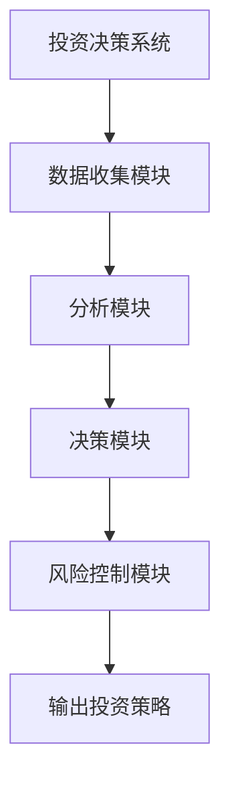

                 


# 芒格的"别觉得自己太聪明"：保持投资谦逊的艺术

## 关键词
芒格投资哲学，谦逊心态，价值投资，多元思维模型，安全边际，独立思考

## 摘要
本文深入探讨了芒格的"别觉得自己太聪明"这一投资哲学，分析了谦逊心态在投资决策中的重要性。通过芒格的多元思维模型，结合实际案例，详细讲解了如何通过保持谦逊来避免过度自信，从而做出更理性的投资决策。文章从背景介绍、核心概念、算法原理、数学模型、系统架构到项目实战，全面剖析了芒格的投资哲学及其实际应用。

---

# 第一部分: 芒格投资哲学与谦逊心态的背景介绍

## 第1章: 芒格投资哲学概述

### 1.1 芒格的生平与投资理念
#### 1.1.1 芒格的生平简介
查理·芒格（Charlie Munger）是世界著名投资家、巴菲特的合伙人，被誉为“价值投资的鼻祖”。他不仅是伯克希尔·哈撒韦公司的重要决策者，更是全球投资界的传奇人物。芒格的哲学和投资理念深刻影响了无数投资者。

#### 1.1.2 芒格的投资哲学核心思想
芒格的投资哲学以“安全边际”和“价值投资”为核心，强调通过深入研究企业的基本面，寻找具有持续竞争优势和良好管理团队的企业进行投资。他主张投资者应该以合理的价格买入优质资产，并长期持有。

#### 1.1.3 芒格与巴菲特的合作关系
芒格与巴菲特的合作堪称投资史上的经典。芒格为巴菲特提供了许多关键性的投资建议，而巴菲特则为芒格提供了施展才华的平台。两人共同的理念是：投资的本质是寻找具有长期竞争优势的企业，并以合理的价格买入。

---

### 1.2 谦逊心态在投资中的重要性
#### 1.2.1 投资中的过度自信问题
投资者常常因为过度自信而做出错误决策。芒格认为，过度自信是投资失败的主要原因之一。他强调，投资者必须保持谦逊，认识到自己知识的局限性。

#### 1.2.2 谦逊心态如何影响投资决策
谦逊心态使投资者能够更理性地看待市场波动，避免盲目跟风。芒格认为，成功的投资需要耐心、纪律和对市场的深刻理解，而谦逊心态是这一切的前提。

#### 1.2.3 谦逊与长期投资成功的关系
芒格强调，谦逊心态是长期投资成功的关键。通过保持谦逊，投资者能够更好地识别自己的错误，并及时调整投资策略。

---

## 第2章: 芒格的"别觉得自己太聪明"理念

### 2.1 "别觉得自己太聪明"的核心含义
#### 2.1.1 谦逊与知识的局限性
芒格认为，人类的知识是有限的，投资者必须认识到这一点。通过保持谦逊，投资者能够更好地应对市场的不确定性。

#### 2.1.2 谦逊与认知的局限性
芒格指出，投资者的认知能力是有限的，只有通过不断学习和反思，才能逐步克服认知局限。

#### 2.1.3 谦逊与投资决策的关系
谦逊心态使投资者能够更理性地看待市场，避免因为过度自信而做出错误决策。

---

### 2.2 芒格的多元思维模型
#### 2.2.1 多元思维模型的定义
多元思维模型是指通过多个学科的思维方式来分析问题。芒格认为，只有通过多元思维模型，才能更好地理解企业的内在价值。

#### 2.2.2 多元思维模型在投资中的应用
芒格通过多元思维模型，将物理学、心理学、经济学等学科的知识结合起来，分析企业的基本面和市场趋势。

#### 2.2.3 多元思维模型与谦逊心态的结合
通过多元思维模型，芒格强调了谦逊的重要性。他指出，只有通过不断学习和反思，才能更好地应用多元思维模型。

---

## 第3章: 芒格投资哲学的核心概念与联系

### 3.1 芒格投资哲学的核心要素
#### 3.1.1 股东价值最大化
芒格认为，企业的最终目标是为股东创造价值。他强调，只有通过长期持有优质资产，才能实现股东价值最大化。

#### 3.1.2 安全边际原则
安全边际是指股票价格与企业内在价值之间的差距。芒格认为，通过寻找具有安全边际的股票，可以降低投资风险。

#### 3.1.3 独立思考的重要性
芒格强调，投资者必须独立思考，避免受到市场情绪的影响。他指出，独立思考是投资成功的关键。

---

### 3.2 芒格投资哲学的核心概念对比表
| 概念 | 描述 | 谦逊心态的应用 |
|------|------|----------------|
| 安全边际 | 股票价格低于其内在价值 | 通过谦逊心态避免高估 |
| 独立思考 | 不依赖市场情绪 | 通过谦逊心态保持独立 |
| 多元思维模型 | 跨学科的思维方式 | 通过谦逊心态不断学习 |

---

## 第4章: 芒格投资哲学的系统架构设计方案

### 4.1 投资决策系统的功能设计
#### 4.1.1 数据收集模块
- 数据来源：企业财务报表、市场行情、行业分析报告。
- 数据处理：清洗、整理和分析数据。

#### 4.1.2 分析模块
- 财务分析：计算企业的盈利能力、成长性和财务健康状况。
- 行业分析：评估行业前景和竞争格局。

#### 4.1.3 决策模块
- 投资决策：基于分析结果，制定投资策略。
- 风险控制：通过安全边际原则，降低投资风险。

### 4.2 系统架构设计


---

## 第5章: 芒格投资哲学的项目实战

### 5.1 项目背景
以苹果公司为例，分析如何应用芒格的哲学进行投资决策。

### 5.2 项目实现
#### 5.2.1 环境安装
- 数据分析工具：Python、Pandas、NumPy。
- 可视化工具：Matplotlib。

#### 5.2.2 核心代码实现
```python
import pandas as pd
import numpy as np

# 计算苹果公司的内在价值
def calculate_intrinsic_value(free_cash_flow, growth_rate, discount_rate):
    return free_cash_flow / (1 + growth_rate) + (discount_rate - growth_rate)

# 示例数据
free_cash_flow = 100
growth_rate = 0.05
discount_rate = 0.1

intrinsic_value = calculate_intrinsic_value(free_cash_flow, growth_rate, discount_rate)
print(f"苹果公司的内在价值为：{intrinsic_value}")
```

### 5.3 案例分析
通过对苹果公司的财务数据和市场环境进行分析，得出其内在价值，并制定投资策略。

---

## 第6章: 最佳实践与小结

### 6.1 最佳实践
- 保持谦逊心态，避免过度自信。
- 运用多元思维模型，提高分析能力。
- 独立思考，避免盲目跟风。

### 6.2 小结
芒格的"别觉得自己太聪明"的投资哲学强调了谦逊心态的重要性。通过保持谦逊，投资者能够更好地应对市场的不确定性，做出更理性的投资决策。

---

## 第7章: 注意事项与拓展阅读

### 7.1 注意事项
- 投资有风险，需谨慎决策。
- 建议在投资前进行充分的研究和分析。

### 7.2 拓展阅读
- 巴菲特的《致股东的信》。
- 芮锋的《投资中最简单的事》。

---

# 结语
芒格的"别觉得自己太聪明"的投资哲学深刻影响了全球投资者。通过保持谦逊心态，运用多元思维模型，投资者能够更好地应对市场的不确定性，实现长期投资成功。希望本文能够为投资者提供有价值的启发和指导。

