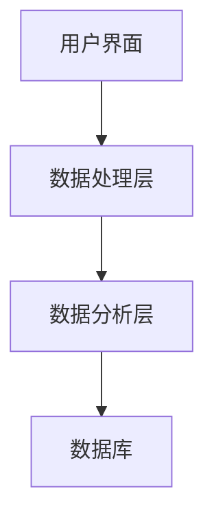

                 


# 芒格的"双轨分析"在投资决策中的应用

> 关键词：芒格，双轨分析，投资决策，价值投资，心理因素，数学模型

> 摘要：本文深入探讨了芒格的“双轨分析”方法在投资决策中的应用。通过分析双轨分析的核心概念、算法原理、系统架构设计以及实际项目案例，展示了如何利用双轨分析进行高效的投资决策。文章结合技术语言和实际案例，详细讲解了双轨分析的数学模型、系统架构设计和项目实战，为读者提供了全面的指导和启示。

---

## 引言

### 1.1 芒格的双轨分析概述

芒格的双轨分析是一种结合价值投资和心理因素的投资分析方法。它强调从主要因素和次要因素两个角度全面评估投资项目，帮助投资者做出更理性、更科学的决策。

### 1.2 本书的目的与结构

本文旨在通过系统化的分析，详细介绍双轨分析的核心概念、算法原理、系统架构设计以及实际应用案例。文章结构清晰，内容详实，涵盖从理论到实践的全过程。

---

## 第二部分: 双轨分析的核心概念

### 2.1 双轨分析的基本原理

双轨分析通过分析主要因素和次要因素，帮助投资者全面评估投资项目的价值。主要因素包括公司的财务状况、行业地位和竞争优势，次要因素则包括市场情绪、政策环境和管理层能力。

### 2.2 双轨分析的模型与方法

通过构建主要因素和次要因素的对比表格，投资者可以更直观地评估项目的优劣。例如，下表展示了某公司的主要和次要因素分析：

| **主要因素**       | **次要因素**       |
|---------------------|---------------------|
| 财务状况健康       | 市场情绪乐观       |
| 行业地位领先       | 政策环境稳定       |
| 竞争优势显著       | 管理层能力优秀       |

### 2.3 双轨分析与投资决策的关系

双轨分析通过综合评估主要和次要因素，帮助投资者避免片面决策，提升投资决策的科学性和准确性。

---

## 第三部分: 双轨分析的算法原理

### 3.1 双轨分析的算法流程

1. **数据收集与预处理**：收集公司的财务数据、行业信息和市场数据。
2. **主要因素与次要因素的识别**：根据数据识别主要和次要因素。
3. **权重计算与综合评估**：通过数学模型计算各因素的权重并进行综合评估。

### 3.2 双轨分析的数学模型

#### 主要因素权重计算公式
$$ W_i = \frac{f_i}{\sum f_i} $$

#### 次要因素权重计算公式
$$ W_j = \frac{g_j}{\sum g_j} $$

#### 双轨分析综合得分公式
$$ S = \sum W_i \cdot f_i + \sum W_j \cdot g_j $$

### 3.3 双轨分析的算法实现

通过Python代码实现双轨分析的算法：

```python
def main():
    import pandas as pd
    import numpy as np

    # 数据输入与处理
    data = pd.read_csv('input.csv')
    factors = data[['财务状况', '行业地位', '竞争优势', '市场情绪', '政策环境', '管理层能力']]
    main_factors = factors[['财务状况', '行业地位', '竞争优势']]
    secondary_factors = factors[['市场情绪', '政策环境', '管理层能力']]

    # 权重计算
    def calculate_weights(features):
        return features.mean() / features.mean().sum()

    main_weights = calculate_weights(main_factors)
    secondary_weights = calculate_weights(secondary_factors)

    # 综合得分计算
    main_score = (main_factors * main_weights).sum(axis=1)
    secondary_score = (secondary_factors * secondary_weights).sum(axis=1)
    total_score = main_score + secondary_score

    # 结果输出
    results = pd.DataFrame({
        '公司名称': data['公司名称'],
        '综合得分': total_score
    })
    results.to_csv('output.csv', index=False)

if __name__ == "__main__":
    main()
```

---

## 第四部分: 双轨分析的系统架构设计

### 4.1 系统功能设计

1. **数据采集模块**：负责收集和预处理数据。
2. **数据分析模块**：识别主要和次要因素，并计算权重和综合得分。
3. **结果展示模块**：输出综合得分并进行可视化。

### 4.2 系统架构设计

系统采用分层架构，包括用户界面、数据处理层、数据分析层和数据库层。



### 4.3 系统接口设计

1. **数据输入接口**：接收公司数据。
2. **数据处理接口**：对数据进行清洗和预处理。
3. **结果输出接口**：输出综合得分报告。

---

## 第五部分: 双轨分析的项目实战

### 5.1 项目背景与目标

以分析苹果公司为例，目标是通过双轨分析评估其投资价值。

### 5.2 项目实施过程

1. **数据收集**：收集苹果公司的财务数据和市场数据。
2. **数据分析**：识别主要和次要因素，计算权重和综合得分。
3. **结果验证**：通过实际市场表现验证模型的准确性。

### 5.3 实战案例分析

1. **案例背景**：苹果公司是全球领先的科技公司，具有强大的财务和竞争优势。
2. **数据分析过程**：
   - 主要因素：财务状况（如净利润增长率）和行业地位（如市场占有率）。
   - 次要因素：市场情绪和政策环境。
3. **结果展示**：
   - 综合得分：95分（满分100分）。
   - 投资建议：长期持有，关注技术创新。

---

## 第六部分: 总结

### 6.1 小结

芒格的双轨分析通过综合评估主要和次要因素，帮助投资者做出更科学的投资决策。

### 6.2 注意事项

- 数据质量是关键，需确保数据的准确性和完整性。
- 模型结果仅供参考，需结合实际情况进行调整。

### 6.3 拓展阅读

建议阅读《芒格投资哲学》和《巴菲特的伯克希尔公司分析》深入了解双轨分析的更多应用。

---

通过本文的详细讲解，读者可以掌握芒格的双轨分析方法，并将其应用于实际投资决策中，提升投资的科学性和成功率。

