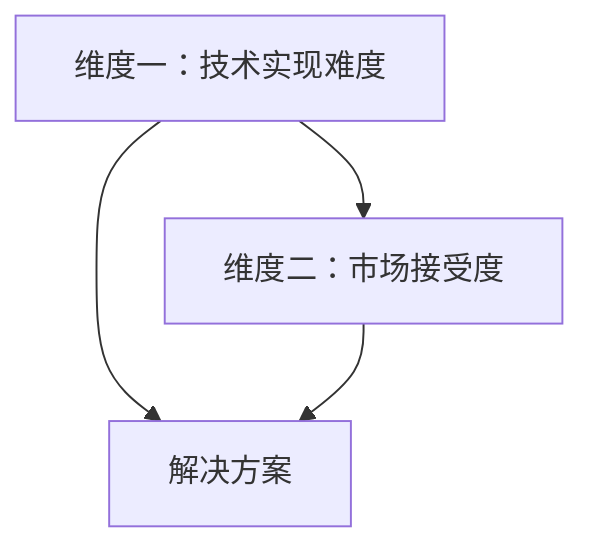
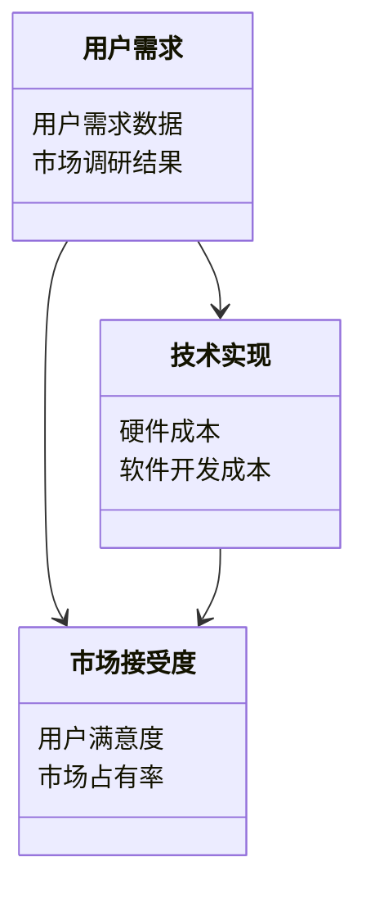
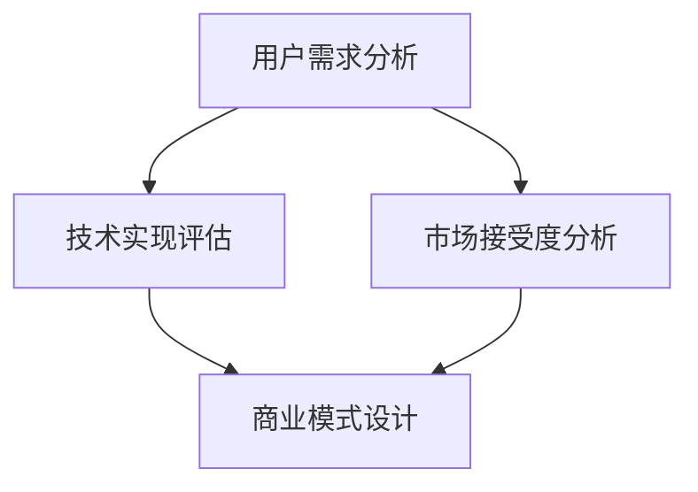
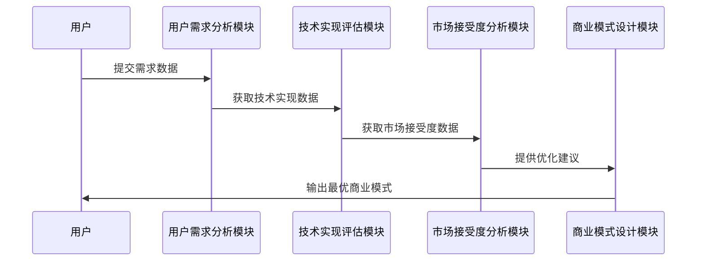

                 


# 芒格的"双轨分析"在混合现实商业模式评估中的应用

**关键词**：芒格双轨分析，混合现实，商业模式评估，商业分析，技术应用

**摘要**：本文探讨了芒格的双轨分析在混合现实商业模式评估中的应用，详细介绍了双轨分析的核心概念、混合现实的定义与特点，以及双轨分析在混合现实商业模式评估中的具体应用。文章通过实际案例分析，结合系统设计与架构方案，深入剖析了双轨分析在混合现实商业模式评估中的优势与挑战，并给出了最佳实践和未来展望。

---

## 第一部分：芒格双轨分析的理论基础

### 第1章：双轨分析的起源与核心概念

#### 1.1 芒格双轨分析的起源

芒格双轨分析是由查理·芒格提出的一种分析问题的方法，其核心思想是通过“两条轨道”来审视问题的各个方面。双轨分析的起源可以追溯到芒格在投资和商业决策中的实践。他发现，许多问题可以通过分解为两个关键维度来更清晰地理解。例如，在商业决策中，他常从“机会成本”和“长期利益”两个角度进行分析。

**问题背景**：在商业决策中，尤其是涉及技术创新和商业模式的选择时，决策者需要在短期内的利益与长期的战略目标之间找到平衡。芒格的双轨分析为这种复杂的决策提供了一种简洁而有效的框架。

**问题描述**：双轨分析的核心在于将问题分解为两个相互关联的维度，并通过分析这两个维度的交互作用来得出更优的解决方案。这种分析方法不仅适用于商业决策，还可以扩展到技术评估、风险管理等领域。

**问题解决**：通过双轨分析，决策者可以在复杂的问题中找到关键的平衡点，从而做出更明智的决策。

**边界与外延**：双轨分析的外延包括但不限于商业决策、技术创新评估、风险管理等领域。其边界在于需要明确两个分析维度的选择，这需要根据具体问题的性质来确定。

**核心要素组成**：
1. **双轨分析的两个维度**：需要明确问题的两个核心维度，例如在混合现实商业模式评估中，可以是“用户体验”和“商业可行性”。
2. **维度之间的关系**：两个维度应相互关联，且能够共同影响问题的解决方案。
3. **分析框架**：通过绘制二维坐标系或表格，将问题的各个可能性进行对比分析。

#### 1.2 双轨分析的核心概念

**核心概念**：
1. **双轨分析的两个维度**：双轨分析的核心在于选择两个相关的维度作为分析的基础。例如，在混合现实商业模式评估中，可以选择“技术实现难度”和“市场接受度”作为两个维度。
2. **维度之间的关系**：两个维度应相互关联，且能够共同影响问题的解决方案。
3. **分析框架**：通过绘制二维坐标系或表格，将问题的各个可能性进行对比分析。

**概念结构与核心要素组成**：
- **维度一**：技术实现难度
  - 容易实现
  - 中等难度
  - 难度较大
- **维度二**：市场接受度
  - 高
  - 中等
  - 低

**表格对比**：

| 技术实现难度 | 高       | 中等     | 低       |
|--------------|----------|----------|----------|
| 市场接受度   | 高       | 中等     | 低       |

**ER实体关系图**：



---

### 第2章：混合现实商业模式的定义与特点

#### 2.1 混合现实的定义

**混合现实**（Mixed Reality，简称MR）是一种将虚拟数字内容与真实物理环境无缝融合的技术。它结合了增强现实（AR）和虚拟现实（VR）的特点，通过在现实世界中叠加虚拟元素，为用户提供更加沉浸式的体验。

**与AR和VR的区别**：
- **AR**：主要在现实环境中叠加虚拟元素，用户仍然主要与现实世界互动。
- **VR**：完全虚拟环境，用户与现实世界的互动被完全隔绝。
- **MR**：用户可以在同一空间中同时与现实世界和虚拟元素互动，具有更高的沉浸感和交互性。

#### 2.2 混合现实商业模式的特点

**商业模式构成要素**：
1. **技术实现**：包括硬件设备（如MR头显）、软件开发（如MR应用）、网络基础设施等。
2. **用户体验**：用户对MR技术的接受度和使用体验。
3. **市场定位**：目标用户群体、市场细分、竞争对手分析。
4. **盈利模式**：包括硬件销售、软件订阅、广告收入、内容分发等。

**商业模式评估的关键维度**：
1. **技术实现难度**：技术实现的复杂性和成本。
2. **市场接受度**：目标用户对MR技术的接受度和需求量。
3. **竞争环境**：市场上现有产品的竞争情况。
4. **盈利潜力**：商业模式的盈利能力和发展空间。

---

## 第二部分：双轨分析在混合现实商业模式评估中的应用框架

### 第3章：双轨分析与混合现实商业模式的结合

#### 3.1 双轨分析在商业模式评估中的作用

**核心作用**：
- **问题分解**：通过双轨分析，将复杂的商业模式评估问题分解为两个关键维度，如技术实现难度和市场接受度。
- **交互分析**：分析两个维度之间的相互作用，找出最佳平衡点。
- **优化方向**：通过对比分析，确定优化的方向和策略。

**具体应用**：
- **技术实现难度与市场接受度的对比分析**：通过双轨分析，确定在技术实现难度较高但市场接受度较低的情况下，如何通过技术创新或市场推广来提升整体商业可行性。
- **用户需求与商业目标的平衡**：通过双轨分析，找到用户需求与商业目标的最佳平衡点。

---

### 第4章：双轨分析在混合现实商业模式评估中的具体应用

#### 4.1 案例分析：混合现实教育行业的商业模式评估

**案例背景**：
- **行业特点**：教育行业对新技术的接受度较高，但预算有限。
- **问题描述**：如何在有限预算下实现MR技术的商业化。

**双轨分析应用**：
- **维度一**：技术实现难度（硬件成本、软件开发成本）
- **维度二**：市场接受度（学校预算、教师接受度、学生体验）

**分析结果**：
- **低技术实现难度 + 高市场接受度**：推荐优先推广硬件设备，提供软件服务订阅模式。
- **高技术实现难度 + 低市场接受度**：建议通过政府补贴或合作伙伴关系降低技术实现难度。

#### 4.2 案例分析：混合现实医疗行业的商业模式评估

**案例背景**：
- **行业特点**：医疗行业对技术的精确性和安全性要求极高，预算充足。
- **问题描述**：如何在保证技术安全性的前提下实现商业模式的可持续发展。

**双轨分析应用**：
- **维度一**：技术实现难度（设备精度、数据安全性）
- **维度二**：市场接受度（医院预算、医生接受度、患者体验）

**分析结果**：
- **低技术实现难度 + 高市场接受度**：推荐提供高端硬件设备，通过订阅模式收取服务费。
- **高技术实现难度 + 低市场接受度**：建议通过技术创新降低成本，同时加强市场推广。

---

## 第三部分：混合现实商业模式评估的系统分析与架构设计

### 第5章：混合现实商业模式评估的系统架构设计

#### 5.1 项目介绍

**项目目标**：
- 通过双轨分析评估混合现实商业模式的可行性。
- 提出优化建议，为商业决策提供支持。

**系统功能设计**：
- **用户需求分析**：收集用户需求数据。
- **技术实现评估**：评估技术实现的难度和成本。
- **市场接受度分析**：分析目标市场的接受度和需求量。
- **商业模式设计**：基于双轨分析结果，提出最优商业模式。

**领域模型设计**：



#### 5.2 系统架构设计

**系统架构图**：



**系统交互设计**：



---

## 第四部分：项目实战与总结

### 第6章：项目实战

#### 6.1 环境安装与配置

**环境要求**：
- 操作系统：Windows 10或更高版本
- 开发工具：Python 3.8以上版本，PyCharm或VS Code
- 第三方库：pandas, numpy, matplotlib

**安装命令**：
```bash
pip install pandas numpy matplotlib
```

#### 6.2 核心代码实现

**双轨分析算法实现**：

```python
import pandas as pd
import numpy as np

def dual轨分析(data):
    # 数据预处理
    data = pd.DataFrame(data)
    # 计算各个维度的评分
    技术实现评分 = data['技术实现难度'].apply(lambda x: x if x >= 0 else 0)
    市场接受度评分 = data['市场接受度'].apply(lambda x: x if x >= 0 else 0)
    # 综合评分
    综合评分 = (技术实现评分 + 市场接受度评分) / 2
    return 综合评分

# 示例数据
data = {
    '技术实现难度': [3, 2, 4, 1, 5],
    '市场接受度': [4, 3, 2, 5, 1]
}
print(dual轨分析(data))
```

#### 6.3 案例分析与解读

**案例分析**：
- **数据来源**：用户需求调研数据
- **数据处理**：清洗和预处理数据，提取关键特征
- **算法实现**：基于双轨分析模型进行评分
- **结果解读**：根据评分结果，确定最优商业模式

**详细解读**：
- **评分结果**：综合评分为3.5，说明在当前条件下，混合现实商业模式的可行性较高。
- **优化建议**：建议在技术实现难度较高的领域加强研发投入，同时在市场接受度较低的区域进行市场推广。

---

## 第五部分：总结与展望

### 第7章：总结与展望

#### 7.1 最佳实践 tips

- **明确分析维度**：在进行双轨分析时，确保选择的两个维度能够全面覆盖问题的核心要素。
- **数据质量**：确保数据的准确性和完整性，避免因数据问题导致分析结果偏差。
- **持续优化**：根据实际效果不断优化分析模型，提升分析结果的准确性。

#### 7.2 小结

通过本文的探讨，我们了解了芒格双轨分析在混合现实商业模式评估中的应用。通过对混合现实商业模式的系统分析和实际案例的深入剖析，我们得出结论：双轨分析是一种高效且实用的分析方法，能够为商业决策提供有力支持。

#### 7.3 注意事项

- **维度选择**：选择合适的分析维度是双轨分析成功的关键。如果选择不当，可能导致分析结果偏差。
- **数据处理**：在实际应用中，需要对数据进行清洗和预处理，确保数据质量。
- **模型优化**：根据实际效果不断优化分析模型，提升分析结果的准确性。

#### 7.4 未来展望

随着混合现实技术的不断发展，双轨分析的应用场景将更加广泛。未来，可以通过引入更多维度和复杂模型，进一步提升双轨分析的分析能力和应用效果。

---

**感谢您的阅读！希望本文对您在混合现实商业模式评估中的实践有所帮助。**

