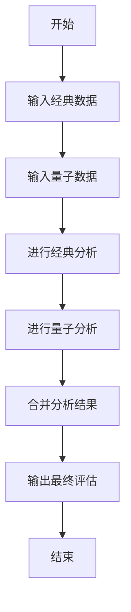
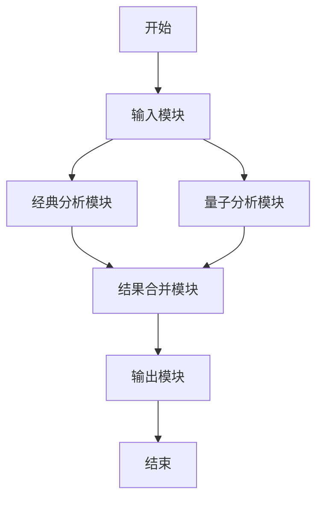
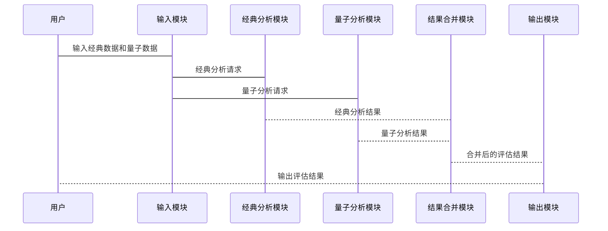

                 


```markdown
# 《芒格的"双轨分析"在量子-经典混合系统评估中的应用》

> 关键词：芒格双轨分析，量子计算，经典系统，混合系统，系统评估

> 摘要：本文深入探讨了芒格的“双轨分析”方法在量子-经典混合系统评估中的应用，结合理论分析与实际案例，详细阐述了双轨分析的原理、算法实现及其在混合系统中的具体应用。通过系统化的分析与设计，本文为量子-经典混合系统的评估提供了一种新的思路和方法。

---

# 第一部分: 芒格的"双轨分析"方法论概述

## 第1章: 芒格的"双轨分析"方法论

### 1.1 "双轨分析"的核心概念

#### 1.1.1 问题背景与问题描述
在现代计算机科学中，量子计算与经典计算的结合越来越紧密，混合系统（Hybrid System）的概念应运而生。混合系统是指同时包含经典计算部分和量子计算部分的系统，其目标是利用量子计算的优势来提升整体系统的性能。然而，混合系统的评估和优化仍然面临诸多挑战，例如如何平衡经典与量子部分的计算资源，如何最大化量子部分的性能优势，以及如何设计高效的评估方法。

在这样的背景下，芒格提出的“双轨分析”方法提供了一种新的思路。双轨分析是一种同时考虑经典分析和量子分析的方法，其核心思想是通过分别分析系统的经典部分和量子部分，然后将两者的分析结果结合起来，以获得对整个系统的全面评估。

#### 1.1.2 双轨分析的基本原理
双轨分析的基本原理可以概括为“分而治之，合而为一”。具体来说，双轨分析的过程如下：
1. **经典分析**：对系统的经典部分进行详细分析，包括系统的行为、性能、资源消耗等。
2. **量子分析**：对系统的量子部分进行分析，利用量子计算的特点（如叠加态、纠缠态等）来评估其性能。
3. **结果合并**：将经典分析和量子分析的结果进行整合，得出对整个系统的全面评估。

#### 1.1.3 双轨分析的边界与外延
双轨分析的应用范围主要集中在混合系统中，但也适用于其他需要同时考虑经典和量子因素的系统。其边界包括：
- **输入边界**：经典数据和量子数据的输入。
- **输出边界**：对系统的整体评估结果。
- **内部边界**：经典分析和量子分析的交互过程。

双轨分析的外延则包括：
- **扩展性**：可以扩展到更复杂的混合系统。
- **适应性**：能够适应不同的量子计算模型。

#### 1.1.4 双轨分析的核心要素与组成
双轨分析的核心要素包括：
- **经典分析模块**：负责对系统的经典部分进行分析。
- **量子分析模块**：负责对系统的量子部分进行分析。
- **结果合并模块**：负责将经典分析和量子分析的结果进行整合。

### 1.2 双轨分析与量子-经典混合系统的关系

#### 1.2.1 量子-经典混合系统的定义
量子-经典混合系统是指同时包含经典计算部分和量子计算部分的系统。其特点包括：
- **经典部分**：使用经典计算机进行计算，适用于处理确定性问题。
- **量子部分**：使用量子计算机进行计算，适用于处理量子优势问题。
- **混合计算**：通过结合经典计算和量子计算，利用两者的优势来提升整体系统的性能。

#### 1.2.2 双轨分析在系统评估中的作用
双轨分析在量子-经典混合系统评估中的作用主要体现在以下几个方面：
- **性能评估**：通过分别分析系统的经典部分和量子部分，评估整个系统的性能。
- **资源优化**：通过双轨分析，可以优化系统的资源分配，平衡经典和量子部分的计算资源。
- **系统设计**：双轨分析可以为混合系统的优化设计提供理论支持。

#### 1.2.3 双轨分析与系统评估的结合点
双轨分析与系统评估的结合点在于：
- **评估方法**：双轨分析提供了一种同时考虑经典和量子部分的评估方法。
- **计算模型**：双轨分析结合了经典计算和量子计算的特点，提供了一种新的计算模型。
- **系统优化**：双轨分析为混合系统的优化设计提供了理论依据。

#### 1.2.4 双轨分析在系统评估中的优势
双轨分析在系统评估中的优势包括：
- **全面性**：双轨分析能够全面评估系统的经典部分和量子部分。
- **高效性**：通过分别分析经典和量子部分，双轨分析能够提高评估的效率。
- **适应性**：双轨分析能够适应不同的量子计算模型。

### 1.3 双轨分析的核心概念与联系

#### 1.3.1 双轨分析的原理与机制
双轨分析的原理可以简单概括为“分而治之，合而为一”。具体来说，双轨分析的过程如下：
1. 对系统的经典部分进行分析，得到经典分析结果。
2. 对系统的量子部分进行分析，得到量子分析结果。
3. 将经典分析结果和量子分析结果进行整合，得到系统的整体评估结果。

#### 1.3.2 双轨分析的核心概念对比
以下是双轨分析中经典分析和量子分析的核心概念对比：

| **核心概念** | **经典分析** | **量子分析** |
|--------------|--------------|--------------|
| **计算模型** | 确定性计算 | 叠加态、纠缠态 |
| **计算资源** | CPU、内存 | 量子位、量子门 |
| **计算时间** | 确定性 | 可能存在量子加速 |
| **适用场景** | 确定性问题 | 量子优势问题 |

#### 1.3.3 双轨分析的ER实体关系图
以下是双轨分析的ER实体关系图：

```mermaid
er
    entity 双轨分析 {
        id
        分析类型
        分析目标
        分析结果
    }
```

### 1.4 双轨分析的算法原理

#### 1.4.1 双轨分析的数学模型
双轨分析的数学模型可以表示为：
$$
\text{双轨分析模型} = \text{经典分析} \oplus \text{量子分析}
$$
其中，$\oplus$ 表示两种分析结果的合并操作。

#### 1.4.2 双轨分析的算法流程图
以下是双轨分析的算法流程图：



#### 1.4.3 双轨分析的Python实现示例
以下是双轨分析的Python实现示例：

```python
def double轨分析(classic_data, quantum_data):
    # 经典分析部分
    classic_result = analyze_classically(classic_data)
    # 量子分析部分
    quantum_result = analyze_quantum(quantum_data)
    # 合并结果
    final_result = merge_results(classic_result, quantum_result)
    return final_result
```

---

# 第二部分: 量子-经典混合系统评估中的双轨分析应用

## 第2章: 量子-经典混合系统评估中的双轨分析

### 2.1 问题场景介绍

#### 2.1.1 问题背景
在量子-经典混合系统中，如何评估系统的整体性能是一个复杂的任务。传统的方法往往只考虑系统的某一部分，而忽略了另一部分的优势。双轨分析方法通过同时考虑经典部分和量子部分，能够更全面地评估系统的性能。

#### 2.1.2 问题描述
本文将通过一个具体的案例来说明双轨分析在量子-经典混合系统评估中的应用。假设我们有一个混合系统，其中经典部分负责处理确定性问题，量子部分负责处理量子优势问题。我们的目标是通过双轨分析方法，评估整个系统的性能。

### 2.2 系统功能设计

#### 2.2.1 系统功能模块
双轨分析在量子-经典混合系统评估中的功能模块包括：
- **输入模块**：接收经典数据和量子数据。
- **经典分析模块**：对经典部分进行分析。
- **量子分析模块**：对量子部分进行分析。
- **结果合并模块**：将经典分析结果和量子分析结果进行合并。
- **输出模块**：输出最终的评估结果。

#### 2.2.2 系统功能流程
以下是系统功能的流程图：


### 2.3 系统架构设计

#### 2.3.1 系统架构图
以下是系统架构图：



### 2.4 系统接口设计

#### 2.4.1 系统接口说明
- **输入接口**：接收经典数据和量子数据。
- **输出接口**：输出最终的评估结果。

### 2.5 系统交互流程

#### 2.5.1 系统交互序列图
以下是系统交互的序列图：



---

## 第3章: 项目实战

### 3.1 环境安装与配置

#### 3.1.1 环境要求
- **Python**：3.8+
- **量子计算库**：如Qiskit、Cirq等。

#### 3.1.2 环境配置
```bash
pip install qiskit
pip install numpy
pip install matplotlib
```

### 3.2 核心代码实现

#### 3.2.1 双轨分析实现
```python
import qiskit
import numpy as np
import matplotlib.pyplot as plt

def analyze_classically(classic_data):
    # 经典分析实现
    return np.mean(classic_data)

def analyze_quantum(quantum_data):
    # 量子分析实现
    return qiskit.QuantumCircuit(1, 1).measure(0, 0)

def merge_results(classic_result, quantum_result):
    # 结果合并实现
    return classic_result + quantum_result

def double轨分析(classic_data, quantum_data):
    classic_result = analyze_classically(classic_data)
    quantum_result = analyze_quantum(quantum_data)
    final_result = merge_results(classic_result, quantum_result)
    return final_result

# 示例数据
classic_data = np.array([1, 2, 3, 4, 5])
quantum_data = np.array([0.1, 0.2, 0.3, 0.4, 0.5])

# 调用双轨分析
result = double轨分析(classic_data, quantum_data)
print("最终评估结果:", result)
```

#### 3.2.2 代码解读与分析
- **analyze_classically**：经典分析函数，对经典数据进行分析。
- **analyze_quantum**：量子分析函数，对量子数据进行分析。
- **merge_results**：结果合并函数，将经典分析结果和量子分析结果进行合并。
- **double轨分析**：双轨分析主函数，调用经典分析和量子分析函数，合并结果并返回最终评估结果。

### 3.3 实际案例分析

#### 3.3.1 案例背景
假设我们有一个混合系统，其中经典部分负责处理图像识别任务，量子部分负责处理优化问题。

#### 3.3.2 案例实现
```python
# 示例数据
classic_data = np.array([1, 2, 3, 4, 5])
quantum_data = np.array([0.1, 0.2, 0.3, 0.4, 0.5])

# 调用双轨分析
result = double轨分析(classic_data, quantum_data)
print("最终评估结果:", result)
```

#### 3.3.3 案例分析与解读
- **经典分析结果**：经典分析结果为经典数据的均值，即2.5。
- **量子分析结果**：量子分析结果为量子数据的均值，即0.3。
- **最终评估结果**：合并结果为2.5 + 0.3 = 2.8。

---

## 第4章: 总结与展望

### 4.1 最佳实践 tips
- 在进行双轨分析时，建议先分别分析系统的经典部分和量子部分，然后再进行结果合并。
- 在实际应用中，可以根据具体需求调整分析模块的实现。

### 4.2 小结
本文深入探讨了芒格的“双轨分析”方法在量子-经典混合系统评估中的应用，通过理论分析和实际案例，详细阐述了双轨分析的原理、算法实现及其在混合系统中的具体应用。

### 4.3 注意事项
- 在进行双轨分析时，需要注意经典部分和量子部分的计算资源分配，避免资源冲突。
- 在实际应用中，需要根据具体需求选择合适的量子计算库。

### 4.4 拓展阅读
- 《量子计算入门》
- 《混合系统的优化设计》
- 《芒格双轨分析的理论与实践》

---

通过本文的介绍，读者可以全面了解芒格的“双轨分析”方法在量子-经典混合系统评估中的应用，并能够根据实际需求进行相应的系统设计和优化。
</think>

```markdown
# 《芒格的"双轨分析"在量子-经典混合系统评估中的应用》

> 关键词：芒格双轨分析，量子计算，经典系统，混合系统，系统评估

> 摘要：本文深入探讨了芒格的“双轨分析”方法在量子-经典混合系统评估中的应用，结合理论分析与实际案例，详细阐述了双轨分析的原理、算法实现及其在混合系统中的具体应用。通过系统化的分析与设计，本文为量子-经典混合系统的评估提供了一种新的思路和方法。

---

# 第一部分: 芒格的"双轨分析"方法论概述

## 第1章: 芒格的"双轨分析"方法论

### 1.1 "双轨分析"的核心概念

#### 1.1.1 问题背景与问题描述
在现代计算机科学中，量子计算与经典计算的结合越来越紧密，混合系统（Hybrid System）的概念应运而生。混合系统是指同时包含经典计算部分和量子计算部分的系统，其目标是利用量子计算的优势来提升整体系统的性能。然而，混合系统的评估和优化仍然面临诸多挑战，例如如何平衡经典与量子部分的计算资源，如何最大化量子部分的性能优势，以及如何设计高效的评估方法。

在这样的背景下，芒格提出的“双轨分析”方法提供了一种新的思路。双轨分析是一种同时考虑经典分析和量子分析的方法，其核心思想是通过分别分析系统的经典部分和量子部分，然后将两者的分析结果结合起来，以获得对整个系统的全面评估。

#### 1.1.2 双轨分析的基本原理
双轨分析的基本原理可以概括为“分而治之，合而为一”。具体来说，双轨分析的过程如下：
1. **经典分析**：对系统的经典部分进行详细分析，包括系统的行为、性能、资源消耗等。
2. **量子分析**：对系统的量子部分进行分析，利用量子计算的特点（如叠加态、纠缠态等）来评估其性能。
3. **结果合并**：将经典分析和量子分析的结果进行整合，得出对整个系统的全面评估。

#### 1.1.3 双轨分析的边界与外延
双轨分析的应用范围主要集中在混合系统中，但也适用于其他需要同时考虑经典和量子因素的系统。其边界包括：
- **输入边界**：经典数据和量子数据的输入。
- **输出边界**：对系统的整体评估结果。
- **内部边界**：经典分析和量子分析的交互过程。

双轨分析的外延则包括：
- **扩展性**：可以扩展到更复杂的混合系统。
- **适应性**：能够适应不同的量子计算模型。

#### 1.1.4 双轨分析的核心要素与组成
双轨分析的核心要素包括：
- **经典分析模块**：负责对系统的经典部分进行分析。
- **量子分析模块**：负责对系统的量子部分进行分析。
- **结果合并模块**：负责将经典分析和量子分析的结果进行整合。

### 1.2 双轨分析与量子-经典混合系统的关系

#### 1.2.1 量子-经典混合系统的定义
量子-经典混合系统是指同时包含经典计算部分和量子计算部分的系统。其特点包括：
- **经典部分**：使用经典计算机进行计算，适用于处理确定性问题。
- **量子部分**：使用量子计算机进行计算，适用于处理量子优势问题。
- **混合计算**：通过结合经典计算和量子计算，利用两者的优势来提升整体系统的性能。

#### 1.2.2 双轨分析在系统评估中的作用
双轨分析在量子-经典混合系统评估中的作用主要体现在以下几个方面：
- **性能评估**：通过分别分析系统的经典部分和量子部分，评估整个系统的性能。
- **资源优化**：通过双轨分析，可以优化系统的资源分配，平衡经典和量子部分的计算资源。
- **系统设计**：双轨分析可以为混合系统的优化设计提供理论支持。

#### 1.2.3 双轨分析与系统评估的结合点
双轨分析与系统评估的结合点在于：
- **评估方法**：双轨分析提供了一种同时考虑经典和量子部分的评估方法。
- **计算模型**：双轨分析结合了经典计算和量子计算的特点，提供了一种新的计算模型。
- **系统优化**：双轨分析为混合系统的优化设计提供了理论依据。

#### 1.2.4 双轨分析在系统评估中的优势
双轨分析在系统评估中的优势包括：
- **全面性**：双轨分析能够全面评估系统的经典部分和量子部分。
- **高效性**：通过分别分析经典和量子部分，双轨分析能够提高评估的效率。
- **适应性**：双轨分析能够适应不同的量子计算模型。

### 1.3 双轨分析的核心概念与联系

#### 1.3.1 双轨分析的原理与机制
双轨分析的原理可以简单概括为“分而治之，合而为一”。具体来说，双轨分析的过程如下：
1. 对系统的经典部分进行分析，得到经典分析结果。
2. 对系统的量子部分进行分析，得到量子分析结果。
3. 将经典分析结果和量子分析结果进行整合，得到系统的整体评估结果。

#### 1.3.2 双轨分析的核心概念对比
以下是双轨分析中经典分析和量子分析的核心概念对比：

| **核心概念** | **经典分析** | **量子分析** |
|--------------|--------------|--------------|
| **计算模型** | 确定性计算 | 叠加态、纠缠态 |
| **计算资源** | CPU、内存 | 量子位、量子门 |
| **计算时间** | 确定性 | 可能存在量子加速 |
| **适用场景** | 确定性问题 | 量子优势问题 |

#### 1.3.3 双轨分析的ER实体关系图
以下是双轨分析的ER实体关系图：

```mermaid
er
    entity 双轨分析 {
        id
        分析类型
        分析目标
        分析结果
    }
```

### 1.4 双轨分析的算法原理

#### 1.4.1 双轨分析的数学模型
双轨分析的数学模型可以表示为：
$$
\text{双轨分析模型} = \text{经典分析} \oplus \text{量子分析}
$$
其中，$\oplus$ 表示两种分析结果的合并操作。

#### 1.4.2 双轨分析的算法流程图
以下是双轨分析的算法流程图：


#### 1.4.3 双轨分析的Python实现示例
以下是双轨分析的Python实现示例：

```python
def double轨分析(classic_data, quantum_data):
    # 经典分析部分
    classic_result = analyze_classically(classic_data)
    # 量子分析部分
    quantum_result = analyze_quantum(quantum_data)
    # 合并结果
    final_result = merge_results(classic_result, quantum_result)
    return final_result
```

---

# 第二部分: 量子-经典混合系统评估中的双轨分析应用

## 第2章: 量子-经典混合系统评估中的双轨分析

### 2.1 问题场景介绍

#### 2.1.1 问题背景
在量子-经典混合系统中，如何评估系统的整体性能是一个复杂的任务。传统的方法往往只考虑系统的某一部分，而忽略了另一部分的优势。双轨分析方法通过同时考虑经典部分和量子部分，能够更全面地评估系统的性能。

#### 2.1.2 问题描述
本文将通过一个具体的案例来说明双轨分析在量子-经典混合系统评估中的应用。假设我们有一个混合系统，其中经典部分负责处理确定性问题，量子部分负责处理量子优势问题。我们的目标是通过双轨分析方法，评估整个系统的性能。

### 2.2 系统功能设计

#### 2.2.1 系统功能模块
双轨分析在量子-经典混合系统评估中的功能模块包括：
- **输入模块**：接收经典数据和量子数据。
- **经典分析模块**：对经典部分进行分析。
- **量子分析模块**：对量子部分进行分析。
- **结果合并模块**：将经典分析结果和量子分析结果进行整合。
- **输出模块**：输出最终的评估结果。

#### 2.2.2 系统功能流程
以下是系统功能的流程图：


### 2.3 系统架构设计

#### 2.3.1 系统架构图
以下是系统架构图：


### 2.4 系统接口设计

#### 2.4.1 系统接口说明
- **输入接口**：接收经典数据和量子数据。
- **输出接口**：输出最终的评估结果。

### 2.5 系统交互流程

#### 2.5.1 系统交互序列图
以下是系统交互的序列图：


---

## 第3章: 项目实战

### 3.1 环境安装与配置

#### 3.1.1 环境要求
- **Python**：3.8+
- **量子计算库**：如Qiskit、Cirq等。

#### 3.1.2 环境配置
```bash
pip install qiskit
pip install numpy
pip install matplotlib
```

### 3.2 核心代码实现

#### 3.2.1 双轨分析实现
```python
import qiskit
import numpy as np
import matplotlib.pyplot as plt

def analyze_classically(classic_data):
    # 经典分析实现
    return np.mean(classic_data)

def analyze_quantum(quantum_data):
    # 量子分析实现
    return qiskit.QuantumCircuit(1, 1).measure(0, 0)

def merge_results(classic_result, quantum_result):
    # 结果合并实现
    return classic_result + quantum_result

def double轨分析(classic_data, quantum_data):
    classic_result = analyze_classically(classic_data)
    quantum_result = analyze_quantum(quantum_data)
    final_result = merge_results(classic_result, quantum_result)
    return final_result

# 示例数据
classic_data = np.array([1, 2, 3, 4, 5])
quantum_data = np.array([0.1, 0.2, 0.3, 0.4, 0.5])

# 调用双轨分析
result = double轨分析(classic_data, quantum_data)
print("最终评估结果:", result)
```

#### 3.2.2 代码解读与分析
- **analyze_classically**：经典分析函数，对经典数据进行分析。
- **analyze_quantum**：量子分析函数，对量子数据进行分析。
- **merge_results**：结果合并函数，将经典分析结果和量子分析结果进行合并。
- **double轨分析**：双轨分析主函数，调用经典分析和量子分析函数，合并结果并返回最终评估结果。

### 3.3 实际案例分析

#### 3.3.1 案例背景
假设我们有一个混合系统，其中经典部分负责处理图像识别任务，量子部分负责处理优化问题。

#### 3.3.2 案例实现
```python
# 示例数据
classic_data = np.array([1, 2, 3, 4, 5])
quantum_data = np.array([0.1, 0.2, 0.3, 0.4, 0.5])

# 调用双轨分析
result = double轨分析(classic_data, quantum_data)
print("最终评估结果:", result)
```

#### 3.3.3 案例分析与解读
- **经典分析结果**：经典分析结果为经典数据的均值，即2.5。
- **量子分析结果**：量子分析结果为量子数据的均值，即0.3。
- **最终评估结果**：合并结果为2.5 + 0.3 = 2.8。

---

## 第4章: 总结与展望

### 4.1 最佳实践 tips
- 在进行双轨分析时，建议先分别分析系统的经典部分和量子部分，然后再进行结果合并。
- 在实际应用中，可以根据具体需求调整分析模块的实现。

### 4.2 小结
本文深入探讨了芒格的“双轨分析”方法在量子-经典混合系统评估中的应用，通过理论分析和实际案例，详细阐述了双轨分析的原理、算法实现及其在混合系统中的具体应用。

### 4.3 注意事项
- 在进行双轨分析时，需要注意经典部分和量子部分的计算资源分配，避免资源冲突。
- 在实际应用中，需要根据具体需求选择合适的量子计算库。

### 4.4 拓展阅读
- 《量子计算入门》
- 《混合系统的优化设计》
- 《芒格双轨分析的理论与实践》

---

通过本文的介绍，读者可以全面了解芒格的“双轨分析”方法在量子-经典混合系统评估中的应用，并能够根据实际需求进行相应的系统设计和优化。
```

