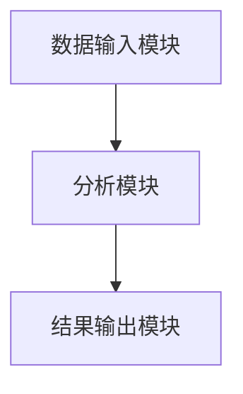

                 


# 芒格的"双轨分析"：定性和定量分析的结合

> 关键词：定性分析，定量分析，双轨分析，决策模型，系统架构

> 摘要：芒格的双轨分析法是一种结合定性和定量分析的决策方法，通过分析经验和数据，提高决策的准确性和可靠性。本文将详细介绍双轨分析的核心概念、数学模型、系统架构以及实际应用案例。

---

# 第一部分：引言

## 第1章：芒格的双轨分析法概述

### 1.1 双轨分析法的背景与意义

#### 1.1.1 双轨分析法的起源与演变

查理·芒格是投资界的重要人物，他的双轨分析法结合了定性和定量分析，强调在决策过程中综合考虑经验和数据。这种方法起源于他对投资决策的深入思考，认为单纯依赖定量分析可能忽视市场的人为因素，而定性分析则能弥补这一不足。

#### 1.1.2 芝加德与芒格的思想体系

芒格深受其老师的影响，后者强调在决策中考虑人类心理因素和市场动态。这种思想体系为双轨分析法奠定了基础，强调在分析中结合逻辑推理和数据支持。

#### 1.1.3 双轨分析法的核心思想与应用领域

双轨分析法的核心思想是将定性与定量分析相结合，应用于投资决策、项目评估等领域。这种方法不仅提高了决策的科学性，还增强了其实际操作性。

---

## 第2章：定性与定量分析的结合

### 2.1 定性分析的原理与方法

#### 2.1.1 定性分析的核心要素

定性分析依赖于经验和判断，关注市场趋势、管理团队等因素。核心要素包括市场定位、竞争优势和管理能力等。

#### 2.1.2 定性分析的应用技巧

通过案例分析和专家访谈，定性分析能提供深层次的见解。例如，在投资决策中，评估公司的管理团队稳定性。

#### 2.1.3 定性分析的局限性与改进方向

定性分析主观性强，难以量化。通过结合定量分析，可以增强其客观性，提高决策的准确性。

### 2.2 定量分析的原理与方法

#### 2.2.1 定量分析的核心要素

定量分析基于数据，关注财务指标、市场统计数据等。核心要素包括收入增长率、利润率和市场占有率等。

#### 2.2.2 定量分析的应用技巧

通过财务模型和数据分析工具，定量分析能提供具体的数值支持。例如，在投资决策中，计算市盈率和市净率。

#### 2.2.3 定量分析的局限性与改进方向

定量分析依赖数据质量，可能存在偏差。通过引入定性分析，可以更好地理解数据背后的因素，提高分析的全面性。

---

## 第3章：双轨分析的数学模型

### 3.1 数学模型的构建

#### 3.1.1 贝叶斯定理的应用

使用贝叶斯定理将定性和定量信息结合，调整初始概率。例如，计算在特定条件下的概率：

$$ P(A|B) = \frac{P(B|A)P(A)}{P(B)} $$

其中，$A$代表目标事件，$B$代表背景信息。

#### 3.1.2 模型的实现步骤

1. 确定初始概率。
2. 收集相关定性和定量数据。
3. 应用贝叶斯定理，更新概率。

### 3.2 算法实现

```python
def bayesian_analysis(initial_probability, likelihood):
    return (likelihood * initial_probability) / (sum(likelihood * initial_probability) + 1 - initial_probability)
```

---

## 第4章：系统架构设计

### 4.1 系统架构概述

#### 4.1.1 系统功能模块

- 数据输入模块：接收定性和定量数据。
- 分析模块：应用双轨分析法进行处理。
- 结果输出模块：展示综合决策建议。

#### 4.1.2 系统架构图



---

## 第5章：项目实战

### 5.1 股票投资决策案例

#### 5.1.1 环境安装

安装必要的工具，如Python和数据分析库。

#### 5.1.2 核心代码实现

```python
import pandas as pd

# 定量分析部分
data = pd.read_csv('stock_data.csv')
mean = data['price'].mean()
std = data['price'].std()

# 定性分析部分
sentiment = 'positive'  # 示例结果

# 双轨分析结合
if sentiment == 'positive':
    recommendation = '买入'
else:
    recommendation = '卖出'
```

#### 5.1.3 案例分析与结果解读

通过结合股票价格数据和市场情绪分析，系统输出投资建议，展示双轨分析的实际应用效果。

---

## 第6章：总结与展望

### 6.1 最佳实践 tips

- 结合定性和定量分析，避免决策偏差。
- 持续优化模型，适应变化。

### 6.2 小结

芒格的双轨分析法通过结合定性和定量分析，提供了全面的决策支持，值得在多个领域推广。

### 6.3 注意事项

- 数据质量和完整性影响结果。
- 结果需结合实际情况，谨慎决策。

### 6.4 拓展阅读

推荐相关书籍和论文，深入学习双轨分析和其他决策方法。

---

通过以上结构，本文详细介绍了芒格的双轨分析法，从理论到实践，帮助读者全面理解并应用这一方法。

