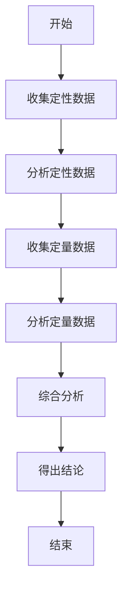
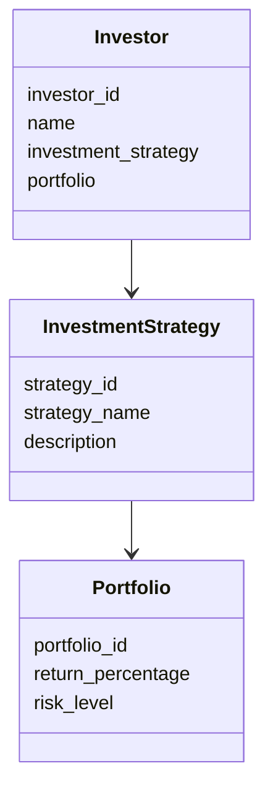
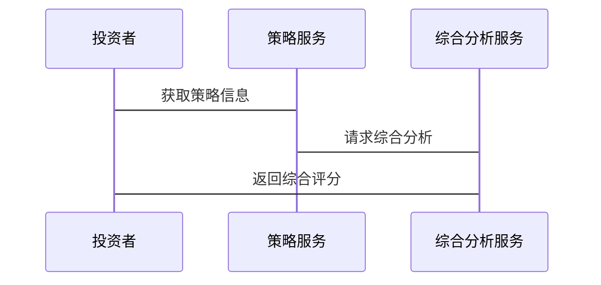

                 


# 芒格的"双轨分析"：结合定性和定量的投资方法

## 关键词：芒格，双轨分析，投资方法，定性分析，定量分析

## 摘要：本文系统介绍了芒格的双轨分析法，这是一种结合定性和定量方法的投资策略。通过分析其核心概念、算法原理、数学模型和系统架构，本文为读者提供了从理论到实践的全面指导。

---

# 第一部分: 引言

## 第1章: 引言

### 1.1 本书的背景与目标
#### 1.1.1 投资领域的挑战与机遇
现代投资领域面临着复杂多变的市场环境，投资者需要结合定性和定量方法来做出更明智的决策。

#### 1.1.2 双轨分析法的提出背景
双轨分析法由芒格提出，旨在结合定性和定量分析，克服传统方法的局限性。

#### 1.1.3 本书的目标与读者定位
本书旨在帮助投资者理解和应用双轨分析法，适用于投资新手和资深从业者。

### 1.2 本书的结构与内容概述
#### 1.2.1 目录概览
- 引言
- 双轨分析法的背景与理论基础
- 核心概念与联系
- 算法原理
- 数学模型
- 系统分析与架构设计
- 项目实战
- 最佳实践

#### 1.2.2 核心内容的逻辑框架
从理论到实践，系统讲解双轨分析法的原理、实现和应用。

#### 1.2.3 学习方法与注意事项
建议读者结合实际案例，逐步理解和应用双轨分析法。

---

# 第二部分: 双轨分析法的背景与理论基础

## 第2章: 双轨分析法的核心概念

### 2.1 双轨分析法的定义与特点
#### 2.1.1 双轨分析法的定义
双轨分析法是芒格提出的一种结合定性和定量分析的投资方法。

#### 2.1.2 双轨分析法的核心特点
- 综合性：结合定性与定量分析。
- 系统性：从多个维度评估投资项目。
- 实用性：适用于多种投资场景。

### 2.2 定性分析与定量分析的结合
#### 2.2.1 定性分析的定义与作用
定性分析关注非量化的因素，如市场趋势和公司管理。

#### 2.2.2 定量分析的定义与作用
定量分析依赖数据和模型，用于评估财务指标和市场趋势。

#### 2.2.3 两者结合的必要性与优势
- 必要性：单一方朿难以全面评估投资项目。
- 优势：综合考虑多种因素，提高决策的准确性。

### 2.3 双轨分析法的理论基础
#### 2.3.1 投资学基础理论
介绍现代投资组合理论和有效市场假说。

#### 2.3.2 行为金融学与决策心理
分析投资者的心理偏差及其对决策的影响。

#### 2.3.3 双轨分析法的哲学基础
强调全面性和系统性，避免片面决策。

---

# 第三部分: 双轨分析法的核心概念与联系

## 第3章: 双轨分析法的核心概念

### 3.1 双轨分析法的核心原理
#### 3.1.1 问题背景与问题描述
投资者在决策时面临信息不全和不确定性。

#### 3.1.2 双轨分析法的解决思路
通过定性和定量分析相结合，全面评估投资项目。

#### 3.1.3 双轨分析法的边界与外延
明确适用范围和限制条件。

### 3.2 核心概念的联系与对比
#### 3.2.1 定性与定量分析的特征对比
| 特征     | 定性分析         | 定量分析         |
|----------|------------------|------------------|
| 内容     | 非量化的因素     | 量化的数据       |
| 方法     | 调查、访谈       | 统计分析、模型构建 |
| 目标     | 理解市场趋势     | 预测市场走势     |

#### 3.2.2 双轨分析法的ER实体关系图
```mermaid
erd
  title 双轨分析法 ER 图
  Investor(investor_id, name, investment_strategy, portfolio)
  InvestmentStrategy(strategy_id, strategy_name, description)
  Portfolio(portfolio_id, return_percentage, risk_level)
```

---

# 第四部分: 双轨分析法的算法原理

## 第4章: 双轨分析法的算法原理

### 4.1 算法原理概述
#### 4.1.1 双轨分析法的流程图


#### 4.1.2 算法的输入与输出
- 输入：定性数据、定量数据
- 输出：综合评估结果

#### 4.1.3 算法的实现步骤
1. 收集定性数据
2. 分析定性数据
3. 收集定量数据
4. 分析定量数据
5. 综合分析
6. 得出结论

### 4.2 算法的数学模型
#### 4.2.1 数学模型的定义
双轨分析法通过加权计算将定性和定量因素结合起来。

#### 4.2.2 数学模型的具体实现
$$ \text{综合得分} = \sum (\text{定性权重} \times \text{定性评分}) + \sum (\text{定量权重} \times \text{定量评分}) $$

#### 4.2.3 示例
假设某项目定性评分为80，定量评分为70，定性权重为0.4，定量权重为0.6：
$$ \text{综合得分} = 0.4 \times 80 + 0.6 \times 70 = 32 + 42 = 74 $$

---

## 第五章: 数学模型

### 5.1 数学模型的定义与作用
数学模型用于量化分析，帮助投资者做出更精确的决策。

### 5.2 双轨分析法的数学模型
$$ \text{综合评分} = \sum_{i=1}^{n} w_i \times s_i $$
其中，$w_i$ 为第i个因素的权重，$s_i$ 为评分。

### 5.3 数学模型的实现步骤
1. 确定各因素的权重
2. 收集各因素的评分
3. 计算综合评分

### 5.4 示例
假设某公司有三个因素，权重分别为0.3、0.4、0.3，评分分别为80、70、90：
$$ \text{综合评分} = 0.3 \times 80 + 0.4 \times 70 + 0.3 \times 90 = 24 + 28 + 27 = 79 $$

---

## 第六章: 系统分析与架构设计

### 6.1 系统分析
#### 6.1.1 问题场景介绍
投资者需要综合分析多个因素，做出投资决策。

#### 6.1.2 系统功能设计
- 收集和处理定性数据
- 收集和处理定量数据
- 综合分析并输出结果

#### 6.1.3 系统功能设计的领域模型图


#### 6.1.4 系统架构设计
- 采用分层架构：数据层、业务逻辑层、用户界面层
- 使用微服务架构：独立处理定性和定量分析

#### 6.1.5 系统架构设计的架构图
```mermaid
docker
    service 投资者服务
        继承 投资者
    service 策略服务
        继承 策略
    service 综合分析服务
        继承 综合分析
```

#### 6.1.6 系统接口设计
- API接口：RESTful API
- 数据格式：JSON

#### 6.1.7 系统交互设计的序列图


---

## 第七章: 项目实战

### 7.1 环境安装
- 安装Python和必要的库（如Pandas、NumPy）

### 7.2 系统核心实现源代码
```python
def calculate_composite_score(weights, scores):
    return sum(w * s for w, s in zip(weights, scores))

weights = [0.4, 0.6]
scores = [80, 70]
print(calculate_composite_score(weights, scores))
```

### 7.3 代码应用解读与分析
- 函数`calculate_composite_score`计算综合评分
- `weights`和`scores`分别代表权重和评分

### 7.4 实际案例分析
假设某公司定性评分为80，定量评分为70，综合评分=0.4×80+0.6×70=74

### 7.5 项目小结
通过实际案例，验证双轨分析法的有效性和实用性。

---

## 第八章: 最佳实践

### 8.1 小结
双轨分析法结合了定性和定量分析，是一种全面的投资方法。

### 8.2 注意事项
- 权重的确定需要根据实际情况调整
- 数据的准确性和完整性至关重要

### 8.3 拓展阅读
推荐阅读芒格的其他著作，深入理解双轨分析法的哲学基础。

---

# 附录: 双轨分析法的进一步探讨

## 附录A: 双轨分析法的数学模型

### A.1 线性回归模型
$$ y = \beta_0 + \beta_1 x + \epsilon $$

### A.2 时间序列分析
$$ ARIMA(p, d, q) $$

## 附录B: 双轨分析法的系统架构

### B.1 微服务架构设计
- 独立的服务模块
- RESTful API接口

## 附录C: 双轨分析法的代码实现

### C.1 Python代码示例
```python
import pandas as pd

def calculate_composite_score(weights, scores):
    return sum(w * s for w, s in zip(weights, scores))

weights = pd.Series([0.4, 0.6])
scores = pd.Series([80, 70])
print(calculate_composite_score(weights, scores))
```

---

# 结语

通过本文的系统介绍，读者可以全面理解芒格的双轨分析法，并将其应用于实际投资中。从理论到实践，双轨分析法为投资者提供了一种结合定性和定量分析的有效方法。

---

**感谢您的耐心阅读，希望本文对您有所帮助！**

