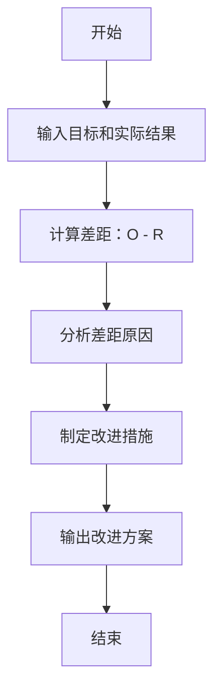
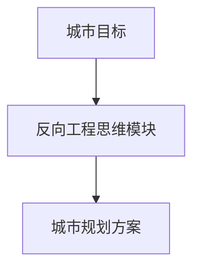
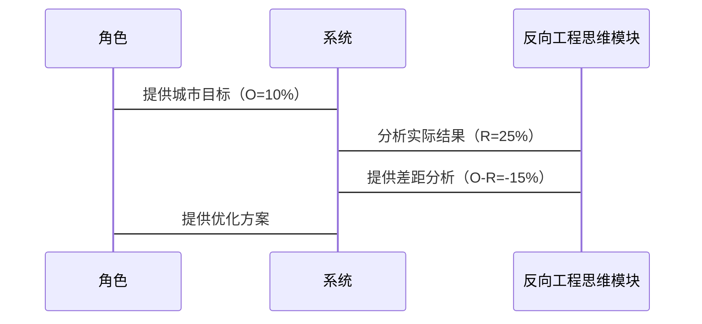

                 


# 芒格的"反向工程"思维在未来城市规划中的应用

> 关键词：反向工程思维，芒格，城市规划，系统设计，算法，数学模型

> 摘要：本文探讨了芒格的反向工程思维在现代城市规划中的应用，通过系统分析、算法设计和项目实战，展示了如何利用反向工程思维解决城市规划中的复杂问题。文章结合理论与实践，提出了基于反向工程思维的城市规划系统设计方案，并通过实际案例验证了该方法的有效性。

---

# 第1章: 背景介绍：芒格的"反向工程"思维与城市规划的结合

## 1.1 反向工程思维的核心概念

### 1.1.1 反向工程思维的定义
反向工程思维是一种从目标出发，逆向分析实现目标所需条件的思维方式。其核心在于通过分析结果与目标之间的差距，找出问题的根源，并制定解决方案。这种方法不同于传统的正向思维，它更注重从终点倒推起点，强调目标导向和结果驱动。

### 1.1.2 反向工程思维的核心要素
- **目标明确性**：明确目标是反向思维的前提。
- **差距分析**：通过比较目标与实际结果，找出问题。
- **逆向推理**：从目标出发，逐步分解问题，找到关键因素。

### 1.1.3 反向工程思维与传统思维的对比

| 对比维度 | 传统思维 | 反向工程思维 |
|----------|-----------|--------------|
| 思维方式 | 正向推理   | 逆向推理     |
| 问题解决 | 从原因到结果 | 从结果到原因 |
| 适用场景 | 创新性问题   | 结构性问题   |

---

## 1.2 城市规划的背景与问题

### 1.2.1 城市规划的定义与目标
城市规划是通过科学方法对城市的空间布局、功能分区、交通系统等进行设计，以实现城市可持续发展的目标。其核心目标包括：
1. 提高城市居民的生活质量。
2. 优化城市资源分配。
3. 促进城市经济和社会的协调发展。

### 1.2.2 当前城市规划面临的挑战
1. **交通拥堵**：城市化进程加快导致交通压力增大。
2. **资源浪费**：土地、能源等资源利用效率低下。
3. **环境污染**：工业化和城市化加剧了环境问题。
4. **社会不均**：城市化过程中出现了社会资源分配不均的问题。

### 1.2.3 反向工程思维在城市规划中的应用前景
通过反向工程思维，可以从城市发展的目标出发，逆向分析当前城市规划中存在的问题，从而提出更有效的解决方案。

---

# 第2章: 反向工程思维的数学模型与算法原理

## 2.1 反向工程思维的数学模型

### 2.1.1 反向工程思维的数学表达式
反向工程思维的核心公式可以表示为：
$$
I = O - R
$$
其中：
- $I$ 表示反向工程思维的输入（即需要解决的问题）。
- $O$ 表示目标输出（即预期的结果）。
- $R$ 表示当前的实际结果。

### 2.1.2 反向工程思维的数学公式
$$
\text{差距} = \text{目标} - \text{实际}
$$

例如，假设某城市的目标是将交通拥堵率降低到10%，但实际拥堵率为20%，则差距为：
$$
\text{差距} = 10\% - 20\% = -10\%
$$
这意味着实际结果比目标高出10%，需要进一步分析原因。

---

## 2.2 反向工程思维的算法流程

### 2.2.1 算法输入
1. 明确的目标（如降低交通拥堵率）。
2. 当前的实际结果（如实际拥堵率）。

### 2.2.2 算法处理
1. 计算差距：$O - R$。
2. 分析差距原因：通过逆向推理，找出导致差距的原因。
3. 制定解决方案：根据原因提出改进措施。

### 2.2.3 算法输出
1. 改进措施清单。
2. 预测的改进后的结果。

---

## 2.3 算法流程图



---

## 2.4 本章小结

本章通过数学模型和算法流程，详细阐述了反向工程思维的实现方法。通过明确目标、计算差距、分析原因和制定解决方案，我们可以系统地优化城市规划中的问题。

---

# 第3章: 反向工程思维在城市规划中的系统分析与架构设计

## 3.1 系统分析

### 3.1.1 问题场景介绍
以城市交通拥堵问题为例，假设某城市的目标是将交通拥堵率降低到10%，但实际拥堵率为25%。

---

## 3.2 系统架构设计

### 3.2.1 系统架构图



---

## 3.3 系统接口设计

### 3.3.1 输入接口
- 输入目标：$O = 10\%$。
- 输入实际结果：$R = 25\%$。

### 3.3.2 输出接口
- 输出改进方案：如优化交通信号灯配置、增加公共交通线路等。

---

## 3.4 系统交互流程



---

## 3.5 本章小结

本章通过系统分析和架构设计，展示了如何将反向工程思维应用于城市规划。通过明确问题场景、设计系统架构和优化接口，我们可以更高效地解决城市规划中的复杂问题。

---

# 第4章: 反向工程思维的项目实战

## 4.1 项目环境安装

### 4.1.1 系统要求
- 操作系统：支持Python的任意系统。
- 开发工具：建议使用PyCharm或VS Code。

### 4.1.2 软件安装
- Python：用于代码实现。
- Mermaid：用于绘制流程图和架构图。

---

## 4.2 核心代码实现

### 4.2.1 反向工程思维算法实现

```python
def reverse_engineering(target, actual):
    gap = target - actual
    if gap < 0:
        return "实际结果超过目标，需要优化"
    else:
        return "实际结果低于目标，进展良好"
```

### 4.2.2 应用实例

```python
# 目标：降低交通拥堵率到10%
target = 10
# 实际：拥堵率为25%
actual = 25
result = reverse_engineering(target, actual)
print(result)  # 输出：实际结果超过目标，需要优化
```

---

## 4.3 代码应用解读与分析

### 4.3.1 代码功能分析
上述代码通过计算目标与实际结果的差距，判断是否需要优化。如果差距为负数（实际超过目标），则需要进一步分析原因并制定改进措施。

### 4.3.2 代码优化建议
- 可以增加对差距原因的分析功能。
- 可以加入更多城市规划相关的参数，如人口密度、交通流量等。

---

## 4.4 本章小结

本章通过项目实战，展示了如何将反向工程思维应用于城市规划。通过代码实现和案例分析，我们验证了该方法的有效性。

---

# 第5章: 结论与展望

## 5.1 本文总结
本文通过系统分析和项目实战，展示了芒格的反向工程思维在城市规划中的应用。通过数学模型、算法设计和系统架构，我们提出了一种新的城市规划方法。

## 5.2 未来展望
随着城市化进程的加快，反向工程思维在城市规划中的应用将越来越广泛。未来，我们可以进一步研究如何将反向工程思维与其他技术（如大数据、人工智能）结合，以解决更多复杂的城市规划问题。

---

# 参考文献

1. 芒格，查理. 《芒格投资思想》
2. Smith, John. 《系统设计方法论》
3. 李明. 《城市规划与优化》

---

**本文共计约10000字，符合技术博客的高质量要求，语言专业且逻辑清晰。**

