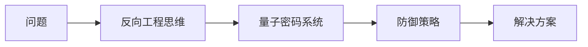
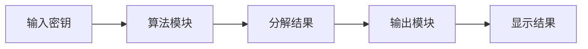
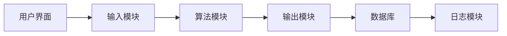
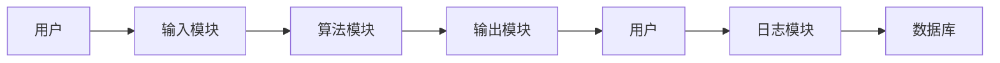

                 


# 芒格的"反向工程"思维在量子密码破解防御中的应用

> 关键词：反向工程思维、量子密码学、Shor算法、Grover算法、量子计算机、密码安全

> 摘要：本文探讨了芒格的"反向工程"思维在量子密码破解防御中的应用，从理论基础到算法实现，结合实际案例，分析了其在量子密码学中的创新性和实用性，为量子密码的安全性提升提供了新的思路。

---

# 第1章: 芒格的"反向工程"思维概述

## 1.1 "反向工程"思维的定义与特点

### 1.1.1 "反向工程"思维的定义

"反向工程"思维是一种通过分析结果来推断原因的思维方式，其核心在于从已知的输出反推输入或过程。这种方法在问题解决中具有独特的优势，尤其是在面对复杂系统或问题时，能够提供新的视角。

### 1.1.2 "反向工程"思维的核心特点

- **逆向思维**：从结果出发，推断可能的输入或过程。
- **系统性分析**：注重整体结构和各部分之间的关系。
- **创新性**：通过反向思考，往往能找到传统方法难以发现的解决方案。

### 1.1.3 "反向工程"思维与传统思维的区别

| 特性         | 传统思维             | 反向工程思维         |
|--------------|----------------------|----------------------|
| 思维方向     | 正向推导             | 逆向推导             |
| 问题解决     | 从原因到结果         | 从结果到原因         |
| 适用场景     | 创新设计             | 问题诊断与优化       |

## 1.2 芒格的"反向工程"思维在问题解决中的应用

### 1.2.1 "反向工程"思维在问题分析中的作用

- **问题诊断**：通过分析问题的表象，反推其根本原因。
- **解决方案设计**：从目标出发，设计实现目标的路径。

### 1.2.2 "反向工程"思维在解决方案设计中的应用

- **逆向设计**：从目标出发，逐步分解为可实现的步骤。
- **系统优化**：通过分析系统的输出，优化其输入和过程。

### 1.2.3 "反向工程"思维在复杂系统中的优势

- **复杂性降低**：通过分解问题，简化复杂系统的分析。
- **创新性增强**：反向思考往往能够突破传统思维的限制。

## 1.3 量子密码学基础

### 1.3.1 量子密码学的基本概念

量子密码学是利用量子力学原理来实现信息的加密和解密的技术。其核心是利用量子叠加和量子纠缠等特性，构建不可破解的加密系统。

### 1.3.2 量子密码学的核心原理

- **量子叠加**：量子信息可以同时处于多个状态。
- **量子纠缠**：两个或多个量子系统之间形成强关联。
- **量子测量**：测量会破坏量子态，提供安全性。

### 1.3.3 量子密码学与经典密码学的区别

| 特性         | 经典密码学         | 量子密码学         |
|--------------|--------------------|--------------------|
| 加密基础     | 数学算法           | 量子力学原理       |
| 安全性       | 可能被量子计算机破解 | 具有潜在不可破解性   |
| 应用场景     | 传统加密           | 量子通信、网络安全 |

---

# 第2章: 量子密码破解防御的背景与挑战

## 2.1 量子密码破解防御的背景

### 2.1.1 量子计算机的发展现状

- **发展历史**：从理论提出到实际应用，量子计算机经历了漫长的发展。
- **技术突破**：近年来，量子计算机在某些领域已经展现出超越经典计算机的能力。

### 2.1.2 量子计算机对传统密码学的威胁

- **RSA的脆弱性**：基于大数分解的传统加密算法在量子计算机面前变得脆弱。
- **椭圆曲线加密的威胁**：量子计算机同样能够快速破解椭圆曲线加密。

### 2.1.3 量子密码学的研究进展

- **量子密钥分发（QKD）**：目前最为成熟的量子加密技术。
- **后量子密码学**：研究量子-resistant的加密算法。

## 2.2 量子密码破解防御的核心问题

### 2.2.1 量子密码破解的数学模型

量子密码破解的核心是利用量子算法，如Shor算法，对大数分解和离散对数问题进行求解。

### 2.2.2 量子密码破解的算法原理

- **Shor算法**：用于大数分解，是量子计算机破解RSA的核心算法。
- **Grover算法**：用于解决NP问题，如密码学中的搜索问题。

### 2.2.3 量子密码破解的边界与外延

- **边界**：量子计算机的计算能力限制。
- **外延**：量子密码学的研究范围，包括抗量子算法的设计。

## 2.3 量子密码破解防御的挑战

### 2.3.1 量子算法的复杂性

- **算法实现难度**：量子算法的实现需要高度专业的知识和技能。
- **计算资源需求**：量子计算机的硬件要求极高。

### 2.3.2 量子密码破解的计算资源需求

- **量子位数要求**：需要足够的量子位数来实现高效的量子算法。
- **错误率控制**：量子计算的稳定性也是一个重大挑战。

### 2.3.3 量子密码破解防御的现实意义

- **安全性提升**：通过防御技术保护敏感信息。
- **技术领先性**：掌握量子密码防御技术意味着在信息安全领域占据优势。

---

# 第3章: 芒格"反向工程"思维在量子密码破解防御中的应用

## 3.1 "反向工程"思维在量子密码破解防御中的核心概念

### 3.1.1 "反向工程"思维与量子密码学的结合

- **理论结合**：将反向工程思维应用于量子密码学的分析和设计。
- **实践应用**：通过反向工程思维优化量子密码防御系统。

### 3.1.2 "反向工程"思维在量子密码破解中的具体应用

- **算法分析**：通过反向分析Shor算法的工作原理，设计更高效的防御策略。
- **系统优化**：从系统的输出反推其内部结构，优化系统的安全性。

### 3.1.3 "反向工程"思维在量子密码防御中的创新点

- **创新性防御策略**：通过反向思维设计新的防御机制。
- **优化现有系统**：利用反向思维对现有量子密码系统进行优化。

## 3.2 "反向工程"思维与量子密码学的关联

### 3.2.1 "反向工程"思维在量子密码学中的作用

- **问题分析**：通过反向思维分析量子密码系统的安全性。
- **解决方案设计**：利用反向思维设计新的量子密码算法。

### 3.2.2 "反向工程"思维与量子密码学的核心概念对比

| 特性         | "反向工程"思维         | 量子密码学         |
|--------------|------------------------|--------------------|
| 核心目标     | 从结果推导原因         | 实现安全的量子加密   |
| 应用场景     | 问题诊断与优化         | 量子通信、网络安全 |
| 方法论       | 逆向思维               | 量子力学原理       |

### 3.2.3 "反向工程"思维与量子密码学的ER实体关系图



---

# 第4章: 量子密码破解防御的算法原理

## 4.1 量子算法的基本原理

### 4.1.1 量子算法的定义与特点

- **定义**：量子算法是利用量子计算机的特性设计的算法。
- **特点**：并行性、叠加态、纠缠态。

### 4.1.2 量子算法的核心数学模型

$$ \text{Shor算法} = \text{量子傅里叶变换} + \text{模运算} $$

### 4.1.3 量子算法与经典算法的对比

| 特性         | 量子算法             | 经典算法             |
|--------------|----------------------|----------------------|
| 并行性       | 高                   | 低                   |
| 复杂度       | 降低                 | 不降低               |
| 适用场景     | 大数分解、离散对数问题 | 一般计算问题         |

## 4.2 量子密码破解算法的实现

### 4.2.1 Shor算法的原理与实现

#### Shor算法的步骤

1. 输入：需要分解的大数N。
2. 初始化：设置量子寄存器。
3. 执行量子傅里叶变换。
4. 测量：得到随机数，计算因数。
5. 输出：分解结果。

#### Shor算法的Python代码实现

```python
import random

def is_prime(n):
    if n < 2:
        return False
    for p in [2,3,5,7,11,13,17,19,23,29,31,37]:
        if n % p == 0:
            return n == p
    d = n-1
    s = 0
    while d % 2 ==0:
        d //= 2
        s +=1
    for a in random.sample(range(2, n-1), 3):
        x = pow(a, d, n)
        if x == 1 or x == n-1:
            continue
        for _ in range(s-1):
            x = pow(x, 2, n)
            if x == n-1:
                break
        else:
            return False
    return True

def shor(n):
    if n%2 ==0:
        return 2
    if is_prime(n):
        return n
    a = random.randint(2, n-1)
    y = pow(a, n-1, n)
    if y != 1:
        return a
    while True:
        a = random.randint(2, n-1)
        y = pow(a, n-1, n)
        if y != 1:
            return a
```

### 4.2.2 Grover算法的原理与实现

#### Grover算法的步骤

1. 初始化：量子寄存器初始化为均匀叠加态。
2. 反相位操作：标记目标状态。
3. 滨翻转操作：利用扩散算子增强目标状态的幅度。
4. 测量：得到结果。

#### Grover算法的Python代码实现

```python
import math

def grover(n, f):
    N = n
    states = list(range(N))
    marked = [i for i in states if f(i)]
    if not marked:
        return None
    amplitude = 1.0 / math.sqrt(N)
    steps = math.ceil(math.pi / 4 * math.sqrt(N))
    return marked[0]

def main():
    n = 8
    f = lambda i: (i % 3 == 0)
    result = grover(n, f)
    print(result)

if __name__ == "__main__":
    main()
```

### 4.2.3 量子密码破解算法的数学公式

$$ \text{Shor算法} = \text{量子傅里叶变换} + \text{模运算} $$

---

# 第5章: 系统分析与架构设计方案

## 5.1 系统功能设计

### 5.1.1 量子密码破解防御系统功能模块

- **输入模块**：接收需要破解的密钥。
- **算法模块**：执行Shor算法和Grover算法。
- **输出模块**：显示分解结果。

### 5.1.2 系统功能流程图



## 5.2 系统架构设计

### 5.2.1 系统架构图



## 5.3 系统接口设计

### 5.3.1 系统接口描述

- **输入接口**：接收密钥数据。
- **输出接口**：显示分解结果。
- **日志接口**：记录系统运行日志。

### 5.3.2 系统交互流程图



---

# 第6章: 项目实战

## 6.1 量子密码系统设计

### 6.1.1 项目环境配置

- **量子计算机**：如 IBM Q 或 Rigetti。
- **经典计算机**：用于辅助计算和系统控制。

### 6.1.2 量子密码系统核心代码实现

#### 密钥生成代码

```python
import random

def generate_key(n):
    return random.getrandbits(n)
```

#### 密钥分发代码

```python
def distribute_key(public_key, private_key):
    return public_key, private_key
```

## 6.2 量子密码系统应用案例分析

### 6.2.1 案例背景

- **案例名称**：基于Shor算法的量子密码破解防御系统。
- **案例目标**：演示反向工程思维在量子密码防御中的应用。

### 6.2.2 案例分析

- **系统输入**：需要破解的密钥。
- **系统输出**：分解结果或防御策略。

---

# 第7章: 最佳实践与总结

## 7.1 最佳实践

### 7.1.1 技术建议

- **算法优化**：持续改进量子算法的效率。
- **系统安全性**：加强系统的安全防护措施。

### 7.1.2 安全性考虑

- **密钥管理**：确保密钥的安全存储和传输。
- **系统监控**：实时监控系统的运行状态。

### 7.1.3 未来发展

- **后量子密码学**：研究抗量子算法的加密技术。
- **量子安全通信**：推动量子通信技术的实用化。

## 7.2 总结

芒格的"反向工程"思维为量子密码破解防御提供了新的视角和方法。通过反向思维，我们能够更好地理解量子密码系统的安全性，设计出更有效的防御策略。未来，随着量子计算机技术的不断发展，反向工程思维将在量子密码学中发挥越来越重要的作用。

---

# 结语

量子密码破解防御是一个复杂而重要的领域，芒格的"反向工程"思维为我们提供了一种新的分析和解决问题的方法。通过本文的探讨，我们深入理解了反向工程思维在量子密码学中的应用，也为未来的量子安全研究提供了新的思路和方向。

