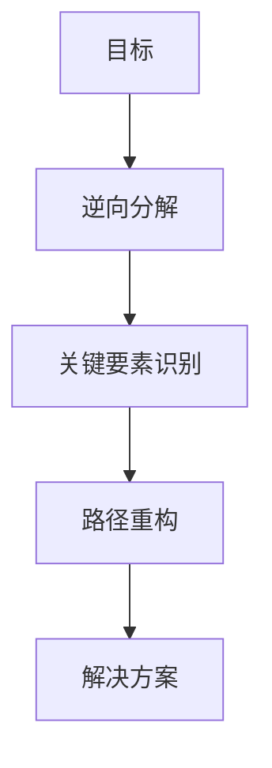
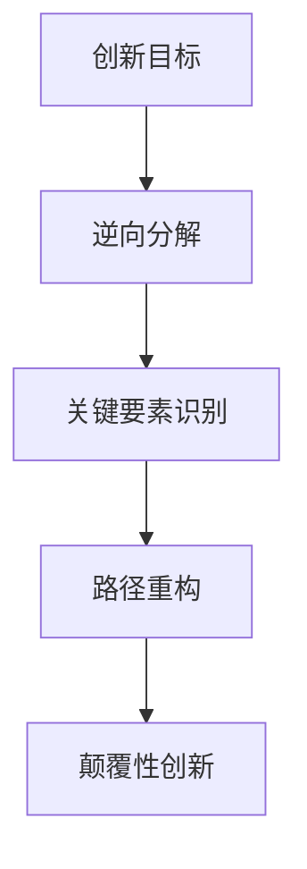
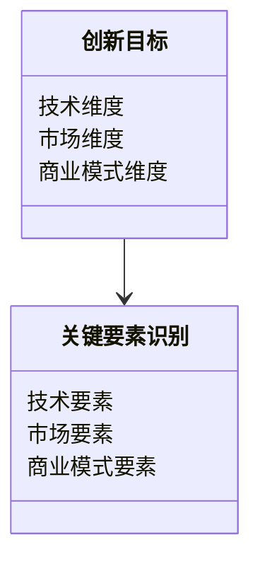
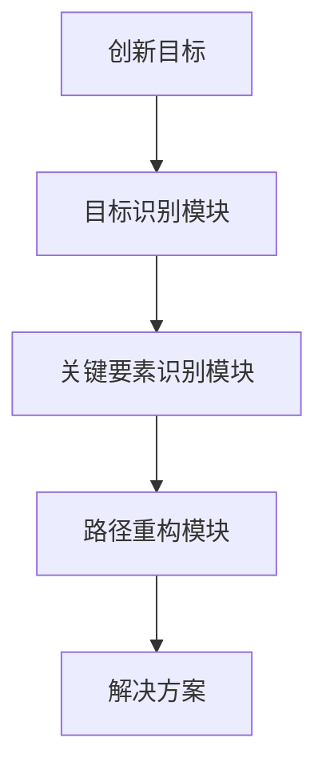

                 


# 芒格的"反向工程"思维在颠覆性创新分析中的应用

---

## 关键词

- 芒格的反向工程思维
- 颠覆性创新
- 创新分析
- 逻辑推理
- 技术与商业结合

---

## 摘要

芒格的"反向工程"思维是一种从结果出发，逆向分析问题本质的方法，其核心在于通过分解目标，识别关键要素，并重构路径来解决问题。本文将从芒格的反向工程思维的背景、核心概念、算法原理、系统架构设计、项目实战等多个维度，详细探讨其在颠覆性创新分析中的应用。通过案例分析和理论结合，本文旨在揭示反向工程思维在创新分析中的独特价值，并为读者提供一套系统化的分析框架。

---

## 目录

1. [芒格的反向工程思维与颠覆性创新的背景](#芒格的反向工程思维与颠覆性创新的背景)
   - 1.1 芒格的反向工程思维概述
   - 1.2 颠覆性创新的定义与特征
   - 1.3 反向工程思维与颠覆性创新的结合意义

2. [反向工程思维的核心概念与分析框架](#反向工程思维的核心概念与分析框架)
   - 2.1 反向工程思维的核心要素
   - 2.2 颠覆性创新的分析维度
   - 2.3 反向工程思维与颠覆性创新的关系模型

3. [反向工程思维的算法原理与数学模型](#反向工程思维的算法原理与数学模型)
   - 3.1 反向工程思维的算法框架
   - 3.2 颠覆性创新的分析模型
   - 3.3 算法的数学表达与实现

4. [系统分析与架构设计](#系统分析与架构设计)
   - 4.1 系统功能设计
   - 4.2 系统架构设计
   - 4.3 接口与交互设计

5. [项目实战：反向工程思维在颠覆性创新中的应用](#项目实战反向工程思维在颠覆性创新中的应用)
   - 5.1 项目背景与目标
   - 5.2 核心代码实现
   - 5.3 案例分析与解读
   - 5.4 项目小结

6. [最佳实践与总结](#最佳实践与总结)
   - 6.1 小结
   - 6.2 注意事项
   - 6.3 拓展阅读

---

## 第1章：芒格的反向工程思维与颠覆性创新的背景

### 1.1 芒格的反向工程思维概述

#### 1.1.1 芒格的生平与思想体系

查理·芒格是世界著名投资家，伯克希尔·哈撒韦公司副主席，以其独特的投资理念和思维方式闻名。他的“反向工程”思维源于对物理学、心理学、经济学等多学科的深刻理解。芒格认为，任何系统都可以通过分解其组成部分来理解其本质。

#### 1.1.2 反向工程思维的核心理念

反向工程思维是一种从结果出发，逆向分析问题本质的方法。其核心在于：

- **目标导向**：从目标出发，分解问题。
- **要素识别**：识别影响目标的关键要素。
- **路径重构**：通过关键要素的优化，重构问题的解决方案。

#### 1.1.3 反向工程思维在投资与决策中的应用

芒格将反向工程思维应用到投资决策中，通过分析企业的竞争优势、商业模式和市场定位，找到投资机会。这种思维方式的核心在于通过逆向思考，发现市场的盲点和机会。

---

### 1.2 颠覆性创新的定义与特征

#### 1.2.1 颠覆性创新的定义

颠覆性创新是指通过引入一种新的技术或商业模式，彻底改变现有市场格局，创造新的市场需求或替代现有产品/服务的行为。颠覆性创新的核心在于“打破常规”，通过创新实现市场的重构。

#### 1.2.2 颠覆性创新与渐进式创新的区别

| 特性                | 颠覆性创新                  | 渐进式创新                  |
|---------------------|-----------------------------|-----------------------------|
| 创新方式            | 引入全新的技术或商业模式     | 对现有技术或模式进行优化    |
| 市场影响            | 打破现有市场格局，创造新需求 | 在现有市场中逐步改进        |
| 风险程度            | 高风险，可能失败            | 风险较低，成功率较高        |
| 代表案例            | 特斯拉（电动汽车）          | 苹果（产品迭代）            |

#### 1.2.3 颠覆性创新的实现路径

1. **技术突破**：通过技术创新，实现产品的颠覆性改进。
2. **商业模式创新**：通过新的商业模式，重新定义市场需求。
3. **用户需求重构**：通过深入理解用户需求，创造新的市场价值。

---

### 1.3 反向工程思维与颠覆性创新的结合意义

#### 1.3.1 反向工程思维在创新分析中的独特价值

反向工程思维通过从目标出发，逆向分析问题，能够帮助我们在创新分析中快速定位关键要素，找到创新的突破口。

#### 1.3.2 颠覆性创新的分析框架

1. **目标识别**：明确创新的目标（如市场占有率、用户满意度）。
2. **要素分解**：分解目标实现的关键要素（如技术、商业模式）。
3. **路径重构**：通过优化关键要素，重构创新路径。

#### 1.3.3 反向工程思维在颠覆性创新中的应用前景

通过反向工程思维，我们可以更好地理解颠覆性创新的本质，从而在实际创新过程中，更快地找到创新的方向和路径。

---

## 第2章：反向工程思维的核心概念与分析框架

### 2.1 反向工程思维的核心要素

#### 2.1.1 反向工程思维的逻辑结构



#### 2.1.2 反向工程思维的工具与方法

- **思维导图**：用于目标分解和要素识别。
- **逆向思维模型**：通过从结果出发，逆向分析问题。

#### 2.1.3 反向工程思维的应用场景

- **技术开发**：通过逆向分析竞争对手的技术，找到创新点。
- **商业模式设计**：通过分析成功案例，重构商业模式。

---

### 2.2 颠覆性创新的分析维度

#### 2.2.1 技术维度：颠覆性技术的识别

1. **技术可行性**：评估技术的实现难度和成本。
2. **技术优势**：分析技术相对于现有技术的创新点。

#### 2.2.2 市场维度：颠覆性市场的定位

1. **目标市场**：明确目标市场的需求和痛点。
2. **竞争分析**：分析现有市场竞争格局，找到市场空白。

#### 2.2.3 商业模式维度：颠覆性商业模式的设计

1. **价值主张**：明确产品或服务的核心价值。
2. **盈利模式**：设计可持续的盈利模式。

---

### 2.3 反向工程思维与颠覆性创新的关系模型

#### 2.3.1 反向工程思维在颠覆性创新中的作用

1. **目标导向**：通过明确创新目标，指导创新过程。
2. **要素识别**：通过分解目标，识别关键创新要素。

#### 2.3.2 反向工程思维与颠覆性创新的交互关系



#### 2.3.3 反向工程思维在颠覆性创新中的应用边界

1. **技术边界**：技术可行性是颠覆性创新的核心要素。
2. **市场边界**：市场定位是颠覆性创新的关键因素。

---

## 第3章：反向工程思维的算法原理与数学模型

### 3.1 反向工程思维的算法框架

#### 3.1.1 算法逻辑流程图


#### 3.1.2 算法实现步骤

1. **目标识别**：明确创新的目标。
2. **逆向分解**：分解目标，识别关键要素。
3. **路径重构**：通过优化关键要素，重构创新路径。

#### 3.1.3 算法的数学表达

$$ \text{创新目标} = \sum_{i=1}^{n} \text{关键要素}_i $$

---

### 3.2 颠覆性创新的分析模型

#### 3.2.1 分析模型的构建

1. **技术维度**：评估技术的可行性和优势。
2. **市场维度**：分析目标市场的定位和竞争格局。
3. **商业模式维度**：设计可持续的盈利模式。

#### 3.2.2 数学模型的实现

$$ \text{创新成功概率} = \frac{\text{技术优势} + \text{市场定位} + \text{商业模式创新}}{3} $$

---

## 第4章：系统分析与架构设计

### 4.1 系统功能设计

#### 4.1.1 领域模型类图



#### 4.1.2 系统功能模块

1. **目标识别模块**：明确创新目标。
2. **要素识别模块**：识别关键创新要素。
3. **路径重构模块**：优化关键要素，重构创新路径。

### 4.2 系统架构设计

#### 4.2.1 系统架构图



#### 4.2.2 接口与交互设计

1. **输入接口**：接收创新目标。
2. **输出接口**：输出创新解决方案。
3. **交互流程**：目标识别 → 要素识别 → 路径重构 → 解决方案输出。

---

## 第5章：项目实战：反向工程思维在颠覆性创新中的应用

### 5.1 项目背景与目标

以某电动汽车公司为例，目标是通过反向工程思维，分析其颠覆性创新路径，优化其商业模式。

### 5.2 核心代码实现

```python
def reverse_engineering(target):
    # 分解目标
    elements = target_decompose(target)
    # 识别关键要素
    key_elements = key_feature(elements)
    # 重构路径
    solution = path_reconstruction(key_elements)
    return solution

# 示例：分析电动汽车的颠覆性创新
target = "电动汽车的市场占有率"
solution = reverse_engineering(target)
print(solution)
```

### 5.3 案例分析与解读

通过对电动汽车市场的分析，识别出技术突破（电池技术）和商业模式创新（融资租赁模式）是实现市场占有率提升的关键要素。通过优化这两个要素，重构创新路径，最终实现市场目标。

### 5.4 项目小结

通过反向工程思维，我们成功地分析了电动汽车的颠覆性创新路径，优化了其商业模式和技术路线，为企业的市场拓展提供了有力支持。

---

## 第6章：最佳实践与总结

### 6.1 小结

反向工程思维通过从目标出发，逆向分析问题本质，能够帮助我们在颠覆性创新分析中快速定位关键要素，找到创新的突破口。

### 6.2 注意事项

- **技术可行性**：创新方案需要具备技术可行性。
- **市场定位**：创新方案需要满足市场需求。
- **持续优化**：创新是一个持续优化的过程。

### 6.3 拓展阅读

- 《芒格的反向思维》
- 《创新者的窘境》

---

## 总结

芒格的反向工程思维是一种强大的工具，能够帮助我们在颠覆性创新分析中找到关键要素，重构创新路径。通过本文的系统分析和案例实践，我们能够更好地理解反向工程思维在创新分析中的应用，并将其应用到实际工作中，推动颠覆性创新的发展。

---

以上是《芒格的"反向工程"思维在颠覆性创新分析中的应用》的完整目录和内容框架。

