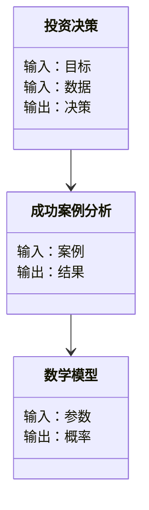
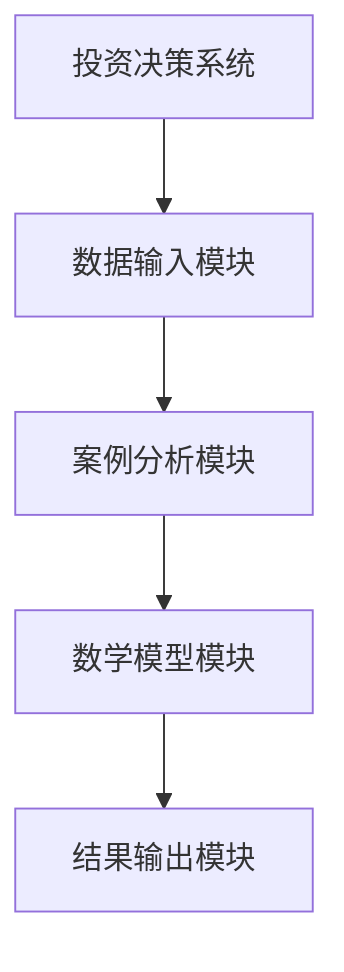

                 


# 《芒格的"反向工程"思维：从成功案例中学习投资》

---

## 关键词：
1. 反向工程思维  
2. 成功案例分析  
3. 投资策略  
4. 芒格投资哲学  
5. 数学模型  

---

## 摘要：
本书以芒格的“反向工程”思维为核心，系统地阐述了如何从成功案例中学习投资。通过详细分析芒格的投资哲学、成功案例的筛选标准、数学模型的构建以及实际项目中的应用，本书为读者提供了从理论到实践的完整框架。书中不仅介绍了反向工程思维的定义和特点，还通过具体的案例分析和系统设计，帮助读者掌握如何在投资决策中运用这一思维方式，从而实现长期稳健的投资回报。

---

# 第一部分: 芒格的"反向工程"思维概述

## 第1章: 芒格的生平与投资哲学

### 1.1 芒格的早年经历
- 1.1.1 芒格的出生与教育背景  
- 1.1.2 芒格的职业生涯与成就  
- 1.1.3 芒格的价值观与人生哲学  

### 1.2 芒格的投资理念
- 1.2.1 价值投资的核心思想  
- 1.2.2 投资中的“安全边际”概念  
- 1.2.3 长期主义与复利思维  

---

## 第2章: 反向工程思维的定义与特点

### 2.1 反向工程思维的定义
- 2.1.1 从结果推导原因的思维方式  
- 2.1.2 反向思维的优势与局限性  
- 2.1.3 反向工程在投资中的独特价值  

### 2.2 反向工程思维的特点
- 2.2.1 系统性：从整体到局部的分析方法  
- 2.2.2 逆向性：与正向思维的对比分析  
- 2.2.3 实用性：在实际投资中的具体应用  

---

# 第二部分: 反向工程思维的核心概念与理论基础

## 第3章: 成功案例的分析方法

### 3.1 成功案例的筛选标准
- 3.1.1 行业领先地位  
- 3.1.2 可持续竞争优势  
- 3.1.3 财务表现优异  

### 3.2 成功案例的分解步骤
- 3.2.1 确定目标  
- 3.2.2 分析结果  
- 3.2.3 推导原因  
- 3.2.4 总结规律  

---

## 第4章: 反向工程思维的数学模型

### 4.1 成功企业的核心要素
- 4.1.1 企业盈利能力  
- 4.1.2 企业成长性  
- 4.1.3 企业风险控制  

### 4.2 数学模型构建
- 4.2.1 成功概率的计算公式  
$$ P = \frac{S}{N} $$  
其中，$P$ 表示成功概率，$S$ 表示成功案例数，$N$ 表示总案例数。  

- 4.2.2 投资回报率的计算公式  
$$ ROI = \frac{收益}{投入} $$  

---

# 第三部分: 反向工程思维的系统分析与架构设计

## 第5章: 投资决策的系统架构

### 5.1 投资决策的领域模型
- 5.1.1 领域模型的类图  


### 5.2 系统架构设计
- 5.2.1 系统功能模块  
- 5.2.2 系统架构图  


---

# 第四部分: 项目实战与案例分析

## 第6章: 反向工程思维的项目实战

### 6.1 项目背景与目标
- 6.1.1 项目背景介绍  
- 6.1.2 项目目标设定  

### 6.2 数据收集与处理
- 6.2.1 数据来源与采集方法  
- 6.2.2 数据清洗与预处理  

### 6.3 投资分析与建模
- 6.3.1 成功案例的筛选与分析  
- 6.3.2 数学模型的应用与验证  

---

## 第7章: 项目实现与代码解读

### 7.1 环境安装与配置
- 7.1.1 Python 环境安装  
- 7.1.2 依赖库的安装与配置  

### 7.2 核心代码实现
```python
def calculate_success_probability(s, n):
    return s / n

def calculate_roi(profits, costs):
    return profits / costs

# 示例数据
s = 5
n = 10
profits = 100
costs = 50

# 调用函数
success_prob = calculate_success_probability(s, n)
roi = calculate_roi(profits, costs)

print(f"成功概率为：{success_prob}")
print(f"投资回报率为：{roi}")
```

### 7.3 代码解读与分析
- 7.3.1 函数定义与实现  
- 7.3.2 数据输入与输出  
- 7.3.3 投资决策的逻辑分析  

---

# 第五部分: 总结与最佳实践

## 第8章: 总结与小结

### 8.1 反向工程思维的优势
- 8.1.1 系统性分析  
- 8.1.2 逆向思维的优势  
- 8.1.3 投资决策的长期性  

### 8.2 投资实战中的注意事项
- 8.2.1 风险管理的重要性  
- 8.2.2 数据分析的准确性  
- 8.2.3 系统设计的合理性  

---

## 第9章: 最佳实践与拓展阅读

### 9.1 投资实战中的最佳实践
- 9.1.1 长期投资与价值发现  
- 9.1.2 数据驱动的决策优化  
- 9.1.3 系统性思维的应用  

### 9.2 拓展阅读与资源推荐
- 9.2.1 芒格的投资经典著作  
- 9.2.2 反向思维的相关研究  
- 9.2.3 投资系统设计的最新进展  

---

# 附录: 资料与参考

## 附录A: 术语表
- 反向工程思维  
- 成功概率  
- 投资回报率  

## 附录B: 公式索引
- 成功概率公式  
- 投资回报率公式  

## 附录C: 代码示例
- Python代码实现  

## 附录D: 参考资料
- 芒格的经典著作  
- 相关投资研究文献  

---

通过以上目录结构，本书将从理论到实践，全面系统地介绍芒格的反向工程思维，帮助读者在投资决策中掌握这一独特的思维方式，实现长期稳健的投资回报。

