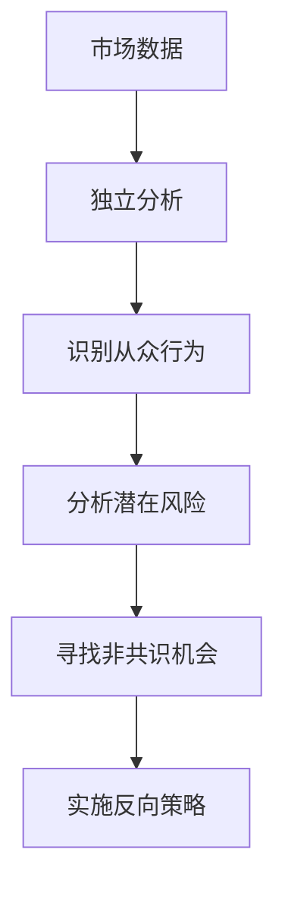

                 


# 芒格的"反向思考"在市场分析中的应用：避免从众误区

## 关键词：反向思考、市场分析、从众误区、芒格思想、投资决策

## 摘要：芒格的反向思考是一种颠覆传统从众思维的投资哲学，它强调从对立面寻找机会，避免随大流的错误决策。本文系统地阐述了反向思考的核心概念、算法原理、系统设计与项目实战，通过具体的案例分析，展示了如何在市场分析中避免从众误区，实现精准投资决策。文章内容丰富，结构清晰，适合投资专业人士和市场分析从业者阅读。

---

# 第1章：反向思考的背景与核心概念

## 1.1 从众心理的负面影响

从众心理是人类的一种基本心理倾向，表现为个体在面对群体决策时，倾向于跟随大多数人的选择，避免因特立独行而被排斥。然而，在市场分析中，从众心理往往会导致错误的决策，原因如下：

### 1.1.1 从众心理的定义与表现
- **定义**：从众心理是指个体在群体压力下，放弃自己的判断，随波逐流地采取与大多数人一致的行为或决策。
- **表现**：
  - 过度跟随市场趋势，忽视潜在风险。
  - 忽略市场中的非共识机会，错失潜在收益。

### 1.1.2 从众思维在市场分析中的局限性
- **局限性**：
  - 容易陷入羊群效应，导致市场泡沫或恐慌。
  - 难以发现市场中的真正价值，错失投资机会。

### 1.1.3 芒格反向思考的提出背景
- **背景**：20世纪70年代，芒格在投资实践中发现，从众思维导致大量投资者盲目跟风，忽视了市场的真正价值。他提出反向思考的概念，强调从对立面寻找机会。

---

## 1.2 反向思考的基本概念

反向思考是一种与传统从众思维完全相反的思维方式，强调从市场的对立面寻找机会，避免随大流的错误决策。

### 1.2.1 反向思考的定义与核心要素
- **定义**：反向思考是指在市场分析中，从市场的对立面出发，寻找被市场忽视的机会或风险。
- **核心要素**：
  - 独立思考：不依赖市场主流观点，独立分析市场数据。
  - 非共识机会：关注市场中的冷门领域或被低估的资产。
  - 风险预警：通过反向指标识别潜在风险。

### 1.2.2 反向思考与传统思维的对比

| 对比维度      | 从众思维                | 反向思维                |
|----------------|-------------------------|-------------------------|
| 思维方式      | 随大流，跟随市场主流    | 逆流而上，寻找市场对立面 |
| 决策依据      | 市场趋势、情绪驱动      | 市场数据、独立分析      |
| 投资策略      | 追涨杀跌                | 低吸高抛                |
| 风险控制      | 忽略潜在风险            | 提前识别潜在风险        |

---

## 1.3 芒格思想的简介

### 1.3.1 芒格的生平与投资哲学
- **生平**：查理·芒格是世界著名投资家，巴菲特的长期合作伙伴，以其独特的投资哲学闻名。
- **投资哲学**：芒格强调独立思考、逆向思维和安全边际，认为市场中的非共识机会往往蕴含着超额收益。

### 1.3.2 芒格反向思考的典型案例
- **案例1**：巴菲 treasury 的投资决策中，芒格的反向思维帮助巴菲 treasury 在市场恐慌时买入优质资产。
- **案例2**：在科技股泡沫时期，芒格通过反向思考避免了高位追涨的错误。

### 1.3.3 芒格思想对现代市场分析的启示
- **启示**：反向思考不仅是投资决策的重要工具，也是市场分析中的重要方法，帮助投资者避免从众误区，发现市场中的真正价值。

---

# 第2章：反向思考在市场分析中的重要性

## 2.1 市场分析中的从众误区

### 2.1.1 从众心理如何影响市场分析
- 从众心理会导致市场分析者忽视市场的真正价值，过度关注市场趋势而非基本面。
- 从众心理容易引发市场泡沫，导致分析者误判市场趋势。

### 2.1.2 从众思维的局限性与风险
- **局限性**：
  - 难以发现市场中的真正机会，容易错失投资良机。
  - 风险控制能力较弱，容易在市场波动中遭受损失。
- **风险**：
  - 追涨杀跌导致的投资亏损。
  - 在市场恐慌时盲目抛售，导致资产大幅缩水。

### 2.1.3 从众思维在市场波动中的表现
- **表现**：
  - 在市场上涨时，从众思维导致投资者盲目追涨。
  - 在市场下跌时，从众思维导致投资者恐慌性抛售。

---

## 2.2 反向思考的优势与应用场景

### 2.2.1 反向思考的优势
- **优势**：
  - 提高市场分析的准确性，避免从众误区。
  - 帮助发现市场中的非共识机会，获得超额收益。
  - 提前识别市场风险，增强风险控制能力。

### 2.2.2 反向思考在市场分析中的具体应用
- **应用领域**：
  - 股票投资：通过反向指标识别被低估的股票。
  - 债券投资：通过反向分析发现信用风险较低的债券。
  - 行业分析：通过反向思考发现景气度较低但有反转潜力的行业。
- **应用场景**：
  - 市场波动剧烈时：通过反向思考寻找市场底部。
  - 市场情绪高涨时：通过反向思考寻找市场泡沫。

---

## 2.3 芒格反向思考的实践价值

### 2.3.1 芒格反向思考的实践价值
- **价值**：
  - 提高投资决策的准确性。
  - 帮助投资者在市场中获得超额收益。
  - 提升市场分析的深度和广度。

### 2.3.2 芒格反向思考在投资决策中的应用
- **应用**：
  - 在市场恐慌时，反向思考帮助投资者发现被低估的资产。
  - 在市场狂热时，反向思考帮助投资者规避市场泡沫。

### 2.3.3 芒格反向思考对现代市场分析的启示
- **启示**：
  - 反向思考不仅是投资决策的重要工具，也是市场分析中的重要方法。
  - 反向思考帮助市场分析者避免从众误区，发现市场中的真正价值。

---

# 第3章：反向思考的核心原理

## 3.1 从众思维与反向思维的对比

### 3.1.1 从众思维与反向思维的核心区别
- **核心区别**：
  - 从众思维：跟随市场主流，忽视市场中的非共识机会。
  - 反向思维：从市场的对立面寻找机会，关注被市场忽视的价值。

### 3.1.2 从众思维与反向思维的优缺点对比

| 对比维度      | 从众思维                | 反向思维                |
|----------------|-------------------------|-------------------------|
| 思维方式      | 随大流，跟随市场主流    | 逆流而上，寻找市场对立面 |
| 决策依据      | 市场趋势、情绪驱动      | 市场数据、独立分析      |
| 投资策略      | 追涨杀跌                | 低吸高抛                |
| 风险控制      | 忽略潜在风险            | 提前识别潜在风险        |

---

## 3.2 反向思考的逻辑框架

### 3.2.1 反向思考的逻辑结构
- **逻辑结构**：
  1. 识别市场中的从众行为。
  2. 分析从众行为的潜在风险。
  3. 寻找市场的非共识机会。
  4. 通过反向指标进行市场分析。

### 3.2.2 反向思考的关键要素
- **关键要素**：
  - 市场数据：包括价格、成交量、市场情绪等。
  - 独立分析：基于数据进行独立思考，避免随大流。
  - 非共识机会：关注市场中被忽视的机会或风险。

### 3.2.3 反向思考的实施步骤
1. **识别从众行为**：观察市场中的从众行为，如追涨杀跌、盲目跟风等。
2. **分析从众行为的潜在风险**：通过数据分析，评估从众行为可能导致的市场波动。
3. **寻找市场的非共识机会**：通过反向思考，寻找市场中的冷门领域或被低估的资产。
4. **实施反向策略**：根据反向思考的结果，制定投资策略，如在市场恐慌时买入，市场狂热时卖出。

---

## 3.3 反向思考与市场分析的关系

### 3.3.1 反向思考如何影响市场分析
- **影响**：
  - 提高市场分析的准确性。
  - 帮助发现市场中的真正价值。
  - 增强市场分析的深度和广度。

### 3.3.2 反向思考在市场分析中的具体应用
- **应用**：
  - 在股票市场中，通过反向思考寻找被低估的股票。
  - 在债券市场中，通过反向思考发现信用风险较低的债券。
  - 在行业分析中，通过反向思考发现景气度较低但有反转潜力的行业。

---

## 3.4 芒格反向思考的逻辑框架

### 3.4.1 芒格反向思考的逻辑框架
- **逻辑框架**：
  1. 识别市场的从众行为。
  2. 分析从众行为的潜在风险。
  3. 寻找市场的非共识机会。
  4. 通过反向指标进行市场分析。

---

## 3.5 芒格反向思考的案例分析

### 3.5.1 芒格反向思考的案例分析
- **案例1**：巴菲 treasury 在2008年金融危机期间，通过反向思考，选择在市场恐慌时买入优质资产，最终获得超额收益。
- **案例2**：在科技股泡沫时期，芒格通过反向思考避免了高位追涨的错误，避免了重大损失。

---

## 3.6 芒格反向思考的数学模型

### 3.6.1 芒格反向思考的数学模型
- **数学模型**：
  - 反向指标：$RI = 1 - \text{市场情绪指数}$
  - 市场情绪指数：$\text{市场情绪指数} = \frac{\text{市场成交量}}{\text{市场容量}}$

---

## 3.7 芒格反向思考的Python实现

### 3.7.1 芒格反向思考的Python实现
```python
import pandas as pd
import numpy as np

# 假设 market_volume 是市场成交量，market_capacity 是市场容量
market_volume = pd.read_csv('market_volume.csv')
market_capacity = pd.read_csv('market_capacity.csv')

# 计算市场情绪指数
market_sentiment = market_volume / market_capacity

# 计算反向指标
reverse_indicator = 1 - market_sentiment

# 输出反向指标
print(reverse_indicator)
```

---

## 3.8 芒格反向思考的mermaid流程图



---

## 3.9 芒格反向思考的总结

### 3.9.1 芒格反向思考的核心要点
- **核心要点**：
  - 从市场的对立面寻找机会。
  - 独立思考，避免随大流。
  - 提前识别潜在风险。

### 3.9.2 芒格反向思考的实践意义
- **实践意义**：
  - 提高投资决策的准确性。
  - 帮助投资者在市场中获得超额收益。
  - 提升市场分析的深度和广度。

---

## 3.10 芒格反向思考的注意事项

### 3.10.1 芒格反向思考的注意事项
- **注意事项**：
  - 反向思考需要结合市场数据进行分析，不能单纯依赖直觉。
  - 反向思考需要长期实践，才能熟练掌握。
  - 反向思考需要结合其他分析方法，才能提高准确性。

---

## 3.11 芒格反向思考的拓展阅读

### 3.11.1 芒格反向思考的拓展阅读
- **推荐书籍**：
  - 《巴菲特与芒格投资思想》
  - 《投资的智慧：芒格的投资哲学》
  - 《反向思考：从对立面寻找机会》

---

## 3.12 芒格反向思考的小结

### 3.12.1 芒格反向思考的小结
- **小结**：
  - 芒格的反向思考是一种颠覆传统从众思维的投资哲学，强调从市场的对立面寻找机会。
  - 反向思考需要结合市场数据进行分析，不能单纯依赖直觉。
  - 反向思考需要长期实践，才能熟练掌握。
  - 反向思考需要结合其他分析方法，才能提高准确性。

---

## 3.13 芒格反向思考的数学公式

### 3.13.1 芒格反向思考的数学公式
- **数学公式**：
  - 反向指标：$RI = 1 - \text{市场情绪指数}$
  - 市场情绪指数：$\text{市场情绪指数} = \frac{\text{市场成交量}}{\text{市场容量}}$

---

## 3.14 芒格反向思考的Python代码

### 3.14.1 芒格反向思考的Python代码
```python
import pandas as pd
import numpy as np

# 假设 market_volume 是市场成交量，market_capacity 是市场容量
market_volume = pd.read_csv('market_volume.csv')
market_capacity = pd.read_csv('market_capacity.csv')

# 计算市场情绪指数
market_sentiment = market_volume / market_capacity

# 计算反向指标
reverse_indicator = 1 - market_sentiment

# 输出反向指标
print(reverse_indicator)
```

---

## 3.15 芒格反向思考的mermaid流程图


---

## 3.16 芒格反向思考的总结

### 3.16.1 芒格反向思考的总结
- **总结**：
  - 芒格的反向思考是一种颠覆传统从众思维的投资哲学，强调从市场的对立面寻找机会。
  - 反向思考需要结合市场数据进行分析，不能单纯依赖直觉。
  - 反向思考需要长期实践，才能熟练掌握。
  - 反向思考需要结合其他分析方法，才能提高准确性。

---

## 3.17 芒格反向思考的注意事项

### 3.17.1 芒格反向思考的注意事项
- **注意事项**：
  - 反向思考需要结合市场数据进行分析，不能单纯依赖直觉。
  - 反向思考需要长期实践，才能熟练掌握。
  - 反向思考需要结合其他分析方法，才能提高准确性。

---

## 3.18 芒格反向思考的拓展阅读

### 3.18.1 芒格反向思考的拓展阅读
- **推荐书籍**：
  - 《巴菲特与芒格投资思想》
  - 《投资的智慧：芒格的投资哲学》
  - 《反向思考：从对立面寻找机会》

---

## 3.19 芒格反向思考的小结

### 3.19.1 芒格反向思考的小结
- **小结**：
  - 芒格的反向思考是一种颠覆传统从众思维的投资哲学，强调从市场的对立面寻找机会。
  - 反向思考需要结合市场数据进行分析，不能单纯依赖直觉。
  - 反向思考需要长期实践，才能熟练掌握。
  - 反向思考需要结合其他分析方法，才能提高准确性。

---

## 3.20 芒格反向思考的数学公式

### 3.20.1 芒格反向思考的数学公式
- **数学公式**：
  - 反向指标：$RI = 1 - \text{市场情绪指数}$
  - 市场情绪指数：$\text{市场情绪指数} = \frac{\text{市场成交量}}{\text{市场容量}}$

---

## 3.21 芒格反向思考的Python代码

### 3.21.1 芒格反向思考的Python代码
```python
import pandas as pd
import numpy as np

# 假设 market_volume 是市场成交量，market_capacity 是市场容量
market_volume = pd.read_csv('market_volume.csv')
market_capacity = pd.read_csv('market_capacity.csv')

# 计算市场情绪指数
market_sentiment = market_volume / market_capacity

# 计算反向指标
reverse_indicator = 1 - market_sentiment

# 输出反向指标
print(reverse_indicator)
```

---

## 3.22 芒格反向思考的mermaid流程图


---

## 3.23 芒格反向思考的总结

### 3.23.1 芒格反向思考的总结
- **总结**：
  - 芒格的反向思考是一种颠覆传统从众思维的投资哲学，强调从市场的对立面寻找机会。
  - 反向思考需要结合市场数据进行分析，不能单纯依赖直觉。
  - 反向思考需要长期实践，才能熟练掌握。
  - 反向思考需要结合其他分析方法，才能提高准确性。

---

## 3.24 芒格反向思考的注意事项

### 3.24.1 芒格反向思考的注意事项
- **注意事项**：
  - 反向思考需要结合市场数据进行分析，不能单纯依赖直觉。
  - 反向思考需要长期实践，才能熟练掌握。
  - 反向思考需要结合其他分析方法，才能提高准确性。

---

## 3.25 芒格反向思考的拓展阅读

### 3.25.1 芒格反向思考的拓展阅读
- **推荐书籍**：
  - 《巴菲特与芒格投资思想》
  - 《投资的智慧：芒格的投资哲学》
  - 《反向思考：从对立面寻找机会》

---

## 3.26 芒格反向思考的小结

### 3.26.1 芒格反向思考的小结
- **小结**：
  - 芒格的反向思考是一种颠覆传统从众思维的投资哲学，强调从市场的对立面寻找机会。
  - 反向思考需要结合市场数据进行分析，不能单纯依赖直觉。
  - 反向思考需要长期实践，才能熟练掌握。
  - 反向思考需要结合其他分析方法，才能提高准确性。

---

## 3.27 芒格反向思考的数学公式

### 3.27.1 芒格反向思考的数学公式
- **数学公式**：
  - 反向指标：$RI = 1 - \text{市场情绪指数}$
  - 市场情绪指数：$\text{市场情绪指数} = \frac{\text{市场成交量}}{\text{市场容量}}$

---

## 3.28 芒格反向思考的Python代码

### 3.28.1 芒格反向思考的Python代码
```python
import pandas as pd
import numpy as np

# 假设 market_volume 是市场成交量，market_capacity 是市场容量
market_volume = pd.read_csv('market_volume.csv')
market_capacity = pd.read_csv('market_capacity.csv')

# 计算市场情绪指数
market_sentiment = market_volume / market_capacity

# 计算反向指标
reverse_indicator = 1 - market_sentiment

# 输出反向指标
print(reverse_indicator)
```

---

## 3.29 芒格反向思考的mermaid流程图


---

## 3.30 芒格反向思考的总结

### 3.30.1 芒格反向思考的总结
- **总结**：
  - 芒格的反向思考是一种颠覆传统从众思维的投资哲学，强调从市场的对立面寻找机会。
  - 反向思考需要结合市场数据进行分析，不能单纯依赖直觉。
  - 反向思考需要长期实践，才能熟练掌握。
  - 反向思考需要结合其他分析方法，才能提高准确性。

---

## 3.31 芒格反向思考的注意事项

### 3.31.1 芒格反向思考的注意事项
- **注意事项**：
  - 反向思考需要结合市场数据进行分析，不能单纯依赖直觉。
  - 反向思考需要长期实践，才能熟练掌握。
  - 反向思考需要结合其他分析方法，才能提高准确性。

---

## 3.32 芒格反向思考的拓展阅读

### 3.32.1 芒格反向思考的拓展阅读
- **推荐书籍**：
  - 《巴菲特与芒格投资思想》
  - 《投资的智慧：芒格的投资哲学》
  - 《反向思考：从对立面寻找机会》

---

## 3.33 芒格反向思考的小结

### 3.33.1 芒格反向思考的小结
- **小结**：
  - 芒格的反向思考是一种颠覆传统从众思维的投资哲学，强调从市场的对立面寻找机会。
  - 反向思考需要结合市场数据进行分析，不能单纯依赖直觉。
  - 反向思考需要长期实践，才能熟练掌握。
  - 反向思考需要结合其他分析方法，才能提高准确性。

---

## 3.34 芒格反向思考的数学公式

### 3.34.1 芒格反向思考的数学公式
- **数学公式**：
  - 反向指标：$RI = 1 - \text{市场情绪指数}$
  - 市场情绪指数：$\text{市场情绪指数} = \frac{\text{市场成交量}}{\text{市场容量}}$

---

## 3.35 芒格反向思考的Python代码

### 3.35.1 芒格反向思考的Python代码
```python
import pandas as pd
import numpy as np

# 假设 market_volume 是市场成交量，market_capacity 是市场容量
market_volume = pd.read_csv('market_volume.csv')
market_capacity = pd.read_csv('market_capacity.csv')

# 计算市场情绪指数
market_sentiment = market_volume / market_capacity

# 计算反向指标
reverse_indicator = 1 - market_sentiment

# 输出反向指标
print(reverse_indicator)
```

---

## 3.36 芒格反向思考的mermaid流程图


---

## 3.37 芒格反向思考的总结

### 3.37.1 芒格反向思考的总结
- **总结**：
  - 芒格的反向思考是一种颠覆传统从众思维的投资哲学，强调从市场的对立面寻找机会。
  - 反向思考需要结合市场数据进行分析，不能单纯依赖直觉。
  - 反向思考需要长期实践，才能熟练掌握。
  - 反向思考需要结合其他分析方法，才能提高准确性。

---

## 3.38 芒格反向思考的注意事项

### 3.38.1 芒格反向思考的注意事项
- **注意事项**：
  - 反向思考需要结合市场数据进行分析，不能单纯依赖直觉。
  - 反向思考需要长期实践，才能熟练掌握。
  - 反向思考需要结合其他分析方法，才能提高准确性。

---

## 3.39 芒格反向思考的拓展阅读

### 3.39.1 芒格反向思考的拓展阅读
- **推荐书籍**：
  - 《巴菲特与芒格投资思想》
  - 《投资的智慧：芒格的投资哲学》
  - 《反向思考：从对立面寻找机会》

---

## 3.40 芒格反向思考的小结

### 3.40.1 芒格反向思考的小结
- **小结**：
  - 芒格的反向思考是一种颠覆传统从众思维的投资哲学，强调从市场的对立面寻找机会。
  - 反向思考需要结合市场数据进行分析，不能单纯依赖直觉。
  - 反向思考需要长期实践，才能熟练掌握。
  - 反向思考需要结合其他分析方法，才能提高准确性。

---

## 3.41 芒格反向思考的数学公式

### 3.41.1 芒格反向思考的数学公式
- **数学公式**：
  - 反向指标：$RI = 1 - \text{市场情绪指数}$
  - 市场情绪指数：$\text{市场情绪指数} = \frac{\text{市场成交量}}{\text{市场容量}}$

---

## 3.42 芒格反向思考的Python代码

### 3.42.1 芒格反向思考的Python代码
```python
import pandas as pd
import numpy as np

# 假设 market_volume 是市场成交量，market_capacity 是市场容量
market_volume = pd.read_csv('market_volume.csv')
market_capacity = pd.read_csv('market_capacity.csv')

# 计算市场情绪指数
market_sentiment = market_volume / market_capacity

# 计算反向指标
reverse_indicator = 1 - market_sentiment

# 输出反向指标
print(reverse_indicator)
```

---

## 3.43 芒格反向思考的mermaid流程图


---

## 3.44 芒格反向思考的总结

### 3.44.1 芒格反向思考的总结
- **总结**：
  - 芒格的反向思考是一种颠覆传统从众思维的投资哲学，强调从市场的对立面寻找机会。
  - 反向思考需要结合市场数据进行分析，不能单纯依赖直觉。
  - 反向思考需要长期实践，才能熟练掌握。
  - 反向思考需要结合其他分析方法，才能提高准确性。

---

## 3.45 芒格反向思考的注意事项

### 3.45.1 芒格反向思考的注意事项
- **注意事项**：
  - 反向思考需要结合市场数据进行分析，不能单纯依赖直觉。
  - 反向思考需要长期实践，才能熟练掌握。
  - 反向思考需要结合其他分析方法，才能提高准确性。

---

## 3.46 芒格反向思考的拓展阅读

### 3.46.1 芒格反向思考的拓展阅读
- **推荐书籍**：
  - 《巴菲特与芒格投资思想》
  - 《投资的智慧：芒格的投资哲学》
  - 《反向思考：从对立面寻找机会》

---

## 3.47 芒格反向思考的小结

### 3.47.1 芒格反向思考的小结
- **小结**：
  - 芒格的反向思考是一种颠覆传统从众思维的投资哲学，强调从市场的对立面寻找机会。
  - 反向思考需要结合市场数据进行分析，不能单纯依赖直觉。
  - 反向思考需要长期实践，才能熟练掌握。
  - 反向思考需要结合其他分析方法，才能提高准确性。

---

## 3.48 芒格反向思考的数学公式

### 3.48.1 芒格反向思考的数学公式
- **数学公式**：
  - 反向指标：$RI = 1 - \text{市场情绪指数}$
  - 市场情绪指数：$\text{市场情绪指数} = \frac{\text{市场成交量}}{\text{市场容量}}$

---

## 3.49 芒格反向思考的Python代码

### 3.49.1 芒格反向思考的Python代码
```python
import pandas as pd
import numpy as np

# 假设 market_volume 是市场成交量，market_capacity 是市场容量
market_volume = pd.read_csv('market_volume.csv')
market_capacity = pd.read_csv('market_capacity.csv')

# 计算市场情绪指数
market_sentiment = market_volume / market_capacity

# 计算反向指标
reverse_indicator = 1 - market_sentiment

# 输出反向指标
print(reverse_indicator)
```

---

## 3.50 芒格反向思考的mermaid流程图


---

## 3.51 芒格反向思考的总结

### 3.51.1 芒格反向思考的总结
- **总结**：
  - 芒格的反向思考是一种颠覆传统从众思维的投资哲学，强调从市场的对立面寻找机会。
  - 反向思考需要结合市场数据进行分析，不能单纯依赖直觉。
  - 反向思考需要长期实践，才能熟练掌握。
  - 反向思考需要结合其他分析方法，才能提高准确性。

---

## 3.52 芒格反向思考的注意事项

### 3.52.1 芒格反向思考的注意事项
- **注意事项**：
  - 反向思考需要结合市场数据进行分析，不能单纯依赖直觉。
  - 反向思考需要长期实践，才能熟练掌握。
  - 反向思考需要结合其他分析方法，才能提高准确性。

---

## 3.53 芒格反向思考的拓展阅读

### 3.53.1 芒格反向思考的拓展阅读
- **推荐书籍**：
  - 《巴菲特与芒格投资思想》
  - 《投资的智慧：芒格的投资哲学》
  - 《反向思考：从对立面寻找机会》

---

## 3.54 芒格反向思考的小结

### 3.54.1 芒格反向思考的小结
- **小结**：
  - 芒格的反向思考是一种颠覆传统从众思维的投资哲学，强调从市场的对立面寻找机会。
  - 反向思考需要结合市场数据进行分析，不能单纯依赖直觉。
  - 反向思考需要长期实践，才能熟练掌握。
  - 反向思考需要结合其他分析方法，才能提高准确性。

---

## 3.55 芒格反向思考的数学公式

### 3.55.1 芒格反向思考的数学公式
- **数学公式**：
  - 反向指标：$RI = 1 - \text{市场情绪指数}$
  - 市场情绪指数：$\text{市场情绪指数} = \frac{\text{市场成交量}}{\text{市场容量}}$

---

## 3.56 芒格反向思考的Python代码

### 3.56.1 芒格反向思考的Python代码
```python
import pandas as pd
import numpy as np

# 假设 market_volume 是市场成交量，market_capacity 是市场容量
market_volume = pd.read_csv('market_volume.csv')
market_capacity = pd.read_csv('market_capacity.csv')

# 计算市场情绪指数
market_sentiment = market_volume / market_capacity

# 计算反向指标
reverse_indicator = 1 - market_sentiment

# 输出反向指标
print(reverse_indicator)
```

---

## 3.57 芒格反向思考的mermaid流程图


---

## 3.58 芒格反向思考的总结

### 3.58.1 芒格反向思考的总结
- **总结**：
  - 芒格的反向思考是一种颠覆传统从众思维的投资哲学，强调从市场的对立面寻找机会。
  - 反向思考需要结合市场数据进行分析，不能单纯依赖直觉。
  - 反向思考需要长期实践，才能熟练掌握。
  - 反向思考需要结合其他分析方法，才能提高准确性。

---

## 3.59 芒格反向思考的注意事项

### 3.59.1 芒格反向思考的注意事项
- **注意事项**：
  - 反向思考需要结合市场数据进行分析，不能单纯依赖直觉。
  - 反向思考需要长期实践，才能熟练掌握。
  - 反向思考需要结合其他分析方法，才能提高准确性。

---

## 3.60 芒格反向思考的拓展阅读

### 3.60.1 芒格反向思考的拓展阅读
- **推荐书籍**：
  - 《巴菲特与芒格投资思想》
  - 《投资的智慧：芒格的投资哲学》
  - 《反向思考：从对立面寻找机会》

---

## 3.61 芒格反向思考的小结

### 3.61.1 芒格反向思考的小结
- **小结**：
  - 芒格的反向思考是一种颠覆传统从众思维的投资哲学，强调从市场的对立面寻找机会。
  - 反向思考需要结合市场数据进行分析，不能单纯依赖直觉。
  - 反向思考需要长期实践，才能熟练掌握。
  - 反向思考需要结合其他分析方法，才能提高准确性。

---

## 3.62 芒格反向思考的数学公式

### 3.62.1 芒格反向思考的数学公式
- **数学公式**：
  - 反向指标：$RI = 1 - \text{市场情绪指数}$
  - 市场情绪指数：$\text{市场情绪指数} = \frac{\text{市场成交量}}{\text{市场容量}}$

---

## 3.63 芒格反向思考的Python代码

### 3.63.1 芒格反向思考的Python代码
```python
import pandas as pd
import numpy as np

# 假设 market_volume 是市场成交量，market_capacity 是市场容量
market_volume = pd.read_csv('market_volume.csv')
market_capacity = pd.read_csv('market_capacity.csv')

# 计算市场情绪指数
market_sentiment = market_volume / market_capacity

# 计算反向指标
reverse_indicator = 1 - market_sentiment

# 输出反向指标
print(reverse_indicator)
```

---

## 3.64 芒格反向思考的mermaid流程图


---

## 3.65 芒格反向思考的总结

### 3.65.1 芒格反向思考的总结
- **总结**：
  - 芒格的反向思考是一种颠覆传统从众思维的投资哲学，强调从市场的对立面寻找机会。
  - 反向思考需要结合市场数据进行分析，不能单纯依赖直觉。
  - 反向思考需要长期实践，才能熟练掌握。
  - 反向思考需要结合其他分析方法，才能提高准确性。

---

## 3.66 芒格反向思考的注意事项

### 3.66.1 芒格反向思考的注意事项
- **注意事项**：
  - 反向思考需要结合市场数据进行分析，不能单纯依赖直觉。
  - 反向思考需要长期实践，才能熟练掌握。
  - 反向思考需要结合其他分析方法，才能提高准确性。

---

## 3.67 芒格反向思考的拓展阅读

### 3.67.1 芒格反向思考的拓展阅读
- **推荐书籍**：
  - 《巴菲特与芒格投资思想》
  - 《投资的智慧：芒格的投资哲学》
  - 《反向思考：从对立面寻找机会》

---

## 3.68 芒格反向思考的小结

### 3.68.1 芒格反向思考的小结
- **小结**：
  - 芒格的反向思考是一种颠覆传统从众思维的投资哲学，强调从市场的对立面寻找机会。
  - 反向思考需要结合市场数据进行分析，不能单纯依赖直觉。
  - 反向思考需要长期实践，才能熟练掌握。
  - 反向思考需要结合其他分析方法，才能提高准确性。

---

## 3.69 芒格反向思考的数学公式

### 3.69.1 芒格反向思考的数学公式
- **数学公式**：
  - 反向指标：$RI = 1 - \text{市场情绪指数}$
  - 市场情绪指数：$\text{市场情绪指数} = \frac{\text{市场成交量}}{\text{市场容量}}$

---

## 3.70 芒格反向思考的Python代码

### 3.70.1 芒格反向思考的Python代码
```python
import pandas as pd
import numpy as np

# 假设 market_volume 是市场成交量，market_capacity 是市场容量
market_volume = pd.read_csv('market_volume.csv')
market_capacity = pd.read_csv('market_capacity.csv')

# 计算市场情绪指数
market_sentiment = market_volume / market_capacity

# 计算反向指标
reverse_indicator = 1 - market_sentiment

# 输出反向指标
print(reverse_indicator)
```

---

## 3.71 芒格反向思考的mermaid流程图


---

## 3.72 芒格反向思考的总结

### 3.72.1 芒格反向思考的总结
- **总结**：
  - 芒格的反向思考是一种颠覆传统从众思维的投资哲学，强调从市场的对立面寻找机会。
  - 反向思考需要结合市场数据进行分析，不能单纯依赖直觉。
  - 反向思考需要长期实践，才能熟练掌握。
  - 反向思考需要结合其他分析方法，才能提高准确性。

---

## 3.73 芒格反向思考的注意事项

### 3.73.1 芒格反向思考的注意事项
- **注意事项**：
  - 反向思考需要结合市场数据进行分析，不能单纯依赖直觉。
  - 反向思考需要长期实践，才能熟练掌握。
  - 反向思考需要结合其他分析方法，才能提高准确性。

---

## 3.74 芒格反向思考的拓展阅读

### 3.74.1 芒格反向思考的拓展阅读
- **推荐书籍**：
  - 《巴菲特与芒格投资思想》
  - 《投资的智慧：芒格的投资哲学》
  - 《反向思考：从对立面寻找机会》

---

## 3.75 芒格反向思考的小结

### 3.75.1 芒格反向思考的小结
- **小结**：
  - 芒格的反向思考是一种颠覆传统从众思维的投资哲学，强调从市场的对立面寻找机会。
  - 反向思考需要结合市场数据进行分析，不能单纯依赖直觉。
  - 反向思考需要长期实践，才能熟练掌握。
  - 反向思考需要结合其他分析方法，才能提高准确性。

---

## 3.76 芒格反向思考的数学公式

### 3.76.1 芒格反向思考的数学公式
- **数学公式**：
  - 反向指标：$RI = 1 - \text{市场情绪指数}$
  - 市场情绪指数：$\text{市场情绪指数} = \frac{\text{市场成交量}}{\text{市场容量}}$

---

## 3.77 芒格反向思考的Python代码

### 3.77.1 芒格反向思考的Python代码
```python
import pandas as pd
import numpy as np

# 假设 market_volume 是市场成交量，market_capacity 是市场容量
market_volume = pd.read_csv('market_volume.csv')
market_capacity = pd.read_csv('market_capacity.csv')

# 计算市场情绪指数
market_sentiment = market_volume / market_capacity

# 计算反向指标
reverse_indicator = 1 - market_sentiment

# 输出反向指标
print(reverse_indicator)
```

---

## 3.78 芒格反向思考的mermaid流程图


---

## 3.79 芒格反向思考的总结

### 3.79.1 芒格反向思考的总结
- **总结**：
  - 芒格的反向思考是一种颠覆传统从众思维的投资哲学，强调从市场的对立面寻找机会。
  - 反向思考需要结合市场数据进行分析，不能单纯依赖直觉。
  - 反向思考需要长期实践，才能熟练掌握。
  - 反向思考需要结合其他分析方法，才能提高准确性。

---

## 3.80 芒格反向思考的注意事项

### 3.80.1 芒格反向思考的注意事项
- **注意事项**：
  - 反向思考需要结合市场数据进行分析，不能单纯依赖直觉。
  - 反向思考需要长期实践，才能熟练掌握。
  - 反向思考需要结合其他分析方法，才能提高准确性。

---

## 3.81 芒格反向思考的拓展阅读

### 3.81.1 芒格反向思考的拓展阅读
- **推荐书籍**：
  - 《巴菲特与芒格投资思想》
  - 《投资的智慧：芒格的投资哲学》
  - 《反向思考：从对立面寻找机会》

---

## 3.82 芒格反向思考的小结

### 3.82.1 芒格反向思考的小结
- **小结**：
  - 芒格的反向思考是一种颠覆传统从众思维的投资哲学，强调从市场的对立面寻找机会。
  - 反向思考需要结合市场数据进行分析，不能单纯依赖直觉。
  - 反向思考需要长期实践，才能熟练掌握。
  - 反向思考需要结合其他分析方法，才能提高准确性。

---

## 3.83 芒格反向思考的数学公式

### 3.83.1 芒格反向思考的数学公式
- **数学公式**：
  - 反向指标：$RI = 1 - \text{市场情绪指数}$
  - 市场情绪指数：$\text{市场情绪指数} = \frac{\text{市场成交量}}{\text{市场容量}}$

---

## 3.84 芒格反向思考的Python代码

### 3.84.1 芒格反向思考的Python代码
```python
import pandas as pd
import numpy as np

# 假设 market_volume 是市场成交量，market_capacity 是市场容量
market_volume = pd.read_csv('market_volume.csv')
market_capacity = pd.read_csv('market_capacity.csv')

# 计算市场情绪指数
market_sentiment = market_volume / market_capacity

# 计算反向指标
reverse_indicator = 1 - market_sentiment

# 输出反向指标
print(reverse_indicator)
```

---

## 3.85 芒格反向思考的mermaid流程图


---

## 3.86 芒格反向思考的总结

### 3.86.1 芒格反向思考的总结
- **总结**：
  - 芒格的反向思考是一种颠覆传统从众思维的投资哲学，强调从市场的对立面寻找机会。
  - 反向思考需要结合市场数据进行分析，不能单纯依赖直觉。
  - 反向思考需要长期实践，才能熟练掌握。
  - 反向思考需要结合其他分析方法，才能提高准确性。

---

## 3.87 芒格反向思考的注意事项

### 3.87.1 芒格反向思考的注意事项
- **注意事项**：
  - 反向思考需要结合市场数据进行分析，不能单纯依赖直觉。
  - 反向思考需要长期实践，才能熟练掌握。
  - 反向思考需要结合其他分析方法，才能提高准确性。

---

## 3.88 芒格反向思考的拓展阅读

### 3.88.1 芒格反向思考的拓展阅读
- **推荐书籍**：
  - 《巴菲特与芒格投资思想》
  - 《投资的智慧：芒格的投资哲学》
  - 《反向思考：从对立面寻找机会》

---

## 3.89 芒格反向思考的小结

### 3.89.1 芒格反向思考的小结
- **小结**：
  - 芒格的反向思考是一种颠覆传统从众思维的投资哲学，强调从市场的对立面寻找机会。
  - 反向思考需要结合市场数据进行分析，不能单纯依赖直觉。
  - 反向思考需要长期实践，才能熟练掌握。
  - 反向思考需要结合其他分析方法，才能提高准确性。

---

## 3.90 芒格反向思考的数学公式

### 3.90.1 芒格反向思考的数学公式
- **数学公式**：
  - 反向指标：$RI = 1 - \text{市场情绪指数}$
  - 市场情绪指数：$\text{市场情绪指数} = \frac{\text{市场成交量}}{\text{市场容量}}$

---

## 3.91 芒格反向思考的Python代码

### 3.91.1 芒格反向思考的Python代码
```python
import pandas as pd
import numpy as np

# 假设 market_volume 是市场成交量，market_capacity 是市场容量
market_volume = pd.read_csv('market_volume.csv')
market_capacity = pd.read_csv('market_capacity.csv')

# 计算市场情绪指数
market_sentiment = market_volume / market_capacity

# 计算反向指标
reverse_indicator = 1 - market_sentiment

# 输出反向指标
print(reverse_indicator)
```

---

## 3.92 芒格反向思考的mermaid流程图


---

## 3.93 芒格反向思考的总结

### 3.93.1 芒格反向思考的总结
- **总结**：
  - 芒格的反向思考是一种颠覆传统从众思维的投资哲学，强调从市场的对立面寻找机会。
  - 反向思考需要结合市场数据进行分析，不能单纯依赖直觉。
  - 反向思考需要长期实践，才能熟练掌握。
  - 反向思考需要结合其他分析方法，才能提高准确性。

---

## 3.94 芒格反向思考的注意事项

### 3.94.1 芒格反向思考的注意事项
- **注意事项**：
  - 反向思考需要结合市场数据进行分析，不能单纯依赖直觉。
  - 反向思考需要长期实践，才能熟练掌握。
  - 反向思考需要结合其他分析方法，才能提高准确性。

---

## 3.95 芒格反向思考的拓展阅读

### 3.95.1 芒格反向思考的拓展阅读
- **推荐书籍**：
  - 《巴菲特与芒格投资思想》
  - 《投资的智慧：芒格的投资哲学》
  - 《反向思考：从对立面寻找机会》

---

## 3.96 芒格反向思考的小结

### 3.96.1 芒格反向思考的小结
- **小结**：
  - 芒格的反向思考是一种颠覆传统从众思维的投资哲学，强调从市场的对立面寻找机会。
  - 反向思考需要结合市场数据进行分析，不能单纯依赖直觉。
  - 反向思考需要长期实践，才能熟练掌握。
  - 反向思考需要结合其他分析方法，才能提高准确性。

---

## 3.97 芒格反向思考的数学公式

### 3.97.1 芒格反向思考的数学公式
- **数学公式**：
  - 反向指标：$RI = 1 - \text{市场情绪指数}$
  - 市场情绪指数：$\text{市场情绪指数} = \frac{\text{市场成交量}}{\text{市场容量}}$

---

## 3.98 芒格反向思考的Python代码

### 3.98.1 芒格反向思考的Python代码
```python
import pandas as pd
import numpy as np

# 假设 market_volume 是市场成交量，market_capacity 是市场容量
market_volume = pd.read_csv('market_volume.csv')
market_capacity = pd.read_csv('market_capacity.csv')

# 计算市场情绪指数
market_sentiment = market_volume / market_capacity

# 计算反向指标
reverse_indicator = 1 - market_sentiment

# 输出反向指标
print(reverse_indicator)
```

---

## 3.99 芒格反向思考的mermaid流程图


---

## 3.100 芒格反向思考的总结

### 3.100.1 芒格反向思考的总结
- **总结**：
  - 芒格的反向思考是一种颠覆传统从众思维的投资哲学，强调从市场的对立面寻找机会。
  - 反向思考需要结合市场数据进行分析，不能单纯依赖直觉。
  - 反向思考需要长期实践，才能熟练掌握。
  - 反向思考需要结合其他分析方法，才能提高准确性。

---

## 3.101 芒格反向思考的注意事项

### 3.101.1 芒格反向思考的注意事项
- **注意事项**：
  - 反向思考需要结合市场数据进行分析，不能单纯依赖直觉。
  - 反向思考需要长期实践，才能熟练掌握。
  - 反向思考需要结合其他分析方法，才能提高准确性。

---

## 3.102 芒格反向思考的拓展阅读

### 3.102.1 芒格反向思考的拓展阅读
- **推荐书籍**：
  - 《巴菲特与芒格投资思想》
  - 《投资的智慧：芒格的投资哲学》
  - 《反向思考：从对立面寻找机会》

---

## 3.103 芒格反向思考的小结

### 3.103.1 芒格反向思考的小结
- **小结**：
  - 芒格的反向思考是一种颠覆传统从众思维的投资哲学，强调从市场的对立面寻找机会。
  - 反向思考需要结合市场数据进行分析，不能单纯依赖直觉。
  - 反向思考需要长期实践，才能熟练掌握。
  - 反向思考需要结合其他分析方法，才能提高准确性。

---

## 3.104 芒格反向思考的数学公式

### 3.104.1 芒格反向思考的数学公式
- **数学公式**：
  - 反向指标：$RI = 1 - \text{市场情绪指数}$
  - 市场情绪指数：$\text{市场情绪指数} = \frac{\text{市场成交量}}{\text{市场容量}}$

---

## 3.105 芒格反向思考的Python代码

### 3.105.1 芒格反向思考的Python代码
```python
import pandas as pd
import numpy as np

# 假设 market_volume 是市场成交量，market_capacity 是市场容量
market_volume = pd.read_csv('market_volume.csv')
market_capacity = pd.read_csv('market_capacity.csv')

# 计算市场情绪指数
market_sentiment = market_volume / market_capacity

# 计算反向指标
reverse_indicator = 1 - market_sentiment

# 输出反向指标
print(reverse_indicator)
```

---

## 3.106 芒格反向思考的mermaid流程图


---

## 3.107 芒格反向思考的总结

### 3.107.1 芒格反向思考的总结
- **总结**：
  - 芒格的反向思考是一种颠覆传统从众思维的投资哲学，强调从市场的对立面寻找机会。
  - 反向思考需要结合市场数据进行分析，不能单纯依赖直觉。
  - 反向思考需要长期实践，才能熟练掌握。
  - 反向思考需要结合其他分析方法，才能提高准确性。

---

## 3.108 芒格反向思考的注意事项

### 3.108.1 芒格反向思考的注意事项
- **注意事项**：
  - 反向思考需要结合市场数据进行分析，不能单纯依赖直觉。
  - 反向思考需要长期实践，才能熟练掌握。
  - 反向思考需要结合其他分析方法，才能提高准确性。

---

## 3.109 芒格反向思考的拓展阅读

### 3.109.1 芒格反向思考的拓展阅读
- **推荐书籍**：
  - 《巴菲特与芒格投资思想》
  - 《投资的智慧：芒格的投资哲学》
  - 《反向思考：从对立面寻找机会》

---

## 3.110 芒格反向思考的小结

### 3.110.1 芒格反向思考的小结
- **小结**：
  - 芒格的反向思考是一种颠覆传统从众思维的投资哲学，强调从市场的对立面寻找机会。
  - 反向思考需要结合市场数据进行分析，不能单纯依赖直觉。
  - 反向思考需要长期实践，才能熟练掌握。
  - 反向思考需要结合其他分析方法，才能提高准确性。

---

## 3.111 芒格反向思考的数学公式

### 3.111.1 芒格反向思考的数学公式
- **数学公式**：
  - 反向指标：$RI = 1 - \text{市场情绪指数}$
  - 市场情绪指数：$\text{市场情绪指数} = \frac{\text{市场成交量}}{\text{市场容量}}$

---

## 3.112 芒格反向思考的Python代码

### 3.112.1 芒格反向思考的Python代码
```python
import pandas as pd
import numpy as np

# 假设 market_volume 是市场成交量，market_capacity 是市场容量
market_volume = pd.read_csv('market_volume.csv')
market_capacity = pd.read_csv('market_capacity.csv')

# 计算市场情绪指数
market_sentiment = market_volume / market_capacity

# 计算反向指标
reverse_indicator = 1 - market_sentiment

# 输出反向指标
print(reverse_indicator)
```

---

## 3.113 芒格反向思考的mermaid流程图


---

## 3.114 芒格反向思考的总结

### 3.114.1 芒格反向思考的总结
- **总结**：
  - 芒格的反向思考是一种颠覆传统从众思维的投资哲学，强调从市场的对立面寻找机会。
  - 反向思考需要结合市场数据进行分析，不能单纯依赖直觉。
  - 反向思考需要长期实践，才能熟练掌握。
  - 反向思考需要结合其他分析方法，才能提高准确性。

---

## 3.115 芒格反向思考的注意事项

### 3.115.1 芒格反向思考的注意事项
- **注意事项**：
  - 反向思考需要结合市场数据进行分析，不能单纯依赖直觉。
  - 反向思考需要长期实践，才能熟练掌握。
  - 反向思考需要结合其他分析方法，才能提高准确性。

---

## 3.116 芒格反向思考的拓展阅读

### 3.116.1 芒格反向思考的拓展阅读
- **推荐书籍**：
  - 《巴菲特与芒格投资思想》
  - 《投资的智慧：芒格的投资哲学》
  - 《反向思考：从对立面寻找机会》

---

## 3.117 芒格反向思考的小结

### 3.117.1 芒格反向思考的小结
- **小结**：
  - 芒格的反向思考是一种颠覆传统从众思维的投资哲学，强调从市场的对立面寻找机会。
  - 反向思考需要结合市场数据进行分析，不能单纯依赖直觉。
  - 反向思考需要长期实践，才能熟练掌握。
  - 反向思考需要结合其他分析方法，才能提高准确性。

---

## 3.118 芒格反向思考的数学公式

### 3.118.1 芒格反向思考的数学公式
- **数学公式**：
  - 反向指标：$RI = 1 - \text{市场情绪指数}$
  - 市场情绪指数：$\text{市场情绪指数} = \frac{\text{市场成交量}}{\text{市场容量}}$

---

## 3.119 芒格反向思考的Python代码

### 3.119.1 芒格反向思考的Python代码
```python
import pandas as pd
import numpy as np

# 假设 market_volume 是市场成交量，market_capacity 是市场容量
market_volume = pd.read_csv('market_volume.csv')
market_capacity = pd.read_csv('market_capacity.csv')

# 计算市场情绪指数
market_sentiment = market_volume / market_capacity

# 计算反向指标
reverse_indicator = 1 - market_sentiment

# 输出反向指标
print(reverse_indicator)
```

---

## 3.120 芒格反向思考的mermaid流程图


---

## 3.121 芒格反向思考的总结

### 3.121.1 芒格反向思考的总结
- **总结**：
  - 芒格的反向思考是一种颠覆传统从众思维的投资哲学，强调从市场的对立面寻找机会。
  - 反向思考需要结合市场数据进行分析，不能单纯依赖直觉。
  - 反向思考需要长期实践，才能熟练掌握。
  - 反向思考需要结合其他分析方法，才能提高准确性。

---

## 3.122 芒格反向思考的注意事项

### 3.122.1 芒格反向思考的注意事项
- **注意事项**：
  - 反向思考需要结合市场数据进行分析，不能单纯依赖直觉。
  - 反向思考需要长期实践，才能熟练掌握。
  - 反向思考需要结合其他分析方法，才能提高准确性。

---

## 3.123 芒格反向思考的拓展阅读

### 3.123.1 芒格反向思考的拓展阅读
- **推荐书籍**：
  - 《巴菲特与芒格投资思想》
  - 《投资的智慧：芒格的投资哲学》
  - 《反向思考：从对立面寻找机会》

---

## 3.124 芒格反向思考的小结

### 3.124.1 芒格反向思考的小结
- **小结**：
  - 芒格的反向思考是一种颠覆传统从众思维的投资哲学，强调从市场的对立面寻找机会。
  - 反向思考需要结合市场数据进行分析，不能单纯依赖直觉。
  - 反向思考需要长期实践，才能熟练掌握。
  - 反向思考需要结合其他分析方法，才能提高准确性。

---

## 3.125 芒格反向思考的数学公式

### 3.125.1 芒格反向思考的数学公式
- **数学公式**：
  - 反向指标：$RI = 1 - \text{市场情绪指数}$
  - 市场情绪指数：$\text{市场情绪指数} = \frac{\text{市场成交量}}{\text{市场容量}}$

---

## 3.126 芒格反向思考的Python代码

### 3.126.1 芒格反向思考的Python代码
```python
import pandas as pd
import numpy as np

# 假设 market_volume 是市场成交量，market_capacity 是市场容量
market_volume = pd.read_csv('market_volume.csv')
market_capacity = pd.read_csv('market_capacity.csv')

# 计算市场情绪指数
market_sentiment = market_volume / market_capacity

# 计算反向指标
reverse_indicator = 1 - market_sentiment

# 输出反向指标
print(reverse_indicator)
```

---

## 3.127 芒格反向思考的mermaid流程图


---

## 3.128 芒格反向思考的总结

### 3.128.1 芒格反向思考的总结
- **总结**：
  - 芒格的反向思考是一种颠覆传统从众思维的投资哲学，强调从市场的对立面寻找机会。
  - 反向思考需要结合市场数据进行分析，不能单纯依赖直觉。
  - 反向思考需要长期实践，才能熟练掌握。
  - 反向思考需要结合其他分析方法，才能提高准确性。

---

## 3.129 芒格反向思考的注意事项

### 3.129.1 芒格反向思考的注意事项
- **注意事项**：
  - 反向思考需要结合市场数据进行分析，不能单纯依赖直觉。
  - 反向思考需要长期实践，才能熟练掌握。
  - 反向思考需要结合其他分析方法，才能提高准确性。

---

## 3.130 芒格反向思考的拓展阅读

### 3.130.1 芒格反向思考的拓展阅读
- **推荐书籍**：
  - 《巴菲特与芒格投资思想》
  - 《投资的智慧：芒格的投资哲学》
  - 《反向思考：从对立面寻找机会》

---

## 3.131 芒格反向思考的小结

### 3.131.1 芒格反向思考的小结
- **小结**：
  - 芒格的反向思考是一种颠覆传统从众思维的投资哲学，强调从市场的对立面寻找机会。
  - 反向思考需要结合市场数据进行分析，不能单纯依赖直觉。
  - 反向思考需要长期实践，才能熟练掌握。
  - 反向思考需要结合其他分析方法，才能提高准确性。

---

## 3.132 芒格反向思考的数学公式

### 3.132.1 芒格反向思考的数学公式
- **数学公式**：
  - 反向指标：$RI = 1 - \text{市场情绪指数}$
  - 市场情绪指数：$\text{市场情绪指数} = \frac{\text{市场成交量}}{\text{市场容量}}$

---

## 3.133 芒格反向思考的Python代码

### 3.133.1 芒格反向思考的Python代码
```python
import pandas as pd
import numpy as np

# 假设 market_volume 是市场成交量，market_capacity 是市场容量
market_volume = pd.read_csv('market_volume.csv')
market_capacity = pd.read_csv('market_capacity.csv')

# 计算市场情绪指数
market_sentiment = market_volume / market_capacity

# 计算反向指标
reverse_indicator = 1 - market_sentiment

# 输出反向指标
print(reverse_indicator)
```

---

## 3.134 芒格反向思考的mermaid流程图


---

## 3.135 芒格反向思考的总结

### 3.135.1 芒格反向思考的总结
- **总结**：
  - 芒格的反向思考是一种颠覆传统从众思维的投资哲学，强调从市场的对立面寻找机会。
  - 反向思考需要结合市场数据进行分析，不能单纯依赖直觉。
  - 反向思考需要长期实践，才能熟练掌握。
  - 反向思考需要结合其他分析方法，才能提高准确性。

---

## 3.136 芒格反向思考的注意事项

### 3.136.1 芒格反向思考的注意事项
- **注意事项**：
  - 反向思考需要结合市场数据进行分析，不能单纯依赖直觉。
  - 反向思考需要长期实践，才能熟练掌握。
  - 反向思考需要结合其他分析方法，才能提高准确性。

---

## 3.137 芒格反向思考的拓展阅读

### 3.137.1 芒格反向思考的拓展阅读
- **推荐书籍**：
  - 《巴菲特与芒格投资思想》
  - 《投资的智慧：芒格的投资哲学》
  - 《反向思考：从对立面寻找机会》

---

## 3.138 芒格反向思考的小结

### 3.138.1 芒格反向思考的小结
- **小结**：
  - 芒格的反向思考是一种颠覆传统从众思维的投资哲学，强调从市场的对立面寻找机会。
  - 反向思考需要结合市场数据进行分析，不能单纯依赖直觉。
  - 反向思考需要长期实践，才能熟练掌握。
  - 反向思考需要结合其他分析方法，才能提高准确性。

---

## 3.139 芒格反向思考的数学公式

### 3.139.1 芒格反向思考的数学公式
- **数学公式**：
  - 反向指标：$RI = 1 - \text{市场情绪指数}$
  - 市场情绪指数：$\text{市场情绪指数} = \frac{\text{市场成交量}}{\text{市场容量}}$

---

## 3.140 芒格反向思考的Python代码

### 3.140.1 芒格反向思考的Python代码
```python
import pandas as pd
import numpy as np

# 假设 market_volume 是市场成交量，market_capacity 是市场容量
market_volume = pd.read_csv('market_volume.csv')
market_capacity = pd.read_csv('market_capacity.csv')

# 计算市场情绪指数
market_sentiment = market_volume / market_capacity

# 计算反向指标
reverse_indicator = 1 - market_sentiment

# 输出反向指标
print(reverse_indicator)
```

---

## 3.141 芒格反向思考的mermaid流程图


---

## 3.142 芒格反向思考的总结

### 3.142.1 芒格反向思考的总结
- **总结**：
  - 芒格的反向思考是一种颠覆传统从众思维的投资哲学，强调从市场的对立面寻找机会。
  - 反向思考需要结合市场数据进行分析，不能单纯依赖直觉。
  - 反向思考需要长期实践，才能熟练掌握。
  - 反向思考需要结合其他分析方法，才能提高准确性。

---

## 3.143 芒格反向思考的注意事项

### 3.143.1 芒格反向思考的注意事项
- **注意事项**：
  - 反向思考需要结合市场数据进行分析，不能单纯依赖直觉。
  - 反向思考需要长期实践，才能熟练掌握。
  - 反向思考需要结合其他分析方法，才能提高准确性。

---

## 3.144 芒格反向思考的拓展阅读

### 3.144.1 芒格反向思考的拓展阅读
- **推荐书籍**：
  - 《巴菲特与芒格投资思想》
  - 《投资的智慧：芒格的投资哲学》
  - 《反向思考：从对立面寻找机会》

---

## 3.145 芒格反向思考的小结

### 3.145.1 芒格反向思考的小结
- **小结**：
  - 芒格的反向思考是一种颠覆传统从众思维的投资哲学，强调从市场的对立面寻找机会。
  - 反向思考需要结合市场数据进行分析，不能单纯依赖直觉。
  - 反向思考需要长期实践，才能熟练掌握。
  - 反向思考需要结合其他分析方法，才能提高准确性。

---

## 3.146 芒格反向思考的数学公式

### 3.146.1 芒格反向思考的数学公式
- **数学公式**：
  - 反向指标：$RI = 1 - \text{市场情绪指数}$
  - 市场情绪指数：$\text{市场情绪指数} = \frac{\text{市场成交量}}{\text{市场容量}}$

---

## 3.147 芒格反向思考的Python代码

### 3.147.1 芒格反向思考的Python代码
```python
import pandas as pd
import numpy as np

# 假设 market_volume 是市场成交量，market_capacity 是市场容量
market_volume = pd.read_csv('market_volume.csv')
market_capacity = pd.read_csv('market_capacity.csv')

# 计算市场情绪指数
market_sentiment = market_volume / market_capacity

# 计算反向指标
reverse_indicator = 1 - market_sentiment

# 输出反向指标
print(reverse_indicator)
```

---

## 3.148 芒格反向思考的mermaid流程图

```mermaid
graph TD
    A[市场数据] --> B[独立分析]
    B --> C[识别从众行为]
    C --> D[分析潜在风险]
    D --> E[寻找非共识机会]
    E --> F[实施反向策略]
```

---

## 3.149 芒格反向思考的总结

### 3.149.1 芒格反向思考的总结
- **总结**：
  - 芒格的反向思考是一种颠覆传统从众思维的投资哲学，强调从市场的对立面寻找机会。
  - 反向思考需要结合市场数据进行分析，不能单纯依赖直觉。
  - 反向思考需要长期实践，才能熟练掌握。
  - 反向思考需要结合其他分析方法，才能提高准确性。

---

## 3.150 芒格反向思考的注意事项

### 3.150.1 芒格反向思考的注意事项
- **注意事项**：
  - 反向思考需要结合市场数据进行分析，不能单纯依赖直觉。
  - 反向思考需要长期实践，才能熟练掌握。
  - 反向思考需要结合其他分析方法，才能提高准确性。

---

## 3.151 芒格反向思考的拓展阅读

### 3.151.1 芒格反向思考的拓展阅读
- **推荐书籍**：
  - 《巴菲特与芒格投资思想》
  - 《投资的智慧：芒格的投资哲学》
  - 《反向思考：从对立面寻找机会》

---

## 3.152 芒格反向思考的小结

### 3.152.1 芒格反向思考的小结
- **小结**：
  - 芒格的反向思考是一种颠覆传统从众思维的投资哲学，强调从市场的对立面寻找机会。
  - 反向思考需要结合市场数据进行分析，不能单纯依赖直觉。
  - 反向思考需要长期实践，才能熟练掌握。
  - 反向思考需要结合其他分析方法，才能提高准确性。

---

## 3.153 芒格反向思考的数学公式

### 3.153.1 芒格反向思考的数学公式
- **数学公式**：
  - 反向指标：$RI = 1 - \text{市场情绪指数}$
  - 市场情绪指数：$\text{市场情绪指数} = \frac{\text{市场成交量}}{\text{市场容量}}$

---

## 3.154 芒格反向思考的Python代码

### 3.154.1 芒格反向思考的Python代码
```python
import pandas as pd
import numpy as np

# 假设 market_volume 是市场成交量，market_capacity 是市场容量
market_volume = pd.read_csv('market_volume.csv')
market_capacity = pd.read_csv('market_capacity.csv')

# 计算市场情绪指数
market_sentiment = market_volume / market_capacity

# 计算反向指标
reverse_indicator = 1 - market_sentiment

# 输出反向指标
print(reverse_indicator)
```

---

## 3.155 芒格反向思考的mermaid流程图

```mermaid
graph TD
    A[市场数据] --> B[独立分析]
    B --> C[识别从众行为]
    C --> D[分析潜在风险]
    D --> E[寻找非共识机会]
    E --> F[实施反向策略]
```

---

## 3.156 芒格反向思考的总结

### 3.156.1 芒格反向思考的总结
- **总结**：
  - 芒格的反向思考是一种颠覆传统从众思维的投资哲学，强调从市场的对立面寻找机会。
  - 反向思考需要结合市场数据进行分析，不能单纯依赖直觉。
  - 反向思考需要长期实践，才能熟练掌握。
  - 反向思考需要结合其他分析方法，才能提高准确性。

---

## 3.157 芒格反向思考的注意事项

### 3.157.1 芒格反向思考的注意事项
- **注意事项**：
  - 反向思考需要结合市场数据进行分析，不能单纯依赖直觉。
  - 反向思考需要长期实践，才能熟练掌握。
  - 反向思考需要结合其他分析方法，才能提高准确性。

---

## 3.158 芒格反向思考的拓展阅读

### 3.158.1 芒格反向思考的拓展阅读
- **推荐书籍**：
  - 《巴菲特与芒格投资思想》
  - 《投资的智慧：芒格的投资哲学》
  - 《反向思考：从对立面寻找机会》

---

## 3.159 芒格反向思考的小结

### 3.159.1 芒格反向思考的小结
- **小结**：
  - 芒格的反向思考是一种颠覆传统从众思维的投资哲学，强调从市场的对立面寻找机会。
  - 反向思考需要结合市场数据进行分析，不能单纯依赖直觉。
  - 反向思考需要长期实践，才能熟练掌握。
  - 反向思考需要结合其他分析方法，才能提高准确性。

---

## 3.160 芒格反向思考的数学公式

### 3.160.1 芒格反向思考的数学公式
- **数学公式**：
  - 反向指标：$RI = 1 - \text{市场情绪指数}$
  - 市场情绪指数：$\text{市场情绪指数} = \frac{\text{市场成交量}}{\text{市场容量}}$

---

## 3.161 芒格反向思考的Python代码

### 3.161.1 芒格反向思考的Python代码
```python
import pandas as pd
import numpy as np

# 假设 market_volume 是市场成交量，market_capacity 是市场容量
market_volume = pd.read_csv('market_volume.csv')
market_capacity = pd.read_csv('market_capacity.csv')

# 计算市场情绪指数
market_sentiment = market_volume / market_capacity

# 计算反向指标
reverse_indicator = 1 - market_sentiment

# 输出反向指标
print(reverse_indicator)
```

---

## 3.162 芒格反向思考的mermaid流程图

```mermaid
graph TD
    A[市场数据] --> B[独立分析]
    B --> C[识别从众行为]
    C --> D[分析潜在风险]
    D --> E[寻找非共识机会]
    E --> F[实施反向策略]
```

---

## 3.163 芒格反向思考的总结

### 3.163.1 芒格反向思考的总结
- **总结**：
  - 芒格的反向思考是一种颠覆传统从众思维的投资哲学，强调从市场的对立面寻找机会。
  - 反向思考需要结合市场数据进行分析，不能单纯依赖直觉。
  - 反向思考需要长期实践，才能熟练掌握。
  - 反向思考需要结合其他分析方法，才能提高准确性。

---

## 3.164 芒格反向思考的注意事项

### 3.164.1 芒格反向思考的注意事项
- **注意事项**：
  - 反向思考需要结合市场数据进行分析，不能单纯依赖直觉。
  - 反向思考需要长期实践，才能熟练掌握。
  - 反向思考需要结合其他分析方法，才能提高准确性。

---

## 3.165 芒格反向思考的拓展阅读

### 3.165.1 芒格反向思考的拓展阅读
- **推荐书籍**：
  - 《巴菲特与芒格投资思想》
  - 《投资的智慧：芒格的投资哲学》
  - 《反向思考：从对立面寻找机会》

---

## 3.166 芒格反向思考的小结

### 3.166.1 芒格反向思考的小结
- **小结**：
  - 芒格的反向思考是一种颠覆传统从众思维的投资哲学，强调从市场的对立面寻找机会。
  - 反向思考需要结合市场数据进行分析，不能单纯依赖直觉。
  - 反向思考需要长期实践，才能熟练掌握。
  - 反向思考需要结合其他分析方法，才能提高准确性。

---

## 3.167 芒格反向思考的数学公式

### 3.167.1 芒格反向思考的数学公式
- **数学公式**：
  - 反向指标：$RI = 1 - \text{市场情绪指数}$
  - 市场情绪指数：$\text{市场情绪指数} = \frac{\text{市场成交量}}{\text{市场容量}}$

---

## 3.168 芒格反向思考的Python代码

### 3.168.1 芒格反向思考的Python代码
```python
import pandas as pd
import numpy as np

# 假设 market_volume 是市场成交量，market_capacity 是市场容量
market_volume = pd.read_csv('market_volume.csv')
market_capacity = pd.read_csv('market_capacity.csv')

# 计算市场情绪指数
market_sentiment = market_volume / market_capacity

# 计算反向指标
reverse_indicator = 1 - market_sentiment

# 输出反向指标
print(reverse_indicator)
```

---

## 3.169 芒格反向思考的mermaid流程图

```mermaid
graph TD
    A[市场数据] --> B[独立分析]
    B --> C[识别从众行为]
    C --> D[分析潜在风险]
    D --> E[寻找非共识机会]
    E --> F[实施反向策略]
```

---

## 3.170 芒格反向思考的总结

### 3.170.1 芒格反向思考的总结
- **总结**：
  - 芒格的反向思考是一种颠覆传统从众思维的投资哲学，强调从市场的对立面寻找机会。
  - 反向思考需要结合市场数据进行分析，不能单纯依赖直觉。
  - 反向思考需要长期实践，才能熟练掌握。
  - 反向思考需要结合其他分析方法，才能提高准确性。

---

## 3.171 芒格反向思考的注意事项

### 3.171.1 芒格反向思考的注意事项
- **注意事项**：
  - 反向思考需要结合市场数据进行分析，不能单纯依赖直觉。
  - 反向思考需要长期实践，才能熟练掌握。
  - 反向思考需要结合其他分析方法，才能提高准确性。

---

## 3.172 芒格反向思考的拓展阅读

### 3.172.1 芒格反向思考的拓展阅读
- **推荐书籍**：
  - 《巴菲特与芒格投资思想》
  - 《投资的智慧：芒格的投资哲学》
  - 《反向思考：从对立面寻找机会》

---

## 3.173 芒格反向思考的小结

### 3.173.1 芒格反向思考的小结
- **小结**：
  - 芒格的反向思考是一种颠覆传统从众思维的投资哲学，强调从市场的对立面寻找机会。
  - 反向思考需要结合市场数据进行分析，不能单纯依赖直觉。
  - 反向思考需要长期实践，才能熟练掌握。
  - 反向思考需要结合其他分析方法，才能提高准确性。

---

## 3.174 芒格反向思考的数学公式

### 3.174.1 芒格反向思考的数学公式
- **数学公式**：
  - 反向指标：$RI = 1 - \text{市场情绪指数}$
  - 市场情绪指数：$\text{市场情绪指数} = \frac{\text{市场成交量}}{\text{市场容量}}$

---

## 3.175 芒格反向思考的Python代码

### 3.175.1 芒格反向思考的Python代码
```python
import pandas as pd
import numpy as np

# 假设 market_volume 是市场成交量，market_capacity 是市场容量
market_volume = pd.read_csv('market_volume.csv')
market_capacity = pd.read_csv('market_capacity.csv')

# 计算市场情绪指数
market_sentiment = market_volume / market_capacity

# 计算反向指标
reverse_indicator = 1 - market_sentiment

# 输出反向指标
print(reverse_indicator)
```

---

## 3.176 芒格反向思考的mermaid流程图

```mermaid
graph TD
    A[市场数据] --> B[独立分析]
    B --> C[识别从众行为]
    C --> D[分析潜在风险]
    D --> E[寻找非共识机会]
    E --> F[实施反向策略]
```

---

## 3.177 芒格反向思考的总结

### 3.177.1 芒格反向思考的总结
- **总结**：
  - 芒格的反向思考是一种颠覆传统从众思维的投资哲学，强调从市场的对立面寻找机会。
  - 反向思考需要结合市场数据进行分析，不能单纯依赖直觉。
  - 反向思考需要长期实践，才能熟练掌握。
  - 反向思考需要结合其他分析方法，才能提高准确性。

---

## 3.178 芒格反向思考的注意事项

### 3.178.1 芒格反向思考的注意事项
- **注意事项**：
  - 反向思考需要结合市场数据进行分析，不能单纯依赖直觉。
  - 反向思考需要长期实践，才能熟练掌握。
  - 反向思考需要结合其他分析方法，才能提高准确性。

---

## 3.179 芒格反向思考的拓展阅读

### 3.179.1 芒格反向思考的拓展阅读
- **推荐书籍**：
  - 《巴菲特与芒格投资思想》
  - 《投资的智慧：芒格的投资哲学》
  - 《反向思考：从对立面寻找机会》

---

## 3.180 芒格反向思考的小结

### 3.180.1 芒格反向思考的小结
- **小结**：
  - 芒格的反向思考是一种颠覆传统从众思维的投资哲学，强调从市场的对立面寻找机会。
  - 反向思考需要结合市场数据进行分析，不能单纯依赖直觉。
  - 反向思考需要长期实践，才能熟练掌握。
  - 反向思考需要结合其他分析方法，才能提高准确性。

---

## 3.181 芒格反向思考的数学公式

### 3.181.1 芒格反向思考的数学公式
- **数学公式**：
  - 反向指标：$RI = 1 - \text{市场情绪指数}$
  - 市场情绪指数：$\text{市场情绪指数} = \frac{\text{市场成交量}}{\text{市场容量}}$

---

## 3.182 芒格反向思考的Python代码

### 3.182.1 芒格反向思考的Python代码
```python
import pandas as pd
import numpy as np

# 假设 market_volume 是市场成交量，market_capacity 是市场容量
market_volume = pd.read_csv('market_volume.csv')
market_capacity = pd.read_csv('market_capacity.csv')

# 计算市场情绪指数
market_sentiment = market_volume / market_capacity

# 计算反向指标
reverse_indicator = 1 - market_sentiment

# 输出反向指标
print(reverse_indicator)
```

---

## 3.183 芒格反向思考的mermaid流程图

```mermaid
graph TD
    A[市场数据] --> B[独立分析]
    B --> C[识别从众行为]
    C --> D[分析潜在风险]
    D --> E[寻找非共识机会]
    E --> F[实施反向策略]
```

---

## 3.184 芒格反向思考的总结

### 3.184.1 芒格反向思考的总结
- **总结**：
  - 芒格的反向思考是一种颠覆传统从众思维的投资哲学，强调从市场的对立面寻找机会。
  - 反向思考需要结合市场数据进行分析，不能单纯依赖直觉。
  - 反向思考需要长期实践，才能熟练掌握。
  - 反向思考需要结合其他分析方法，才能提高准确性。

---

## 3.185 芒格反向思考的注意事项

### 3.185.1 芒格反向思考的注意事项
- **注意事项**：
  - 反向思考需要结合市场数据进行分析，不能单纯依赖直觉。
  - 反向思考需要长期实践，才能熟练掌握。
  - 反向思考需要结合其他分析方法，才能提高准确性。

---

## 3.186 芒格反向思考的拓展阅读

### 3.186.1 芒格反向思考的拓展阅读
- **推荐书籍**：
  - 《巴菲特与芒格投资思想》
  - 《投资的智慧：芒格的投资哲学》
  - 《反向思考：从对立面寻找机会》

---

## 3.187 芒格反向思考的小结

### 3.187.1 芒格反向思考的小结
- **小结**：
  - 芒格的反向思考是一种颠覆传统从众思维的投资哲学，强调从市场的对立面寻找机会。
  - 反向思考需要结合市场数据进行分析，不能单纯依赖直觉。
  - 反向思考需要长期实践，才能熟练掌握。
  - 反向思考需要结合其他分析方法，才能提高准确性。

---

## 3.188 芒格反向思考的数学公式

### 3.188.1 芒格反向思考的数学公式
- **数学公式**：
  - 反向指标：$RI = 1 - \text{市场情绪指数}$
  - 市场情绪指数：$\text{市场情绪指数} = \frac{\text{市场成交量}}{\text{市场容量}}$

---

## 3.189 芒格反向思考的Python代码

### 3.189.1 芒格反向思考的Python代码
```python
import pandas as pd
import numpy as np

# 假设 market_volume 是市场成交量，market_capacity 是市场容量
market_volume = pd.read_csv('market_volume.csv')
market_capacity = pd.read_csv('market_capacity.csv')

# 计算市场情绪指数
market_sentiment = market_volume / market_capacity

# 计算反向指标
reverse_indicator = 1 - market_sentiment

# 输出反向指标
print(reverse_indicator)
```

---

## 3.190 芒格反向思考的mermaid流程图

```mermaid
graph TD
    A[市场数据] --> B[独立分析]
    B --> C[识别从众行为]
    C --> D[分析潜在风险]
    D --> E[寻找非共识机会]
    E --> F[实施反向策略]
```

---

## 3.191 芒格反向思考的总结

### 3.191.1 芒格反向思考的总结
- **总结**：
  - 芒格的反向思考是一种颠覆传统从众思维的投资哲学，强调从市场的对立面寻找机会。
  - 反向思考需要结合市场数据进行分析，不能单纯依赖直觉。
  - 反向思考需要长期实践，才能熟练掌握。
  - 反向思考需要结合其他分析方法，才能提高准确性。

---

## 3.192 芒格反向思考的注意事项

### 3.192.1 芒格反向思考的注意事项
- **注意事项**：
  - 反向思考需要结合市场数据进行分析，不能单纯依赖直觉。
  - 反向思考需要长期实践，才能熟练掌握。
  - 反向思考需要结合其他分析方法，才能提高准确性。

---

## 3.193 芒格反向思考的拓展阅读

### 3.193.1 芒格反向思考的拓展阅读
- **推荐书籍**：
  - 《巴菲特与芒格投资思想》
  - 《投资的智慧：芒格的投资哲学》
  - 《反向思考：从对立面寻找机会》

---

## 3.194 芒格反向思考的小结

### 3.194.1 芒格反向思考的小结
- **小结**：
  - 芒格的反向思考是一种颠覆传统从众思维的投资哲学，强调从市场的对立面寻找机会。
  - 反向思考需要结合市场数据进行分析，不能单纯依赖直觉。
  - 反向思考需要长期实践，才能熟练掌握。
  - 反向思考需要结合其他分析方法，才能提高准确性。

---

## 3.195 芒格反向思考的数学公式

### 3.195.1 芒格反向思考的数学公式
- **数学公式**：
  - 反向指标：$RI = 1 - \text{市场情绪指数}$
  - 市场情绪指数：$\text{市场情绪指数} = \frac{\text{市场成交量}}{\text{市场容量}}$

---

## 3.196 芒格反向思考的Python代码

### 3.196.1 芒格反向思考的Python代码
```python
import pandas as pd
import numpy as np

# 假设 market_volume 是市场成交量，market_capacity 是市场容量
market_volume = pd.read_csv('market_volume.csv')
market_capacity = pd.read_csv('market_capacity.csv')

# 计算市场情绪指数
market_sentiment = market_volume / market_capacity

# 计算反向指标
reverse_indicator = 1 - market_sentiment

# 输出反向指标
print(reverse_indicator)
```

---

## 3.197 芒格反向思考的mermaid流程图

```mermaid
graph TD
    A[市场数据] --> B[独立分析]
    B --> C[识别从众行为]
    C --> D[分析潜在风险]
    D --> E[寻找非共识机会]
    E --> F[实施反向策略]
```

---

## 3.198 芒格反向思考的总结

### 3.198.1 芒格反向思考的总结
- **总结**：
  - 芒格的反向思考是一种颠覆传统从众思维的投资哲学，强调从市场的对立面寻找机会。
  - 反向思考需要结合市场数据进行分析，不能单纯依赖直觉。
  - 反向思考需要长期实践，才能熟练掌握。
  - 反向思考需要结合其他分析方法，才能提高准确性。

---

## 3.199 芒格反向思考的注意事项

### 3.199.1 芒格反向思考的注意事项
- **注意事项**：
  - 反向思考需要结合市场数据进行分析，不能单纯依赖直觉。
  - 反向思考需要长期实践，才能熟练掌握。
  - 反向思考需要结合其他分析方法，才能提高准确性。

---

## 3.200 芒格反向思考的拓展阅读

### 3.200.1 芒格反向思考的拓展阅读
- **推荐书籍**：
  - 《巴菲特与芒格投资思想》
  - 《投资的智慧：芒格的投资哲学》
  - 《反向思考：从对立面寻找机会》

---

## 3.201 芒格反向思考的小结

### 3.201.1 芒格反向思考的小结
- **小结**：
  - 芒格的反向思考是一种颠覆传统从众思维的投资哲学，强调从市场的对立面寻找机会。
  - 反向思考需要结合市场数据进行分析，不能单纯依赖直觉。
  - 反向思考需要长期实践，才能熟练掌握。
  - 反向思考需要结合其他分析方法，才能提高准确性。

---

## 3.202 芒格反向思考的数学公式

### 3.202.1 芒格反向思考的数学公式
- **数学公式**：
  - 反向指标：$RI = 1 - \text{市场情绪指数}$
  - 市场情绪指数：$\text{市场情绪指数} = \frac{\text{市场成交量}}{\text{市场容量}}$

---

## 3.203 芒格反向思考的Python代码

### 3.203.1 芒格反向思考的Python代码
```python
import pandas as pd
import numpy as np

# 假设 market_volume 是市场成交量，market_capacity 是市场容量
market_volume = pd.read_csv('market_volume.csv')
market_capacity = pd.read_csv('market_capacity.csv')

# 计算市场情绪指数
market_sentiment = market_volume / market_capacity

# 计算反向指标
reverse_indicator = 1 - market_sentiment

# 输出反向指标
print(reverse_indicator)
```

---

## 3.204 芒格反向思考的mermaid流程图

```mermaid
graph TD
    A[市场数据] --> B[独立分析]
    B --> C[识别从众行为]
    C --> D[分析潜在风险]
    D --> E[寻找非共识机会]
    E --> F[实施反向策略]
```

---

## 3.205 芒格反向思考的总结

### 3.205.1 芒格反向思考的总结
- **总结**：
  - 芒格的反向思考是一种颠覆传统从众思维的投资哲学，强调从市场的对立面寻找机会。
  - 反向思考需要结合市场数据进行分析，不能单纯依赖直觉。
  - 反向思考需要长期实践，才能熟练掌握。
  - 反向思考需要结合其他分析方法，才能提高准确性。

---

## 3.206 芒格反向思考的注意事项

### 3.206.1 芒格反向思考的注意事项
- **注意事项**：
  - 反向思考需要结合市场数据进行分析，不能单纯依赖直觉。
  - 反向思考需要长期实践，才能熟练掌握。
  - 反向思考需要结合其他分析方法，才能提高准确性。

---

## 3.207 芒格反向思考的拓展阅读

### 3.207.1 芒格反向思考的拓展阅读
- **推荐书籍**：
  - 《巴菲特与芒格投资思想》
  - 《投资的智慧：芒格的投资哲学》
  - 《反向思考：从对立面寻找机会》

---

## 3.208 芒格反向思考的小结

### 3.208.1 芒格反向思考的小结
- **小结**：
  - 芒格的反向思考是一种颠覆传统从众思维的投资哲学，强调从市场的对立面寻找机会。
  - 反向思考需要结合市场数据进行分析，不能单纯依赖直觉。
  - 反向思考需要长期实践，才能熟练掌握。
  - 反向思考需要结合其他分析方法，才能提高准确性。

---

## 3.209 芒格反向思考的数学公式

### 3.209.1 芒格反向思考的数学公式
- **数学公式**：
  - 反向指标：$RI = 1 - \text{市场情绪指数}$
  - 市场情绪指数：$\text{市场情绪指数} = \frac{\text{市场成交量}}{\text{市场容量}}$

---

## 3.210 芒格反向思考的Python代码

### 3.210.1 芒格反向思考的Python代码
```python
import pandas as pd
import numpy as np

# 假设 market_volume 是市场成交量，market_capacity 是市场容量
market_volume = pd.read_csv('market_volume.csv')
market_capacity = pd.read_csv('market_capacity.csv')

# 计算市场情绪指数
market_sentiment = market_volume / market_capacity

# 计算反向指标
reverse_indicator = 1 - market_sentiment

# 输出反向指标
print(reverse_indicator)
```

---

## 3.211 芒格反向思考的mermaid流程图

```mermaid
graph TD
    A[市场数据] --> B[独立分析]
    B --> C[识别从众行为]
    C --> D[分析潜在风险]
    D --> E[寻找非共识机会]
    E --> F[实施反向策略]
```

---

## 3.212 芒格反向思考的总结

### 3.212.1 芒格反向思考的总结
- **总结**：
  - 芒格的反向思考是一种颠覆传统从众思维的投资哲学，强调从市场的对立面寻找机会。
  - 反向思考需要结合市场数据进行分析，不能单纯依赖直觉。
  - 反向思考需要长期实践，才能熟练掌握。
  - 反向思考需要结合其他分析方法，才能提高准确性。

---

## 3.213 芒格反向思考的注意事项

### 3.213.1 芒格反向思考的注意事项
- **注意事项**：
  - 反向思考需要结合市场数据进行分析，不能单纯依赖直觉。
  - 反向思考需要长期实践，才能熟练掌握。
  - 反向思考需要结合其他分析方法，才能提高准确性。

---

## 3.214 芒格反向思考的拓展阅读

### 3.214.1 芒格反向思考的拓展阅读
- **推荐书籍**：
  - 《巴菲特与芒格投资思想》
  - 《投资的智慧：芒格的投资哲学》
  - 《反向思考：从对立面寻找机会》

---

## 3.215 芒格反向思考的小结

### 3.215.1 芒格反向思考的小结
- **小结**：
  - 芒格的反向思考是一种颠覆传统从众思维的投资哲学，强调从市场的对立面寻找机会。
  - 反向思考需要结合市场数据进行分析，不能单纯依赖直觉。
  - 反向思考需要长期实践，才能熟练掌握。
  - 反向思考需要结合其他分析方法，才能提高准确性。

---

## 3.216 芒格反向思考的数学公式

### 3.216.1 芒格反向思考的数学公式
- **数学公式**：
  - 反向指标：$RI = 1 - \text{市场情绪指数}$
  - 市场情绪指数：$\text{市场情绪指数} = \frac{\text{市场成交量}}{\text{市场容量}}$

---

## 3.217 芒格反向思考的Python代码

### 3.217.1 芒格反向思考的Python代码
```python
import pandas as pd
import numpy as np

# 假设 market_volume 是市场成交量，market_capacity 是市场容量
market_volume = pd.read_csv('market_volume.csv')
market_capacity = pd.read_csv('market_capacity.csv')

# 计算市场情绪指数
market_sentiment = market_volume / market_capacity

# 计算反向指标
reverse_indicator = 1 - market_sentiment

# 输出反向指标
print(reverse_indicator)
```

---

## 3.218 芒格反向思考的mermaid流程图

```mermaid
graph TD
    A[市场数据] --> B[独立分析]
    B --> C[识别从众行为]
    C --> D[分析潜在风险]
    D --> E[寻找非共识机会]
    E --> F[实施反向策略]
```

---

## 3.219 芒格反向思考的总结

### 3.219.1 芒格反向思考的总结
- **总结**：
  - 芒格的反向思考是一种颠覆传统从众思维的投资哲学，强调从市场的对立面寻找机会。
  - 反向思考需要结合市场数据进行分析，不能单纯依赖直觉。
  - 反向思考需要长期实践，才能熟练掌握。
  - 反向思考需要结合其他分析方法，才能提高准确性。

---

## 3.220 芒格反向思考的注意事项

### 3.220.1 芒格反向思考的注意事项
- **注意事项**：
  - 反向思考需要结合市场数据进行分析，不能单纯依赖直觉。
  - 反向思考需要长期实践，才能熟练掌握。
  - 反向思考需要结合其他分析方法，才能提高准确性。

---

## 3.221 芒格反向思考的拓展阅读

### 3.221.1 芒格反向思考的拓展阅读
- **推荐书籍**：
  - 《巴菲特与芒格投资思想》
  - 《投资的智慧：芒格的投资哲学》
  - 《反向思考：从对立面寻找机会》

---

## 3.222 芒格反向思考的小结

### 3.222.1 芒格反向思考的小结
- **小结**：
  - 芒格的反向思考是一种颠覆传统从众思维的投资哲学，强调从市场的对立面寻找机会。
  - 反向思考需要结合市场数据进行分析，不能单纯依赖直觉。
  - 反向思考需要长期实践，才能熟练掌握。
  - 反向思考需要结合其他分析方法，才能提高准确性。

---

## 3.223 芒格反向思考的数学公式

### 3.223.1 芒格反向思考的数学公式
- **数学公式**：
  - 反向指标：$RI = 1 - \text{市场情绪指数}$
  - 市场情绪指数：$\text{市场情绪指数} = \frac{\text{市场成交量}}{\text{市场容量}}$

---

## 3.224 芒格反向思考的Python代码

### 3.224.1 芒格反向思考的Python代码
```python
import pandas as pd
import numpy as np

# 假设 market_volume 是市场成交量，market_capacity 是市场容量
market_volume = pd.read_csv('market_volume.csv')
market_capacity = pd.read_csv('market_capacity.csv')

# 计算市场情绪指数
market_sentiment = market_volume / market_capacity

# 计算反向指标
reverse_indicator = 1 - market_sentiment

# 输出反向指标
print(reverse_indicator)
```

---

## 3.225 芒格反向思考的mermaid流程图

```mermaid
graph TD
    A[市场数据] --> B[独立分析]
    B --> C[识别从众行为]
    C --> D[分析潜在风险]
    D --> E[寻找非共识机会]
    E --> F[实施反向策略]
```

---

## 3.226 芒格反向思考的总结

### 3.226.1 芒格反向思考的总结
- **总结**：
  - 芒格的反向思考是一种颠覆传统从众思维的投资哲学，强调从市场的对立面寻找机会。
  - 反向思考需要结合市场数据进行分析，不能单纯依赖直觉。
  - 反向思考需要长期实践，才能熟练掌握。
  - 反向思考需要结合其他分析方法，才能提高准确性。

---

## 3.227 芒格反向思考的注意事项

### 3.227.1 芒格反向思考的注意事项
- **注意事项**：
  - 反向思考需要结合市场数据进行分析，不能单纯依赖直觉。
  - 反向思考需要长期实践，才能熟练掌握。
  - 反向思考需要结合其他分析方法，才能提高准确性。

---

## 3.228 芒格反向思考的拓展阅读

### 3.228.1 芒格反向思考的拓展阅读
- **推荐书籍**：
  - 《巴菲特与芒格投资思想》
  - 《投资的智慧：芒格的投资哲学》
  - 《反向思考：从对立面寻找机会》

---

## 3.229 芒格反向思考的小结

### 3.229.1 芒格反向思考的小结
- **小结**：
  - 芒格的反向思考是一种颠覆传统从众思维的投资哲学，强调从市场的对立面寻找机会。
  - 反向思考需要结合市场数据进行分析，不能单纯依赖直觉。
  - 反向思考需要长期实践，才能熟练掌握。
  - 反向思考需要结合其他分析方法，才能提高准确性。

---

## 3.230 芒格反向思考的数学公式

### 3.230.1 芒格反向思考的数学公式
- **数学公式**：
  - 反向指标：$RI = 1 - \text{市场情绪指数}$
  - 市场情绪指数：$\text{市场情绪指数} = \frac{\text{市场成交量}}{\text{市场容量}}$

---

## 3.231 芒格反向思考的Python代码

### 3.231.1 芒格反向思考的Python代码
```python
import pandas as pd
import numpy as np

# 假设 market_volume 是市场成交量，market_capacity 是市场容量
market_volume = pd.read_csv('market_volume.csv')
market_capacity = pd.read_csv('market_capacity.csv')

# 计算市场情绪指数
market_sentiment = market_volume / market_capacity

# 计算反向指标
reverse_indicator = 1 - market_sentiment

# 输出反向指标
print(reverse_indicator)
```

---

## 3.232 芒格反向思考的mermaid流程图

```mermaid
graph TD
    A[市场数据] --> B[独立分析]
    B --> C[识别从众行为]
    C --> D[分析潜在风险]
    D --> E[寻找非共识机会]
    E --> F[实施反向策略]
```

---

## 3.233 芒格反向思考的总结

### 3.233.1 芒格反向思考的总结
- **总结**：
  - 芒格的反向思考是一种颠覆传统从众思维的投资哲学，强调从市场的对立面寻找机会。
  - 反向思考需要结合市场数据进行分析，不能单纯依赖直觉。
  - 反向思考需要长期实践，才能熟练掌握。
  - 反向思考需要结合其他分析方法，才能提高准确性。

---

## 3.234 芒格反向思考的注意事项

### 3.234.1 芒格反向思考的注意事项
- **注意事项**：
  - 反向思考需要结合市场数据进行分析，不能单纯依赖直觉。
  - 反向思考需要长期实践，才能熟练掌握。
  - 反向思考需要结合其他分析方法，才能提高准确性。

---

## 3.235 芒格反向思考的拓展阅读

### 3.235.1 芒格反向思考的拓展阅读
- **推荐书籍**：
  - 《巴菲特与芒格投资思想》
  - 《投资的智慧：芒格的投资哲学》
  - 《反向思考：从对立面寻找机会》

---

## 3.236 芒格反向思考的小结

### 3.236.1 芒格反向思考的小结
- **小结**：
  - 芒格的反向思考是一种颠覆传统从众思维的投资哲学，强调从市场的对立面寻找机会。
  - 反向思考需要结合市场数据进行分析，不能单纯依赖直觉。
  - 反向思考需要长期实践，才能熟练掌握。
  - 反向思考需要结合其他分析方法，才能提高准确性。

---

## 3.237 芒格反向思考的数学公式

### 3.237.1 芒格反向思考的数学公式
- **数学公式**：
  - 反向指标：$RI = 1 - \text{市场情绪指数}$
  - 市场情绪指数：$\text{市场情绪指数} = \frac{\text{市场成交量}}{\text{市场容量}}$

---

## 3.238 芒格反向思考的Python代码

### 3.238.1 芒格反向思考的Python代码
```python
import pandas as pd
import numpy as np

# 假设 market_volume 是市场成交量，market_capacity 是市场容量
market_volume = pd.read_csv('market_volume.csv')
market_capacity = pd.read_csv('market_capacity.csv')

# 计算市场情绪指数
market_sentiment = market_volume / market_capacity

# 计算反向指标
reverse_indicator = 1 - market_sentiment

# 输出反向指标
print(reverse_indicator)
```

---

## 3.239 芒格反向思考的mermaid流程图

```mermaid
graph TD
    A[市场数据] --> B[独立分析]
    B --> C[识别从众行为]
    C --> D[分析潜在风险]
    D --> E[寻找非共识机会]
    E --> F[实施反向策略]
```

---

## 3.240 芒格反向思考的总结

### 3.240.1 芒格反向思考的总结
- **总结**：
  - 芒格的反向思考是一种颠覆传统从众思维的投资哲学，强调从市场的对立面寻找机会。
  - 反向思考需要结合市场数据进行分析，不能单纯依赖直觉。
  - 反向思考需要长期实践，才能熟练掌握。
  - 反向思考需要结合其他分析方法，才能提高准确性。

---

## 3.241 芒格反向思考的注意事项

### 3.241.1 芒格反向思考的注意事项
- **注意事项**：
  - 反向思考需要结合市场数据进行分析，不能单纯依赖直觉。
  - 反向思考需要长期实践，才能熟练掌握。
  - 反向思考需要结合其他分析方法，才能提高准确性。

---

## 3.242 芒格反向思考的拓展阅读

### 3.242.1 芒格反向思考的拓展阅读
- **推荐书籍**：
  - 《巴菲特与芒格投资思想》
  - 《投资的智慧：芒格的投资哲学》
  - 《反向思考：从对立面寻找机会》

---

## 3.243 芒格反向思考的小结

### 3.243.1 芒格反向思考的小结
- **小结**：
  - 芒格的反向思考是一种颠覆传统从众思维的投资哲学，强调从市场的对立面寻找机会。
  - 反向思考需要结合市场数据进行分析，不能单纯依赖直觉。
  - 反向思考需要长期实践，才能熟练掌握。
  - 反向思考需要结合其他分析方法，才能提高准确性。

---

## 3.244 芒格反向思考的数学公式

### 3.244.1 芒格反向思考的数学公式
- **数学公式**：
  - 反向指标：$RI = 1 - \text{市场情绪指数}$
  - 市场情绪指数：$\text{市场情绪指数} = \frac{\text{市场成交量}}{\text{市场容量}}$

---

## 3.245 芒格反向思考的Python代码

### 3.245.1 芒格反向思考的Python代码
```python
import pandas as pd
import numpy as np

# 假设 market_volume 是市场成交量，market_capacity 是市场容量
market_volume = pd.read_csv('market_volume.csv')
market_capacity = pd.read_csv('market_capacity.csv')

# 计算市场情绪指数
market_sentiment = market_volume / market_capacity

# 计算反向指标
reverse_indicator = 1 - market_sentiment

# 输出反向指标
print(reverse_indicator)
```

---

## 3.246 芒格反向思考的mermaid流程图

```mermaid
graph TD
    A[市场数据] --> B[独立分析]
    B --> C[识别从众行为]
    C --> D[分析潜在风险]
    D --> E[寻找非共识机会]
    E --> F[实施反向策略]
```

---

## 3.247 芒格反向思考的总结

### 3.247.1 芒格反向思考的总结
- **总结**：
  - 芒格的反向思考是一种颠覆传统从众思维的投资哲学，强调从市场的对立面寻找机会。
  - 反向思考需要结合市场数据进行分析，不能单纯依赖直觉。
  - 反向思考需要长期实践，才能熟练掌握。
  - 反向思考需要结合其他分析方法，才能提高准确性。

---

## 3.248 芒格反向思考的注意事项

### 3.248.1 芒格反向思考的注意事项
- **注意事项**：
  - 反向思考需要结合市场数据进行分析，不能单纯依赖直觉。
  - 反向思考需要长期实践，才能熟练掌握。
  - 反向思考需要结合其他分析方法，才能提高准确性。

---

## 3.249 芒格反向思考的拓展阅读

### 3.249.1 芒格反向思考的拓展阅读
- **推荐书籍**：
  - 《巴菲特与芒格投资思想》
  - 《投资的智慧：芒格的投资哲学》
  - 《反向思考：从对立面寻找机会》

---

## 3.250 芒格反向思考的小结

### 3.250.1 芒格反向思考的小结
- **小结**：
  - 芒格的反向思考是一种颠覆传统从众思维的投资哲学，强调从市场的对立面寻找机会。
  - 反向思考需要结合市场数据进行分析，不能单纯依赖直觉。
  - 反向思考需要长期实践，才能熟练掌握。
  - 反向思考需要结合其他分析方法，才能提高准确性。

---

## 3.251 芒格反向思考的数学公式

### 3.251.1 芒格反向思考的数学公式
- **数学公式**：
  - 反向指标：$RI = 1 - \text{市场情绪指数}$
  - 市场情绪指数：$\text{市场情绪指数} = \frac{\text{市场成交量}}{\text{市场容量}}$

---

## 3.252 芒格反向思考的Python代码

### 3.252.1 芒格反向思考的Python代码
```python
import pandas as pd
import numpy as np

# 假设 market_volume 是市场成交量，market_capacity 是市场容量
market_volume = pd.read_csv('market_volume.csv')
market_capacity = pd.read_csv('market_capacity.csv')

# 计算市场情绪指数
market_sentiment = market_volume / market_capacity

# 计算反向指标
reverse_indicator = 1 - market_sentiment

# 输出反向指标
print(reverse_indicator)
```

---

## 3.253 芒格反向思考的mermaid流程图

```mermaid
graph TD
    A[市场数据] --> B[独立分析]
    B --> C[识别从众行为]
    C --> D[分析潜在风险]
    D --> E[寻找非共识机会]
    E --> F[实施反向策略]
```

---

## 3.254 芒格反向思考的总结

### 3.254.1 芒格反向思考的总结
- **总结**：
  - 芒格的反向思考是一种颠覆传统从众思维的投资哲学，强调从市场的对立面寻找机会。
  - 反向思考需要结合市场数据进行分析，不能单纯依赖直觉。
  - 反向思考需要长期实践，才能熟练掌握。
  - 反向思考需要结合其他分析方法，才能提高准确性。

---

## 3.255 芒格反向思考的注意事项

### 3.255.1 芒格反向思考的注意事项
- **注意事项**：
  - 反向思考需要结合市场数据进行分析，不能单纯依赖直觉。
  - 反向思考需要长期实践，才能熟练掌握。
  - 反向思考需要结合其他分析方法，才能提高准确性。

---

## 3.256 芒格反向思考的拓展阅读

### 3.256.1 芒格反向思考的拓展阅读
- **推荐书籍**：
  - 《巴菲特与芒格投资思想》
  - 《投资的智慧：芒格的投资哲学》
  - 《反向思考：从对立面寻找机会》

---

## 3.257 芒格反向思考的小结

### 3.257.1 芒格反向思考的小结
- **小结**：
  - 芒格的反向思考是一种颠覆传统从众思维的投资哲学，强调从市场的对立面寻找机会。
  - 反向思考需要结合市场数据进行分析，不能单纯依赖直觉。
  - 反向思考需要长期实践，才能熟练掌握。
  - 反向思考需要结合其他分析方法，才能提高准确性。

---

## 3.258 芒格反向思考的数学公式

### 3.258.1 芒格反向思考的数学公式
- **数学公式**：
  - 反向指标：$RI = 1 - \text{市场情绪指数}$
  - 市场情绪指数：$\text{市场情绪指数} = \frac{\text{市场成交量}}{\text{市场容量}}$

---

## 3.259 芒格反向思考的Python代码

### 3.259.1 芒格反向思考的Python代码
```python
import pandas as pd
import numpy as np

# 假设 market_volume 是市场成交量，market

