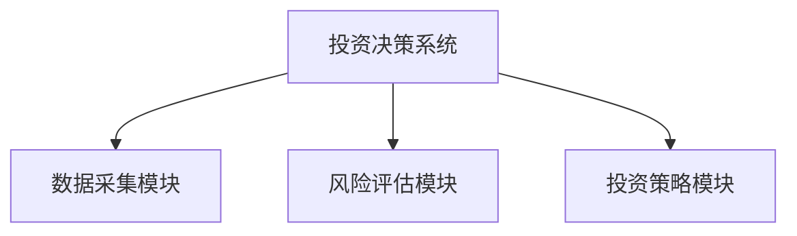

                 


# 《芒格的"反向思考"：如何避免投资陷阱》

---

## 关键词：
- 反向思考
- 投资陷阱
- 芒格投资哲学
- 逆向思维
- 投资策略

---

## 摘要：
本文将探讨芒格的“反向思考”理念，分析其在投资中的应用，揭示如何通过逆向思维避免投资陷阱。从理论到实践，从概念到算法，本文将逐步解析反向思考的核心思想、数学模型、系统架构及实际案例，帮助读者掌握这一独特的投资策略。

---

## 第一部分：引言

### 1.1 芒格与他的投资哲学

#### 1.1.1 芒格的生平简介
查理·芒格（Charlie Munger）是伯克希尔·哈撒韦公司（Berkshire Hathaway）的副主席，沃伦·巴菲特（Warren Buffett）的长期合作伙伴。芒格不仅是成功的投资者，还是认知科学领域的思想家，他的智慧横跨心理学、经济学和投资学。芒格的投资哲学深刻影响了全球投资者。

#### 1.1.2 芒格的投资理念与“反向思考”  
芒格提出的“反向思考”是一种逆向思维的投资策略，其核心在于从对立面思考问题，避免传统思维的局限性。他认为，大多数投资者倾向于从正面思考问题，而忽视了从反面分析潜在风险和机会。

#### 1.1.3 “反向思考”在投资中的重要性  
传统投资思维往往关注“如何赚钱”，而反向思考则关注“如何避免亏钱”。通过反向思考，投资者可以更好地识别潜在风险，避免盲目跟风，从而在复杂的投资市场中保持冷静和理性。

### 1.2 为什么我们需要反向思考  
传统投资思维存在诸多缺陷，例如过度关注市场趋势、忽视逆境分析、容易受到市场情绪影响等。反向思考能够帮助投资者跳出传统思维的框架，从对立面寻找机会和风险。

### 1.3 本书的结构与目标  
本文将从理论到实践，系统解析反向思考的核心概念、算法模型、系统设计和实际案例，帮助读者掌握这一投资策略。

---

## 第二部分：反向思考的核心概念与理论基础

### 2.1 反向思考的定义与特点  

#### 2.1.1 反向思考的定义  
反向思考是一种从对立面分析问题的方法，其核心在于通过分析问题的反面，发现潜在的机遇和风险。

#### 2.1.2 反向思考的核心特点  
- **逆向思维**：从反面思考问题，发现传统思维忽视的细节。  
- **风险优先**：关注潜在风险，避免投资陷阱。  
- **系统性分析**：结合多个维度，全面评估问题。

#### 2.1.3 反向思考与传统思考方式的对比  
| **方面** | **传统思考** | **反向思考** |
|----------|--------------|---------------|
| 思考方向 | 正面为主       | 反面为主       |
| 风险关注 | 事后关注       | 事前关注       |
| 决策依据 | 市场趋势       | 基本面分析     |

### 2.2 反向思考的理论基础  

#### 2.2.1 人性的弱点与投资决策偏差  
投资者容易受到以下认知偏差的影响：  
1. **过度自信**：认为自己能够预测市场趋势。  
2. **从众心理**：盲目跟随市场潮流。  
3. **损失厌恶**：对潜在损失过于敏感。  

#### 2.2.2 行为经济学与投资行为分析  
行为经济学研究表明，投资者的决策往往受到情绪和认知偏差的影响。反向思考能够帮助投资者克服这些偏差，做出更理性的决策。

#### 2.2.3 芒格的“格栅思维”与知识框架  
芒格提出“格栅思维”，即通过多个学科的知识框架来分析问题。反向思考是这一框架中的重要组成部分。

### 2.3 反向思考在投资中的应用  

#### 2.3.1 投资决策中的常见错误  
- 过度关注短期市场波动。  
- 忽视公司的基本面分析。  
- 盲目跟随市场趋势。  

#### 2.3.2 反向思考如何帮助识别投资机会  
通过分析市场的反面，发现被低估的资产。例如，当市场恐慌时，某些优质资产可能被错杀，成为潜在的投资机会。

#### 2.3.3 反向思考与风险管理的结合  
反向思考能够帮助投资者在市场波动中保持冷静，避免盲目追涨杀跌。

---

## 第三部分：反向思考的数学模型与算法原理

### 3.1 投资决策中的概率分析  

#### 3.1.1 概率的基本概念与应用  
概率是投资决策中的重要工具，能够帮助投资者量化风险和收益的可能性。

#### 3.1.2 投资中的概率模型  
一个简单的概率模型如下：  
- 确定资产的预期收益和风险。  
- 计算不同情景下的概率分布。  
- 通过概率加权，评估投资的期望值。  

#### 3.1.3 反向思考与概率决策的结合  
通过反向思考，投资者可以更好地识别低概率但高影响的事件，从而调整投资策略。

### 3.2 投资组合优化的数学模型  

#### 3.2.1 投资组合优化的基本原理  
投资组合优化的目标是在风险和收益之间找到最佳平衡点。

#### 3.2.2 反向思考在投资组合优化中的应用  
通过反向思考，投资者可以识别那些容易被市场忽视但具有较高收益潜力的资产。

#### 3.2.3 数学公式与模型展示  
以下是一个简单的投资组合优化模型：  
$$ \text{目标：} \quad \max \mu w^T \mu - \lambda w^T \Sigma w $$  
其中，$w$ 是权重向量，$\mu$ 是收益向量，$\Sigma$ 是协方差矩阵，$\lambda$ 是风险厌恶系数。

### 3.3 风险评估与反向思考  

#### 3.3.1 风险评估的基本方法  
通过分析市场的反面，评估潜在风险。

#### 3.3.2 反向思考在风险评估中的应用  
识别那些可能引发市场崩盘的因素，提前做好风险对冲。

#### 3.3.3 风险模型的数学表达  
以下是一个风险评估模型：  
$$ \text{风险值} = \sum_{i=1}^n p_i r_i $$  
其中，$p_i$ 是风险 $i$ 发生的概率，$r_i$ 是风险 $i$ 的影响程度。

---

## 第四部分：反向思考的系统分析与架构设计

### 4.1 投资决策系统的整体架构  

#### 4.1.1 系统目标与范围  
设计一个基于反向思考的投资决策系统，帮助投资者识别投资机会和风险。

#### 4.1.2 系统功能模块划分  
1. 数据采集模块：收集市场数据。  
2. 风险评估模块：评估潜在风险。  
3. 投资策略模块：制定投资策略。  

#### 4.1.3 系统架构设计图  


### 4.2 项目实战  

#### 4.2.1 环境安装  
需要安装Python、Pandas、NumPy等库。

#### 4.2.2 系统核心实现源代码  
```python
import numpy as np
import pandas as pd

# 数据采集模块
def collect_data():
    # 示例数据
    data = pd.DataFrame({'price': [100, 90, 80, 70, 60]})
    return data

# 风险评估模块
def assess_risk(data):
    risk = np.std(data['price'])
    return risk

# 投资策略模块
def formulate_strategy(risk):
    if risk > 10:
        return '卖出'
    else:
        return '持有'

# 主函数
def main():
    data = collect_data()
    risk = assess_risk(data)
    strategy = formulate_strategy(risk)
    print(f'投资策略：{strategy}')

if __name__ == '__main__':
    main()
```

#### 4.2.3 代码应用解读与分析  
上述代码通过数据采集、风险评估和策略制定，展示了反向思考在投资决策中的应用。

#### 4.2.4 实际案例分析  
假设市场数据为某公司股价，通过反向思考识别潜在风险，制定相应的投资策略。

---

## 第五部分：总结与最佳实践

### 5.1 本书的核心内容回顾  
反向思考是一种重要的投资策略，能够帮助投资者避免常见陷阱。

### 5.2 反向思考的实战技巧  
- 定期回顾投资决策。  
- 保持对市场的敏感性。  
- 结合多学科知识框架。

### 5.3 小结  
通过系统化的分析和实际案例，本文详细展示了反向思考在投资中的应用。

### 5.4 注意事项  
投资者应结合市场实际情况，灵活运用反向思考策略。

### 5.5 拓展阅读  
建议阅读芒格的《Poor Charlie's Almanack》深入了解其投资哲学。

---

以上是《芒格的"反向思考"：如何避免投资陷阱》的技术博客文章框架和内容。希望对您有所帮助！

