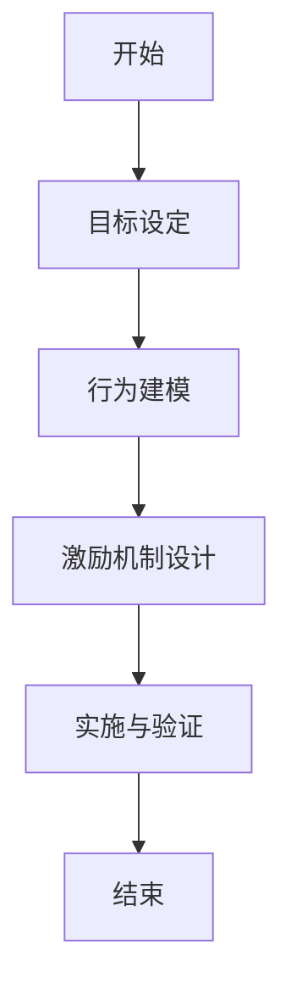
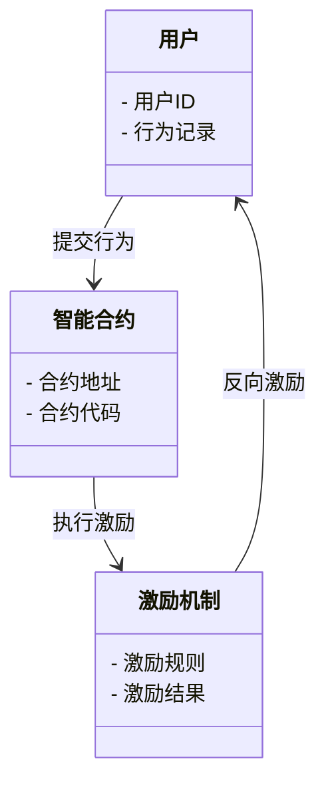
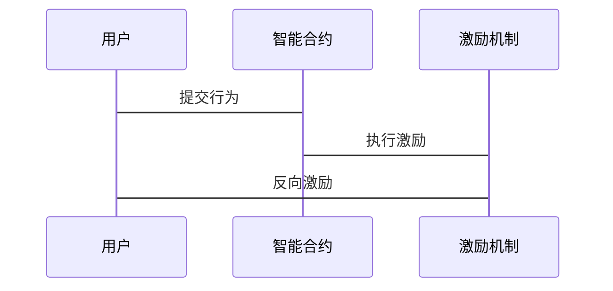

                 


# 芒格的"反向激励"分析在去中心化自治组织(DAO)中的应用

**关键词：反向激励、DAO、区块链、治理机制、激励机制**

**摘要：**  
芒格的“反向激励”是一种通过逆向设计激励机制来实现目标的方法，而去中心化自治组织（DAO）则是一种基于区块链技术的新型组织形式。本文将探讨“反向激励”在DAO中的应用，分析其核心概念、算法原理、系统架构，并通过实际案例展示其在 DAO 治理中的潜力和优势。

---

## 第一部分: 芒格的"反向激励"分析基础

### 第1章: 芒格的"反向激励"概述

#### 1.1 芒格的"反向激励"概念
##### 1.1.1 什么是"反向激励"
“反向激励”是芒格提出的一种激励理论，其核心思想是通过设计一种与传统激励机制相反的机制，引导个体或组织在追求自身利益的过程中，同时实现整体目标。这种机制通常通过惩罚、限制或逆向奖励的方式，促使参与者在追求个人利益的同时，自然地推动组织目标的实现。

##### 1.1.2 反向激励的核心思想
反向激励的核心思想是通过设计一种非线性的激励机制，使得个体的行为在追求自身利益的过程中，自动地符合组织的目标。这种机制通常依赖于数学建模和博弈论，确保激励机制的有效性和可实施性。

##### 1.1.3 反向激励的应用场景
反向激励适用于许多领域，包括经济、管理学、博弈论等。在DAO中，反向激励可以用于治理、激励参与者的合作行为，以及解决“搭便车”问题。

#### 1.2 去中心化自治组织(DAO)的定义与特点
##### 1.2.1 DAO的定义
DAO（Decentralized Autonomous Organization）是一种基于区块链技术的去中心化组织。它通过智能合约自动执行组织的规则和激励机制，实现组织的自治和去中心化。

##### 1.2.2 DAO的核心特点
- **去中心化：** DAO没有传统的中心化管理机构，所有决策和操作均通过区块链上的智能合约自动执行。
- **透明性：** DAO的所有操作和决策均记录在区块链上，具有高度的透明性。
- **不可篡改性：** 由于区块链的特性，DAO的规则和激励机制一旦设定，难以被篡改。

##### 1.2.3 DAO与传统组织的区别
- **去中心化 vs. 中心化：** DAO没有传统组织的中心化管理结构。
- **自动执行 vs. 人工操作：** DAO通过智能合约自动执行规则，而传统组织依赖人工操作。
- **透明性 vs. 黑箱操作：** DAO的所有操作均透明可追溯，而传统组织可能存在信息不对称。

#### 1.3 芒格的"反向激励"与DAO的结合背景
##### 1.3.1 反向激励的起源与发展
反向激励的概念起源于芒格对传统激励机制的反思。他认为，传统的正向激励机制可能导致个体行为与组织目标的偏离，而反向激励通过设计一种逆向的激励机制，使得个体行为与组织目标自然一致。

##### 1.3.2 DAO的兴起与现状
随着区块链技术的发展，DAO作为一种新型的组织形式，逐渐兴起。它通过智能合约实现组织的自治和去中心化，为分布式协作提供了新的可能性。

##### 1.3.3 反向激励在DAO中的应用潜力
反向激励在DAO中的应用潜力主要体现在治理机制的设计上。通过反向激励机制，DAO可以更有效地激励参与者的行为，确保组织目标的实现。

---

### 第2章: 反向激励的核心概念与分析框架

#### 2.1 反向激励的核心原理
##### 2.1.1 反向激励的定义与特征
反向激励是一种通过设计一种与传统激励机制相反的机制，引导个体行为符合组织目标的方法。其核心特征包括：
- **逆向设计：** 反向激励通过设计一种与传统激励机制相反的机制。
- **自动调节：** 反向激励通过数学建模和博弈论，自动调节个体行为与组织目标之间的关系。
- **结果导向：** 反向激励注重结果，而非过程。

##### 2.1.2 反向激励的数学模型
反向激励的数学模型可以表示为：
$$ f(x) = -kx $$
其中，$x$ 表示个体行为，$k$ 为正比例常数，$f(x)$ 表示激励结果。当个体行为 $x$ 增大时，激励结果 $f(x)$ 减小，从而起到反向激励的作用。

##### 2.1.3 反向激励的实施步骤
1. **目标设定：** 明确组织目标。
2. **行为建模：** 建立个体行为的数学模型。
3. **激励机制设计：** 设计反向激励机制。
4. **实施与验证：** 实施激励机制，并验证其有效性。

#### 2.2 DAO中的激励机制分析
##### 2.2.1 DAO中的传统激励机制
在传统 DAO 中，激励机制通常基于正向激励，例如通过分配代币的方式激励参与者。

##### 2.2.2 反向激励在DAO中的独特性
反向激励的独特性体现在其通过设计一种逆向的激励机制，使得个体行为自动符合组织目标。这种机制可以有效解决“搭便车”问题。

##### 2.2.3 反向激励与DAO治理的关系
反向激励通过设计一种与传统激励机制相反的机制，使得个体行为与组织目标自然一致，从而提升 DAO 的治理效率。

#### 2.3 反向激励与DAO的实体关系分析
##### 2.3.1 实体关系图（ER图）
以下是反向激励与DAO的实体关系图：

```mermaid
erDiagram
    participant 用户
    participant 智能合约
    participant 激励机制
    用户 --> 智能合约 : 提交行为
    智能合约 --> 激励机制 : 执行激励
    激励机制 --> 用户 : 反向激励
```

##### 2.3.2 反向激励在DAO中的作用机制
反向激励通过设计一种逆向的激励机制，使得个体行为自动符合组织目标。例如，当个体行为 $x$ 增大时，激励结果 $f(x)$ 减小，从而起到反向激励的作用。

##### 2.3.3 反向激励与DAO治理的交互关系
反向激励通过智能合约自动执行激励机制，与 DAO 的治理机制相结合，实现组织目标的自动实现。

---

### 第3章: 反向激励的数学模型与算法原理

#### 3.1 反向激励的数学模型
##### 3.1.1 反向激励的数学表达式
反向激励的数学表达式可以表示为：
$$ f(x) = -kx $$
其中，$x$ 表示个体行为，$k$ 为正比例常数，$f(x)$ 表示激励结果。

##### 3.1.2 反向激励的优化算法
反向激励的优化算法可以通过以下步骤实现：
1. **目标设定：** 明确组织目标。
2. **行为建模：** 建立个体行为的数学模型。
3. **激励机制设计：** 设计反向激励机制。
4. **实施与验证：** 实施激励机制，并验证其有效性。

#### 3.2 反向激励在DAO中的应用算法
##### 3.2.1 反向激励的应用场景
反向激励在DAO中的应用场景包括治理机制设计、激励参与者合作行为等。

##### 3.2.2 反向激励的实现步骤
1. **目标设定：** 明确组织目标。
2. **行为建模：** 建立个体行为的数学模型。
3. **激励机制设计：** 设计反向激励机制。
4. **实施与验证：** 实施激励机制，并验证其有效性。

#### 3.3 反向激励的算法流程图
以下是反向激励的算法流程图：



---

## 第四部分: 反向激励在DAO中的系统架构与实现

### 第4章: 系统分析与架构设计方案

#### 4.1 问题场景介绍
在 DAO 中，传统激励机制可能导致个体行为与组织目标的偏离。通过反向激励机制，可以有效解决这一问题。

#### 4.2 项目介绍
本项目旨在设计一种基于反向激励的 DAO 治理机制，通过智能合约实现激励机制的自动执行。

#### 4.3 系统功能设计
##### 4.3.1 领域模型
以下是领域模型图：



#### 4.4 系统架构设计
##### 4.4.1 系统架构图
以下是系统架构图：


#### 4.5 系统接口设计
系统接口设计包括用户接口、智能合约接口和激励机制接口。

#### 4.6 系统交互流程图
以下是系统交互流程图：



---

## 第五部分: 反向激励在DAO中的项目实战

### 第5章: 项目实战

#### 5.1 环境安装
需要安装区块链开发环境（如Solidity）、智能合约编译工具（如 Remix）等。

#### 5.2 核心代码实现
以下是核心代码实现：

```solidity
// 反向激励机制智能合约
contract IncentiveMechanism {
    mapping(address => uint) private userBehavior;
    
    function submitBehavior(address user, uint behavior) external {
        userBehavior[user] = behavior;
    }
    
    function executeIncentive(address user) external {
        uint behavior = userBehavior[user];
        uint incentive = -behavior; // 反向激励
        // 实施激励
        // ...
    }
}
```

#### 5.3 代码应用解读与分析
上述代码通过智能合约实现反向激励机制，用户提交行为后，激励机制根据行为值的反向结果实施激励。

#### 5.4 实际案例分析
通过实际案例分析，验证反向激励机制在 DAO 中的应用效果。

#### 5.5 项目小结
反向激励机制通过智能合约自动执行激励机制，有效解决了 DAO 中的传统激励机制问题。

---

## 第六部分: 反向激励在DAO中的最佳实践

### 第6章: 最佳实践

#### 6.1 小结
反向激励机制通过设计一种与传统激励机制相反的机制，使得个体行为自动符合组织目标。

#### 6.2 注意事项
在设计反向激励机制时，需要注意激励机制的有效性和可实施性。

#### 6.3 未来展望
随着区块链技术的发展，反向激励机制在 DAO 中的应用前景广阔。

---

## 附录: 参考文献

- 芒格的相关著作
- 区块链技术相关文献
- 智能合约开发文档

---

通过以上内容，我们可以看到，芒格的“反向激励”分析在去中心化自治组织（DAO）中的应用，不仅能够提升 DAO 的治理效率，还能为分布式协作提供新的可能性。

