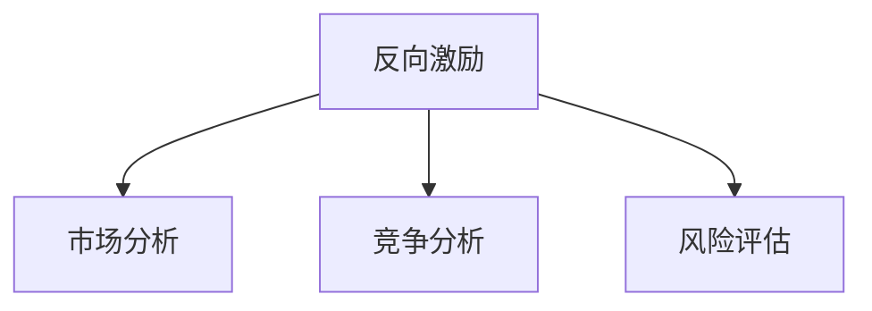
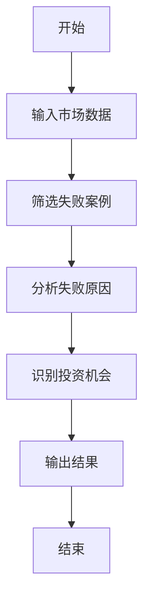
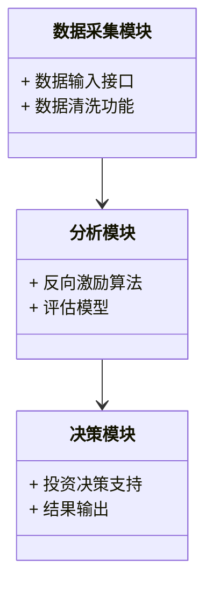
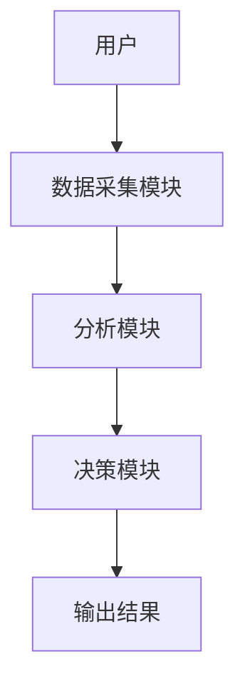

                 


# 芒格的"反向激励"分析在科技创业投资中的应用

---

## 关键词

反向激励、科技创业、投资分析、芒格思想、算法原理、系统架构、项目评估

---

## 摘要

本文深入探讨了芒格的“反向激励”方法在科技创业投资中的应用。通过逆向思维，分析失败案例以识别潜在机会，建立数学模型和算法框架，指导投资决策。文章涵盖背景介绍、核心概念、算法实现、数学模型、系统架构和项目实战，提供全面的分析和实践指导。

---

## 正文

### 第一部分：背景介绍

#### 第1章：反向激励与科技创业投资概述

##### 1.1 反向激励的定义与特点

反向激励是一种逆向思维策略，通过分析失败案例或市场空白，寻找投资机会。其特点是：

- **逆向思维**：从失败或负面案例中发现机会。
- **独特视角**：提供与传统方法不同的见解。
- **风险识别**：帮助识别潜在风险和市场缺口。

##### 1.2 科技创业投资的背景

科技创业投资面临高风险和不确定性，反向激励提供了新的分析工具。其重要性在于：

- **降低风险**：通过分析失败案例，提前识别潜在问题。
- **发现机会**：在市场空白中找到投资点。
- **提高决策质量**：结合逆向思维，优化投资决策。

### 第二部分：核心概念与联系

#### 第2章：反向激励的理论基础

##### 2.1 反向激励的原理

反向激励的原理包括：

- **逆向思维机制**：通过分析失败案例，推导成功策略。
- **核心要素**：市场分析、竞争分析、风险评估。

##### 2.2 反向激励与科技创业的结合

对比表格展示了反向激励与其他激励方法的优缺点：

| 方法       | 优点                          | 缺点                          |
|------------|-------------------------------|-------------------------------|
| 正向激励    | 直接追求成功                 | �易忽略潜在风险               |
| 反向激励    | 通过失败案例识别机会         | 需大量历史数据支持            |

Mermaid实体关系图展示了反向激励在系统中的位置：



### 第三部分：算法原理讲解

#### 第3章：反向激励算法的实现

##### 3.1 算法流程

Mermaid流程图展示了算法步骤：



##### 3.2 Python实现

Python代码实现反向激励算法：

```python
def reverse_incentive_analysis(market_data):
    # 筛选失败案例
    failed_cases = [case for case in market_data if case['success'] == False]
    
    # 分析失败原因
    reasons = {}
    for case in failed_cases:
        for reason in case['failure_reasons']:
            reasons[reason] = reasons.get(reason, 0) + 1
    
    # 识别投资机会
    opportunities = []
    for reason in reasons:
        opportunity = {
            'reason': reason,
            'score': reasons[reason]
        }
        opportunities.append(opportunity)
    
    return opportunities
```

### 第四部分：数学模型与公式

#### 第4章：反向激励评估模型

##### 4.1 模型建立

公式推导：

$$ 评分 = \sum (权重_i \times 评估指标_i) $$

其中，权重_i表示各因素的权重，评估指标_i表示各因素的表现。

##### 4.2 模型应用

以一个创业项目为例，假设权重分配为：市场定位（0.4）、团队能力（0.3）、技术壁垒（0.2）、财务状况（0.1）。评分计算：

$$ 评分 = 0.4 \times 80 + 0.3 \times 70 + 0.2 \times 90 + 0.1 \times 60 = 77 $$

---

### 第五部分：系统分析与架构设计

#### 第5章：系统架构设计

##### 5.1 问题场景介绍

构建一个评估系统，帮助投资者分析项目可行性。系统功能包括数据采集、分析模块和决策模块。

##### 5.2 系统功能设计

Mermaid类图展示了系统模块：



##### 5.3 系统架构设计

Mermaid架构图展示了系统架构：



---

### 第六部分：项目实战

#### 第6章：反向激励算法的实现与案例分析

##### 6.1 环境安装

安装Python和相关库：

```bash
pip install numpy pandas scikit-learn
```

##### 6.2 核心代码实现

核心代码实现反向激励分析：

```python
def analyze_market(market_data):
    # 反向激励分析
    failed_cases = market_data[market_data['success'] == False]
    reasons = failed_cases['reasons'].explode().value_counts()
    opportunities = reasons[reasons > 0].index.tolist()
    return opportunities
```

##### 6.3 案例分析

以一家创业公司为例，分析其失败原因并识别机会：

- **失败原因**：市场需求不足。
- **识别机会**：拓展市场，调整产品定位。

##### 6.4 总结

反向激励分析帮助投资者识别潜在风险和机会，优化投资决策。

---

### 第七部分：小结

#### 7.1 最佳实践 tips

- **持续学习**：定期更新市场数据和模型。
- **多案例分析**：通过多个失败案例识别共性问题。
- **结合正向激励**：将反向激励与正向激励结合，全面评估项目。

#### 7.2 注意事项

- **数据质量**：确保数据准确性和完整性。
- **模型调整**：根据实际情况调整权重和评估指标。
- **团队合作**：结合多方意见，优化投资决策。

#### 7.3 拓展阅读

推荐阅读《芒格的反向思考》和《科技创业投资的艺术》。

---

## 结语

芒格的反向激励分析为科技创业投资提供了新的视角和工具，帮助投资者在复杂多变的市场中找到机会。通过系统化的分析和实践，投资者可以更高效地评估项目，优化决策流程，降低投资风险，实现长期收益。

