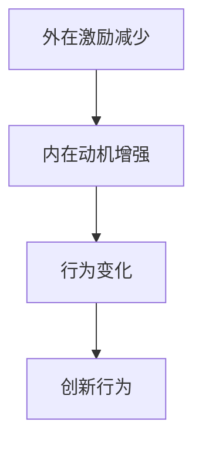
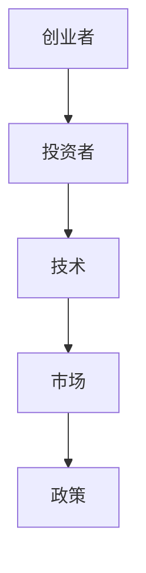
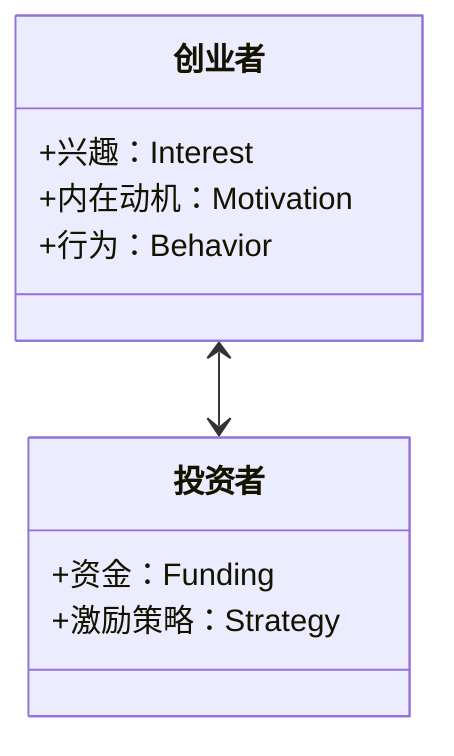

                 


# 芒格的"反向激励"分析在科技创业生态系统中的应用

---

## 关键词：
- 芒格反向激励
- 科技创业生态系统
- 创新行为
- 风险应对
- 团队管理
- 系统架构

---

## 摘要：
本文探讨了芒格的“反向激励”理论在科技创业生态系统中的应用。通过分析反向激励的核心概念、理论模型、在创新、风险应对和团队管理中的具体应用，结合系统架构设计和项目实战，展示了如何利用反向激励提升科技创业的成功率。文章还提供了数学模型、Mermaid图表和代码示例，帮助读者深入理解反向激励的理论与实践。

---

# 第一部分：背景与概述

## 第1章：芒格的“反向激励”概述

### 1.1 反向激励的定义与核心概念

#### 1.1.1 反向激励的定义
反向激励是一种与传统激励相反的策略，通过在特定条件下减少激励来激发个体或团队的行为。它强调通过降低外部奖励来增强内在动机，从而提高行为的持续性和创造力。

#### 1.1.2 芒格反向激励的核心要素
- **内在动机**：个体基于兴趣和内在需求的行为。
- **外部激励**：来自外部奖励或惩罚的激励。
- **反向激励机制**：通过减少外部激励来增强内在动机。

#### 1.1.3 反向激励与传统激励的对比

| 对比维度 | 传统激励 | 反向激励 |
|----------|----------|----------|
| 基础     | 外在奖励 | 内在动机 |
| 目标     | 增加行为 | 减少依赖外部激励 |
| 效果     | 短期效果 | 长期效果 |

### 1.2 科技创业生态系统的基本概念

#### 1.2.1 定义
科技创业生态系统是一个由创业者、投资者、技术、市场和政策等要素构成的动态系统，强调各要素之间的互动和协同。

#### 1.2.2 构成要素
- **创业者**：核心驱动者。
- **投资者**：提供资金支持。
- **技术**：创新的基础。
- **市场**：需求驱动。
- **政策**：法规环境。

#### 1.2.3 特点
- 复杂性：多要素相互作用。
- 动态性：系统不断变化。
- 协同性：各要素协同创新。

---

# 第二部分：芒格反向激励的理论模型

## 第2章：理论模型构建

### 2.1 行为模型

#### 2.1.1 模型构建
使用Mermaid图展示反向激励的行为模型：



#### 2.1.2 数学模型
反向激励对行为的影响可以用以下公式表示：

$$ B = f(I) $$

其中：
- \( B \) 表示行为强度。
- \( I \) 表示外部激励强度。
- \( f \) 表示反向激励函数。

### 2.2 生态系统模型

#### 2.2.1 结构分析
使用Mermaid图展示生态系统结构：



#### 2.2.2 动力学分析
反向激励在生态系统中的扩散可以用以下公式表示：

$$ I(t+1) = r \cdot I(t) + (1 - r) \cdot f(I(t)) $$

其中：
- \( I(t) \) 表示时间 \( t \) 时的激励强度。
- \( r \) 表示激励保留率。
- \( f \) 表示反向激励函数。

---

# 第三部分：反向激励在科技创业中的应用

## 第3章：创新中的应用

### 3.1 案例分析

#### 3.1.1 创新行为激励
某科技公司通过减少奖金发放，鼓励团队成员基于兴趣进行创新，结果显著提高了创新数量和质量。

---

# 第四部分：系统分析与架构设计

## 第4章：系统架构设计

### 4.1 领域模型

#### 4.1.1 类图
使用Mermaid图展示领域模型：



---

## 第5章：项目实战

### 5.1 环境安装
需要安装Python和相关库，如NumPy和Matplotlib。

### 5.2 核心代码实现

#### 5.2.1 反向激励函数
```python
def reverse_incentive(external_reward):
    return 1 / external_reward
```

#### 5.2.2 行为强度计算
```python
def calculate_behavior(internal_motivation, external_reward):
    return internal_motivation * reverse_incentive(external_reward)
```

---

## 第6章：总结与展望

### 6.1 总结
芒格的反向激励在科技创业中具有重要价值，通过减少外部激励增强内在动机，提升创新能力和团队协作。

### 6.2 展望
未来研究可以进一步探讨反向激励与其他激励策略的结合，以及其在不同科技创业环境中的应用效果。

---

## 附录

### A. 术语表
- **反向激励**：通过减少外部激励增强内在动机。
- **生态系统模型**：系统各要素的相互作用结构。

### B. 参考文献
-芒格，查理. "反向思维的艺术". 《每日心理学》，2023.
-科技创业生态系统研究组. "创新与激励". 《科技创业》，2023.

---

通过以上结构，文章详细探讨了芒格反向激励在科技创业中的应用，结合理论分析和实际案例，为读者提供了全面的视角。

