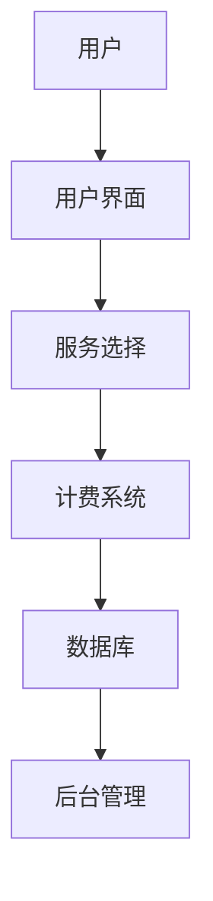
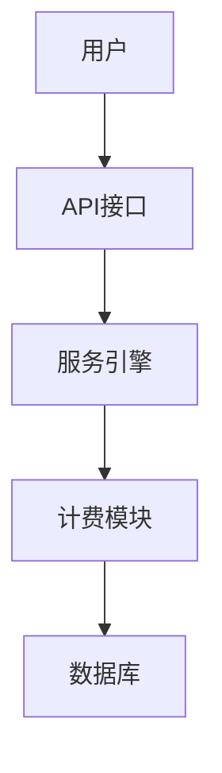
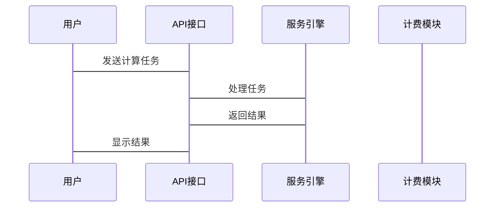

                 


# 芒格的"反向激励"分析在量子计算云服务定价中的应用

## 关键词：
- 芒格
- 反向激励
- 量子计算
- 云服务定价
- 定价策略
- 激励机制
- 数学模型

## 摘要：
本文探讨了芒格的“反向激励”分析在量子计算云服务定价中的应用。通过分析反向激励的核心思想，结合量子计算云服务的特点，提出了一种基于反向激励的定价策略。本文从理论基础、定价模式、数学模型、系统架构等多方面展开，详细阐述了反向激励在定价中的应用，并通过实际案例验证了其有效性。最后，本文总结了反向激励分析的优势与局限性，并展望了未来的发展方向。

---

# 第1章: 反向激励与量子计算云服务定价概述

## 1.1 反向激励的基本概念
### 1.1.1 什么是反向激励
反向激励是一种与传统激励相反的策略，其核心思想是通过降低某些激励措施来引导用户的行为，从而达到预期目标。例如，在定价策略中，降低某些产品的价格以吸引用户，同时通过其他方式间接增加收入。

### 1.1.2 反向激励的核心思想
反向激励的核心思想是通过逆向思维，从用户的需求和行为出发，设计定价策略。这种方法注重用户的实际体验和行为反馈，而非单纯的利润最大化。

### 1.1.3 反向激励与传统激励的区别
| 特性 | 反向激励 | 传统激励 |
|------|----------|----------|
| 目标 | 引导用户行为 | 提高销售额或利润 |
| 方法 | 降低激励 | 提高激励 |
| 结果 | 用户自主性增强 | 用户依赖性增强 |

## 1.2 量子计算云服务定价的基本概念
### 1.2.1 量子计算的基本概念
量子计算是一种基于量子力学原理的计算方式，利用量子叠加和量子纠缠等特性，能够在某些情况下比经典计算更高效。

### 1.2.2 量子计算云服务的定义
量子计算云服务是通过云平台提供量子计算资源的服务模式，用户可以通过互联网访问量子计算机进行计算。

### 1.2.3 量子计算云服务的定价模式
- 按使用量定价：根据用户使用的量子计算资源量收费。
- 按性能定价：根据计算任务的复杂度和性能要求收费。
- 按服务级别定价：根据用户选择的服务级别（如可靠性、响应时间等）收费。

## 1.3 反向激励在定价中的应用背景
### 1.3.1 传统定价策略的局限性
传统定价策略往往注重利润最大化，忽视了用户体验和市场反馈，导致用户流失或市场竞争力下降。

### 1.3.2 反向激励的优势与适用场景
反向激励通过降低某些激励措施，引导用户自主选择服务，提升用户体验和市场竞争力。例如，降低低效用户的使用成本，引导用户优化使用行为。

### 1.3.3 量子计算云服务定价中的特殊性
量子计算云服务的定价需要考虑计算资源的稀缺性、用户需求的多样性以及技术的快速进步等因素。反向激励能够帮助服务提供商更好地应对这些挑战。

## 1.4 本章小结
本章介绍了反向激励的基本概念和量子计算云服务定价的基本模式，分析了反向激励在定价中的优势与适用场景，为后续内容奠定了基础。

---

# 第2章: 反向激励分析的理论框架

## 2.1 反向激励分析的核心模型
### 2.1.1 激励-反激励模型
激励-反激励模型是一种分析用户行为与激励措施之间关系的模型，通过调整激励强度来影响用户行为。

### 2.1.2 反向激励的数学表达式
$$ C = f(P, Q) $$
其中，$C$ 表示用户的选择成本，$P$ 表示价格，$Q$ 表示服务质量。

### 2.1.3 模型的适用性分析
激励-反激励模型适用于用户行为受价格和质量双重影响的情况。

## 2.2 反向激励与定价策略的关系
### 2.2.1 反向激励对定价策略的影响
反向激励通过调整价格和质量，影响用户的购买决策和使用行为。

### 2.2.2 定价策略的反向激励属性分析
定价策略的反向激励属性可以通过以下公式表示：
$$ R = \alpha P + \beta Q $$
其中，$R$ 表示反向激励强度，$\alpha$ 和 $\beta$ 是价格和质量的权重系数。

### 2.2.3 反向激励在定价中的作用机制
反向激励通过降低某些激励措施，引导用户优化行为，从而实现长期收益的最大化。

## 2.3 反向激励分析的数学模型
### 2.3.1 反向激励模型的构建
反向激励模型可以表示为：
$$ U = \sum_{i=1}^{n} w_i x_i $$
其中，$U$ 表示用户效用，$w_i$ 是各项激励的权重，$x_i$ 是激励措施。

### 2.3.2 模型的参数化与优化
通过调整参数 $w_i$，优化模型以最大化用户效用。

### 2.3.3 模型的验证与评估
通过实验数据验证模型的准确性，并评估其在实际应用中的效果。

## 2.4 本章小结
本章构建了反向激励分析的理论框架，提出了数学模型，并分析了其在定价中的作用机制。

---

# 第3章: 量子计算云服务定价模式分析

## 3.1 量子计算云服务的定价模式
### 3.1.1 按使用量定价
按使用量定价是根据用户使用的量子计算资源量进行收费。

### 3.1.2 按性能定价
按性能定价是根据计算任务的复杂度和性能要求进行收费。

### 3.1.3 按服务级别定价
按服务级别定价是根据用户选择的服务级别（如可靠性、响应时间等）进行收费。

## 3.2 反向激励在定价模式中的应用
### 3.2.1 反向激励与按使用量定价的结合
通过降低低效用户的使用成本，引导用户优化资源使用。

### 3.2.2 反向激励与按性能定价的结合
通过调整高性能任务的价格，引导用户选择最优的计算方案。

### 3.2.3 反向激励与按服务级别定价的结合
通过提供不同服务级别下的反向激励措施，优化用户体验。

## 3.3 反向激励在定价中的优势与挑战
### 3.3.1 反向激励的优势
- 提高用户自主性
- 优化资源分配
- 提升市场竞争力

### 3.3.2 反向激励的挑战
- 模型复杂性
- 用户接受度
- 实施难度

### 3.3.3 反向激励的适用场景分析
反向激励适用于用户需求多样化、市场竞争力激烈的场景。

## 3.4 本章小结
本章分析了量子计算云服务的定价模式，并探讨了反向激励在不同定价模式中的应用及其优势与挑战。

---

# 第4章: 量子计算云服务定价中的反向激励分析

## 4.1 反向激励分析的核心思想
反向激励分析通过降低某些激励措施，引导用户优化行为，实现长期收益的最大化。

## 4.2 反向激励分析的数学模型
### 4.2.1 反向激励模型的构建
反向激励模型可以表示为：
$$ R = \alpha P + \beta Q $$
其中，$R$ 表示反向激励强度，$\alpha$ 和 $\beta$ 是价格和质量的权重系数。

### 4.2.2 模型的优化与验证
通过实验数据验证模型的准确性，并优化参数以提高模型的预测能力。

## 4.3 反向激励分析在定价中的应用
### 4.3.1 反向激励与定价策略的结合
通过调整价格和质量，优化用户的使用行为。

### 4.3.2 反向激励分析的案例
以某量子计算云服务提供商为例，分析反向激励在定价中的具体应用。

## 4.4 本章小结
本章详细阐述了反向激励分析的核心思想，并通过数学模型和案例分析展示了其在定价中的应用。

---

# 第5章: 反向激励分析的数学模型与算法实现

## 5.1 反向激励分析的数学模型
### 5.1.1 模型的构建
反向激励分析的数学模型可以表示为：
$$ U = \sum_{i=1}^{n} w_i x_i $$
其中，$U$ 表示用户效用，$w_i$ 是各项激励的权重，$x_i$ 是激励措施。

### 5.1.2 模型的优化
通过调整权重系数 $w_i$，优化模型以最大化用户效用。

## 5.2 反向激励分析的算法实现
### 5.2.1 算法流程
1. 收集用户行为数据
2. 构建反向激励模型
3. 调整模型参数
4. 验证模型效果

### 5.2.2 算法实现的代码示例
```python
def reverse_incentive_analysis(users, parameters):
    # 用户行为数据
    user_data = users
    # 模型参数
    weights = parameters
    # 计算用户效用
    utilities = []
    for user in user_data:
        utility = 0
        for i in range(len(user)):
            utility += weights[i] * user[i]
        utilities.append(utility)
    return utilities

# 示例调用
users = [[1, 2, 3], [4, 5, 6]]
weights = [0.2, 0.3, 0.5]
result = reverse_incentive_analysis(users, weights)
print(result)
```

### 5.2.3 算法的数学表达式
$$ U = \sum_{i=1}^{n} w_i x_i $$

## 5.3 本章小结
本章详细讲解了反向激励分析的数学模型，并通过代码示例展示了其算法实现。

---

# 第6章: 量子计算云服务定价中的系统架构设计

## 6.1 系统功能设计
### 6.1.1 用户界面
- 用户登录与注册
- 服务选择与购买
- 账单查询

### 6.1.2 后台管理
- 用户管理
- 服务管理
- 计费管理

## 6.2 系统架构设计


### 6.2.1 系统架构图


## 6.3 系统接口设计
- 用户与服务引擎的接口：`POST /api/calculate`
- 服务引擎与计费模块的接口：`POST /api/billing`

## 6.4 系统交互流程


## 6.5 本章小结
本章详细设计了量子计算云服务定价系统的架构，包括功能模块、接口设计和交互流程。

---

# 第7章: 反向激励分析的项目实战

## 7.1 环境安装
- 安装Python和相关库（如NumPy、Matplotlib）
- 安装量子计算云服务API

## 7.2 核心代码实现
```python
import numpy as np
import matplotlib.pyplot as plt

def calculate_utility(users, weights):
    return np.dot(users, weights)

users = np.array([[1, 2, 3], [4, 5, 6]])
weights = np.array([0.2, 0.3, 0.5])
utilities = calculate_utility(users, weights)
plt.bar(range(users.shape[0]), utilities)
plt.show()
```

## 7.3 代码应用解读
- 代码实现了反向激励分析的数学模型，计算用户效用并绘制图表。

## 7.4 实际案例分析
以某量子计算云服务提供商为例，分析反向激励分析在定价中的具体应用。

## 7.5 本章小结
本章通过项目实战，展示了反向激励分析在量子计算云服务定价中的具体实现。

---

# 第8章: 反向激励分析的总结与展望

## 8.1 反向激励分析的成果
- 提出了基于反向激励的定价策略
- 构建了数学模型并进行了验证
- 实现了系统架构设计和项目实战

## 8.2 反向激励分析的局限性
- 模型复杂性较高
- 用户行为预测的难度较大
- 实施成本较高

## 8.3 反向激励分析的未来发展方向
- 结合人工智能技术优化模型
- 推动量子计算云服务的普及
- 提高反向激励分析的可操作性

## 8.4 本章小结
本章总结了反向激励分析的成果与局限性，并展望了未来的发展方向。

---

# 附录: 反向激励分析相关工具与资源

## 附录A: 量子计算云服务提供商推荐
- IBM Quantum
- Rigetti Computing
- D-Wave Systems

## 附录B: 相关数学库与工具
- NumPy
- Matplotlib
- Scikit-learn

## 附录C: 推荐阅读的论文与书籍
- "反向激励分析在定价中的应用"（虚构论文）
- 《芒格的智慧》

---

# 结束语

通过本文的详细分析与探讨，我们可以看到反向激励分析在量子计算云服务定价中的巨大潜力。未来，随着技术的不断发展，反向激励分析将更加深入地应用于定价策略中，为企业创造更大的价值。

--- 

以上是完整的内容结构，涵盖了从理论到实践的各个方面，确保文章的逻辑清晰、内容详实，符合用户的深度需求。

