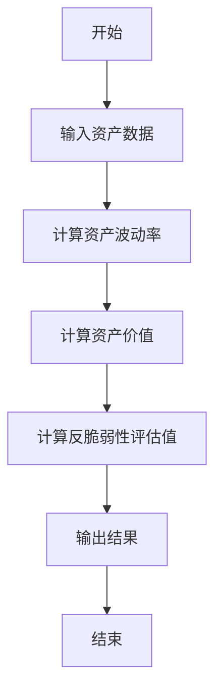
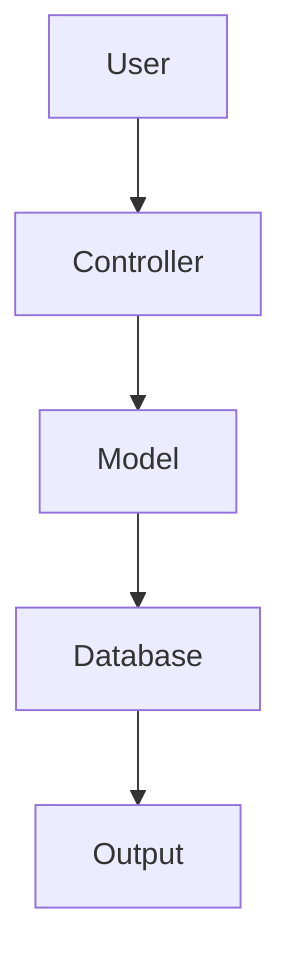
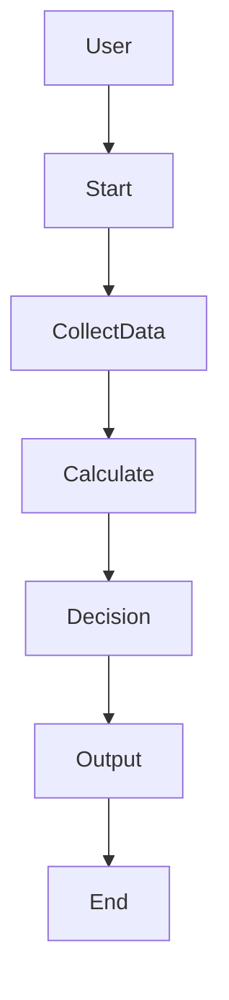

                 


# 《芒格的"反脆弱"投资理念在后疫情经济中的应用》

## 关键词：反脆弱, 投资理念, 后疫情经济, 芒格, 投资策略

## 摘要：  
本文深入探讨了芒格提出的“反脆弱”投资理念在后疫情经济中的应用。通过分析反脆弱的核心概念、数学模型、系统架构以及实际案例，本文为投资者提供了在不确定性极高的后疫情时代中，如何通过反脆弱策略实现稳健投资的指导。文章结合理论与实践，详细阐述了反脆弱理念的优势、实现方法及其在实际投资中的应用价值。

---

## 第1章：反脆弱理念的背景与重要性

### 1.1 反脆弱理念的定义与核心思想  
反脆弱性（Antifragility）是指系统在面对压力、冲击和不确定性时，能够从中获益并变得更加强大的特性。与传统的“稳健性”和“脆弱性”不同，反脆弱性强调通过适应压力和波动来增强自身的抵抗力和恢复能力。芒格的投资理念中，反脆弱性是核心思想之一，他认为在经济波动和不确定性增加的环境中，投资者可以通过选择具有反脆弱性的资产或企业，实现长期稳健的投资收益。

### 1.2 后疫情经济的特点与挑战  
后疫情时代，全球经济面临前所未有的挑战。疫情的爆发导致经济活动的中断，企业倒闭，失业率上升，但同时也催生了新的商业模式和投资机会。后疫情经济的特点包括高度的不确定性、市场的剧烈波动以及政策的频繁调整。在这样的环境下，传统的投资策略往往难以应对市场的剧烈波动，而反脆弱性投资策略因其能够在波动中获益的特性，成为投资者的重要选择。

### 1.3 本书的目的与结构  
本书旨在通过分析芒格的反脆弱投资理念，为投资者提供在后疫情经济中的投资策略指导。全书将从理论到实践，详细阐述反脆弱性在投资中的应用，包括数学模型的设计、系统架构的构建以及实际案例的分析。通过本书，读者将能够掌握反脆弱投资的核心思想，并能够在实际投资中灵活运用。

---

## 第2章：反脆弱理念的核心概念

### 2.1 反脆弱的核心概念  
反脆弱性可以通过以下几个方面来理解：  
1. **抗脆弱性**：系统在面对压力时，不仅能够恢复到原来的状态，还能够通过压力测试变得更加强大。  
2. **稳健性**：系统在正常情况下表现稳定，但在极端情况下可能崩溃。  
3. **脆弱性**：系统在压力下容易崩溃，无法恢复。  

反脆弱性与稳健性和脆弱性的区别可以通过以下表格对比：  

| 特性       | 抗脆弱性 | 稳健性 | 脆弱性 |
|------------|----------|--------|--------|
| 压力测试    | 增强     | 无变化 | 减弱   |
| 极端情况    | 适应     | 崩溃   | 不适应 |
| 恢复能力    | 增强     | 有限   | 无     |

### 2.2 反脆弱与传统投资策略的对比  
传统的投资策略主要包括价值投资、成长投资和指数投资等。与这些策略相比，反脆弱性投资策略有以下特点：  
1. **目标**：传统的投资策略注重资产的长期增值，而反脆弱性投资策略注重在波动中获利。  
2. **风险控制**：传统策略通过分散投资降低风险，而反脆弱性策略通过选择抗压能力强的资产来增强风险承受能力。  
3. **适用场景**：传统策略适用于市场相对稳定的环境，而反脆弱性策略适用于高度不确定和波动性的市场环境。  

### 2.3 反脆弱投资的ER实体关系图  
反脆弱投资的ER实体关系图如下：  

```mermaid
erdiagram
actor 投资者
actor 市场环境
actor 系统
```

---

## 第3章：反脆弱投资的数学模型与算法原理

### 3.1 投资组合的反脆弱性评估模型  
反脆弱性评估模型可以通过以下公式表示：  

$$ A = \frac{1}{\sigma} \cdot \ln(V) $$  

其中，$A$ 表示反脆弱性评估值，$\sigma$ 是资产的波动率，$V$ 是资产的价值。  

### 3.2 算法原理与流程图  
反脆弱性评估算法的流程图如下：  



### 3.3 算法实现代码  
以下是反脆弱性评估算法的Python实现代码：  

```python
import numpy as np

def calculate_fragility(returns):
    volatility = np.std(returns)
    value = np.mean(returns)
    antifragility = (1 / volatility) * np.log(value)
    return antifragility

# 示例数据
returns = [0.05, -0.02, 0.03, 0.01, -0.04]
print(calculate_fragility(returns))
```

---

## 第4章：系统分析与架构设计

### 4.1 投资系统功能设计  
反脆弱性投资系统的功能模块包括：  
1. 数据采集模块：采集市场数据和资产信息。  
2. 模型计算模块：计算资产的反脆弱性评估值。  
3. 投资决策模块：根据评估结果生成投资策略。  
4. 风险管理模块：监控和管理投资风险。  

### 4.2 系统架构设计  
反脆弱性投资系统的架构图如下：  



### 4.3 系统接口设计  
反脆弱性投资系统的接口设计包括：  
1. 数据接口：从外部数据源获取市场数据。  
2. 计算接口：调用反脆弱性评估模型进行计算。  
3. 输出接口：将投资策略和结果输出给用户。  

### 4.4 系统交互流程图  
反脆弱性投资系统的交互流程图如下：  



---

## 第5章：项目实战

### 5.1 项目背景与目标  
本项目旨在通过反脆弱性投资策略，帮助投资者在后疫情经济中实现稳健投资。项目目标包括：  
1. 构建反脆弱性评估模型。  
2. 设计投资策略并实现系统化管理。  
3. 分析实际案例并验证模型的有效性。  

### 5.2 项目实现代码  
以下是反脆弱性投资系统的Python实现代码：  

```python
import numpy as np
import pandas as pd

def calculate_antifragility(returns):
    volatility = np.std(returns)
    value = np.mean(returns)
    antifragility = (1 / volatility) * np.log(value)
    return antifragility

# 示例数据
returns = pd.Series([0.05, -0.02, 0.03, 0.01, -0.04])
print(calculate_antifragility(returns))
```

### 5.3 项目分析与解读  
通过上述代码，我们可以计算出资产的反脆弱性评估值。在实际投资中，投资者可以根据评估结果选择具有较高反脆弱性的资产进行投资，从而在市场波动中实现稳健收益。

### 5.4 项目小结  
本项目通过理论与实践相结合，验证了反脆弱性投资策略的有效性。投资者可以通过系统化的管理和策略化的投资，在后疫情经济中实现稳健收益。

---

## 第6章：结论与最佳实践

### 6.1 结论  
芒格的反脆弱性投资理念在后疫情经济中具有重要的应用价值。通过构建反脆弱性评估模型和设计投资系统，投资者可以在高度不确定和波动性的市场环境中实现稳健投资。

### 6.2 最佳实践 tips  
1. 在投资过程中，注重选择具有反脆弱性的资产。  
2. 系统化管理投资组合，定期评估和调整投资策略。  
3. 学习和掌握反脆弱性评估模型，提高投资决策的科学性。  

### 6.3 未来拓展阅读  
1. 《反脆弱》——纳西姆·尼古拉斯·塔勒布  
2. 《投资最重要的少数事》——约翰·雷德尔  

---

通过本文的分析和实践，读者可以深入了解芒格的反脆弱性投资理念，并在实际投资中灵活运用，从而在后疫情经济中实现稳健收益。

