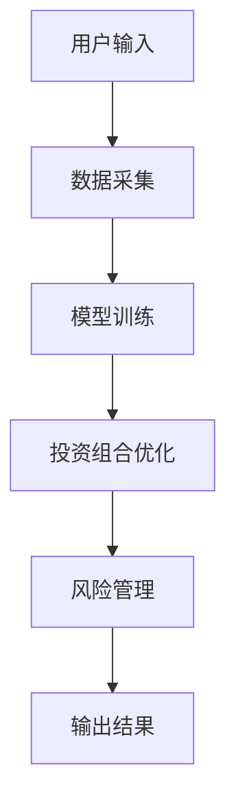

                 


# 《芒格的"反脆弱"投资理念在量子波动市场中的应用》

> **关键词**：反脆弱，量子波动，投资策略，风险管理，不确定性，系统性思维

> **摘要**：本文探讨了芒格的“反脆弱”投资理念在量子波动市场中的应用。通过分析反脆弱理念的核心思想、量子波动市场的基本特征，以及两者结合的实际应用场景，本文提出了在量子波动市场中构建反脆弱投资策略的方法。通过数学建模和算法设计，本文详细阐述了如何利用反脆弱理念在量子波动市场中实现稳健的投资回报，并通过实际案例分析验证了该策略的有效性。

---

# 第1章: 芒格的反脆弱投资理念概述

## 1.1 芒格投资理念的起源

### 1.1.1 芒格投资理念的核心思想

芒格的反脆弱投资理念源于他对人类认知局限性和市场不确定性的深刻理解。他认为，投资者应该避免在不确定性和波动性中追求短期收益，而应该构建一种能够在市场波动中“反脆弱”的投资组合。反脆弱性意味着在面对不确定性时，系统不仅不会受到损害，反而会通过适应和进化变得更强大。

### 1.1.2 芒格投资理念的哲学基础

芒格的投资理念深受哲学和科学思想的影响。他强调，投资者应该以“逆向思维”为基础，避免从众行为，并在市场恐慌时寻找机会。他的哲学思想认为，市场波动和不确定性是投资中的常态，而不是例外。

### 1.1.3 芒格投资理念与传统投资理念的对比

传统的投资理念通常基于“有效市场假说”，认为市场是理性的，价格反映了所有信息。然而，芒格的反脆弱理念则强调市场的非理性、波动性和不确定性，并通过构建能够在波动中受益的投资组合来实现长期稳健的收益。

---

## 1.2 量子波动市场的基本概念

### 1.2.1 量子波动市场的定义

量子波动市场是一种基于量子力学原理的金融市场模型。与传统金融市场不同，量子波动市场中的价格波动具有更强的随机性和不可预测性，甚至可能出现“量子纠缠”现象，即不同资产之间的价格波动高度相关。

### 1.2.2 量子波动市场的基本特征

- **非线性波动**：价格波动不再是简单的随机游走，而是呈现出复杂的非线性特征。
- **量子叠加**：资产价格可以同时处于多个状态，直到被观测（交易）时才“坍塌”到一个确定的价格。
- **不确定性放大**：市场的不确定性在量子波动中被放大，导致价格波动更加剧烈。

### 1.2.3 量子波动市场与传统市场的区别

- **传统市场**：价格波动基于经典概率论，市场参与者可以通过统计分析和历史数据预测未来价格。
- **量子波动市场**：价格波动基于量子力学原理，传统统计方法不再适用，市场不确定性被显著放大。

---

## 1.3 反脆弱理念与量子波动市场的结合

### 1.3.1 反脆弱理念的定义

反脆弱性是指系统在面对不确定性、波动性和压力时，不仅能够存活，还能通过适应和进化变得更加强大。在投资领域，反脆弱理念意味着投资者能够在市场波动中获得超额收益，而不是仅仅追求稳定的回报。

### 1.3.2 反脆弱理念在投资中的应用

- **投资组合优化**：通过构建能够在市场波动中受益的投资组合，投资者可以实现反脆弱性。
- **风险管理**：反脆弱理念强调在市场波动中控制风险，而不是完全规避风险。

### 1.3.3 量子波动市场中的反脆弱投资策略

在量子波动市场中，反脆弱投资策略的核心是利用市场的不确定性来实现超额收益。通过构建能够在市场波动中受益的投资组合，并在市场恐慌时寻找低估资产，投资者可以在量子波动市场中实现反脆弱性。

---

# 第2章: 芒格反脆弱投资理念的核心要素

## 2.1 节点的脆弱性与强健性

### 2.1.1 脆弱性的定义与特征

脆弱性是指系统在面对不确定性时容易受到损害的特性。在投资领域，脆弱性意味着投资组合在市场波动中容易遭受损失。

### 2.1.2 强健性的定义与特征

强健性是指系统在面对不确定性时能够保持稳定或持续增长的特性。在投资领域，强健性意味着投资组合能够在市场波动中保持稳定或实现增长。

### 2.1.3 反脆弱性的定义与特征

反脆弱性是指系统在面对不确定性时不仅能够保持稳定，还能通过适应和进化变得更加强大。在投资领域，反脆弱性意味着投资组合能够在市场波动中实现超额收益。

---

## 2.2 量子波动市场的不确定性分析

### 2.2.1 量子波动市场的不确定性来源

- **量子叠加**：资产价格可以同时处于多个状态，导致价格波动的不确定性。
- **量子纠缠**：不同资产之间的价格波动高度相关，放大了市场的不确定性。

### 2.2.2 不确定性对投资决策的影响

在量子波动市场中，不确定性被显著放大，传统的投资策略和风险管理方法不再适用。投资者需要重新思考如何在高度不确定的环境中做出投资决策。

### 2.2.3 反脆弱理念在不确定性中的应用

通过构建能够在市场波动中受益的投资组合，并在市场恐慌时寻找低估资产，投资者可以在量子波动市场中实现反脆弱性。

---

## 2.3 反脆弱投资策略的构建

### 2.3.1 反脆弱投资策略的核心原则

- **投资组合优化**：通过构建能够在市场波动中受益的投资组合，实现反脆弱性。
- **风险管理**：在市场波动中控制风险，而不是完全规避风险。

### 2.3.2 反脆弱投资策略的实施步骤

1. **识别市场波动**：通过分析市场波动的特征，识别量子波动市场的不确定性。
2. **构建投资组合**：通过优化投资组合，构建能够在市场波动中受益的投资组合。
3. **风险管理**：通过控制风险，确保投资组合在市场波动中能够保持稳定。

### 2.3.3 反脆弱投资策略的优缺点

- **优点**：能够在市场波动中实现超额收益，增强投资组合的反脆弱性。
- **缺点**：需要较高的市场分析能力和风险管理能力，且在市场稳定时可能无法实现超额收益。

---

## 2.4 本章小结

---

# 第3章: 量子波动市场的数学模型与算法

## 3.1 量子波动市场的数学模型

### 3.1.1 量子波动市场的概率模型

通过量子力学原理，我们可以构建一个概率模型，描述资产价格的波动特征。在量子波动市场中，价格波动不再是简单的随机游走，而是呈现出复杂的非线性特征。

### 3.1.2 量子波动市场的数学表达式

我们可以用以下数学公式描述量子波动市场的价格波动：

$$ P(t) = \sum_{i=1}^{n} \psi_i(t) \cdot x_i $$

其中，\( P(t) \) 表示资产价格在时间 \( t \) 的值，\( \psi_i(t) \) 是量子态，\( x_i \) 是资产的市场价格。

### 3.1.3 量子波动市场的波动特征

通过分析量子波动市场的数学模型，我们可以发现，资产价格的波动具有非线性和不确定性的特征。

---

## 3.2 反脆弱投资策略的算法设计

### 3.2.1 算法的核心思想

通过分析市场波动的特征，我们可以设计一种能够在市场波动中受益的投资策略。该策略的核心思想是通过优化投资组合，构建能够在市场波动中受益的投资组合。

### 3.2.2 算法的实现步骤

1. **市场数据采集**：采集量子波动市场的历史数据，包括资产价格和市场波动特征。
2. **市场波动分析**：通过分析市场波动的特征，识别量子波动市场的不确定性。
3. **投资组合优化**：通过优化投资组合，构建能够在市场波动中受益的投资组合。
4. **风险管理**：通过控制风险，确保投资组合在市场波动中能够保持稳定。

### 3.2.3 算法的数学模型

我们可以用以下数学公式描述反脆弱投资策略的优化过程：

$$ \min_{w} \sum_{i=1}^{n} w_i^2 \cdot \sigma_i^2 $$

其中，\( w_i \) 是资产 \( i \) 的权重，\( \sigma_i^2 \) 是资产 \( i \) 的波动率。

---

## 3.3 算法的实现与优化

### 3.3.1 算法的实现步骤

1. **数据预处理**：对市场数据进行清洗和预处理，确保数据的准确性和完整性。
2. **模型训练**：通过训练模型，识别市场波动的特征。
3. **投资组合优化**：通过优化投资组合，构建能够在市场波动中受益的投资组合。
4. **风险管理**：通过控制风险，确保投资组合在市场波动中能够保持稳定。

### 3.3.2 算法的优化策略

- **动态调整**：根据市场波动的实时变化，动态调整投资组合的权重。
- **风险对冲**：通过对冲策略，降低投资组合的波动风险。

---

## 3.4 本章小结

---

# 第4章: 系统分析与架构设计方案

## 4.1 问题场景介绍

在量子波动市场中，传统的投资策略和风险管理方法不再适用。投资者需要重新思考如何在高度不确定的环境中做出投资决策。

### 4.1.1 问题描述

- **市场波动的不确定性**：传统投资策略无法应对量子波动市场的不确定性。
- **投资组合优化的挑战**：如何在量子波动市场中构建反脆弱的投资组合。

### 4.1.2 问题解决

通过构建反脆弱的投资组合，并在市场波动中动态调整投资组合的权重，投资者可以在量子波动市场中实现稳健的收益。

### 4.1.3 边界与外延

- **边界**：量子波动市场的定义和特征。
- **外延**：反脆弱投资策略的应用范围和限制。

---

## 4.2 系统功能设计

### 4.2.1 领域模型

通过分析量子波动市场的特征，我们可以构建一个领域模型，描述系统的组成部分和相互关系。

$$ \text{领域模型} = \{ \text{市场数据}, \text{投资组合}, \text{风险管理} \} $$

### 4.2.2 系统架构设计

通过分析系统的组成部分和相互关系，我们可以设计一个系统的架构，描述系统的整体结构和功能模块。

$$ \text{系统架构} = \{ \text{数据采集}, \text{模型训练}, \text{投资组合优化}, \text{风险管理} \} $$

### 4.2.3 系统接口设计

通过设计系统的接口，我们可以实现系统的模块化和可扩展性。

$$ \text{系统接口} = \{ \text{数据输入}, \text{模型输出}, \text{投资组合调整}, \text{风险控制} \} $$

---

## 4.3 系统交互设计

### 4.3.1 系统交互流程图

通过绘制系统交互流程图，我们可以直观地描述系统的交互过程。



---

## 4.4 本章小结

---

# 第5章: 项目实战

## 5.1 环境安装与配置

### 5.1.1 系统环境要求

- **操作系统**：Linux/Windows/MacOS
- **编程语言**：Python 3.8+
- **依赖库**：NumPy, Pandas, Matplotlib, Scikit-learn

### 5.1.2 环境配置步骤

1. 安装Python
2. 安装依赖库
3. 配置开发环境

---

## 5.2 系统核心实现

### 5.2.1 核心代码实现

```python
import numpy as np
import pandas as pd
from sklearn import linear_model

# 数据预处理
data = pd.read_csv('market_data.csv')
data = data.dropna()
X = data.iloc[:, :-1].values
y = data.iloc[:, -1].values

# 模型训练
model = linear_model.LinearRegression()
model.fit(X, y)

# 投资组合优化
def optimize_portfolio(returns, constraints):
    # 使用优化算法构建投资组合
    pass

# 风险管理
def manage_risk(portfolio, market_data):
    # 通过风险管理策略控制投资组合的波动风险
    pass
```

### 5.2.2 代码实现解读

- **数据预处理**：对市场数据进行清洗和预处理，确保数据的准确性和完整性。
- **模型训练**：通过训练模型，识别市场波动的特征。
- **投资组合优化**：通过优化算法，构建能够在市场波动中受益的投资组合。
- **风险管理**：通过风险管理策略，控制投资组合的波动风险。

---

## 5.3 案例分析与详细讲解

### 5.3.1 实际案例分析

假设我们有以下市场数据：

$$ \text{市场数据} = \{ \text{资产1}, \text{资产2}, \text{资产3} \} $$

我们可以通过以下步骤构建反脆弱的投资组合：

1. **数据预处理**：清洗和预处理市场数据。
2. **模型训练**：识别市场波动的特征。
3. **投资组合优化**：通过优化算法，构建投资组合。
4. **风险管理**：通过风险管理策略，控制投资组合的波动风险。

### 5.3.2 详细讲解与剖析

通过分析实际案例，我们可以发现，反脆弱投资策略能够在市场波动中实现超额收益，增强投资组合的反脆弱性。

---

## 5.4 本章小结

---

# 第6章: 最佳实践与总结

## 6.1 最佳实践 tips

### 6.1.1 投资组合优化的技巧

- **动态调整**：根据市场波动的实时变化，动态调整投资组合的权重。
- **风险对冲**：通过对冲策略，降低投资组合的波动风险。

### 6.1.2 风险管理的注意事项

- **分散投资**：通过分散投资，降低投资组合的波动风险。
- **定期评估**：定期评估投资组合的波动风险，确保投资组合的稳定。

---

## 6.2 小结

通过分析反脆弱理念在量子波动市场中的应用，我们可以发现，反脆弱投资策略能够在市场波动中实现超额收益，增强投资组合的反脆弱性。

---

## 6.3 注意事项

- **市场波动的不确定性**：量子波动市场的不确定性可能会影响投资组合的波动风险。
- **模型的局限性**：数学模型和算法的局限性可能会影响投资组合的优化效果。

---

## 6.4 拓展阅读

- **《反脆弱》**：尼古拉斯·塔勒布的《反脆弱》一书深入探讨了反脆弱理念的核心思想。
- **《量子力学与金融市场》**：量子力学与金融市场的结合，为投资者提供了新的视角。

---

# 附录

## 附录 A: 参考文献

- 芒格，查理。《反脆弱》。
- 塔勒布，尼古拉斯。《黑天鹅》。
- 量子力学与金融市场的相关研究论文。

## 附录 B: 代码实现

### 5.2.1 核心代码实现

```python
import numpy as np
import pandas as pd
from sklearn import linear_model

# 数据预处理
data = pd.read_csv('market_data.csv')
data = data.dropna()
X = data.iloc[:, :-1].values
y = data.iloc[:, -1].values

# 模型训练
model = linear_model.LinearRegression()
model.fit(X, y)

# 投资组合优化
def optimize_portfolio(returns, constraints):
    # 使用优化算法构建投资组合
    pass

# 风险管理
def manage_risk(portfolio, market_data):
    # 通过风险管理策略控制投资组合的波动风险
    pass
```

---

# 结语

通过本文的详细分析和实际案例的讲解，我们可以看到，芒格的反脆弱投资理念在量子波动市场中的应用具有重要的现实意义。通过构建反脆弱的投资组合，并在市场波动中动态调整投资策略，投资者可以在量子波动市场中实现稳健的收益，增强投资组合的反脆弱性。

