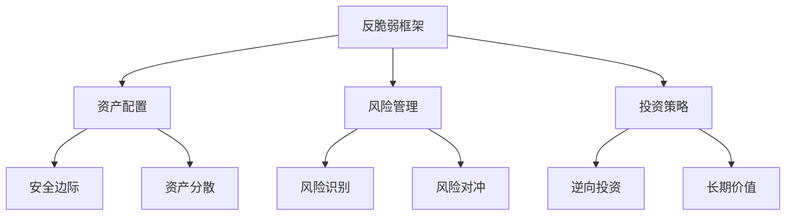

                 


# 芒格的"反脆弱"概念在投资组合构建中的应用

> 关键词：反脆弱, 投资组合, 芒格投资理念, 资产配置, 风险管理, 投资策略, 数学模型

> 摘要：本文深入探讨了芒格的“反脆弱”概念在投资组合构建中的应用，通过系统化的分析和数学模型的构建，结合实际案例，详细阐述了如何在投资组合中应用反脆弱原则，以实现长期稳健的投资收益。文章从理论基础到实践应用，层层展开，为投资者提供了科学的投资策略和风险管理方法。

---

# 第1章: 反脆弱概念的背景与基础

## 1.1 反脆弱概念的起源与发展

### 1.1.1 反脆弱的定义与核心思想
反脆弱是指系统在面对压力、冲击或不确定性时，不仅能够存活，还能通过适应和优化变得更加强大。这一概念由 Nassim Taleb 在《反脆弱》一书中首次提出，强调在波动性和不确定性中寻找机会。

### 1.1.2 芒格的投资理念与反脆弱的联系
芒格作为巴菲特的长期合作伙伴，其投资理念强调“安全边际”和“长期价值”，这与反脆弱的核心思想不谋而合。芒格的投资策略注重在市场波动中寻找被低估的机会，并通过分散投资降低风险。

### 1.1.3 反脆弱在投资领域的应用前景
在投资领域，反脆弱概念为投资组合的构建提供了新的思路。通过识别和投资于具有反脆弱特性的资产或企业，投资者可以在市场波动中获得超额收益，同时降低组合的整体风险。

## 1.2 芒格的投资哲学与反脆弱原则

### 1.2.1 芒格的投资哲学概述
芒格的投资哲学强调“逆向思考”和“安全边际”。他认为，投资者应避免盲目跟随市场趋势，而是应该在市场恐慌时寻找优质资产，同时确保投资的安全性。

### 1.2.2 反脆弱原则在芒格投资策略中的体现
芒格的投资策略中蕴含了反脆弱的思维方式。例如，他倾向于投资那些在经济下行周期中表现稳定的公司，这些公司在市场波动中不仅能够生存，还能通过低成本扩张实现增长。

### 1.2.3 反脆弱与投资组合构建的结合
芒格的反脆弱投资理念为投资组合的构建提供了指导原则。通过合理配置具有反脆弱特性的资产，投资者可以在不同市场环境下保持组合的稳健性和增长性。

## 1.3 本章小结

### 1.3.1 反脆弱概念的核心要点
- 反脆弱是指系统在面对压力时能够变得更强大。
- 芒格的投资理念与反脆弱原则具有高度一致性。

### 1.3.2 芒格投资哲学对反脆弱的启示
- 芒格强调安全边际和逆向投资，这些理念与反脆弱的核心思想一致。
- 反脆弱投资策略可以帮助投资者在市场波动中获得超额收益。

### 1.3.3 本书的研究目标与意义
- 探讨如何将反脆弱概念应用于投资组合构建。
- 提供基于芒格投资理念的反脆弱投资策略。

---

# 第2章: 反脆弱理论的深入分析

## 2.1 反脆弱理论的核心原理

### 2.1.1 反脆弱的定义与特征
反脆弱的核心特征包括：
1. **抗脆弱性**：系统在压力下不仅能够生存，还能增强。
2. **波动性利用**：通过波动性获取超额收益。
3. **非线性收益**：收益与风险之间的关系是非线性的。

### 2.1.2 反脆弱与脆弱、强韧性的对比分析
| 特性       | 脆弱性       | 强韧性       | 反脆弱性      |
|------------|--------------|--------------|---------------|
| 反应方式   | 压力导致崩溃 | 压力下维持稳定 | 压力下变得更强大 |
| 适用场景   | 稳定环境     | 中等波动环境 | 高波动环境     |

### 2.1.3 反脆弱的数学模型与概率论基础
反脆弱的数学模型可以通过概率论和统计学来描述。例如，考虑资产的收益分布，反脆弱资产在极端事件发生时的收益表现优于其他资产。

$$ R_{antifragile} = \max(R_{average} + k \times \sigma, 0) $$

其中，$R_{antifragile}$ 表示反脆弱资产的收益，$R_{average}$ 是平均收益，$\sigma$ 是收益的标准差，$k$ 是一个常数。

---

## 2.2 反脆弱在投资中的应用

### 2.2.1 投资组合中的反脆弱策略
反脆弱投资策略强调在投资组合中配置那些在市场下跌时能够表现稳定的资产。例如，配置债券、黄金等避险资产可以在市场波动中提供保护。

### 2.2.2 反脆弱资产的选择标准
- 资产在市场下跌时具有抗跌性。
- 资产在市场上涨时能够跑赢市场。
- 资产具有较高的安全边际。

### 2.2.3 反脆弱与风险管理的结合
反脆弱投资策略与风险管理密切相关。通过合理配置资产，投资者可以在市场波动中降低组合的总体风险，同时抓住市场波动带来的机会。

## 2.3 芒格反脆弱理念的系统化框架

### 2.3.1 芒格反脆弱框架的核心要素
- **安全边际**：确保投资的安全性。
- **逆向思维**：在市场恐慌时寻找机会。
- **长期价值**：投资于具有长期竞争优势的企业。

### 2.3.2 反脆弱框架的层次结构
反脆弱框架的层次结构可以用以下类图表示：



### 2.3.3 反脆弱框架的实体关系图（ER图）
以下是反脆弱框架的实体关系图：

```mermaid
erd
    章节标题：反脆弱框架的实体关系图
    title 反脆弱框架的实体关系图

    安全边际 --|> 资产配置
    资产分散 --|> 资产配置
    风险识别 --|> 风险管理
    风险对冲 --|> 风险管理
    逆向投资 --|> 投资策略
    长期价值 --|> 投资策略
```

## 2.4 本章小结

### 2.4.1 反脆弱理论的核心要点
- 反脆弱是一种在压力下能够变得更强大的特性。
- 反脆弱在投资中的应用需要结合风险管理。

### 2.4.2 芒格反脆弱框架的系统化分析
- 芒格反脆弱框架的核心要素包括安全边际、逆向思维和长期价值。
- 系统化框架可以通过类图和ER图进行展示。

### 2.4.3 本章内容的总结与展望
- 本章总结了反脆弱理论的核心思想和芒格反脆弱框架的核心要素。
- 下一章将探讨投资组合构建中的反脆弱策略。

---

# 第3章: 投资组合构建中的反脆弱策略

## 3.1 投资组合构建的基本原理

### 3.1.1 投资组合构建的定义与目标
投资组合构建是指通过合理配置不同资产，以实现投资目标的过程。目标通常包括最大化收益、最小化风险等。

### 3.1.2 投资组合的风险与收益平衡
投资组合的风险与收益之间存在权衡关系。通过合理的资产配置，投资者可以在风险和收益之间找到平衡点。

### 3.1.3 资产配置的基本原则
- **分散投资**：通过配置不同类型的资产降低风险。
- **长期投资**：注重资产的长期价值，避免短期波动的影响。

## 3.2 反脆弱策略在投资组合中的应用

### 3.2.1 资产配置的反脆弱优化
通过优化资产配置，投资者可以构建一个具有反脆弱特性的投资组合。例如，配置一定比例的债券和黄金可以增强组合的反脆弱性。

### 3.2.2 安全边际的反脆弱投资策略
安全边际是反脆弱投资策略的核心要素。通过选择具有较高安全边际的资产，投资者可以在市场波动中降低风险。

### 3.2.3 反脆弱资产的筛选与权重
反脆弱资产的筛选需要考虑资产的抗跌性和成长性。例如，配置具有强大护城河的优质股票可以增强组合的反脆弱性。

## 3.3 数学模型与算法实现

### 3.3.1 反脆弱投资组合的数学模型
反脆弱投资组合的数学模型可以通过以下公式表示：

$$ \text{收益} = \sum_{i=1}^{n} w_i \times R_i $$

其中，$w_i$ 是第 $i$ 种资产的权重，$R_i$ 是第 $i$ 种资产的收益。

### 3.3.2 基于反脆弱的资产配置算法
以下是基于反脆弱的资产配置算法：

```python
def antifragile_portfolio_allocation(assets, risks):
    # 输入：assets 是资产列表，risks 是资产的风险评分
    # 输出：优化后的资产配置权重
    # 算法实现：通过反脆弱原则优化资产配置
    pass
```

### 3.3.3 算法实现与代码示例
以下是一个简单的反脆弱投资组合构建的代码示例：

```python
import numpy as np
import pandas as pd

def calculate_antifragile_weights(assets, returns):
    # 计算反脆弱权重
    n = len(assets)
    weights = np.zeros(n)
    # 简单实现：将权重分配给具有最低风险的资产
    min_risk_assets = assets[returns.std().sort_values(ascending=True).index[:int(n/2)]]
    weights[min_risk_assets] = 1 / len(min_risk_assets)
    return weights

# 示例数据
assets = ['股票', '债券', '黄金']
returns = pd.DataFrame({
    '股票': [0.1, -0.05, 0.08],
    '债券': [0.03, 0.02, 0.01],
    '黄金': [0.05, -0.02, 0.04]
})

# 计算权重
weights = calculate_antifragile_weights(assets, returns)
print("反脆弱权重:", weights)
```

---

## 3.3 本章小结

### 3.3.1 反脆弱策略的核心要点
- 反脆弱投资策略强调在投资组合中配置具有反脆弱特性的资产。
- 通过优化资产配置，投资者可以在市场波动中降低风险并获取超额收益。

### 3.3.2 投资组合构建的系统化框架
- 系统化框架包括资产配置、风险管理、投资策略三个核心要素。
- 通过数学模型和算法优化，可以实现反脆弱投资组合的科学构建。

### 3.3.3 本章内容的总结与展望
- 本章总结了反脆弱策略在投资组合构建中的应用。
- 下一章将探讨实际案例中的反脆弱投资策略应用。

---

# 总结

本文从反脆弱概念的背景与基础出发，深入分析了反脆弱理论的核心原理，结合芒格的投资理念，探讨了投资组合构建中的反脆弱策略。通过系统化的分析和数学模型的构建，本文为投资者提供了科学的投资策略和风险管理方法。未来的研究可以进一步探索反脆弱在不同市场环境中的应用，以及如何通过技术创新优化反脆弱投资策略。

