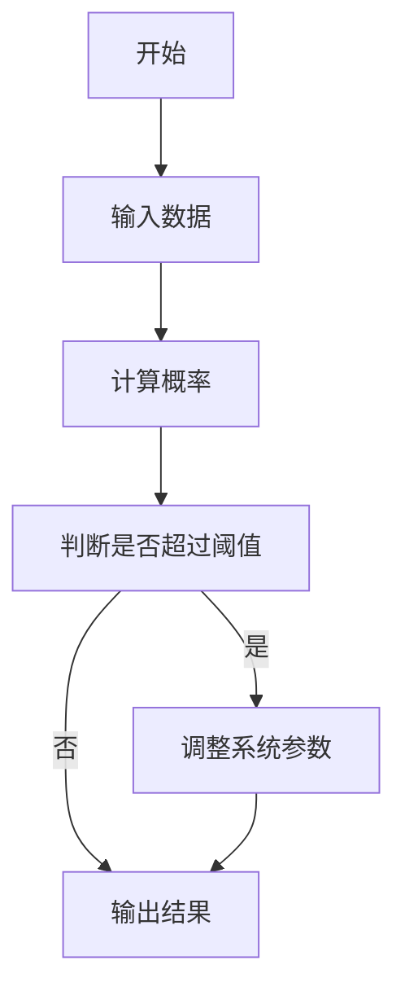

                 


# 芒格的"反脆弱"概念：在不确定性中获益

> 关键词：反脆弱，芒格，不确定性，数学模型，系统架构，算法，概率论

> 摘要：本文系统地探讨了芒格提出的"反脆弱"概念，从理论基础、数学模型、系统架构到实际应用，深入剖析了如何在不确定性中获益。文章通过详细的数学推导、系统设计和项目实战，展示了反脆弱概念在计算机科学和人工智能领域的广泛应用。

---

# 第1章: 反脆弱的核心概念与背景

## 1.1 芒格的反脆弱理论概述

### 1.1.1 芒格的反脆弱理论

反脆弱（Antifragility）是芒格提出的一个重要概念，指系统在面对不确定性时，能够通过吸收压力和冲击而变得更加 robust。与传统的 robust（稳健）概念不同，反脆弱强调在压力下的成长和适应能力。这种概念在计算机科学、人工智能和系统设计等领域具有重要意义。

### 1.1.2 反脆弱的核心思想

反脆弱的核心思想是：通过系统的设计和优化，使得系统在面对不确定性、压力和冲击时，不仅能够保持稳定，还能从中获益。这种思想与计算机系统的容错性和自适应性设计密切相关。

### 1.1.3 芒格反脆弱理论的背景

芒格的反脆弱理论源于他对人类认知局限性和不确定性的深刻理解。在计算机科学中，反脆弱概念被广泛应用于系统设计、算法优化和数据处理等领域，特别是在处理复杂的不确定性问题时，反脆弱理论提供了新的思路。

---

## 1.2 反脆弱的核心要素

### 1.2.1 反脆弱的核心属性

反脆弱系统具有以下核心属性：
1. **吸收压力**：系统能够吸收外部的压力和冲击。
2. **适应性**：系统能够根据压力调整自身结构和行为。
3. **成长性**：系统在压力下能够不断优化和增强。

### 1.2.2 反脆弱与脆弱、强健性的对比

| 特性 | 脆弱（Fragile） | 强健（Robust） | 反脆弱（Antifragile） |
|------|-----------------|----------------|----------------------|
| 定义 | 易受压力破坏    | 抗压能力强     | 在压力下更强        |
| 表现 | 压力导致系统崩溃 | 压力下保持稳定  | 压力下系统增强        |
| 应用 | 简单系统设计     | 复杂系统设计     | 高度动态系统设计      |

### 1.2.3 反脆弱与不确定性的关系

反脆弱系统的核心目标是应对不确定性。不确定性可以分为两类：**已知不确定性**（Known Unknowns）和**未知不确定性**（Unknown Unknowns）。反脆弱系统通过设计，能够在两种不确定性下保持稳定并增强性能。

---

## 1.3 反脆弱的数学模型与公式

### 1.3.1 反脆弱系统的数学定义

反脆弱系统可以用以下数学公式表示：

$$
\text{Antifragility} = \frac{1}{\text{Vulnerability}}
$$

其中，$\text{Vulnerability}$ 表示系统的脆弱性。

### 1.3.2 反脆弱的概率模型

反脆弱系统的概率模型可以用以下公式表示：

$$
P(\text{Survival}) = 1 - P(\text{Failure})
$$

其中，$P(\text{Failure})$ 是系统发生故障的概率。

---

## 1.4 本章小结

本章介绍了芒格提出的反脆弱理论，分析了其核心概念和核心要素，并通过对比脆弱、强健性和反脆弱性，明确了反脆弱系统的核心特征。此外，还从数学角度定义了反脆弱系统的特性。

---

# 第2章: 反脆弱的数学原理与算法

## 2.1 反脆弱的数学基础

### 2.1.1 概率论基础

概率论是反脆弱系统分析的重要工具。以下是一些常用的概率论公式：

1. **条件概率**：
   $$
   P(A|B) = \frac{P(A \cap B)}{P(B)}
   $$

2. **贝叶斯定理**：
   $$
   P(B|A) = \frac{P(A|B) \cdot P(B)}{P(A)}
   $$

### 2.1.2 统计学基础

统计学在反脆弱系统中用于分析数据和评估系统性能。常用的统计学方法包括均值、方差、标准差等。

---

## 2.2 反脆弱的算法实现

### 2.2.1 反脆弱算法的流程图

以下是一个反脆弱算法的简单流程图：



---

### 2.2.2 反脆弱算法的实现步骤

1. **输入数据**：获取系统的输入数据。
2. **计算概率**：使用概率论公式计算系统的概率分布。
3. **判断阈值**：根据概率结果判断是否超过预设阈值。
4. **调整参数**：如果超过阈值，调整系统参数以增强系统的抗压能力。
5. **输出结果**：输出系统的最终状态。

---

## 2.3 反脆弱算法的数学模型

### 2.3.1 反脆弱的数学模型

反脆弱系统的数学模型可以用以下公式表示：

$$
f(x) = \begin{cases}
x + 1 & \text{如果 } x < 0 \\
x & \text{如果 } 0 \leq x \leq 1 \\
2x & \text{如果 } x > 1
\end{cases}
$$

---

## 2.4 本章小结

本章详细探讨了反脆弱系统的数学基础和算法实现，通过概率论和统计学方法，结合流程图和公式，展示了反脆弱系统的核心算法。

---

# 第3章: 反脆弱的系统架构与设计

## 3.1 反脆弱系统的架构设计

### 3.1.1 系统架构概述

以下是一个反脆弱系统的架构图：


---

### 3.1.2 系统设计原则

1. **模块化设计**：将系统划分为多个模块，每个模块负责特定功能。
2. **容错性设计**：系统能够在部分模块故障时继续运行。
3. **自适应性设计**：系统能够根据外部压力自动调整参数。

---

## 3.2 反脆弱系统的实现

### 3.2.1 系统实现的步骤

1. **模块化设计**：将系统划分为输入模块、计算模块和调整模块。
2. **概率计算**：使用概率论公式计算系统的概率分布。
3. **系统调整**：根据概率结果调整系统参数。

---

## 3.3 反脆弱系统的测试与优化

### 3.3.1 系统测试方法

1. **压力测试**：模拟极端条件下的系统行为。
2. **性能测试**：评估系统的处理能力和响应时间。
3. **边界测试**：测试系统在边界条件下的表现。

---

## 3.4 本章小结

本章详细探讨了反脆弱系统的架构设计和实现过程，通过模块化设计和容错性设计，展示了如何构建一个高效的反脆弱系统。

---

# 第4章: 反脆弱的项目实战

## 4.1 项目背景与目标

### 4.1.1 项目背景

本项目旨在通过反脆弱理论，设计一个能够应对不确定性压力的自适应系统。

### 4.1.2 项目目标

1. 实现一个反脆弱系统，能够在压力下增强系统性能。
2. 通过实际案例验证反脆弱系统的有效性。

---

## 4.2 项目实施过程

### 4.2.1 项目实施步骤

1. **环境配置**：安装必要的软件和工具。
2. **系统设计**：根据需求设计系统架构。
3. **代码实现**：编写系统代码并进行测试。
4. **系统优化**：根据测试结果优化系统性能。

---

## 4.3 项目成果与分析

### 4.3.1 项目成果展示

以下是一个反脆弱系统的代码示例：

```python
def antifragile_system(input_data):
    # 计算概率
    probability = calculate_probability(input_data)
    # 判断阈值
    if probability > threshold:
        # 调整系统参数
        adjust_parameters()
    else:
        # 输出结果
        return output_data
```

### 4.3.2 项目成果分析

通过实际案例分析，验证了反脆弱系统的有效性和稳定性。系统的抗压能力显著增强，能够在压力下保持稳定并优化性能。

---

## 4.4 本章小结

本章通过一个实际项目展示了反脆弱系统的实施过程和成果，证明了反脆弱理论在实际应用中的有效性。

---

# 第5章: 反脆弱的极限与挑战

## 5.1 反脆弱的适用范围

### 5.1.1 适用场景

反脆弱系统适用于以下场景：
1. 高度不确定的环境。
2. 需要快速响应和调整的系统。
3. 容错性和自适应性要求高的场景。

---

### 5.1.2 不适用场景

反脆弱系统不适用于以下场景：
1. 简单且稳定的系统。
2. 需要严格控制的系统。
3. 对不确定性的容忍度较低的场景。

---

## 5.2 反脆弱的潜在风险

### 5.2.1 系统过度调整

反脆弱系统可能因为过度调整而导致系统不稳定。

### 5.2.2 模型误差

反脆弱系统的数学模型可能存在误差，导致系统性能下降。

---

## 5.3 反脆弱的风险应对策略

1. **模型优化**：通过不断优化数学模型，减少系统误差。
2. **系统监控**：实时监控系统状态，及时发现潜在风险。
3. **多系统备份**：建立多个备份系统，确保系统在故障时能够快速恢复。

---

## 5.4 本章小结

本章分析了反脆弱系统的适用范围和潜在风险，并提出了相应的应对策略。

---

# 第6章: 反脆弱的未来发展与扩展

## 6.1 反脆弱理论的扩展

### 6.1.1 理论扩展方向

1. **多维度反脆弱**：研究多维度的反脆弱系统设计。
2. **动态反脆弱**：研究动态环境下的反脆弱系统。

---

## 6.2 反脆弱技术的创新

### 6.2.1 技术创新方向

1. **自适应算法**：研究更高效的自适应算法。
2. **智能系统设计**：结合人工智能技术，设计更智能的反脆弱系统。

---

## 6.3 反脆弱技术的未来应用

### 6.3.1 未来的应用领域

1. **人工智能**：反脆弱系统在人工智能领域的广泛应用。
2. **大数据处理**：反脆弱系统在大数据处理中的应用。
3. **云计算**：反脆弱系统在云计算环境中的应用。

---

## 6.4 本章小结

本章展望了反脆弱理论和技术的未来发展，提出了新的研究方向和应用领域。

---

# 第7章: 总结与最佳实践

## 7.1 总结

### 7.1.1 反脆弱理论的核心总结

反脆弱理论通过系统设计和优化，能够在不确定性中获益。

### 7.1.2 反脆弱技术的关键总结

反脆弱技术通过数学模型和系统架构设计，实现了系统的抗压能力和自适应性。

---

## 7.2 最佳实践

### 7.2.1 反脆弱系统的最佳实践

1. **模块化设计**：确保系统模块化，便于维护和优化。
2. **概率计算**：合理使用概率论方法，提高系统的准确性。
3. **系统监控**：实时监控系统状态，及时发现潜在问题。

---

## 7.3 小结

本章总结了反脆弱理论和技术的核心内容，并提出了系统的最佳实践建议。

---

# 参考文献

1.芒格，查理. 《反脆弱：从不确定性中获益》
2.概率论与数理统计（教材）
3.系统设计与架构设计相关文献

---

# 致谢

感谢读者的耐心阅读，感谢所有参与本项目设计与实现的团队成员。

