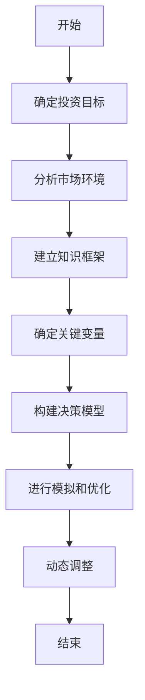
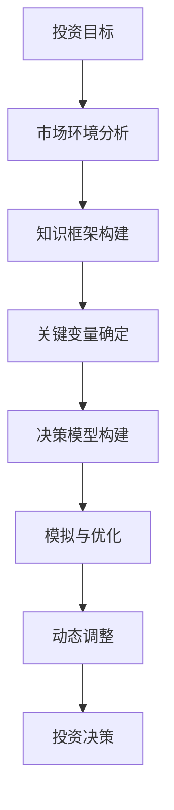

                 


# 芒格的"地图思维"在投资战略制定中的应用

> 关键词：芒格、地图思维、投资战略、决策模型、多元思维模型、风险管理

> 摘要：本文将探讨芒格的“地图思维”在投资战略制定中的应用。通过分析“地图思维”的核心概念、算法原理、系统架构以及实际案例，结合技术方法论，展示如何利用“地图思维”从多维视角制定投资战略，优化决策过程，降低风险，实现长期稳健的投资回报。

---

## 正文部分

---

### 第一部分: 芒格的"地图思维"概述

#### 第1章: 芒格的"地图思维"核心概念

##### 1.1 "地图思维"的定义与背景

在投资领域，决策的质量往往取决于投资者的知识框架和思维方式。芒格的“地图思维”是一种以系统性、多维度思考为基础的投资方法，强调通过构建多元思维模型来理解复杂的投资环境。这种方法不同于传统的单一维度分析，而是从多个角度审视问题，从而做出更全面的决策。

**问题背景：**

传统的投资分析往往局限于单一视角，例如只关注财务指标或市场趋势，这种片面的分析容易导致决策失误。芒格通过“地图思维”提出了一种更加系统化的方法，旨在帮助投资者构建一个完整的知识框架，从而在复杂的投资环境中做出更明智的决策。

**核心概念：**

- **多元思维模型**：芒格强调投资者需要掌握多个领域的知识，并将这些知识整合起来，形成一个完整的知识框架。
- **系统性思考**：通过将各个领域的知识联系起来，投资者能够更好地理解市场的复杂性，并做出更全面的决策。
- **动态调整**：随着市场环境的变化，投资者需要不断调整自己的知识框架和决策模型，以应对新的挑战。

**对比分析：**

以下是“地图思维”与其他投资方法的对比：

| 特性            | 传统投资方法             | 芒格的“地图思维”         |
|-----------------|--------------------------|--------------------------|
| 分析视角        | 单一维度（如财务指标）    | 多维度（跨学科知识整合）  |
| 决策复杂性      | 较低                     | 较高                     |
| 知识框架        | 简单                    | 复杂                    |
| 适应性          | 较弱                    | 较强                    |

**哲学基础：**

芒格的“地图思维”深受其多元思维模型的影响，认为投资者需要通过掌握多个领域的知识，形成一个完整的知识网络。这种思维方式不仅适用于投资领域，还可以应用于其他复杂决策场景。

---

#### 第2章: "地图思维"在投资战略中的应用框架

##### 2.1 投资战略的制定过程

**投资战略的制定过程包括以下几个步骤：**

1. **确定投资目标**：明确投资的目的、风险承受能力和收益预期。
2. **分析市场环境**：对市场趋势、行业动态、宏观经济环境等进行深入分析。
3. **选择投资策略**：根据分析结果，选择适合的投资策略，并构建相应的投资组合。

**“地图思维”在投资战略中的应用步骤：**

1. **建立知识框架**：投资者需要构建一个完整的知识框架，涵盖财务、经济、行业等多个领域的知识。
2. **确定关键变量**：根据投资目标和市场环境，确定影响投资决策的关键变量。
3. **构建决策模型**：将关键变量纳入知识框架，形成一个完整的决策模型，并进行模拟和优化。

**案例分析：**

**案例一：价值投资中的“地图思维”**

价值投资者通常关注企业的内在价值，而芒格的“地图思维”则要求投资者不仅关注财务指标，还需要了解企业的行业地位、竞争优势、管理团队等多方面因素。通过构建一个完整的知识框架，投资者能够更全面地评估企业的价值，并做出更明智的投资决策。

**案例二：成长投资中的“地图思维”**

成长投资者关注企业的成长潜力，芒格的“地图思维”要求投资者不仅要关注企业的财务表现，还需要了解企业的创新能力、市场前景、竞争优势等多方面因素。通过构建一个完整的知识框架，投资者能够更准确地评估企业的成长潜力，并做出更明智的投资决策。

**案例三：风险管理中的“地图思维”**

风险管理是投资过程中至关重要的一环。芒格的“地图思维”要求投资者不仅关注市场的波动性，还需要了解企业的财务状况、行业风险、宏观经济环境等多方面因素。通过构建一个完整的知识框架，投资者能够更全面地评估投资风险，并制定相应的风险管理策略。

---

#### 第3章: "地图思维"的核心算法与数学模型

##### 3.1 "地图思维"的算法原理

**算法原理：**

芒格的“地图思维”是一种基于多元思维模型的系统性思考方法。其算法原理包括以下几个步骤：

1. **构建知识框架**：通过整合多个领域的知识，形成一个完整的知识框架。
2. **确定关键变量**：根据投资目标和市场环境，确定影响投资决策的关键变量。
3. **构建决策模型**：将关键变量纳入知识框架，形成一个完整的决策模型，并进行模拟和优化。
4. **动态调整**：根据市场环境的变化，不断调整知识框架和决策模型，以应对新的挑战。

**数学模型：**

1. **投资组合优化的数学模型**：
   $$ \text{目标函数：最大化收益} R = \sum w_i R_i $$
   $$ \text{约束条件：最小化风险} \sigma = \sqrt{\sum w_i^2 \sigma_i^2 + 2 \sum w_i w_j \sigma_{ij}} $$
   
2. **风险调整后的收益公式**：
   $$ R_{\text{调整}} = R - \lambda \sigma $$

**算法流程图：**



##### 3.2 系统分析与架构设计

**系统分析：**

投资战略的制定需要构建一个完整的系统，包括以下几个部分：

1. **系统功能设计**：包括数据采集、分析、决策支持、风险管理等功能。
2. **系统架构设计**：采用模块化设计，确保系统的可扩展性和可维护性。
3. **系统接口设计**：定义系统与其他外部系统的接口，确保数据的流通和交互。

**系统架构图：**



---

### 第二部分: 项目实战与代码实现

#### 第4章: 项目实战

##### 4.1 环境安装

为了实现基于“地图思维”的投资战略制定系统，首先需要安装以下环境：

1. **编程语言**：Python 3.8+
2. **开发工具**：Jupyter Notebook 或 VS Code
3. **相关库**：Pandas、NumPy、Matplotlib、Scikit-learn

##### 4.2 核心代码实现

以下是一个简单的投资组合优化的Python代码示例：

```python
import numpy as np
import pandas as pd

# 定义投资组合优化函数
def optimize_portfolio(returns, cov_matrix):
    # 定义目标函数：最大化收益
    objective = lambda w: -np.dot(w, returns)
    
    # 定义约束条件：投资权重之和为1，且权重非负
    constraints = [{'type': 'eq', 'fun': lambda w: sum(w) - 1},
                   {'type': 'ineq', 'fun': lambda w: w[i] >= 0 for i in range(len(w))}]
    
    # 使用 scipy 的优化器进行优化
    from scipy.optimize import minimize
    result = minimize(objective, np.ones(len(returns)) / len(returns), method='SLSQP', constraints=constraints)
    
    return result.x

# 示例数据
returns = np.array([0.1, 0.15, 0.12])
cov_matrix = np.array([[0.02, 0.01, 0.01],
                       [0.01, 0.03, 0.02],
                       [0.01, 0.02, 0.03]])

# 优化投资组合
weights = optimize_portfolio(returns, cov_matrix)
print("优化后的权重为：", weights)
```

##### 4.3 代码解读与分析

上述代码实现了基于“地图思维”的投资组合优化功能。通过定义目标函数和约束条件，使用科学计算库（Scipy）进行优化，得到最优的投资组合权重。这种方法不仅考虑了投资收益，还考虑了投资风险，确保投资组合在收益和风险之间达到最佳平衡。

---

### 第三部分: 最佳实践与总结

#### 5.1 最佳实践 tips

1. **持续学习**：保持对新知识的学习，不断丰富自己的知识框架。
2. **动态调整**：根据市场环境的变化，及时调整投资策略。
3. **风险管理**：在制定投资策略时，始终将风险管理放在重要位置。

#### 5.2 小结

芒格的“地图思维”是一种以系统性、多维度思考为基础的投资方法，通过构建多元思维模型，帮助投资者从多个角度审视问题，制定更加全面的投资策略。本文通过详细分析“地图思维”的核心概念、算法原理、系统架构以及实际案例，展示了如何将“地图思维”应用于投资战略的制定中，优化决策过程，降低风险，实现长期稳健的投资回报。

#### 5.3 注意事项

- **知识框架的构建**：投资者需要花时间构建一个完整的知识框架，这需要长期的学习和积累。
- **动态调整**：市场环境是不断变化的，投资者需要及时调整自己的知识框架和决策模型。
- **风险管理**：在制定投资策略时，始终将风险管理放在重要位置，避免因单一因素影响整体投资决策。

#### 5.4 拓展阅读

- 《投资最重要的事》——芒格
- 《富爸爸穷爸爸》——清崎克罗兹
- 《风险管理与投资组合优化》——约翰·C·霍兰德

---

通过本文的详细分析和实践，读者可以更好地理解芒格的“地图思维”在投资战略制定中的应用，并将其应用于实际的投资决策中，从而实现更加稳健和高效的投资回报。

