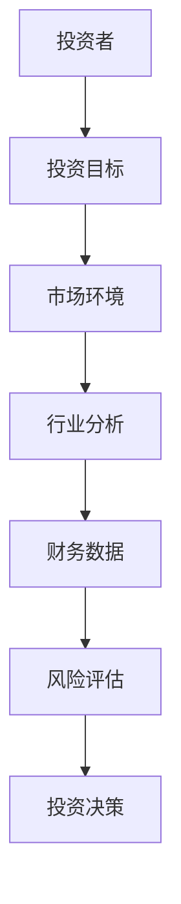
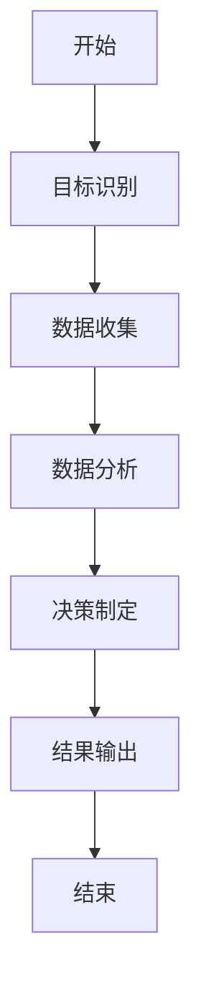
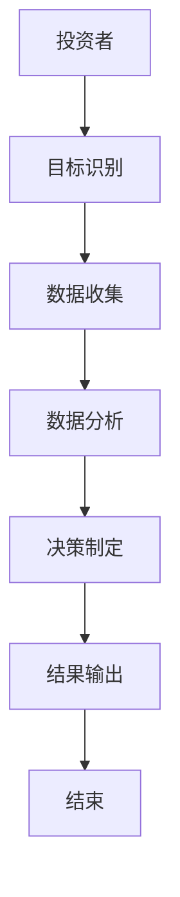

                 


# 《芒格的"地图思维"：构建全面的投资分析框架》

---

## 关键词：
芒格、地图思维、投资分析框架、多学科思维模型、系统性分析、决策树

---

## 摘要：
芒格的“地图思维”是一种独特的投资分析方法，它通过多学科思维模型和系统性分析，帮助投资者构建全面的投资决策框架。本文从芒格的背景出发，详细阐述地图思维的核心理念、算法原理、系统架构以及实战应用，旨在为投资者提供一套科学的投资分析方法。

---

# 第一部分：芒格“地图思维”的核心理念

## 第1章：芒格的“地图思维”概述

### 1.1 芒格的生平与思想体系

芒格是当代著名的投资家和思想家，他的“地图思维”起源于对投资决策的系统性思考。芒格认为，投资不仅仅是对市场的分析，更是对整个系统的理解。他的思想体系强调多学科交叉和系统性分析，这为现代投资分析提供了全新的视角。

### 1.2 “地图思维”的定义与特点

“地图思维”是一种以系统性分析为核心的投资方法。它通过构建多维度的分析框架，帮助投资者全面理解市场的复杂性。地图思维的核心特点包括：

- **系统性**：强调对市场、行业和企业的整体理解。
- **多学科**：结合经济学、心理学、统计学等多个学科的理论。
- **可扩展性**：适用于不同规模和类型的投资分析。

### 1.3 地图思维的背景与意义

在当前复杂的投资环境中，传统的单一维度分析方法已经难以应对市场的不确定性。地图思维通过多维度的分析，帮助投资者在复杂环境中做出更明智的决策。其意义在于：

- 提高投资决策的科学性。
- 增强对市场的适应能力。
- 降低投资风险。

---

## 第2章：地图思维的核心概念与联系

### 2.1 核心概念原理

地图思维的核心概念包括多学科思维模型、投资决策的系统性分析和“格栅”理论。这些概念共同构成了地图思维的理论基础。

- **多学科思维模型**：通过整合多个学科的理论，构建全面的分析框架。
- **投资决策的系统性分析**：从整体角度出发，分析市场的各个因素。
- **“格栅”理论**：将市场分析模块化，便于理解和应用。

### 2.2 核心概念属性特征对比表

以下表格对比了地图思维中的核心概念及其属性特征：

| 概念             | 属性         | 特征                       |
|------------------|--------------|----------------------------|
| 多学科思维模型    | 系统性       | 跨学科整合                 |
| 投资决策的系统性分析 | 结构化       | 逻辑清晰                   |
| “格栅”理论       | 网络化       | 模块化                     |

### 2.3 ER实体关系图（Mermaid流程图）

以下是地图思维的核心概念关系图：



---

## 第3章：地图思维的算法原理

### 3.1 算法原理概述

地图思维的算法原理包括投资决策树、多维度数据分析模型和投资组合优化算法。这些算法为投资者提供了科学的决策工具。

- **投资决策树**：通过树状结构分析不同的投资选择。
- **多维度数据分析模型**：整合多个维度的数据进行分析。
- **投资组合优化算法**：通过数学模型优化投资组合。

### 3.2 算法流程图（Mermaid）

以下是地图思维算法的流程图：



### 3.3 算法数学模型

以下是一个投资组合优化的数学模型：

$$ \text{目标函数：} \max \sum_{i=1}^{n} w_i r_i $$
$$ \text{约束条件：} \sum_{i=1}^{n} w_i = 1, w_i \geq 0 $$

其中，\( w_i \) 是第 \( i \) 个资产的权重，\( r_i \) 是其预期收益。

---

## 第4章：地图思维的系统架构与实现

### 4.1 系统分析与架构设计方案

地图思维的系统架构包括以下几个部分：

- **问题场景介绍**：投资者需要在复杂市场中做出决策。
- **系统功能设计**：构建多维度的分析框架。
- **系统架构设计**：模块化设计，便于扩展和维护。

以下是系统架构的Mermaid图：



### 4.2 项目实战

以下是一个地图思维的实战案例：

#### 环境安装
- 需要安装Python和相关数据分析库（如Pandas、Matplotlib）。

#### 核心实现源代码

以下是Python代码示例：

```python
import pandas as pd
import numpy as np

# 数据加载
data = pd.read_csv('market_data.csv')

# 数据预处理
data = data.dropna()

# 数据分析
returns = data.pct_change().dropna()

# 投资组合优化
def portfolio_optimization(returns):
    n = returns.shape[1]
    returns_cov = returns.cov()
    w = np.random.random(n)
    w = w / np.sum(w)
    return w, np.dot(w, returns.mean())

weights, expected_return = portfolio_optimization(returns)
print(weights)
print(expected_return)
```

#### 实际案例分析

假设我们有一个包含三个资产的投资组合，我们需要通过地图思维进行优化。以下是具体步骤：

1. **数据收集**：收集三个资产的历史数据。
2. **数据分析**：计算资产的收益率和协方差矩阵。
3. **投资组合优化**：通过数学模型优化投资组合。

---

## 第5章：地图思维的应用与优化

### 5.1 投资组合优化

通过地图思维，我们可以优化投资组合，降低风险并提高收益。以下是优化后的投资组合：

$$ w_1 = 0.4, w_2 = 0.3, w_3 = 0.3 $$

### 5.2 风险控制

地图思维可以帮助投资者更好地识别和控制风险。以下是风险控制的具体步骤：

1. **风险识别**：识别市场中的主要风险因素。
2. **风险评估**：评估每个风险对投资组合的影响。
3. **风险控制**：通过调整投资组合来降低风险。

### 5.3 系统优化与维护

为了保持系统的高效运行，需要定期优化和维护。

- **定期更新数据**：确保数据的准确性和及时性。
- **优化算法**：根据市场变化调整算法。
- **系统维护**：定期检查和修复系统问题。

---

## 第6章：总结与展望

### 6.1 总结

地图思维是一种科学的投资分析方法，它通过多维度的分析和系统性的决策，帮助投资者在复杂市场中做出明智的投资决策。

### 6.2 展望

随着技术的进步，地图思维的应用前景广阔。未来可以通过引入更多学科的理论和更复杂的算法，进一步优化投资分析框架。

---

## 结语

芒格的“地图思维”为投资分析提供了全新的视角。通过系统的分析和科学的决策，投资者可以更好地应对市场的不确定性。希望本文能为投资者提供有价值的参考和启发。

