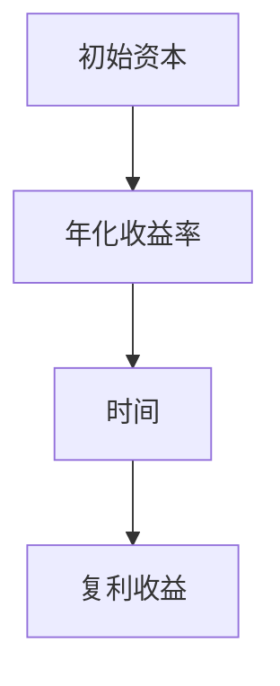
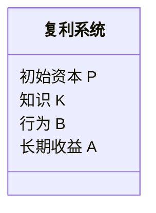
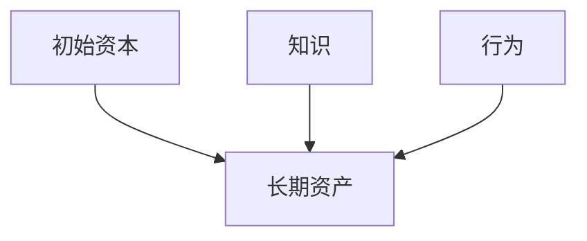
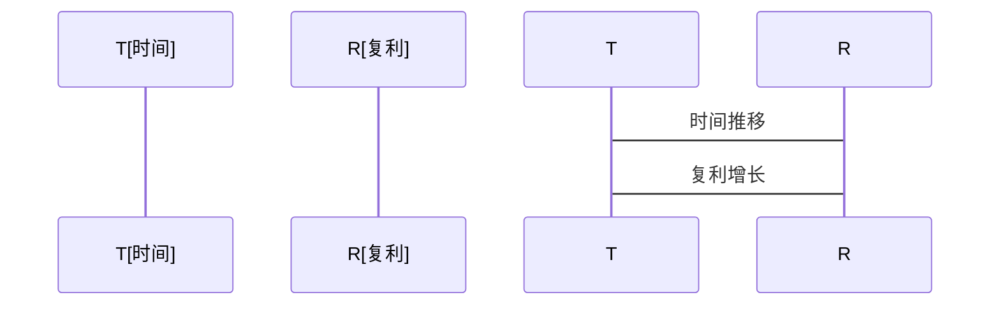
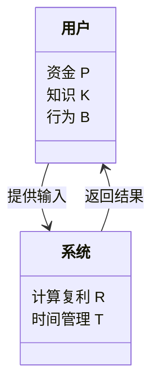
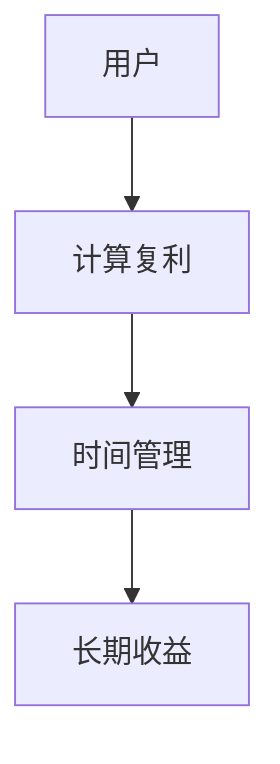

                 


# 芒格的"复利思维"：时间是最大的盟友

## 关键词：芒格、复利思维、时间管理、投资策略、知识复利、系统架构

## 摘要：  
芒格的复利思维是一种以时间为核心，通过积累和优化实现长期价值增长的思维方式。本文将从复利思维的定义、核心原理、算法实现、系统架构、项目实战等多个角度，详细分析复利思维在投资、个人成长和时间管理中的应用，并结合实际案例，探讨如何通过复利思维实现长期价值最大化。

---

## 第一部分：复利思维的定义与背景

### 第1章：复利思维的定义与背景

#### 1.1 复利思维的定义  
复利思维是一种以时间为核心，通过持续优化和积累实现指数级增长的思维方式。它强调通过时间和资源的最优配置，将简单的行为转化为长期的复利收益。  

- **核心概念**：  
  - 复利：简单来说，就是“钱生钱”的过程，通过不断积累和优化实现指数级增长。  
  - 时间：复利的基石，时间越长，复利效果越显著。  
  - 知识：复利的加速器，知识的积累和优化可以显著提升复利效率。  

- **与传统线性思维的对比**：  
  - 线性思维：简单线性关系，结果与投入呈正比例增长。  
  - 复利思维：结果与投入呈指数级增长，时间是关键变量。  

- **哲学基础**：  
  芒格的复利思维源于对时间、知识和行为的深刻理解。他认为，复利思维的核心在于通过持续优化和积累，将简单的行为转化为长期的复利收益。  

---

#### 1.2 复利思维的重要性  

- **在投资中的作用**：  
  复利思维是投资的核心理念，通过长期持有优质资产，实现财富的指数级增长。  

- **在个人成长中的意义**：  
  复利思维强调通过持续学习和优化，将知识和技能转化为长期的价值积累。  

- **对时间管理的影响**：  
  复利思维要求我们高效利用时间，通过时间的杠杆效应，将简单的行为转化为长期的成功。  

---

#### 1.3 复利思维的核心要素  

- **时间**：复利的基石，时间越长，复利效果越显著。  
- **知识**：复利的加速器，知识的积累和优化可以显著提升复利效率。  
- **行为**：复利的催化剂，持续的行为优化是复利思维的核心动力。  

---

## 第二部分：复利思维的核心原理

### 第2章：复利思维的核心原理

#### 2.1 复利的数学模型  

- **复利计算公式**：  
  $$A = P(1 + r)^n$$  
  其中，$P$ 是初始资本，$r$ 是年化收益率，$n$ 是时间（年）。  

- **复利与时间的关系图解（Mermaid流程图）**：  


---

#### 2.2 复利思维的系统架构  

- **系统目标**：最大化长期价值。  
- **系统输入**：初始资本、知识、行为。  
- **系统输出**：长期复利收益。  

- **系统架构图（Mermaid类图）**：  


---

#### 2.3 复利思维的实体关系图  

- **实体关系图（Mermaid图）**：  


---

## 第三部分：复利思维的算法实现

### 第3章：复利思维的算法实现

#### 3.1 复利计算的Python实现  

- **基本复利计算代码**：  
```python
def compound_interest(principal, rate, time):
    return principal * (1 + rate) ** time
```

- **代码解释**：  
  该函数计算初始资本在给定年化收益率和时间下的复利收益。  

---

#### 3.2 复利与时间的交互分析  

- **时间对复利的影响（Mermaid序列图）**：  


---

#### 3.3 复利与知识的协同作用  

- **知识复利的数学模型**：  
  $$K = k_1 + k_2 \times t$$  
  其中，$k_1$ 是初始知识量，$k_2$ 是知识积累的速度，$t$ 是时间。  

- **知识复利的系统类图（Mermaid类图）**：  


---

## 第四部分：复利思维的系统设计

### 第4章：复利思维的系统设计

#### 4.1 系统目标与范围  

- **系统目标**：最大化长期价值。  
- **系统范围**：包括投资、学习、时间管理等多个领域。  

---

#### 4.2 系统功能设计  

- **领域模型（Mermaid类图）**：  


---

#### 4.3 系统架构设计  

- **系统架构图（Mermaid架构图）**：  


---

## 第五部分：复利思维的项目实战

### 第5章：复利思维的项目实战

#### 5.1 环境安装  

- **Python环境安装**：  
  需要安装Python 3.8及以上版本。  

---

#### 5.2 系统核心实现源代码  

- **复利计算代码**：  
```python
def compound_interest(principal, rate, time):
    return principal * (1 + rate) ** time
```

- **代码应用解读与分析**：  
  该代码用于计算初始资本在给定年化收益率和时间下的复利收益。  

---

#### 5.3 实际案例分析  

- **案例分析：股票投资**  
  假设初始资本为100元，年化收益率为10%，时间为10年。  
  $$A = 100 \times (1 + 0.1)^{10} = 259.37$$  
  复利收益为159.37元。  

- **案例分析：知识积累**  
  假设初始知识量为100，知识积累速度为每年10%。  
  $$K = 100 + 10 \times t$$  
  5年后，知识量为150。  

---

## 第六部分：复利思维的最佳实践

### 第6章：复利思维的最佳实践

#### 6.1 小结  

- **复利思维的核心**：时间、知识和行为的优化与积累。  
- **复利思维的应用**：投资、学习和时间管理。  

---

#### 6.2 注意事项  

- **避免短期行为**：复利思维强调长期积累，短期波动不影响最终结果。  
- **持续优化**：定期评估和优化目标、策略和行为。  

---

#### 6.3 拓展阅读  

- **推荐书籍**：《穷爸爸富爸爸》、《价值投资》。  
- **推荐博客**：芒格投资思想研究。  

---

通过以上分析和实践，我们可以看到，复利思维是一种以时间为核心，通过持续优化和积累实现长期价值增长的思维方式。在投资、个人成长和时间管理等领域，复利思维都能发挥重要作用。通过本文的分析，我们希望读者能够更好地理解和应用复利思维，实现长期价值的最大化。

