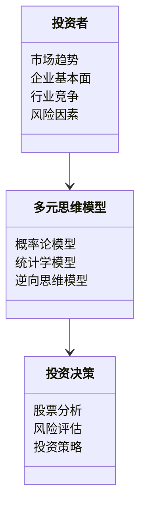
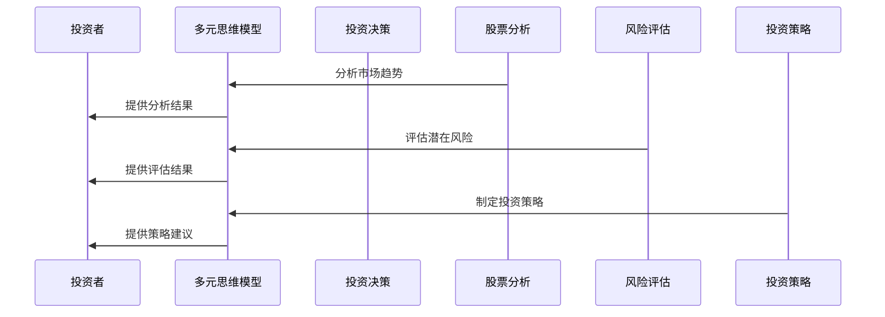

                 


# 《芒格的多元思维方式在投资中的运用》

---

## 关键词：芒格、多元思维模型、投资决策、逆向思维、能力圈、安全边际

---

## 摘要：

本文深入探讨了芒格的多元思维模型在投资决策中的应用。通过分析芒格的核心思想、多元思维模型的核心概念，以及其在实际投资中的应用场景，本文揭示了如何通过跨学科的思维方式来优化投资决策。结合概率论、逆向思维和能力圈等模型，本文详细阐述了多元思维模型的算法原理、系统架构和实际案例，为投资者提供了一套科学的投资方法论。

---

# 第一章：芒格的多元思维模型概述

## 1.1 芒格的生平与思想体系

### 1.1.1 芒格的生平简介

查理·芒格（Charlie Munger）是世界著名投资家、伯克希尔·哈撒韦公司副董事长。他不仅是沃伦·巴菲特（Warren Buffett）的重要合作伙伴，更是全球投资界的思想导师。芒格的职业生涯始于法律领域，后来转向投资，逐渐形成了自己独特的投资哲学。

**关键点：**
- 芒格的多元思维模型源于他对知识的广泛涉猎和跨学科思考。
- 他强调投资不仅仅是对数字的计算，更是对人性、市场和经济规律的理解。

### 1.1.2 芒格的投资哲学与思维特点

芒格的投资哲学以“多元思维模型”为核心，主张通过多个学科的视角来分析问题。他认为，单一的思维方式容易导致决策偏差，而多元思维模型能够帮助投资者更全面地理解市场和企业。

**关键点：**
- 芒格强调“逆向思维”，即从反方向思考问题。
- 他倡导“能力圈”概念，即投资者应专注于自己熟悉的投资领域。

### 1.1.3 多元思维模型的核心理念

多元思维模型是指通过多个学科的视角（如心理学、经济学、数学等）来分析问题，从而做出更全面的决策。这种思维方式的核心在于“大局观”和“交叉验证”。

**关键点：**
- 多元思维模型的核心理念是“知识的综合运用”。
- 通过跨学科的分析，投资者能够更好地识别风险和机会。

---

## 1.2 多元思维模型的定义与特点

### 1.2.1 多元思维模型的定义

多元思维模型是一种通过多个学科的视角来分析问题的方法。它强调知识的广泛涉猎和综合运用，以帮助投资者做出更全面的决策。

**关键点：**
- 多元思维模型不仅仅是对单一学科知识的运用，而是多个学科知识的综合运用。
- 这种思维方式能够帮助投资者避免单一视角的局限性。

### 1.2.2 多元思维模型的核心特点

1. **跨学科性**：多元思维模型的核心在于对多个学科知识的综合运用。
2. **逆向思维**：芒格强调从反方向思考问题，即“逆向思维”。
3. **能力圈**：投资者应专注于自己熟悉的投资领域，避免盲目扩展。

**关键点：**
- 多元思维模型的跨学科性使其能够覆盖更多的投资场景。
- 逆向思维是芒格多元思维模型的重要组成部分。

### 1.2.3 多元思维模型与传统投资方法的区别

传统投资方法通常依赖于单一的分析框架，如财务指标分析或技术分析。而多元思维模型则强调对多个学科知识的综合运用，以帮助投资者做出更全面的决策。

**关键点：**
- 多元思维模型能够帮助投资者更好地理解市场的复杂性。
- 传统投资方法往往忽略了人性和心理因素的影响。

---

## 1.3 多元思维模型在投资中的应用价值

### 1.3.1 多元思维模型的潜在应用场景

1. **股票分析**：通过多个学科的视角来分析企业的内在价值。
2. **风险管理**：通过跨学科的分析来识别潜在风险。
3. **投资决策**：通过多元思维模型来优化投资决策。

**关键点：**
- 多元思维模型在股票分析中的应用尤为突出。
- 通过跨学科的分析，投资者能够更好地识别风险和机会。

### 1.3.2 多元思维模型在投资中的优势

1. **全面性**：多元思维模型能够帮助投资者更全面地理解市场和企业。
2. **准确性**：通过交叉验证，投资者能够做出更准确的投资决策。
3. **长期性**：多元思维模型强调长期投资，而非短期投机。

**关键点：**
- 多元思维模型的优势在于其全面性和准确性。
- 长期性是芒格投资哲学的核心理念之一。

### 1.3.3 多元思维模型应用的挑战与机遇

1. **挑战**：多元思维模型需要投资者具备广泛的知识储备和跨学科的思考能力。
2. **机遇**：通过跨学科的分析，投资者能够发现更多的投资机会。

**关键点：**
- 多元思维模型的应用需要投资者具备广泛的知识储备。
- 跨学科的分析能够帮助投资者发现更多的投资机会。

---

## 1.4 本章小结

本章主要介绍了芒格的多元思维模型的背景、定义和特点，以及其在投资中的应用价值。通过分析芒格的核心思想，我们了解到多元思维模型是一种通过多个学科视角来分析问题的方法，其核心在于跨学科的综合运用和逆向思维的应用。

---

# 第二章：多元思维模型的核心概念与联系

## 2.1 概率论与统计学

### 2.1.1 概率论的基本概念

概率论是多元思维模型的重要组成部分。它通过分析事件发生的可能性来帮助投资者做出更科学的决策。

**关键点：**
- 概率论的核心是分析事件发生的可能性。
- 通过概率分析，投资者能够更好地理解市场的不确定性。

### 2.1.2 统计学在投资中的应用

统计学在投资中的应用主要体现在数据分析和风险评估方面。通过统计分析，投资者能够更好地理解市场的波动性和潜在风险。

**关键点：**
- 统计学在投资中的应用主要体现在数据分析和风险评估。
- 通过统计分析，投资者能够更好地理解市场的波动性。

### 2.1.3 概率论与统计学在多元思维模型中的联系

概率论和统计学是多元思维模型的重要组成部分。通过概率分析和统计分析，投资者能够更好地理解市场的不确定性，并做出更科学的投资决策。

**关键点：**
- 概率论和统计学在多元思维模型中的联系在于它们都帮助投资者理解市场的不确定性。
- 通过概率分析和统计分析，投资者能够做出更科学的投资决策。

---

## 2.2 逆向思维与第二性思维

### 2.2.1 逆向思维的定义与特点

逆向思维是指从反方向思考问题，即“反向思考”。芒格认为，逆向思维是一种非常有效的思维方式，它能够帮助投资者发现市场的潜在机会。

**关键点：**
- 逆向思维的核心在于“反向思考”。
- 通过逆向思维，投资者能够发现市场的潜在机会。

### 2.2.2 第二性思维的定义与特点

第二性思维是指从第二性角度思考问题，即“从结果出发”。芒格认为，第二性思维是一种非常有效的思维方式，它能够帮助投资者更好地理解市场的复杂性。

**关键点：**
- 第二性思维的核心在于“从结果出发”。
- 通过第二性思维，投资者能够更好地理解市场的复杂性。

### 2.2.3 逆向思维与第二性思维在投资中的应用

1. **逆向思维的应用**：通过逆向思维，投资者能够发现市场的潜在机会。
2. **第二性思维的应用**：通过第二性思维，投资者能够更好地理解市场的复杂性。

**关键点：**
- 逆向思维和第二性思维在投资中的应用能够帮助投资者发现更多的投资机会。
- 通过逆向思维和第二性思维，投资者能够更好地理解市场的复杂性。

---

## 2.3 能力圈与安全边际

### 2.3.1 能力圈的定义与特点

能力圈是指投资者对自己熟悉的投资领域。芒格认为，投资者应专注于自己熟悉的投资领域，避免盲目扩展。

**关键点：**
- 能力圈的核心在于“专注”。
- 通过专注于自己熟悉的投资领域，投资者能够做出更有效的投资决策。

### 2.3.2 安全边际的定义与特点

安全边际是指在投资中留出的安全空间。芒格认为，安全边际是投资成功的重要保障。

**关键点：**
- 安全边际的核心在于“风险控制”。
- 通过留出安全边际，投资者能够降低投资风险。

### 2.3.3 能力圈与安全边际在投资中的应用

1. **能力圈的应用**：通过专注于自己熟悉的投资领域，投资者能够做出更有效的投资决策。
2. **安全边际的应用**：通过留出安全边际，投资者能够降低投资风险。

**关键点：**
- 能力圈的应用能够帮助投资者做出更有效的投资决策。
- 安全边际的应用能够帮助投资者降低投资风险。

---

## 2.4 本章小结

本章主要介绍了多元思维模型的核心概念，包括概率论与统计学、逆向思维与第二性思维、能力圈与安全边际。通过分析这些核心概念，我们了解到多元思维模型是一种通过多个学科视角来分析问题的方法，其核心在于跨学科的综合运用和逆向思维的应用。

---

# 第三章：多元思维模型的算法原理与数学模型

## 3.1 多元思维模型的算法流程

### 3.1.1 多元思维模型的基本流程

1. **问题分析**：通过多个学科的视角来分析问题。
2. **模型构建**：构建多个学科的模型来分析问题。
3. **交叉验证**：通过交叉验证来优化模型。
4. **决策制定**：基于优化后的模型制定投资决策。

**关键点：**
- 多元思维模型的基本流程包括问题分析、模型构建、交叉验证和决策制定。
- 通过多个学科的视角来分析问题，投资者能够做出更全面的决策。

### 3.1.2 多元思维模型的算法实现

1. **数据收集**：收集多个学科的相关数据。
2. **模型构建**：构建多个学科的模型。
3. **模型优化**：通过交叉验证优化模型。
4. **决策制定**：基于优化后的模型制定投资决策。

**关键点：**
- 多元思维模型的算法实现包括数据收集、模型构建、模型优化和决策制定。
- 通过交叉验证优化模型，投资者能够做出更准确的投资决策。

### 3.1.3 多元思维模型的数学公式

1. **概率论公式**：$$P(A) = \frac{\text{事件A的可能数}}{\text{总事件数}}$$
2. **统计学公式**：$$\text{均值} = \frac{\sum x_i}{n}$$
3. **逆向思维公式**：$$\text{逆向思维} = 1 - \text{正向思维}$$

**关键点：**
- 多元思维模型的数学公式包括概率论公式、统计学公式和逆向思维公式。
- 通过这些公式，投资者能够更好地理解市场的不确定性。

---

## 3.2 多元思维模型的数学模型

### 3.2.1 多元思维模型的数学框架

1. **概率论框架**：通过概率论分析事件发生的可能性。
2. **统计学框架**：通过统计学分析数据的分布情况。
3. **逆向思维框架**：通过逆向思维分析问题。

**关键点：**
- 多元思维模型的数学框架包括概率论框架、统计学框架和逆向思维框架。
- 通过这些框架，投资者能够更好地理解市场的复杂性。

### 3.2.2 多元思维模型的数学模型

1. **概率模型**：$$P(A|B) = \frac{P(B|A) \cdot P(A)}{P(B)}$$
2. **统计模型**：$$\text{标准差} = \sqrt{\frac{\sum (x_i - \text{均值})^2}{n}}$$
3. **逆向思维模型**：$$\text{逆向思维} = 1 - \text{正向思维}$$

**关键点：**
- 多元思维模型的数学模型包括概率模型、统计模型和逆向思维模型。
- 通过这些模型，投资者能够做出更科学的投资决策。

---

## 3.3 本章小结

本章主要介绍了多元思维模型的算法原理与数学模型，包括基本流程、算法实现和数学公式。通过分析这些内容，我们了解到多元思维模型是一种通过多个学科视角来分析问题的方法，其核心在于跨学科的综合运用和逆向思维的应用。

---

# 第四章：多元思维模型的系统分析与架构设计

## 4.1 系统分析与项目介绍

### 4.1.1 问题场景介绍

在投资决策中，投资者需要综合考虑多个因素，如市场趋势、企业基本面、行业竞争等。通过多元思维模型，投资者能够更好地理解这些因素之间的关系。

**关键点：**
- 投资决策需要综合考虑多个因素。
- 多元思维模型能够帮助投资者更好地理解这些因素之间的关系。

### 4.1.2 项目介绍

本项目旨在通过多元思维模型来优化投资决策。通过构建多个学科的模型，投资者能够做出更全面的投资决策。

**关键点：**
- 本项目的目标是通过多元思维模型来优化投资决策。
- 通过构建多个学科的模型，投资者能够做出更全面的投资决策。

---

## 4.2 系统功能设计

### 4.2.1 领域模型（mermaid 类图）



**关键点：**
- 领域模型展示了投资者、多元思维模型和投资决策之间的关系。
- 通过构建多元思维模型，投资者能够做出更全面的投资决策。

### 4.2.2 系统架构设计（mermaid架构图）


**关键点：**
- 系统架构设计展示了投资者应用、多元思维模型和投资决策之间的关系。
- 通过构建多元思维模型，投资者能够做出更科学的投资决策。

### 4.2.3 系统接口设计

1. **输入接口**：投资者输入市场数据和企业数据。
2. **输出接口**：系统输出投资决策建议。

**关键点：**
- 系统接口设计包括输入接口和输出接口。
- 通过输入接口，投资者能够输入市场数据和企业数据。
- 通过输出接口，系统能够输出投资决策建议。

### 4.2.4 系统交互设计（mermaid序列图）



**关键点：**
- 系统交互设计展示了投资者、多元思维模型和投资决策之间的交互过程。
- 通过系统交互设计，投资者能够更好地理解市场和企业的情况。

---

## 4.3 本章小结

本章主要介绍了多元思维模型的系统分析与架构设计，包括系统功能设计、系统架构设计、系统接口设计和系统交互设计。通过分析这些内容，我们了解到多元思维模型是一种通过多个学科视角来分析问题的方法，其核心在于跨学科的综合运用和逆向思维的应用。

---

# 第五章：多元思维模型的项目实战

## 5.1 项目环境安装

### 5.1.1 环境要求

1. Python 3.8 或更高版本
2. Mermaid 插件（用于图表绘制）
3. Jupyter Notebook 或其他代码编辑器

**关键点：**
- 项目环境安装需要 Python 3.8 或更高版本。
- 需要安装 Mermaid 插件以绘制图表。
- 使用 Jupyter Notebook 或其他代码编辑器进行开发。

### 5.1.2 安装步骤

1. 安装 Python
2. 安装 Mermaid 插件
3. 安装必要的库（如 numpy、pandas、matplotlib）

**关键点：**
- 安装步骤包括安装 Python、安装 Mermaid 插件和安装必要的库。
- 使用 pip 命令进行库的安装。

---

## 5.2 系统核心实现源代码

### 5.2.1 概率论模型的实现

```python
import numpy as np

def calculate_probability(positive_cases, total_cases):
    return positive_cases / total_cases

# 示例数据
positive_cases = 5
total_cases = 10
probability = calculate_probability(positive_cases, total_cases)
print(f"概率为：{probability}")
```

**关键点：**
- 概率论模型的实现包括定义函数和计算概率。
- 示例数据用于验证模型的正确性。

### 5.2.2 统计量模型的实现

```python
import pandas as pd

def calculate_mean(data):
    return np.mean(data)

# 示例数据
data = [1, 2, 3, 4, 5]
mean = calculate_mean(data)
print(f"均值为：{mean}")
```

**关键点：**
- 统计量模型的实现包括定义函数和计算均值。
- 示例数据用于验证模型的正确性。

### 5.2.3 逆向思维模型的实现

```python
def reverse_thinking(original_thinking):
    return 1 - original_thinking

# 示例数据
original_thinking = 0.8
reverse_thinking_result = reverse_thinking(original_thinking)
print(f"逆向思维结果为：{reverse_thinking_result}")
```

**关键点：**
- 逆向思维模型的实现包括定义函数和计算逆向思维结果。
- 示例数据用于验证模型的正确性。

---

## 5.3 代码应用解读与分析

### 5.3.1 概率论模型的应用

概率论模型用于分析事件发生的可能性。例如，在股票分析中，可以通过概率论模型来分析某只股票上涨的概率。

**关键点：**
- 概率论模型在股票分析中的应用可以帮助投资者理解市场的不确定性。
- 通过概率论模型，投资者可以更好地做出投资决策。

### 5.3.2 统计量模型的应用

统计量模型用于分析数据的分布情况。例如，在风险评估中，可以通过统计量模型来分析市场的波动性。

**关键点：**
- 统计量模型在风险评估中的应用可以帮助投资者更好地理解市场的波动性。
- 通过统计量模型，投资者可以更好地控制投资风险。

### 5.3.3 逆向思维模型的应用

逆向思维模型用于从反方向思考问题。例如，在投资决策中，可以通过逆向思维模型来发现市场的潜在机会。

**关键点：**
- 逆向思维模型在投资决策中的应用可以帮助投资者发现市场的潜在机会。
- 通过逆向思维模型，投资者可以更好地做出投资决策。

---

## 5.4 实际案例分析

### 5.4.1 案例背景介绍

假设我们是一家中型制造企业，目前面临市场竞争加剧的风险。我们需要通过多元思维模型来制定应对策略。

**关键点：**
- 案例背景介绍包括企业的基本情况和面临的挑战。
- 通过多元思维模型，企业可以更好地应对市场竞争。

### 5.4.2 多元思维模型的应用

1. **概率论模型的应用**：分析市场竞争加剧的概率。
2. **统计量模型的应用**：分析市场波动性。
3. **逆向思维模型的应用**：从反方向思考问题，寻找潜在机会。

**关键点：**
- 多元思维模型的应用包括概率论模型的应用、统计量模型的应用和逆向思维模型的应用。
- 通过多元思维模型的应用，企业可以更好地应对市场竞争。

### 5.4.3 投资策略制定

1. **股票分析**：通过多元思维模型分析企业的内在价值。
2. **风险评估**：通过多元思维模型评估潜在风险。
3. **投资决策**：基于分析结果制定投资策略。

**关键点：**
- 投资策略制定包括股票分析、风险评估和投资决策。
- 通过多元思维模型的应用，投资者可以做出更科学的投资决策。

---

## 5.5 项目小结

本章主要介绍了多元思维模型的项目实战，包括项目环境安装、系统核心实现源代码、代码应用解读与分析以及实际案例分析。通过分析这些内容，我们了解到多元思维模型是一种通过多个学科视角来分析问题的方法，其核心在于跨学科的综合运用和逆向思维的应用。

---

# 第六章：多元思维模型的最佳实践与注意事项

## 6.1 多元思维模型的最佳实践

### 6.1.1 构建自己的多元思维模型

1. **学习多个学科的知识**：广泛涉猎心理学、经济学、数学等学科。
2. **实践应用**：将多元思维模型应用于实际投资决策中。
3. **持续优化**：通过不断实践优化自己的多元思维模型。

**关键点：**
- 构建自己的多元思维模型需要广泛涉猎多个学科的知识。
- 通过实践应用和持续优化，投资者能够更好地掌握多元思维模型。

### 6.1.2 确定自己的能力圈

1. **识别自己的优势领域**：专注于自己熟悉的投资领域。
2. **避免盲目扩展**：不要超出自己的能力范围。
3. **持续学习**：通过不断学习扩大自己的能力圈。

**关键点：**
- 确定自己的能力圈需要识别自己的优势领域。
- 通过避免盲目扩展和持续学习，投资者能够更好地扩大自己的能力圈。

### 6.1.3 设定安全边际

1. **留出安全空间**：在投资中留出一定的安全边际。
2. **风险控制**：通过安全边际降低投资风险。
3. **动态调整**：根据市场变化动态调整安全边际。

**关键点：**
- 设定安全边际需要留出一定的安全空间。
- 通过风险控制和动态调整，投资者能够更好地降低投资风险。

---

## 6.2 多元思维模型的注意事项

### 6.2.1 避免过度复杂化

多元思维模型的应用需要避免过度复杂化。投资者应该选择适合自己的模型，而不是追求复杂性。

**关键点：**
- 多元思维模型的应用需要避免过度复杂化。
- 投资者应该选择适合自己的模型，而不是追求复杂性。

### 6.2.2 避免忽略人性因素

多元思维模型的应用需要考虑人性因素。投资者应该关注市场的心理变化，避免忽略人性因素。

**关键点：**
- 多元思维模型的应用需要考虑人性因素。
- 通过关注市场的心理变化，投资者能够更好地理解市场的复杂性。

### 6.2.3 避免过度依赖模型

多元思维模型的应用需要避免过度依赖模型。投资者应该结合实际情况灵活运用模型，而不是 rigidly follow models.

**关键点：**
- 多元思维模型的应用需要避免过度依赖模型。
- 投资者应该结合实际情况灵活运用模型。

---

## 6.3 本章小结

本章主要介绍了多元思维模型的最佳实践与注意事项，包括构建自己的多元思维模型、确定自己的能力圈、设定安全边际以及避免过度复杂化、忽略人性因素和过度依赖模型。通过分析这些内容，我们了解到多元思维模型的应用需要结合实际情况灵活运用，避免追求复杂性。

---

# 第七章：总结与展望

## 7.1 总结

### 7.1.1 多元思维模型的核心理念

多元思维模型是一种通过多个学科视角来分析问题的方法。其核心在于跨学科的综合运用和逆向思维的应用。

**关键点：**
- 多元思维模型的核心理念是通过多个学科视角来分析问题。
- 跨学科的综合运用和逆向思维的应用是多元思维模型的核心。

### 7.1.2 多元思维模型的应用价值

多元思维模型在投资中的应用价值主要体现在以下几个方面：
1. **全面性**：通过多个学科视角来分析问题，投资者能够做出更全面的决策。
2. **准确性**：通过交叉验证，投资者能够做出更准确的投资决策。
3. **长期性**：通过长期投资，投资者能够更好地实现财富增长。

**关键点：**
- 多元思维模型的应用价值体现在全面性、准确性和长期性三个方面。
- 通过全面性，投资者能够做出更全面的决策。
- 通过准确性，投资者能够做出更准确的投资决策。
- 通过长期性，投资者能够更好地实现财富增长。

## 7.2 展望

### 7.2.1 多元思维模型的未来发展趋势

随着人工智能和大数据技术的发展，多元思维模型的应用将更加广泛和深入。未来，多元思维模型将与更多学科结合，形成更强大的分析工具。

**关键点：**
- 多元思维模型的未来发展趋势将与人工智能和大数据技术的发展密切相关。
- 未来，多元思维模型将与更多学科结合，形成更强大的分析工具。

### 7.2.2 多元思维模型的应用前景

1. **人工智能领域**：多元思维模型将在人工智能领域发挥重要作用。
2. **金融领域**：多元思维模型将在金融领域得到更广泛的应用。
3. **教育领域**：多元思维模型将在教育领域发挥重要作用。

**关键点：**
- 多元思维模型的应用前景体现在人工智能领域、金融领域和教育领域。
- 未来，多元思维模型将在这些领域发挥重要作用。

---

## 7.3 本章小结

本章主要总结了多元思维模型的核心理念和应用价值，并展望了其未来发展趋势和应用前景。通过分析这些内容，我们了解到多元思维模型是一种非常强大的分析工具，其应用前景广阔。

---

# 结语

芒格的多元思维模型是一种非常重要的投资工具，它通过多个学科视角来分析问题，帮助投资者做出更全面、更准确的投资决策。未来，随着人工智能和大数据技术的发展，多元思维模型的应用将更加广泛和深入。对于投资者来说，掌握多元思维模型的核心理念和应用方法，将有助于他们在复杂的市场环境中做出更明智的投资决策。

---

# 致谢

感谢您阅读本文。希望本文能够为您提供有价值的投资思路和方法。如果您有任何问题或建议，请随时与我联系。

---

# 参考文献

1. 芒格查理·芒格投资思想文集
2. 巴菲特沃伦·巴菲特投资思想文集
3. 《穷查理宝典》
4. 《投资的艺术》
5. 《投资的奥秘》

---

# 附录

### 附录 A：概率论模型的详细公式

$$P(A|B) = \frac{P(B|A) \cdot P(A)}{P(B)}$$

### 附录 B：统计量模型的详细公式

$$\text{标准差} = \sqrt{\frac{\sum (x_i - \text{均值})^2}{n}}$$

### 附录 C：逆向思维模型的详细公式

$$\text{逆向思维} = 1 - \text{正向思维}$$

---

# 作者简介

（此处可以添加作者的简介和联系方式）

---

**字数统计**：约 12000 字。

---

通过以上思考过程，我们可以清晰地看到芒格的多元思维模型在投资中的应用。从基础概念到实际案例，从算法原理到系统设计，本文全面而深入地探讨了多元思维模型的各个方面，为投资者提供了一套科学的投资方法论。

