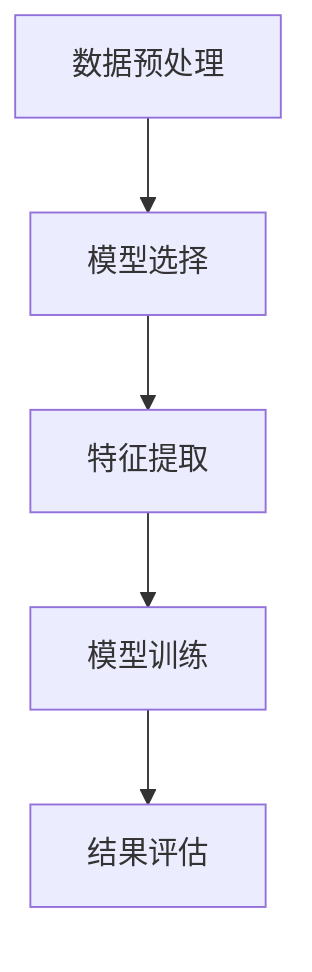
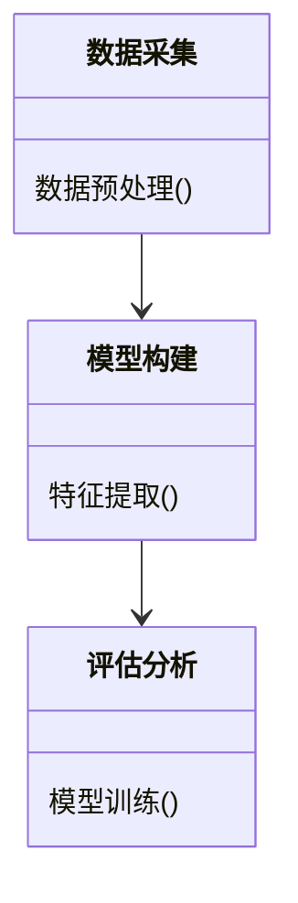

                 


# 芒格的"多元思维格栅"在跨学科量子技术融合评估中的应用

---

## 关键词

- 多元思维格栅
- 跨学科融合
- 量子技术评估
- 算法原理
- 系统架构设计

---

## 摘要

本文探讨了芒格的多元思维格栅在跨学科量子技术融合评估中的应用，通过系统分析和项目实战，展示了如何利用该方法优化量子技术评估过程。文章详细介绍了多元思维格栅的核心原理、算法模型及其在量子技术中的应用，提供了丰富的案例分析和系统设计，为读者提供了实用的指导。

---

## 第一部分：背景介绍

### 第1章：多元思维格栅概述

#### 1.1 多元思维格栅的定义与核心要素

多元思维格栅由查理·芒格提出，是一种通过多个学科的基本原理来构建知识框架的方法。其核心要素包括：

- **知识框架**：建立在各个学科的基本原理之上。
- **思维模型**：包括决策树、逆向思维等工具。
- **跨学科视角**：整合不同学科的见解，形成全面的分析能力。

#### 1.2 量子技术基础

量子技术涵盖量子计算、量子通信和量子传感，涉及计算机科学、物理学、数学等多个学科。跨学科融合是其发展的关键，通过整合不同领域的知识，优化技术性能。

---

## 第二部分：核心概念与联系

### 第2章：多元思维格栅的核心原理

#### 2.1 格栅的构建方法

- **知识框架的建立**：识别关键学科，收集核心概念，建立关联关系。
- **思维模型的选择与整合**：选择适用的模型，进行优化和调整。
- **跨学科视角的融合策略**：识别跨学科节点，建立联系，验证和优化。

#### 2.2 格栅的属性对比表

| 思维模型 | 适用领域 | 复杂度 | 优点 | 缺点 |
|----------|-----------|--------|------|------|
| 决策树   | 管理、金融 | 中     | 结构清晰 | 易受数据影响 |
| 逆向思维 | 技术分析   | 低     | 独特视角 | 可能过于激进 |

#### 2.3 ER实体关系图

```mermaid
erDiagram
    概念 <--- 关系 --- 模型
    概念 <--- 属性 --- 学科
```

---

## 第三部分：算法原理与数学模型

### 第3章：多元思维格栅算法原理

#### 3.1 算法流程



#### 3.2 数学模型

- 熵值公式：$$E = -\sum p_i \log p_i$$
- 模型评估公式：$$Accuracy = \frac{TP + TN}{TP + TN + FP + FN}$$

#### 3.3 Python源代码

```python
import numpy as np
from sklearn.tree import DecisionTreeClassifier

def preprocess_data(data):
    # 数据预处理代码
    return processed_data

def build_model(X_train, y_train):
    model = DecisionTreeClassifier()
    model.fit(X_train, y_train)
    return model

data = [...]  # 示例数据
X_train, y_train = preprocess_data(data)
model = build_model(X_train, y_train)
```

---

## 第四部分：系统分析与架构设计

### 第4章：系统分析与架构设计

#### 4.1 问题场景

量子技术评估中的数据复杂性和多学科融合需求。

#### 4.2 功能设计



#### 4.3 架构设计


#### 4.4 接口设计

- 数据接口：数据采集模块与模型构建模块之间的接口。
- 模型接口：模型构建模块与评估分析模块之间的接口。

---

## 第五部分：项目实战

### 第5章：项目实战

#### 5.1 环境安装

- 安装Python、量子计算库、数据处理库等。

#### 5.2 核心实现

- 编写数据预处理函数，构建多元思维模型，训练评估模型。

#### 5.3 案例分析

通过具体案例展示模型的应用，分析结果，讨论优缺点。

#### 5.4 小结

总结项目经验，提出改进建议。

---

## 第六部分：最佳实践

### 第6章：最佳实践

#### 6.1 小结

总结全文，强调多元思维格栅在量子技术评估中的重要性。

#### 6.2 注意事项

- 注意数据质量、模型选择和跨学科融合的复杂性。

#### 6.3 拓展阅读

推荐相关书籍和资源，供读者深入学习。

---

## 总结

通过本文的详细分析和系统设计，展示了多元思维格栅在量子技术融合评估中的应用，为读者提供了实用的指导和启示。

