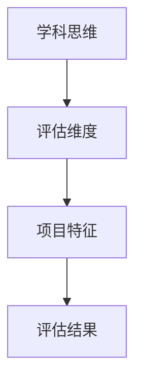
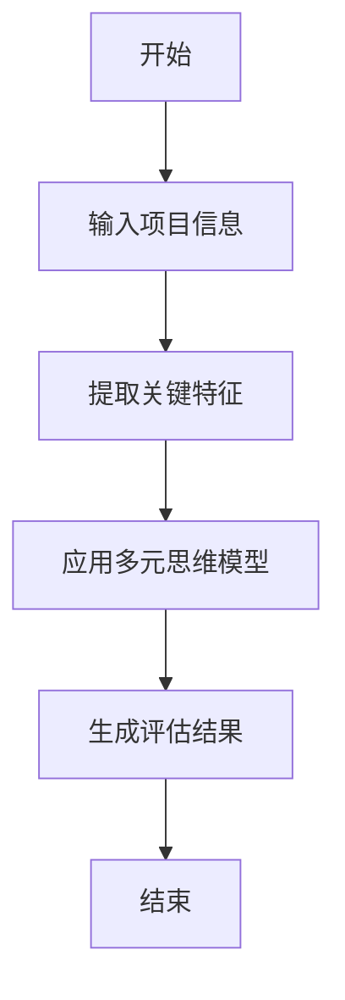
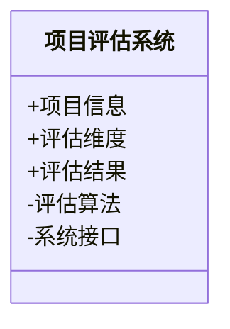
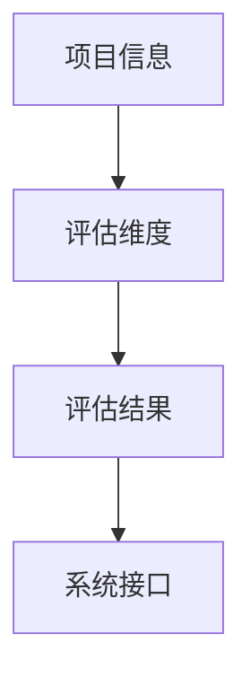
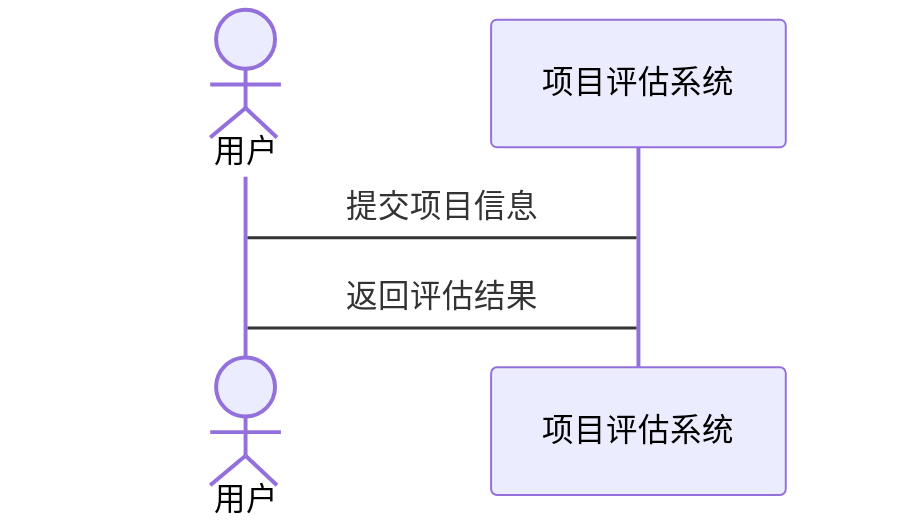

                 


# 芒格的"多元思维格栅"在跨维度创新项目评估中的应用

---

## 关键词：
- 芒格
- 多元思维格栅
- 创新项目评估
- 跨维度分析
- 系统思维

---

## 摘要：
芒格的"多元思维格栅"是一种通过整合多个学科的思维模型来进行决策的框架，其核心在于通过多维度的分析和评估来提高决策的准确性和全面性。本文将深入探讨“多元思维格栅”在跨维度创新项目评估中的应用，结合实际案例和系统设计，分析其在项目评估中的具体应用场景、算法实现以及系统架构设计。通过本文的分析，读者可以更好地理解如何利用多元思维格栅来提升跨维度创新项目的评估效率和准确性。

---

# 第一部分：芒格的"多元思维格栅"基础

## 第1章：芒格的"多元思维格栅"概述

### 1.1 多元思维模型的核心概念

#### 1.1.1 多元思维模型的定义
芒格的"多元思维格栅"是一种通过整合多个学科的思维模型来形成决策框架的方法。其核心在于通过多维度的视角来分析问题，从而避免单一思维的局限性。

#### 1.1.2 多元思维模型的起源与背景
芒格在《穷查理芒格的 worldly wisdom》中首次系统地提出了"多元思维格栅"的概念。他认为，人类的知识体系就像一个多维的格栅，只有通过多个维度的思考，才能全面理解问题的本质。

#### 1.1.3 多元思维模型的核心思想
多元思维模型的核心思想是通过整合不同学科的思维方式，形成一个立体的知识框架，从而在决策时能够从多个角度进行分析和验证。

### 1.2 多元思维模型在项目评估中的应用价值

#### 1.2.1 项目评估的复杂性与挑战
跨维度创新项目通常涉及多个领域的知识和技术，项目的成功与否往往取决于对这些复杂因素的全面评估。

#### 1.2.2 多元思维模型的优势与特点
多元思维模型通过整合不同学科的思维模型，能够帮助评估者从多个维度全面分析项目的可行性、风险和潜在机会。

#### 1.2.3 多元思维模型在跨维度创新中的应用前景
随着技术的快速发展，跨维度创新项目越来越多，多元思维模型在项目评估中的应用前景广阔，能够帮助评估者更好地应对复杂性挑战。

### 1.3 本章小结
本章主要介绍了芒格的"多元思维格栅"的基本概念、核心思想以及其在项目评估中的应用价值，为后续章节的分析奠定了基础。

---

# 第二部分：多元思维格栅的核心概念与联系

## 第2章：多元思维模型的原理与框架

### 2.1 多元思维模型的原理

#### 2.1.1 多元思维模型的基本原理
多元思维模型的基本原理是通过整合不同学科的思维框架，形成一个立体的知识网络，从而在决策时能够从多个维度进行分析和验证。

#### 2.1.2 多元思维模型的核心要素
- **学科思维模型**：包括心理学、经济学、社会学等多个学科的思维方式。
- **评估维度**：包括技术可行性、市场潜力、团队能力等多个评估维度。
- **项目特征**：包括项目的创新性、风险性、可扩展性等多个项目特征。

#### 2.1.3 多元思维模型的相互作用机制
不同学科的思维模型通过相互作用，形成一个有机的整体，从而能够从多个角度对项目进行全面评估。

### 2.2 多元思维模型的属性特征对比

#### 2.2.1 不同学科思维框架的对比
以下是不同学科思维框架的对比表格：

| 学科领域 | 心理学 | 经济学 | 社会学 |
|----------|--------|--------|--------|
| 核心思想 | 行为分析 | 价格机制 | 社会关系 |
| 应用场景 | 个体行为分析 | 市场分析 | 社会网络分析 |

#### 2.2.2 多元思维模型的优缺点分析
- **优点**：
  - 提高决策的全面性和准确性。
  - 降低单一思维的局限性。
- **缺点**：
  - 需要整合多个学科的知识，实施难度较大。
  - 可能会增加决策的时间成本。

#### 2.2.3 多元思维模型与其他思维模型的差异
多元思维模型与单一思维模型的主要差异在于其多维度的分析方式，能够更好地应对复杂性问题。

### 2.3 多元思维模型的ER实体关系图

以下是多元思维模型的ER实体关系图：



### 2.4 本章小结
本章详细介绍了多元思维模型的原理、核心要素以及其与其他思维模型的差异，并通过ER实体关系图展示了其内部的联系。

---

# 第三部分：多元思维格栅的算法原理

## 第3章：多元思维模型的算法实现

### 3.1 多元思维模型的算法原理

#### 3.1.1 多元思维模型的输入与输出
- **输入**：项目的相关信息，包括技术可行性、市场潜力、团队能力等。
- **输出**：项目的评估结果，包括项目的可行性和风险分析。

#### 3.1.2 多元思维模型的计算步骤
1. **提取项目特征**：从项目中提取关键特征，如技术创新性、市场潜力等。
2. **应用多元思维模型**：将提取的特征输入多元思维模型进行评估。
3. **生成评估结果**：根据评估结果生成最终的项目评估报告。

#### 3.1.3 多元思维模型的评估标准
评估标准包括项目的创新性、可行性和潜在风险。

### 3.2 多元思维模型的算法流程图

以下是多元思维模型的算法流程图：



### 3.3 多元思维模型的数学模型

以下是多元思维模型的数学模型：

$$
评估结果 = \sum_{i=1}^{n} w_i \cdot f_i
$$

其中，$w_i$ 是第 $i$ 个评估维度的权重，$f_i$ 是第 $i$ 个评估维度的特征值。

---

## 第4章：多元思维模型的系统分析与架构设计方案

### 4.1 系统分析与架构设计方案

#### 4.1.1 项目评估的场景介绍
跨维度创新项目的评估通常涉及多个领域的知识和技术，项目的成功与否取决于对这些复杂因素的全面评估。

#### 4.1.2 系统功能设计
以下是系统功能设计的领域模型：



#### 4.1.3 系统架构设计
以下是系统架构设计的架构图：



#### 4.1.4 系统交互设计
以下是系统交互设计的序列图：



### 4.2 本章小结
本章详细介绍了多元思维模型在系统分析与架构设计中的应用，包括系统功能设计、架构设计和交互设计。

---

## 第5章：多元思维模型的项目实战

### 5.1 项目环境安装

```bash
pip install mermaid
```

### 5.2 项目核心实现

```python
def evaluate_project(project_info):
    # 提取项目特征
    features = extract_features(project_info)
    # 应用多元思维模型
    result = multi_dimensional_analysis(features)
    return result

def extract_features(project_info):
    # 提取项目特征
    return features

def multi_dimensional_analysis(features):
    # 应用多元思维模型进行评估
    return评估结果
```

### 5.3 项目实战案例分析
以下是多元思维模型在实际项目评估中的应用案例：


### 5.4 本章小结
本章通过具体的项目实战，展示了多元思维模型在实际项目评估中的应用，帮助读者更好地理解其在实际中的作用。

---

## 第6章：总结与展望

### 6.1 总结
芒格的"多元思维格栅"是一种通过整合多个学科的思维模型来进行决策的框架，其核心在于通过多维度的分析和评估来提高决策的准确性和全面性。

### 6.2 展望
随着技术的快速发展，多元思维模型在跨维度创新项目评估中的应用前景广阔，能够帮助评估者更好地应对复杂性挑战。

### 6.3 小结
本章总结了全文的主要内容，并展望了多元思维模型在未来的发展前景。

---

## 第7章：注意事项与拓展阅读

### 7.1 注意事项
在应用多元思维模型时，需要注意以下几点：
1. **多维度分析**：确保从多个维度对项目进行全面评估。
2. **权重分配**：合理分配各个评估维度的权重。
3. **模型更新**：随着环境的变化，及时更新模型。

### 7.2 拓展阅读
1. 《穷查理芒格的 worldly wisdom》
2. 《系统思维》
3. 《创新方法论》

### 7.3 本章小结
本章提供了应用多元思维模型时需要注意的事项以及相关的拓展阅读资料，帮助读者更好地理解和应用该模型。

---

## 附录：参考文献

1.芒格, 查理. 《穷查理芒格的 worldly wisdom》
2.系统思维, 《系统思维导论》
3.创新方法论, 《创新方法论》

--- 

# 结语

芒格的"多元思维格栅"在跨维度创新项目评估中的应用，不仅能够帮助评估者从多个维度全面分析项目，还能提高决策的准确性和全面性。通过本文的分析和案例，读者可以更好地理解如何利用多元思维格栅来提升跨维度创新项目的评估效率和准确性。

