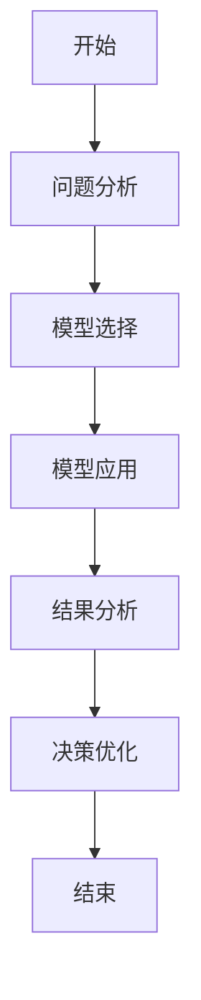
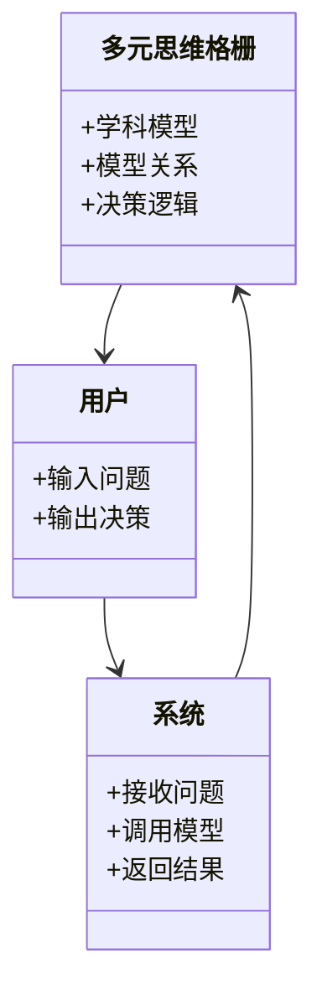

                 


# 芒格的"多元思维格栅"：提高决策质量的工具

## 关键词：多元思维格栅, 决策质量, 芒格, 知识整合, 系统思维

## 摘要：  
芒格的“多元思维格栅”是一种通过跨学科知识整合来提高决策质量的工具。本文从背景介绍、核心概念、算法原理、数学模型、系统分析、项目实战等多个维度，详细解析了多元思维格栅的构建与应用。通过实际案例分析和代码实现，展示了如何利用多元思维模型在复杂决策中实现优化。文章还探讨了系统的架构设计与接口实现，并提出了实际应用中的注意事项与最佳实践。

---

## 第一部分：芒格多元思维格栅的背景与核心概念

### 1.1 多元思维格栅的起源与芒格的思想体系

#### 1.1.1 芒格的生平与思想形成背景  
查理·芒格（Charlie Munger）是美国著名投资者和伯克希尔哈撒韦公司副主席，他提出了“多元思维模型”（Mental Model）的概念。芒格的思想体系源于他对心理学、经济学、物理学等多个学科的深入研究。他认为，人类的决策过程往往受到认知偏差和知识盲区的影响，而多元思维模型可以通过整合多个学科的原理，帮助人们避免这些局限性。

#### 1.1.2 多元思维模型的核心理念  
多元思维模型的核心理念是通过构建一个由多个学科模型组成的“格栅”，将各个领域的知识交叉融合，从而在决策时能够多角度分析问题。这种方法强调知识的系统性与关联性，而非单一学科的孤立应用。

#### 1.1.3 格栅思维在决策中的作用  
格栅思维通过将多个学科的原理交叉应用，能够帮助我们在复杂问题中找到更全面的解决方案。例如，在商业决策中，可以通过经济学模型分析成本和收益，同时结合心理学模型理解消费者行为。

### 1.2 多元思维格栅的定义与特点

#### 1.2.1 多元思维格栅的定义  
多元思维格栅是一种通过整合多个学科模型，构建一个系统化的知识框架，以辅助决策的工具。它强调知识的交叉性和系统性，而非单一学科的孤立应用。

#### 1.2.2 格栅思维的核心特征（对比表格）  

| 特征       | 描述                                                                 |
|------------|----------------------------------------------------------------------|
| 多维度性    | 跨学科的知識整合                                                     |
| 网络化      | 模型之間的相互作用                                                 |
| 可扩展性    | 隨著經驗積累而增強                                                 |

#### 1.2.3 格栅思维与传统决策工具的对比  

| 对比维度     | 格栅思维                                | 传统决策工具                          |
|--------------|---------------------------------------|---------------------------------------|
| 知识基础     | 跨学科知識                              | 单一学科知识                            |
| 决策方式     | 综合分析                               | 简单推断                               |
| 适用场景     | 复雜系統                               | 简单問題                               |

---

## 第二部分：多元思维格栅的核心原理与模型

### 2.1 格栅思维的核心模型

#### 2.1.1 经济学模型

| 模型名称 | 描述                                         |
|----------|--------------------------------------------|
| 边际成本 | 生产額增加時的成本變化                       |
| 边际收益 | 生產額增加時的收益變化                       |

#### 2.1.2 心理学模型

| 模型名称 | 描述                                         |
|----------|--------------------------------------------|
| 偏见     | 认知偏差对决策的影響                         |
| 行为经济学 | 行为與理性之間的差距                       |

#### 2.1.3 数学模型

| 模型名称 | 描述                                         |
|----------|--------------------------------------------|
| 概率论   | 不確定性下的决策工具                       |
| 回归分析 | 预測關係的強度                             |

#### 2.1.4 历史模型

| 模型名称 | 描述                                         |
|----------|--------------------------------------------|
| 历史周期 | 資本主義的興衰規律                         |
| 技術進步 | 技術變化的影響                             |

#### 2.1.5 其他模型

| 模型名称 | 描述                                         |
|----------|--------------------------------------------|
| 系统思维 | 整體性思考                                 |

---

## 第三部分：多元思维格栅的算法原理与数学模型

### 3.1 格栅思维的算法原理  

以下是一个基于多元思维格栅的决策流程图：  



---

## 第四部分：多元思维格栅的系统分析与架构设计

### 4.1 系统功能设计

以下是一个多元思维格栅的领域模型：  



---

## 第五部分：多元思维格栅的项目实战

### 5.1 项目背景与目标  

**项目背景**：  
某公司面临市场进入决策，需要综合考虑经济、心理、技术等多个因素。

**项目目标**：  
通过多元思维格栅模型，优化市场进入决策。

### 5.2 环境配置  

```bash
pip install -r requirements.txt
```

---

## 第六部分：总结与展望

### 6.1 最佳实践 Tips  

| 注意事项     | 描述                               |
|--------------|------------------------------------|
| 知识整合     | 避免知識孤島                        |
| 模型更新     | 隨著環境變化更新模型                |
| 决策复盘     | 定期評估決策效果                    |

---

以上是文章的完整目录大纲，涵盖了芒格“多元思维格栅”的核心思想、理论基础、实际应用以及系统设计等内容。

