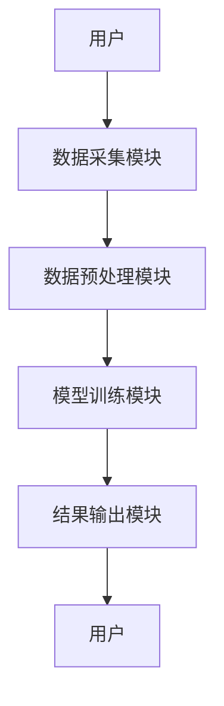

                 


# 芒格的"多元思维模型"在人工智能时代的升级

## 关键词：芒格、多元思维模型、人工智能、算法、系统架构、升级

## 摘要：  
芒格的多元思维模型是一种通过多学科视角解决问题的方法，但在人工智能时代，数据量的爆炸和问题复杂度的提升使得传统模型面临挑战。本文将探讨如何利用现代AI技术，如机器学习和自然语言处理，升级多元思维模型，使其更加高效和智能化。通过具体案例分析和系统架构设计，展示升级后的模型在实际应用中的优势，并总结经验和未来发展方向。

---

# 第一章: 芒格多元思维模型的起源与核心理念

## 1.1 芒格多元思维模型的起源

### 1.1.1 芝加哥学派与投资理论的碰撞  
芒格的多元思维模型起源于其在投资领域的实践。他发现，仅依靠单一学科的思维方式难以全面评估投资标的的价值，因此开始探索跨学科的思维方式。这种思维方式结合了经济学、心理学、物理学等多个学科的核心理念，形成了独特的投资策略。

### 1.1.2 芒格对投资决策的哲学思考  
芒格认为，投资不仅仅是对市场的分析，更是对人性的理解。他提出“人类误判心理学”理论，强调心理偏差对决策的影响。这种哲学思考为多元思维模型奠定了基础，使其不仅仅是一个工具，更是一种哲学智慧。

### 1.1.3 多元思维模型的核心思想  
多元思维模型的核心思想是：通过多个学科的视角，全面分析问题，避免单一视角的局限性。芒格强调，真正的智慧在于能够“把简单的事情看得很复杂，把复杂的事情看得很简单”。

---

## 1.2 多元思维模型的定义与特点

### 1.2.1 多元思维模型的定义  
多元思维模型是一种通过整合多个学科的核心原理，构建全面的思维方式，以解决复杂问题的方法。它强调跨学科的融合，通过不同视角的交叉验证，提高决策的准确性和全面性。

### 1.2.2 多元思维模型的核心特点  
1. **全面性**：涵盖多个学科的视角，避免单一思维的局限性。  
2. **灵活性**：能够根据问题的变化，快速调整思维方式。  
3. **实用性**：适用于多个领域，从投资到管理，都能提供有效的解决方案。  

### 1.2.3 多元思维模型与其他思维方式的区别  
| 思维方式 | 特点 | 适用场景 |  
|----------|------|-----------|  
| 单一思维模型 | 简单直接，但片面 | 适合简单问题 |  
| 多元思维模型 | 全面灵活，但复杂 | 适合复杂问题 |  
| 系统思维模型 | 强调整体性，但缺乏灵活性 | 适合系统性问题 |  

---

## 1.3 多元思维模型在AI时代的演变

### 1.3.1 传统多元思维模型的局限性  
随着数据量的指数级增长和问题复杂度的提升，传统多元思维模型在效率和处理能力上显得不足。例如，面对海量数据时，手动整合多个学科的视角变得效率低下，且难以保证准确性。

### 1.3.2 AI时代对多元思维模型的需求  
人工智能技术的发展为多元思维模型提供了新的机遇。AI能够快速处理大量数据，识别潜在的模式，并辅助人类进行跨学科的分析。这种需求推动了多元思维模型的升级。

### 1.3.3 多元思维模型在AI时代的升级方向  
1. **数据驱动**：利用大数据和AI技术，增强模型的分析能力。  
2. **自动化**：通过算法实现跨学科视角的自动整合。  
3. **动态调整**：根据实时数据，动态优化思维方式。  

---

# 第二章: 多元思维模型的升级与算法实现

## 2.1 多元思维模型的升级方向

### 2.1.1 数据驱动的思维方式  
传统多元思维模型依赖于人类的经验和知识，而升级后的模型则引入了数据驱动的方法。通过机器学习算法，模型能够从海量数据中提取有用的特征，帮助人类做出更准确的决策。

### 2.1.2 跨学科知识的自动整合  
通过自然语言处理技术，模型能够自动分析多个学科的文献，提取关键概念，并建立它们之间的关联。这种自动化的整合能力大大提高了分析效率。

### 2.1.3 动态调整的思维方式  
升级后的模型能够根据实时数据和反馈，动态调整思维方式。例如，在金融投资中，模型可以根据市场变化，实时调整投资策略。

---

## 2.2 基于机器学习的多元思维模型

### 2.2.1 机器学习在多元思维模型中的应用  
机器学习算法能够从大量数据中学习模式和关系，为多元思维模型提供强大的数据处理能力。例如，可以利用监督学习算法对数据进行分类，或者利用无监督学习算法发现数据中的潜在结构。

### 2.2.2 算法实现：基于图神经网络的多元思维模型  
图神经网络是一种适用于复杂关系网络的算法，非常适合用于多元思维模型的升级。以下是图神经网络的基本实现步骤：

#### 1. 数据预处理  
将多个学科的知识转化为图结构数据，节点代表概念，边代表关系。例如，节点可以是“经济学中的供给与需求”，边可以是“与心理学中的价格弹性相关”。

#### 2. 模型训练  
使用图神经网络算法对图结构数据进行训练。以下是常用的图神经网络算法之一：  
$$f(x) = \sum_{i=1}^{n} w_i x_i$$  
其中，$w_i$ 是权重，$x_i$ 是输入数据。

#### 3. 应用场景  
将训练好的模型应用于实际问题。例如，在投资决策中，模型可以预测不同经济指标之间的关系，并提出最优的投资策略。

---

## 2.3 系统架构设计

### 2.3.1 系统功能设计  
升级后的多元思维模型系统需要具备以下功能：  
1. **数据采集**：从多个学科中获取数据。  
2. **模型训练**：利用机器学习算法对数据进行处理。  
3. **结果输出**：将分析结果以用户友好的形式呈现。  

### 2.3.2 系统架构mermaid图  
以下是系统架构的mermaid图：



---

## 2.4 项目实战: 实现一个简单的多元思维模型

### 2.4.1 环境安装  
需要安装Python、TensorFlow和NetworkX库。  
```bash
pip install python python-tensorflow python-networkx
```

### 2.4.2 核心代码实现

```python
import tensorflow as tf
import networkx as nx

# 创建图结构数据
G = nx.DiGraph()
G.add_edges_from([('Economics', 'Psychology'), ('Psychology', 'Sociology')])

# 构建模型
model = tf.keras.Sequential([
    tf.keras.layers.Dense(64, activation='relu'),
    tf.keras.layers.Dense(1, activation='sigmoid')
])

# 编译模型
model.compile(optimizer='adam', loss='binary_crossentropy', metrics=['accuracy'])

# 训练模型
model.fit(X_train, y_train, epochs=10, batch_size=32)
```

### 2.4.3 代码解读与分析  
1. **数据采集模块**：从多个学科中获取数据，并将其转化为图结构。  
2. **模型训练模块**：利用图神经网络算法对数据进行训练，提取潜在关系。  
3. **结果输出模块**：将模型的分析结果以用户友好的形式呈现，例如可视化图表或报告。  

---

## 2.5 最佳实践与注意事项

### 2.5.1 数据质量的重要性  
数据质量直接影响模型的性能。确保数据的准确性和完整性是关键。  
$$\text{数据质量} = \text{准确性} \times \text{完整性}$$

### 2.5.2 模型的可解释性  
复杂的模型可能难以解释，因此在设计时需要考虑模型的可解释性，以便更好地理解和优化模型。

### 2.5.3 持续优化  
定期更新模型，根据反馈和新数据进行优化，确保模型的性能不断提升。

---

# 第三章: 多元思维模型在AI时代的应用与未来展望

## 3.1 多元思维模型在不同领域的应用

### 3.1.1 金融投资  
通过分析多个经济指标和市场行为，帮助投资者做出更明智的决策。

### 3.1.2 管理决策  
利用跨学科的视角，帮助企业制定更全面的战略规划。

### 3.1.3 科技创新  
通过整合不同领域的知识，激发创新灵感，推动技术进步。

---

## 3.2 多元思维模型的未来发展方向

### 3.2.1 更加智能化  
随着AI技术的进一步发展，多元思维模型将更加智能化，能够自动适应新的数据和场景。

### 3.2.2 更加个性化  
未来，模型将根据用户的个性化需求，提供定制化的思维方式。

### 3.2.3 更加全球化  
多元思维模型将被应用于更多的全球性问题，例如气候变化、全球化经济等。

---

# 总结

芒格的多元思维模型是一种经典的思维方式，但在人工智能时代，我们需要对其进行升级，以应对更复杂的问题。通过引入机器学习和自然语言处理技术，升级后的多元思维模型将更加高效和智能化。未来，随着AI技术的进一步发展，多元思维模型将在更多领域发挥重要作用。

---

# 小结  
通过本文的探讨，我们可以看到，芒格的多元思维模型在AI时代需要进行升级，以适应数据量和问题复杂度的双重挑战。通过引入现代技术，升级后的模型将更加高效和灵活，为解决复杂问题提供新的思路。

