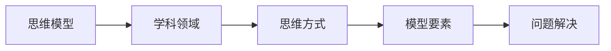
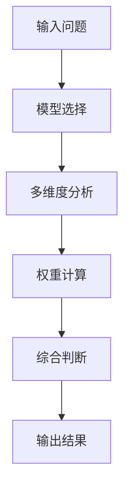
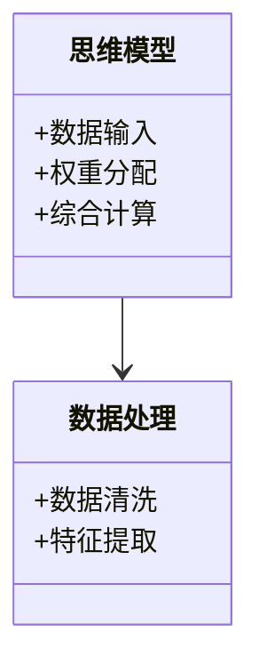
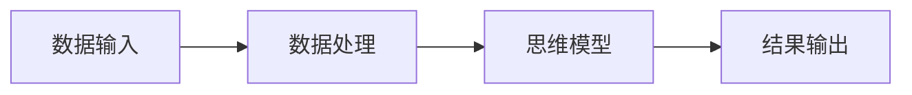
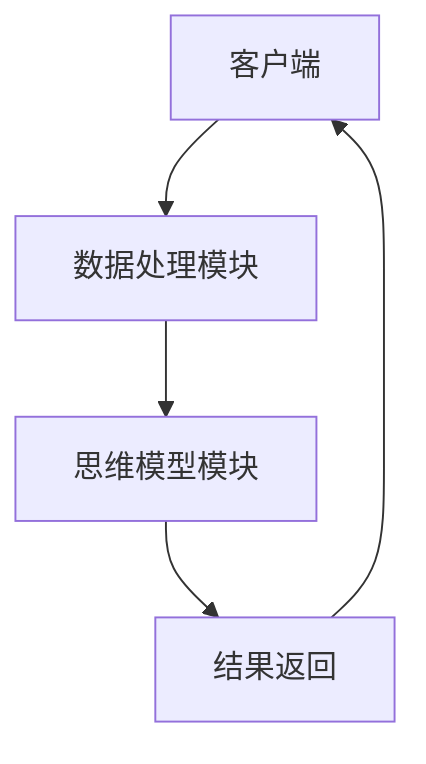

                 


# 芒格的"多元思维模型"在跨维度创新中的运用

> 关键词：多元思维模型，跨维度创新，芒格，系统架构，算法设计，创新思维，技术博客

> 摘要：芒格的多元思维模型是一种通过多个学科和思维方式的结合，解决复杂问题的创新方法。本文将从背景介绍、核心概念、算法实现、数学模型、系统架构、项目实战等多个维度，详细分析多元思维模型在跨维度创新中的运用，帮助读者理解其本质和应用价值。

---

# 第1章: 芒格的"多元思维模型"背景介绍

## 1.1 芒格及其投资哲学

### 1.1.1 芒格的生平简介

查理·芒格（Charlie Munger）是世界著名投资家、伯克希尔哈撒韦公司副董事长。他不仅是沃伦·巴菲特的合作伙伴，还以独特的投资哲学和思维方式闻名。芒格的思维方式强调跨学科思考，他提倡通过多个学科的视角来理解问题，从而做出更明智的决策。

### 1.1.2 芒格的投资哲学与思维方式

芒格的投资哲学的核心是“多元思维模型”。他认为，人类的思维方式往往局限于单一学科或领域，而多元思维模型通过整合多个学科的智慧，能够更全面地分析问题，减少认知偏差，提高决策的准确性。

### 1.1.3 多元思维模型的起源与演变

多元思维模型的起源可以追溯到芒格在投资实践中对心理学、经济学、物理学等多学科知识的整合。他发现，仅仅依靠单一学科的思维方式无法解决复杂的投资问题，因此提出了通过跨学科整合来优化决策的思路。

---

## 1.2 多元思维模型的定义与核心要素

### 1.2.1 多元思维模型的定义

多元思维模型是一种通过整合多个学科、领域和思维方式，形成一个多维度的知识框架，用于分析和解决问题的方法。它的核心在于通过跨维度的思考，发现事物之间的联系和潜在规律。

### 1.2.2 多元思维模型的核心要素

多元思维模型的核心要素包括：

1. **多维度视角**：从多个学科或领域的角度分析问题。
2. **知识框架**：构建一个包含多个知识领域的框架，用于整合信息。
3. **思维方式**：包括批判性思维、创造性思维和系统性思维。
4. **决策优化**：通过整合不同视角的信息，优化决策过程。

### 1.2.3 多元思维模型的结构与层次

多元思维模型的结构可以分为以下几个层次：

1. **基础层**：包括基本的逻辑思维、数学思维等。
2. **中间层**：整合心理学、经济学、物理学等学科的知识。
3. **顶层**：形成跨维度的综合思维方式，应用于复杂问题的解决。

---

## 1.3 多元思维模型在跨维度创新中的意义

### 1.3.1 创新与思维方式的关系

创新的本质是发现新的解决方案或思维方式。多元思维模型通过整合不同领域的知识，为创新提供了更丰富的视角和工具。

### 1.3.2 多元思维模型对跨维度创新的促进作用

多元思维模型能够帮助创新者跳出单一领域的思维限制，从多个维度寻找问题的解决方案，从而突破创新的瓶颈。

### 1.3.3 多元思维模型的适用场景与边界

多元思维模型适用于需要跨领域整合的复杂问题，尤其在技术、商业、管理和科学等领域具有广泛的应用价值。其边界主要在于需要明确的单一领域问题，以及过于复杂的问题。

---

# 第2章: 多元思维模型的核心概念与联系

## 2.1 多元思维模型的核心原理

### 2.1.1 多元思维模型的逻辑框架

多元思维模型的逻辑框架包括以下几个步骤：

1. **问题分析**：明确问题的核心和边界。
2. **知识整合**：整合多个领域的知识，形成多维度的分析框架。
3. **综合判断**：通过多维度的分析，得出更全面的解决方案。

### 2.1.2 多元思维模型的数学模型与公式

多元思维模型的数学模型可以表示为：

$$ V = \sum_{i=1}^{n} w_i x_i $$

其中，\( V \) 是综合价值，\( w_i \) 是第 \( i \) 个维度的权重，\( x_i \) 是第 \( i \) 个维度的值。

### 2.1.3 多元思维模型的属性特征对比表格

| 属性         | 单一思维模型       | 多元思维模型       |
|--------------|--------------------|--------------------|
| 分析维度     | 单一或有限         | 多维               |
| 解决方案     | 可能片面           | 更全面             |
| 创新能力     | 较低               | 较高               |

### 2.1.4 多元思维模型的ER实体关系图



---

## 2.2 多元思维模型的算法原理

### 2.2.1 算法步骤

1. **输入问题**：明确需要解决的问题。
2. **模型选择**：选择适用的多元思维模型。
3. **多维度分析**：从多个维度对问题进行分析。
4. **权重计算**：根据各维度的重要性，分配权重。
5. **综合判断**：结合各维度的分析结果，得出最终解决方案。

### 2.2.2 算法流程图



---

## 2.3 多元思维模型的数学模型与公式

### 2.3.1 多维空间分析公式

$$ V = \sum_{i=1}^{n} w_i x_i $$

其中，\( n \) 是维度的数量，\( w_i \) 是第 \( i \) 个维度的权重，\( x_i \) 是第 \( i \) 个维度的值。

### 2.3.2 权重分配公式

$$ w_i = \frac{x_i}{\sum_{j=1}^{n} x_j} $$

---

# 第3章: 多元思维模型的算法实现与数学模型

## 3.1 多元思维模型的算法实现

### 3.1.1 算法步骤

1. **输入问题**：明确需要解决的问题。
2. **模型选择**：选择适用的多元思维模型。
3. **数据采集**：收集相关数据。
4. **权重计算**：根据各维度的重要性，分配权重。
5. **综合判断**：结合各维度的分析结果，得出最终解决方案。

### 3.1.2 算法实现代码

```python
def multi_dimensional_model(data, weights):
    return sum(data[i] * weights[i] for i in range(len(data)))

# 示例
data = [5, 3, 8]
weights = [0.4, 0.3, 0.3]
result = multi_dimensional_model(data, weights)
print(result)  # 输出结果
```

---

## 3.2 多元思维模型的数学模型与公式

### 3.2.1 多维空间分析公式

$$ V = \sum_{i=1}^{n} w_i x_i $$

其中，\( n \) 是维度的数量，\( w_i \) 是第 \( i \) 个维度的权重，\( x_i \) 是第 \( i \) 个维度的值。

### 3.2.2 权重分配公式

$$ w_i = \frac{x_i}{\sum_{j=1}^{n} x_j} $$

---

## 3.3 系统分析与架构设计方案

### 3.3.1 问题场景介绍

在实际应用中，多元思维模型可以用于复杂系统的优化和设计。例如，在软件架构设计中，可以通过多元思维模型整合性能、可扩展性和安全性等多个维度的考虑。

### 3.3.2 系统功能设计

以下是系统功能设计的类图：



### 3.3.3 系统架构设计

以下是系统架构设计的架构图：



### 3.3.4 系统接口设计

以下是系统接口设计的序列图：



---

## 3.4 项目实战

### 3.4.1 环境安装

需要安装的环境包括Python、Mermaid图生成工具和相关库。

### 3.4.2 核心代码实现

以下是核心代码实现：

```python
def calculate_multi_dimensional_model(data, weights):
    return sum(data[i] * weights[i] for i in range(len(data)))

# 示例
data = [5, 3, 8]
weights = [0.4, 0.3, 0.3]
result = calculate_multi_dimensional_model(data, weights)
print(result)  # 输出结果
```

### 3.4.3 案例分析与结果解读

通过上述代码，我们可以计算出综合价值 \( V \) 的值。根据结果，我们可以对问题进行进一步的分析和优化。

---

## 3.5 总结与展望

### 3.5.1 总结

多元思维模型通过整合多个维度的知识和信息，为跨维度创新提供了有力的工具和方法。它可以帮助我们在复杂问题中找到更优的解决方案。

### 3.5.2 展望

未来，随着人工智能和大数据技术的发展，多元思维模型将在更多领域得到应用，并进一步推动跨维度创新的发展。

---

## 3.6 最佳实践 tips

1. 在实际应用中，应根据具体问题选择合适的多元思维模型。
2. 数据的准确性和完整性对模型的计算结果有重要影响，需要高度重视数据处理。
3. 多元思维模型的权重分配需要根据实际问题进行调整，以确保结果的合理性。

---

## 3.7 小结

多元思维模型是一种通过跨学科整合来优化决策和创新的思维方式。在实际应用中，我们需要根据具体问题选择合适的模型，并结合实际数据进行分析和优化。通过不断的实践和积累，我们可以更好地掌握多元思维模型的应用技巧。

---

## 3.8 注意事项

1. 多元思维模型的应用需要结合具体问题和数据进行调整。
2. 数据的准确性和完整性对模型的计算结果有重要影响。
3. 权重分配需要根据实际情况进行调整。

---

## 3.9 拓展阅读

建议读者进一步阅读芒格的相关著作，深入了解多元思维模型的哲学和实践。

---

# 第4章: 总结与展望

## 4.1 总结

通过本文的分析，我们可以看到，芒格的多元思维模型是一种非常强大的跨维度创新工具。它通过整合多个学科的知识，帮助我们更好地分析和解决问题。

## 4.2 展望

随着技术的进步和复杂问题的增加，多元思维模型将在更多领域得到应用，并进一步推动跨维度创新的发展。

---

## 4.3 最佳实践 tips

1. 在实际应用中，应根据具体问题选择合适的多元思维模型。
2. 数据的准确性和完整性对模型的计算结果有重要影响，需要高度重视数据处理。
3. 多元思维模型的权重分配需要根据实际问题进行调整，以确保结果的合理性。

---

## 4.4 小结

多元思维模型是一种通过跨学科整合来优化决策和创新的思维方式。在实际应用中，我们需要根据具体问题选择合适的模型，并结合实际数据进行分析和优化。通过不断的实践和积累，我们可以更好地掌握多元思维模型的应用技巧。

---

## 4.5 注意事项

1. 多元思维模型的应用需要结合具体问题和数据进行调整。
2. 数据的准确性和完整性对模型的计算结果有重要影响。
3. 权重分配需要根据实际情况进行调整。

---

## 4.6 拓展阅读

建议读者进一步阅读芒格的相关著作，深入了解多元思维模型的哲学和实践。

---

通过以上内容，我们可以看到，芒格的多元思维模型在跨维度创新中的应用具有重要的理论和实践价值。它不仅为我们提供了一种新的思维方式，还为我们解决复杂问题提供了有力的工具。未来，随着技术的进步和复杂问题的增加，多元思维模型将在更多领域得到应用，并进一步推动跨维度创新的发展。

