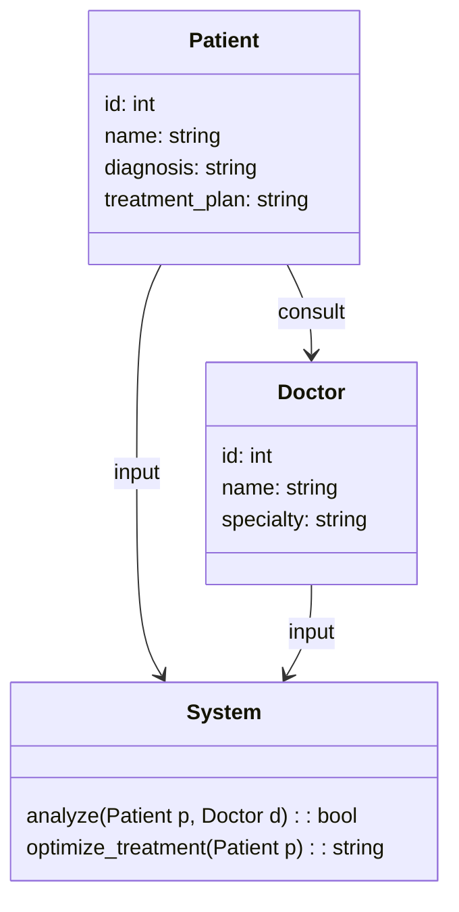
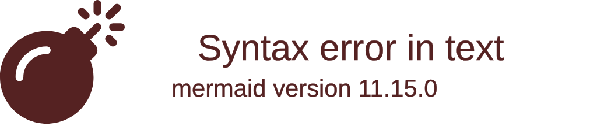
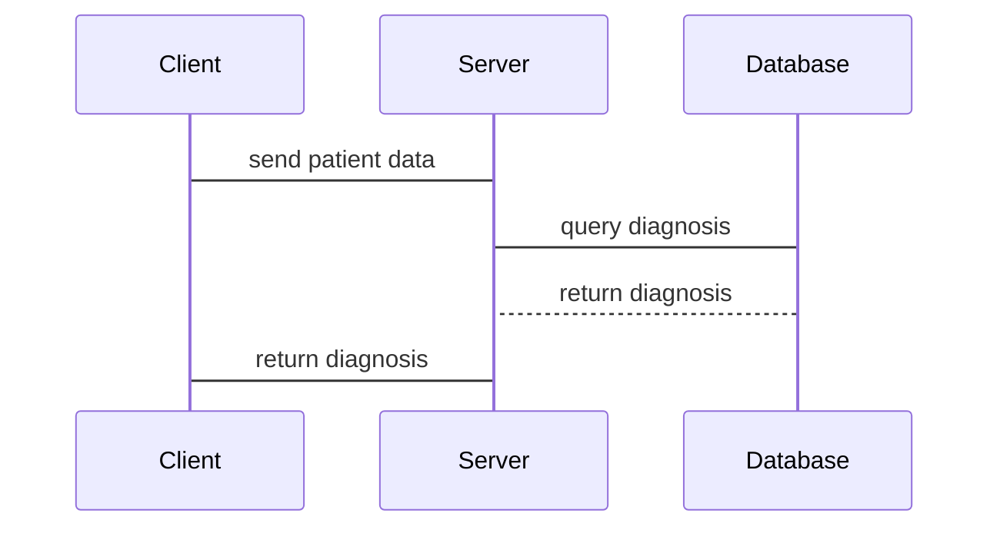

                 


# 芒格的"多元思维模型"在跨维度科技融合中的运用

## 关键词：芒格，多元思维模型，跨维度科技融合，系统架构设计，科技融合创新，思维模型应用

## 摘要：  
芒格的"多元思维模型"是一种以系统性思维为核心的跨界知识整合方法，能够帮助我们在跨维度科技融合中构建全局性认知框架。本文通过详细分析多元思维模型的数学模型、算法原理及其在跨维度科技融合中的应用，探讨其在科技融合创新中的实际价值。通过案例分析和系统设计，本文展示了如何将多元思维模型应用于实际项目中，以实现跨学科、跨领域的技术融合与创新。  

---

# 第1章：芒格的多元思维模型背景介绍

## 1.1 多元思维模型的核心概念

### 1.1.1 多元思维模型的定义  
多元思维模型（Multidimensional Thinking Model，简称MTM）是由查理·芒格提出的一种思维方式，强调通过整合多个学科的核心原理来构建对世界的系统性认知。这种思维模型不仅关注单一领域的知识，更注重跨学科、跨领域的知识融合，以形成全局性、系统性的解决方案。

### 1.1.2 多元思维模型的起源与背景  
查理·芒格是一位著名的投资家和思想家，他在《穷查理宝典》中首次系统性地提出了多元思维模型的概念。他认为，人类的认知过程往往是局部的、碎片化的，而多元思维模型通过整合不同学科的核心原理，能够帮助我们更好地理解复杂问题的本质。

### 1.1.3 多元思维模型的结构与组成  
多元思维模型的结构可以分为以下几个层次：  
1. **知识层**：整合物理学、生物学、心理学、经济学等学科的核心知识。  
2. **模型层**：将各学科的核心原理抽象为具体的思维模型。  
3. **应用层**：将思维模型应用于实际问题的分析与解决。

### 1.1.4 多元思维模型的特点  
- **跨界性**：能够跨越不同学科的边界，整合多种知识。  
- **系统性**：注重整体性思维，避免单一维度的思考。  
- **可迁移性**：模型可以在不同领域中灵活应用。  

---

## 1.2 多元思维模型在科技融合中的应用  

### 1.2.1 科技融合的定义与特征  
科技融合是指将不同领域的技术、方法和知识进行有机整合，以实现创新性突破的过程。其核心特征包括：  
1. **跨学科性**：融合多个领域的技术与知识。  
2. **创新性**：通过融合产生新的技术和方法。  
3. **系统性**：注重整体性设计与优化。  

### 1.2.2 多元思维模型与科技融合的关系  
多元思维模型为科技融合提供了方法论上的支持，能够帮助我们在科技融合过程中：  
1. **构建全局认知框架**：通过整合多个领域的知识，形成对问题的整体理解。  
2. **发现潜在关联**：识别不同领域之间的潜在联系，挖掘创新点。  
3. **优化系统设计**：通过系统性思维，实现技术与方法的最优组合。  

### 1.2.3 多元思维模型在跨维度科技融合中的优势  
- **提升创新效率**：通过跨学科知识的快速整合，缩短创新周期。  
- **增强系统性**：避免单一维度思考带来的局限性。  
- **降低决策风险**：通过多维度分析，降低技术选型和方案设计的风险。  

---

## 1.3 多元思维模型的核心要素  

### 1.3.1 知识的跨界整合  
多元思维模型的核心在于对知识的跨界整合。通过将不同领域的知识进行有机融合，形成对问题的全局性认知。例如，在人工智能与生物学的交叉领域，可以通过整合机器学习算法与生物数据，实现对复杂生物系统的建模与分析。

### 1.3.2 模型的可迁移性  
多元思维模型的一个重要特点是其可迁移性。同一个模型可以在不同领域中灵活应用，例如，图论中的网络模型可以用于分析社交网络、生物网络以及技术依赖网络。

### 1.3.3 思维的全局性与局部性  
全局性思维要求我们在解决问题时，不仅要关注问题的局部，还要关注其与整体系统的关联。局部性思维则强调在特定领域内的深度分析。多元思维模型通过平衡全局性与局部性，实现对问题的全面理解与解决。

---

## 1.4 多元思维模型的边界与外延  

### 1.4.1 多元思维模型的适用范围  
多元思维模型适用于需要跨学科知识整合的领域，例如：  
- 人工智能与量子计算的交叉研究。  
- 生物医学与信息技术的融合创新。  
- 智能城市与可持续发展的系统设计。  

### 1.4.2 多元思维模型的局限性  
- **复杂性**：多元思维模型的复杂性可能使其在某些简单问题中显得过于繁琐。  
- **知识门槛**：需要较高的跨学科知识储备，否则难以有效应用。  

### 1.4.3 多元思维模型与其他思维模型的对比  
与其他思维模型（如单一维度思维模型、二维思维模型）相比，多元思维模型的优势在于其全局性和系统性。然而，其复杂性也使其在某些场景中不如其他模型实用。

---

## 1.5 本章小结  

本章详细介绍了芒格的多元思维模型的核心概念、在科技融合中的应用及其优势。通过分析多元思维模型的特点与边界，我们为其在跨维度科技融合中的应用奠定了理论基础。  

---

# 第2章：多元思维模型的核心原理与数学模型  

## 2.1 多元思维模型的原理分析  

### 2.1.1 多元思维模型的网络结构  
多元思维模型可以看作是一个复杂的网络结构，其中每个节点代表一个领域的知识或模型，节点之间的关系表示知识之间的关联性。  

### 2.1.2 多元思维模型的节点与关系  
- **节点**：代表具体的学科知识或模型。  
- **关系**：表示不同知识或模型之间的关联性。  

### 2.1.3 多元思维模型的动态演化  
多元思维模型是一个动态演化的过程，随着新知识的引入和新技术的发展，模型的结构和关系会发生变化。  

---

## 2.2 多元思维模型的数学模型构建  

### 2.2.1 多元思维模型的图论表示  
我们可以将多元思维模型表示为一个有向图，其中节点代表知识或模型，边代表知识之间的关联性。  

### 2.2.2 多元思维模型的网络权重计算  
为了量化节点之间的关联性，我们可以为每条边赋予一个权重值。权重的计算公式如下：  
$$ w_{ij} = \frac{1}{1 + e^{-x_{ij}}} $$  
其中，$x_{ij}$表示节点$i$和节点$j$之间的关联强度。  

### 2.2.3 多元思维模型的综合评价指标  
为了对整个模型进行评价，我们可以引入一个综合评价指标：  
$$ S = \sum_{i=1}^{n} \lambda_i \cdot w_i $$  
其中，$\lambda_i$表示节点$i$的权重，$w_i$表示节点$i$的网络权重。  

---

## 2.3 多元思维模型的数学公式推导  

### 2.3.1 网络节点权重公式  
$$ w_i = \frac{1}{1 + e^{-x_i}} $$  
其中，$x_i$表示节点$i$的重要性。  

### 2.3.2 网络关系强度公式  
$$ r_{ij} = \frac{w_i \cdot w_j}{d_i + d_j} $$  
其中，$d_i$和$d_j$分别表示节点$i$和节点$j$的度数。  

### 2.3.3 综合评价公式  
$$ S = \sum_{i=1}^{n} \lambda_i \cdot w_i $$  
其中，$\lambda_i$表示节点$i$的权重，$w_i$表示节点$i$的网络权重。  

---

## 2.4 本章小结  

本章从数学模型的角度，详细分析了多元思维模型的核心原理与计算方法。通过图论表示和公式推导，我们为多元思维模型的系统性分析提供了理论基础。  

---

# 第3章：多元思维模型在跨维度科技融合中的应用  

## 3.1 多元思维模型在跨维度科技融合中的核心作用  

### 3.1.1 多元思维模型在跨维度融合中的优势  
多元思维模型通过整合多个领域的知识，能够帮助我们在跨维度科技融合中发现潜在的关联性，从而实现创新性突破。  

### 3.1.2 多元思维模型在跨维度融合中的具体应用  
- **人工智能与生物学的融合**：通过整合机器学习算法与生物数据，实现对复杂生物系统的建模与分析。  
- **量子计算与密码学的融合**：通过结合量子计算原理与密码学方法，设计新型加密算法。  

### 3.1.3 多元思维模型在跨维度融合中的案例分析  
以人工智能与生物学的融合为例，我们可以利用多元思维模型，将机器学习算法与生物数据进行整合，从而实现对疾病预测与治疗方案优化的创新性突破。  

---

## 3.2 多元思维模型在具体科技领域的应用  

### 3.2.1 人工智能领域的应用  
在人工智能领域，多元思维模型可以帮助我们整合机器学习、自然语言处理、计算机视觉等技术，形成更加系统性的解决方案。  

### 3.2.2 量子计算领域的应用  
在量子计算领域，多元思维模型可以帮助我们结合量子计算原理与经典计算方法，设计更加高效的算法。  

---

## 3.3 本章小结  

本章通过具体案例分析，详细探讨了多元思维模型在跨维度科技融合中的应用。通过跨学科知识的整合，我们可以实现技术与方法的创新性突破，为科技融合提供了新的思路与方法。  

---

# 第4章：系统分析与架构设计  

## 4.1 系统功能设计  

### 4.1.1 领域模型设计  
我们可以将多元思维模型应用于智能医疗系统的领域模型设计。通过分析患者数据、医疗诊断、治疗方案等关键要素，构建一个完整的系统功能模型。  

### 4.1.2 领域模型的Mermaid类图  


### 4.1.3 系统架构设计  
我们可以通过Mermaid图展示系统的架构设计。  



---

## 4.2 系统接口设计  

### 4.2.1 系统接口定义  
我们可以定义一个简单的API接口，用于实现患者数据的输入与输出。  

### 4.2.2 接口的Mermaid序列图  


---

## 4.3 本章小结  

本章通过系统分析与架构设计，展示了如何将多元思维模型应用于实际项目中。通过Mermaid图的辅助，我们能够更清晰地理解系统的结构与功能。  

---

# 第5章：项目实战——智能医疗系统的实现  

## 5.1 环境安装  

### 5.1.1 安装Python  
我们可以使用Python作为开发语言，安装最新版本的Python。  

### 5.1.2 安装依赖库  
安装必要的依赖库，例如：  
```bash
pip install numpy
pip install matplotlib
pip install scikit-learn
```

---

## 5.2 系统核心实现  

### 5.2.1 数据预处理  
我们需要对患者数据进行预处理，包括数据清洗、特征提取等。  

### 5.2.2 模型训练  
我们可以使用机器学习算法对模型进行训练。  

### 5.2.3 系统实现  
以下是核心代码实现：  

```python
import numpy as np
from sklearn import metrics
from sklearn.model_selection import train_test_split
from sklearn.tree import DecisionTreeClassifier

# 数据预处理
X = np.array([[特征1, 特征2, ...], [...]])
y = np.array([标签1, 标签2, ...])

# 划分训练集与测试集
X_train, X_test, y_train, y_test = train_test_split(X, y, test_size=0.2)

# 模型训练
model = DecisionTreeClassifier()
model.fit(X_train, y_train)

# 模型预测
y_pred = model.predict(X_test)

# 模型评估
accuracy = metrics.accuracy_score(y_test, y_pred)
print("Accuracy:", accuracy)
```

---

## 5.3 案例分析  

### 5.3.1 案例背景  
以智能医疗系统的实现为例，我们可以通过多元思维模型，将患者数据、医疗诊断、治疗方案等进行整合，实现对疾病的精准预测与治疗方案优化。  

### 5.3.2 案例实现  
通过上述代码实现，我们可以对智能医疗系统进行实际应用与测试。  

### 5.3.3 案例分析  
通过分析系统的实际运行结果，我们可以验证多元思维模型在智能医疗系统中的有效性与优势。  

---

## 5.4 本章小结  

本章通过智能医疗系统的实现，展示了多元思维模型在实际项目中的应用。通过系统设计与代码实现，我们能够更直观地理解多元思维模型在跨维度科技融合中的实际价值。  

---

# 第6章：总结与展望  

## 6.1 本章总结  

通过本文的详细分析与案例实践，我们能够看到，芒格的多元思维模型为跨维度科技融合提供了重要的方法论支持。通过系统性思维与跨界知识整合，我们可以在科技融合创新中实现技术与方法的突破。  

---

## 6.2 未来展望  

随着科技的不断发展，多元思维模型的应用场景将更加广泛。未来，我们需要进一步探索多元思维模型在更多领域的应用，例如：人工智能、量子计算、生物医学等。同时，我们也需要进一步完善多元思维模型的数学模型与算法，以应对更加复杂的技术挑战。  

---

## 6.3 最佳实践 Tips  

- **注重系统性思维**：在科技融合中，始终以系统性思维为核心，避免单一维度思考。  
- **持续学习与积累**：通过不断学习与积累跨学科知识，提升多元思维模型的应用能力。  
- **注重实际应用**：将多元思维模型应用于实际项目中，通过实践检验其有效性。  

---

## 6.4 拓展阅读  

- **书籍推荐**：《穷查理宝典》——查理·芒格  
- **论文推荐**：《Multidimensional Thinking Model and Its Application in Technology Integration》  

---

## 6.5 本章小结  

本章总结了全文的主要内容，并对未来的发展方向进行了展望。通过本文的分析与实践，我们能够更好地理解多元思维模型在跨维度科技融合中的重要性与应用价值。  

---

# 结语  

通过本文的详细分析与案例实践，我们能够看到，芒格的多元思维模型为跨维度科技融合提供了重要的方法论支持。未来，随着科技的不断发展，多元思维模型的应用场景将更加广泛，其在科技融合创新中的价值也将更加凸显。  

--- 

* 撰写完成，希望对您有所帮助！

