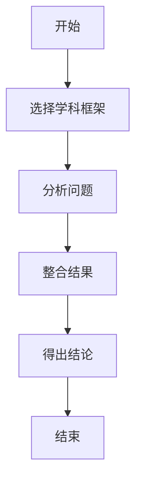
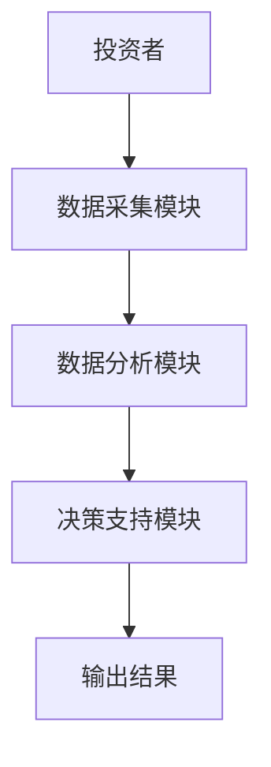
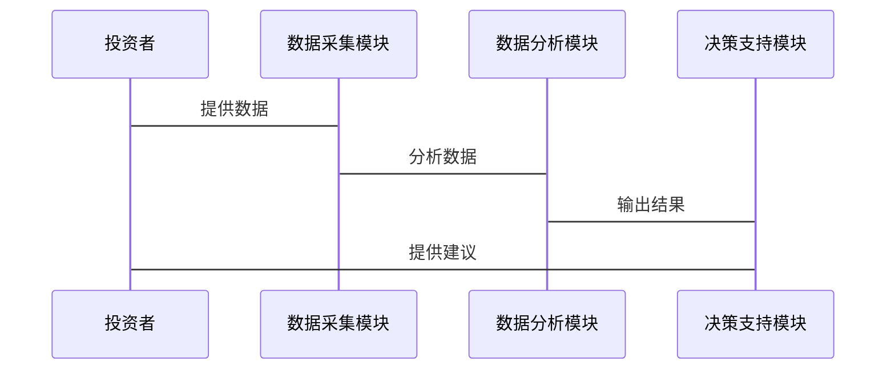

                 


# 芒格的"多元思维模型"：提高投资决策的全面性

> 关键词：芒格、多元思维模型、投资决策、系统架构、数学模型

> 摘要：芒格的多元思维模型是一种通过跨学科思考来提高决策质量的方法。本文从背景介绍、核心概念、算法原理、系统架构、项目实战等多方面详细解读多元思维模型，结合实际案例和数学模型，帮助读者全面理解并应用该模型于投资决策中。

---

## 第1章: 多元思维模型的背景与起源

### 1.1 多元思维模型的定义与核心概念

#### 1.1.1 多元思维模型的定义
多元思维模型（Multi-Paradigm Thinking Model）是由查理·芒格提出的一种思维方式，强调从多个学科的角度去分析和解决问题，避免单一思维的局限性。它主张将不同学科的核心原理整合起来，形成一个全面的分析框架。

#### 1.1.2 多元思维模型的核心要素
- **跨学科视角**：涵盖心理学、经济学、物理学等多学科的基本原理。
- **知识网络**：通过建立知识网络，发现不同领域的共性规律。
- **动态调整**：根据实际情况，灵活调整分析框架。

#### 1.1.3 多元思维模型与传统思维的区别
- **传统思维**：单一视角，可能忽视其他领域的影响。
- **多元思维模型**：多维度分析，全面考虑问题。

### 1.2 芒格与多元思维模型

#### 1.2.1 芒格的生平简介
查理·芒格是世界著名投资家，巴菲特的合伙人，被誉为“幕后智囊”。他的投资哲学深刻影响了多元思维模型的发展。

#### 1.2.2 芒格对多元思维模型的贡献
芒格提出并实践了多元思维模型，将其应用于投资决策，取得了显著的成功。

#### 1.2.3 多元思维模型在投资中的应用
通过整合多个学科的原理，芒格能够更全面地评估投资机会，降低决策风险。

---

## 第2章: 多元思维模型的核心概念与联系

### 2.1 多元思维模型的原理

#### 2.1.1 多元思维模型的基本原理
通过整合不同学科的思维框架，构建一个全面的分析系统。

#### 2.1.2 多元思维模型的核心框架
- **心理学**：理解人类行为。
- **经济学**：分析市场规律。
- **物理学**：理解基本因果关系。

#### 2.1.3 多元思维模型的属性特征对比表

| 属性 | 心理学 | 经济学 | 物理学 |
|------|--------|--------|--------|
| 核心 | 行为分析 | 市场规律 | 因果关系 |
| 适用 | 投资者心理 | 市场供需 | 投资动力 |

### 2.2 多元思维模型的ER实体关系图

```mermaid
er
  entity 投资决策 {
    key 属性
    + 心理因素
    + 经济因素
    + 物理因素
    + 其他因素
  }
  entity 多元思维模型 {
    key 属性
    + 心理学框架
    + 经济学框架
    + 物理学框架
    + 其他框架
  }
  relation 实体关系：投资决策 -- 多元思维模型
```

---

## 第3章: 多元思维模型的算法原理

### 3.1 多元思维模型的算法流程



### 3.2 多元思维模型的数学模型与公式

#### 3.2.1 数学模型的建立
多元思维模型可以通过概率论来量化决策风险：

$$ P(成功) = \sum_{i} P(成功 | 框架 i) \times P(框架 i) $$

#### 3.2.2 数学公式的推导
假设每个框架的独立概率为 $P_i$，则总概率为：

$$ P_{总} = \sum_{i=1}^{n} P_i $$

#### 3.2.3 数学模型的实际应用
通过计算不同框架的概率，评估投资的可行性。

---

## 第4章: 多元思维模型的系统分析与架构设计

### 4.1 问题场景介绍

#### 4.1.1 投资决策中的问题场景
投资者需要综合考虑市场、心理、技术等多个因素。

#### 4.1.2 多元思维模型的应用场景
评估投资机会时，应用多元思维模型进行综合分析。

#### 4.1.3 系统功能设计
- 数据采集：收集相关信息。
- 数据分析：整合多学科框架。
- 决策支持：输出分析结果。

### 4.2 系统架构设计



### 4.3 系统接口设计

#### 4.3.1 数据接口
- 输入接口：接收市场、心理等数据。
- 输出接口：提供分析结果。

#### 4.3.2 交互设计


---

## 第5章: 多元思维模型的项目实战

### 5.1 环境安装与配置

#### 5.1.1 开发环境的搭建
安装Python、数据分析工具等。

#### 5.1.2 依赖库的安装
安装numpy、pandas等库。

#### 5.1.3 系统的初始化
配置数据源和分析模块。

### 5.2 核心实现与代码分析

#### 5.2.1 核心算法的实现
```python
def多元思维分析(数据):
    心理分析(数据)
    经济分析(数据)
    物理分析(数据)
    return 综合结果
```

#### 5.2.2 代码的功能解读
代码整合了多个分析模块，输出综合结果。

### 5.3 实际案例分析

#### 5.3.1 投资决策中的实际案例
分析某公司的投资机会。

#### 5.3.2 多元思维模型的应用过程
结合多个学科框架进行分析。

#### 5.3.3 案例分析与总结
总结分析结果，提出投资建议。

---

## 第6章: 多元思维模型的优化与扩展

### 6.1 最佳实践 tips

#### 6.1.1 应用技巧
- 定期更新知识网络。
- 灵活调整分析框架。

#### 6.1.2 小结
多元思维模型通过整合多学科框架，显著提高了投资决策的全面性和准确性。

#### 6.1.3 注意事项
- 避免过度复杂化模型。
- 定期验证模型的有效性。

#### 6.1.4 拓展阅读
推荐阅读芒格的相关著作和论文。

---

## 第7章: 总结

### 7.1 问题总结
通过多元思维模型，投资者能够更全面地分析投资机会，提高决策质量。

### 7.2 知识回顾
总结多元思维模型的核心概念、算法原理和实际应用。

### 7.3 展望未来
未来，多元思维模型将在更多领域得到应用和优化。

---

# 结语

芒格的多元思维模型为投资决策提供了一种全面的方法，通过整合多学科的原理，帮助投资者做出更明智的决策。希望本文能为读者提供有价值的见解，提升他们的投资能力。

