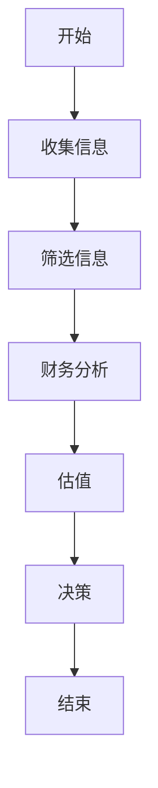

                 

# 芮格的"太难了"篮子：如何避开复杂投资

> 关键词：芒格、投资、简单性、风险管理、长期主义

> 摘要：本文深入探讨了芒格的“太难了”篮子投资理念，分析了其背后的哲学基础、价值投资的基本原理以及如何通过避开复杂投资来实现长期稳健的收益。文章结合实际案例和系统分析，提供了从理论到实践的操作指南。

---

## 第一部分: 芮格"太难了"篮子的背景与核心理念

### 第1章: 芮格"太难了"篮子的背景与核心理念

#### 1.1 芮格投资理念的起源

##### 1.1.1 芮格投资方法的哲学基础

芒格的投资哲学植根于对人类心理和市场行为的深刻理解。他强调，投资不仅仅是对数字的计算，更是对人性的洞察。芒格的“太难了”篮子理念，正是基于这一哲学基础，主张避开那些复杂且难以预测的投资标的，选择那些简单、可预测且容易理解的机会。

##### 1.1.2 "太难了"篮子的定义与目标

“太难了”篮子是芒格提出的一种投资策略，其目标是通过避开那些复杂、不确定的投资领域，集中精力投资于那些简单、可预测且具有长期竞争优势的企业。这种方法的核心在于，通过降低投资标的的复杂性，减少不确定性，从而提高投资成功的概率。

##### 1.1.3 芮格投资与其他投资策略的对比

与传统的价值投资相比，芒格的“太难了”篮子理念更加强调对投资标的简单性和可预测性的关注。与成长型投资相比，芒格的方法更注重长期的稳健性和确定性，而非追求短期的高增长。

#### 1.2 "太难了"篮子的核心要素

##### 1.2.1 简单性：避开复杂投资的智慧

简单性是“太难了”篮子的核心要素之一。芒格认为，复杂的投资标的往往难以预测，容易受到市场情绪和外部环境的影响。因此，选择简单、可预测的投资标的，可以降低投资的风险，提高投资的确定性。

##### 1.2.2 逆向思维：从市场的疯狂中寻找机会

芒格的逆向思维是“太难了”篮子的另一个核心要素。他认为，在市场狂热时，大多数人会选择复杂的、高增长的标的，而这些标的往往定价过高，风险也较大。相反，在市场低迷时，简单且被市场忽视的标的往往会被低估，成为投资的机会。

##### 1.2.3 长期主义：时间是优秀投资的伙伴

长期主义是芒格投资理念的基石。他认为，优秀的企业往往需要时间来验证其竞争优势和盈利能力。通过长期持有优质标的，投资者可以避免短期市场的波动，获得长期的稳健收益。

---

## 第二部分: 价值投资的基本原理

### 第2章: 价值投资的核心概念

#### 2.1 价值投资的核心概念

##### 2.1.1 企业的内在价值计算

芒格认为，投资的本质是购买企业的部分所有权。因此，计算企业的内在价值是投资的第一步。内在价值可以通过对企业未来现金流的折现来计算。公式如下：

$$
\text{内在价值} = \sum_{t=1}^{n} \frac{\text{现金流}_t}{(1 + r)^t}
$$

其中，\( r \) 是折现率，\( n \) 是预测的年数。

##### 2.1.2 市场先生：理性与非理性的交替

芒格将市场比作“市场先生”，市场先生每天都会以不同的价格出售企业的部分所有权。作为投资者，我们需要在市场先生情绪低落时买入，情绪高涨时卖出。

##### 2.1.3 安全边际：保护本金的基石

安全边际是芒格投资理念中的一个重要概念。它指的是，买入价格与企业内在价值之间的差距。通过预留安全边际，投资者可以在市场波动中保护本金，避免因价格波动而造成损失。

#### 2.2 财务报表分析基础

##### 2.2.1 资产负债表：企业的财务健康状况

资产负债表反映了企业的资产、负债和所有者权益。通过分析资产负债表，我们可以了解企业的财务健康状况，判断其是否存在过度杠杆或其他财务风险。

##### 2.2.2 利润表：企业的盈利能力分析

利润表反映了企业在一定时期内的收入和支出情况。通过分析利润表，我们可以了解企业的盈利能力，判断其是否具有可持续的盈利能力。

##### 2.2.3 现金流量表：企业的现金流健康

现金流量表反映了企业在一定时期内的现金流情况。通过分析现金流量表，我们可以了解企业的现金流健康状况，判断其是否具有持续的现金流来源。

---

## 第三部分: "太难了"篮子的投资策略

### 第3章: "太难了"篮子的投资策略

#### 3.1 简单行业的选择

##### 3.1.1 避开复杂行业：寻找容易理解的企业

芒格主张，投资者应选择那些简单、容易理解的企业。例如，公用事业、消费品等行业，这些行业的商业模式简单，容易预测。

##### 3.1.2 简单行业的特征：稳定的商业模式

简单行业的特征是商业模式稳定，市场需求相对稳定。例如，食品行业的需求相对稳定，而高科技行业的市场需求可能受到技术变化的影响较大。

##### 3.1.3 行业选择的误区：避免追逐热点

芒格提醒投资者，应避免追逐市场热点。例如，当市场热衷于高科技企业时，投资者可能会盲目跟风，忽视了这些企业的复杂性和不确定性。

#### 3.2 高质量企业的识别

##### 3.2.1 高ROE企业的特点

高ROE（净资产收益率）企业通常具有较强的盈利能力。ROE的计算公式为：

$$
\text{ROE} = \frac{\text{净利润}}{\text{净资产}}
$$

##### 3.2.2 企业竞争优势的分析：护城河

芒格强调，具有竞争优势的企业通常具有护城河。护城河可以是成本优势、品牌优势、技术优势等。例如，可口可乐的品牌优势就是其护城河。

##### 3.2.3 企业治理结构的重要性

良好的企业治理结构是企业长期成功的重要保障。例如，合理的董事会结构、透明的财务披露等。

---

## 第四部分: 投资决策的系统分析

### 第4章: 投资决策的系统分析

#### 4.1 投资决策的系统架构

##### 4.1.1 信息收集与筛选

投资决策的第一步是信息收集与筛选。投资者需要收集企业的财务报表、行业分析、竞争对手分析等信息。

##### 4.1.2 财务分析与估值

通过财务分析和估值，投资者可以确定企业的内在价值。常用的估值方法包括市盈率、市净率、现金流折现法等。

##### 4.1.3 投资决策的流程图

以下是一个简化的投资决策流程图：

#### 4.2 风险管理与投资组合

##### 4.2.1 风险识别：潜在的投资风险

潜在的投资风险包括市场风险、流动性风险、信用风险等。例如，市场风险是指市场波动对投资组合的影响。

##### 4.2.2 风险评估：量化风险的影响

通过风险评估，投资者可以量化不同风险对投资组合的影响。例如，使用VaR（Value at Risk）模型来衡量投资组合的风险。

##### 4.2.3 投资组合的构建：分散风险

通过分散投资，投资者可以降低投资组合的整体风险。例如，投资于不同行业、不同地区的资产，可以降低因某一特定因素带来的风险。

---

## 第五部分: "太难了"篮子的实战案例

### 第5章: "太难了"篮子的实战案例

#### 5.1 案例分析：寻找简单行业的投资机会

##### 5.1.1 案例一：某简单行业龙头企业的分析

例如，分析一家食品企业的财务报表，判断其是否具有长期竞争优势。

##### 5.1.2 案例二：对比复杂行业的投资风险

例如，分析一家高科技企业的财务报表，判断其是否存在较高的复杂性和不确定性。

#### 5.2 投资决策的误区与经验总结

##### 5.2.1 初学者常见错误

初学者常见的错误包括过度关注短期市场波动、追逐热点、忽视企业的基本面等。

##### 5.2.2 从案例中总结的经验与教训

通过案例分析，我们可以总结出，简单行业的投资机会往往被市场忽视，而复杂行业的投资风险较高。

---

## 第六部分: 风险管理与心理因素

### 第6章: 风险管理与心理因素

#### 6.1 投资中的心理陷阱

##### 6.1.1 情绪化决策：贪婪与恐惧的控制

芒格强调，投资者需要克服贪婪和恐惧的情绪化决策。例如，当市场上涨时，投资者可能会因贪婪而追高；当市场下跌时，投资者可能会因恐惧而抛售。

##### 6.1.2 过度自信：对自身能力的误判

过度自信是投资者常见的心理陷阱。例如，投资者可能会认为自己能够准确预测市场走势，从而忽视了市场的不确定性。

##### 6.1.3 认知偏差：避免误判

认知偏差是人类决策中的常见问题。例如，确认偏差会导致投资者倾向于寻找支持自己观点的信息，而忽视相反的信息。

#### 6.2 长期投资心态的培养

##### 6.2.1 长期投资的优势

长期投资的优势在于，可以避免短期市场的波动，获得企业的长期增长。

##### 6.2.2 如何应对市场的短期波动

芒格建议投资者，应关注企业的长期价值，而非短期市场的波动。例如，当市场出现短期波动时，投资者应保持冷静，避免盲目操作。

---

## 第七部分: 小结与附录

### 第7章: 小结

通过本文的分析，我们可以看到，芒格的“太难了”篮子投资理念，是一种通过避开复杂投资、选择简单且容易理解的企业，从而实现长期稳健收益的方法。这种方法的核心在于，通过降低投资标的的复杂性，减少不确定性，提高投资成功的概率。

### 附录

#### 附录A: 进一步阅读的书籍推荐

1. 《巴菲特与芒格的对话》
2. 《价值投资入门》
3. 《投资的智慧》

#### 附录B: 工具推荐

1. 财务报表分析工具：Excel、Morningstar
2. 投资组合管理工具：M1 Finance、Betterment
3. 数据分析工具：Python、R

#### 附录C: 常见问题解答

1. 什么是“太难了”篮子？答：“太难了”篮子是芒格提出的一种投资策略，主张避开复杂的投资标的，选择简单、可预测的企业进行投资。

2. 如何计算企业的内在价值？答：可以通过现金流折现法来计算企业的内在价值。

3. 投资中的心理陷阱有哪些？答：贪婪与恐惧、过度自信、认知偏差等。

---

通过本文的分析，我们可以看到，芒格的“太难了”篮子投资理念，是一种通过避开复杂投资、选择简单且容易理解的企业，从而实现长期稳健收益的方法。这种方法的核心在于，通过降低投资标的的复杂性，减少不确定性，提高投资成功的概率。

