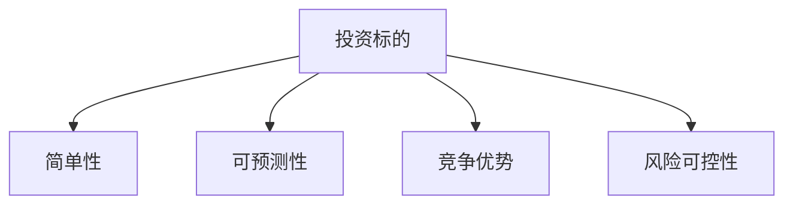
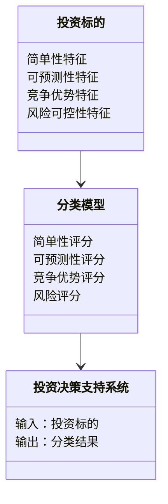

                 


# 芒格的"太难了"篮子：避开复杂投资

> 关键词：芒格，投资策略，简单性原则，复杂性分析，投资决策，风险管理

> 摘要：芒格的“太难了”篮子是一种独特的投资理念，旨在通过避开复杂性来寻找简单而有潜力的投资机会。本文从背景、原理、算法、系统设计、实战案例等方面详细阐述这一投资策略，并结合技术语言进行分析，帮助读者理解如何在复杂的投资领域中找到简单而高效的解决方案。

---

# 第一部分：芒格的“太难了”篮子概述

## 第1章：芒格“太难了”篮子的背景与核心概念

### 1.1 芒格“太难了”篮子的背景介绍

芒格的“太难了”篮子理念源自其投资哲学的核心——避免复杂性和不确定性。这一理念强调，在投资决策中，选择那些简单、可预测、具有竞争优势且风险可控的机会，而非那些过于复杂、难以评估的标的。

#### 1.1.1 投资领域的复杂性问题

现代投资领域充斥着大量的复杂性，包括不断变化的市场环境、难以预测的经济波动、复杂的金融工具以及信息过载等。这些复杂性使得许多投资者难以准确评估投资机会，容易陷入决策失误的困境。

#### 1.1.2 芒格投资理念的形成背景

芒格的投资哲学深受其导师巴菲特的影响，但其独特的思维方式使其形成了“太难了”篮子的理念。他认为，投资者的时间和精力有限，应该专注于那些简单而有潜力的机会，避免被复杂性所拖累。

#### 1.1.3 “太难了”篮子的核心问题背景

“太难了”篮子的核心问题在于如何通过简单性原则，筛选出那些容易理解和可预测的投资机会，同时避免那些复杂性过高的标的。这种筛选方法不仅能够降低投资风险，还能提高投资的可操作性和长期收益。

### 1.2 芒格“太难了”篮子的核心概念

#### 1.2.1 “太难了”篮子的定义与特点

“太难了”篮子是指那些过于复杂、难以评估、风险过高或竞争优势不足的投资机会。芒格认为，这些标的应该被排除在投资组合之外，因为它们难以带来稳定的收益，反而可能导致重大损失。

#### 1.2.2 篮子的核心要素与组成结构

“太难了”篮子的核心要素包括：

1. **简单性**：标的的业务模式、财务状况和竞争优势必须简单易懂。
2. **可预测性**：标的的未来表现具有较高的可预测性。
3. **竞争优势**：标的必须具备明显的竞争优势，如成本优势、品牌优势等。
4. **风险可控性**：标的的风险必须在可接受的范围内。

#### 1.2.3 篮子的边界与外延

“太难了”篮子的边界在于，它只关注那些过于复杂或不确定性过高的投资机会。其外延则包括那些简单、可预测、竞争优势明显且风险可控的投资机会。

---

## 第2章：芒格“太难了”篮子的核心原理

### 2.1 篮子的决策逻辑

芒格的“太难了”篮子的决策逻辑基于以下几个步骤：

1. **筛选简单性**：优先选择那些简单易懂的投资机会。
2. **评估可预测性**：分析标的的未来表现是否具有较高的可预测性。
3. **竞争优势分析**：评估标的是否具备明显的优势。
4. **风险评估**：判断标的的风险是否在可接受范围内。

### 2.2 篮子的核心概念属性对比

| 属性 | 描述 |
|------|------|
| 简单性 | 投资标的的业务模式简单，易于理解和预测 |
| 可预测性 | 标的的未来表现具有较高的可预测性 |
| 竞争优势 | 标的具备明显的竞争优势，如成本优势、品牌优势等 |
| 风险可控性 | 标的风险在可接受范围内，不会对投资组合造成重大影响 |

### 2.3 篮子的ER实体关系图



---

## 第3章：芒格“太难了”篮子的算法原理

### 3.1 篮子的分类算法

芒格的“太难了”篮子的分类算法基于以下标准：

1. **简单性评分**：通过量化指标评估标的的简单性。
2. **可预测性评分**：通过模型预测标的的未来表现。
3. **竞争优势评分**：分析标的的竞争优势。
4. **风险评分**：评估标的的风险。

#### 3.1.1 分类标准

```mermaid
graph TD
    Start --> Classify
    Classify --> (简单性判断)
    Classify --> (可预测性判断)
    Classify --> (竞争优势判断)
    Classify --> (风险可控性判断)
    Classify --> End
```

### 3.2 篮子的数学模型

#### 3.2.1 简单性评分模型

$$ \text{简单性评分} = \frac{\text{简单性特征} \times 0.4 + \text{可预测性特征} \times 0.3 + \text{竞争优势特征} \times 0.2 + \text{风险可控性特征} \times 0.1} $$

---

## 第4章：芒格“太难了”篮子的系统分析与架构设计

### 4.1 问题场景介绍

在实际投资过程中，投资者需要面对复杂的市场环境和大量的信息。为了简化决策过程，芒格提出了“太难了”篮子的理念，帮助投资者筛选出那些简单而有潜力的投资机会。

### 4.2 系统功能设计

#### 4.2.1 领域模型



---

## 第5章：芒格“太难了”篮子的项目实战

### 5.1 环境安装

为了实现“太难了”篮子的分类算法，我们需要安装以下环境：

1. **Python**：用于代码实现
2. **Mermaid**：用于绘制图表
3. **LaTeX**：用于公式展示

### 5.2 代码实现

#### 5.2.1 简单性评分函数

```python
def calculate_simplicity_score(asset):
    # 简单性特征
    simplicity_feature = asset.simplicity
    # 可预测性特征
    predictability_feature = asset.predictability
    # 竞争优势特征
    competitive_advantage_feature = asset.competitive_advantage
    # 风险可控性特征
    risk_control_feature = asset.risk_control
    # 简单性评分公式
    simplicity_score = (simplicity_feature * 0.4 +
                        predictability_feature * 0.3 +
                        competitive_advantage_feature * 0.2 +
                        risk_control_feature * 0.1)
    return simplicity_score
```

---

## 第6章：总结与建议

### 6.1 总结

芒格的“太难了”篮子是一种简单而有效的投资策略，通过避免复杂性和不确定性，帮助投资者找到那些简单而有潜力的投资机会。这种方法不仅能够降低投资风险，还能提高投资的可操作性和长期收益。

### 6.2 最佳实践

1. **保持简单性**：始终关注那些简单易懂的投资机会。
2. **持续学习**：不断学习和提升自己的投资知识和能力。
3. **风险控制**：在投资决策中，始终关注风险的可控性。

---

通过以上分析，我们可以看到芒格的“太难了”篮子是一种简单而高效的策略，能够在复杂的投资环境中帮助投资者找到那些简单而有潜力的机会。这种方法不仅适用于个人投资者，也适用于机构投资者。

