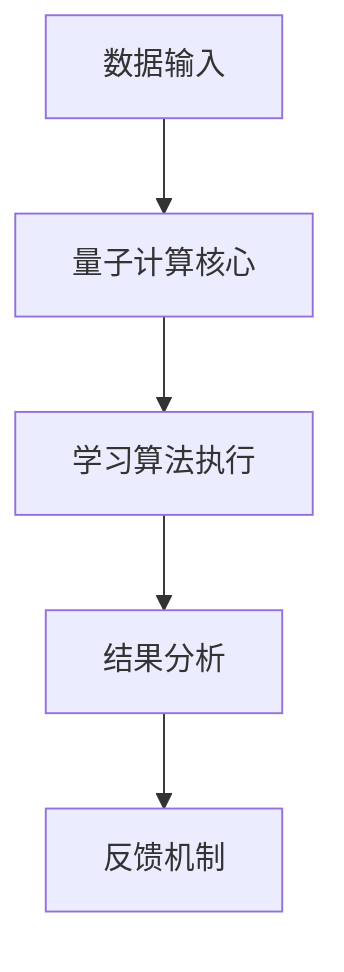
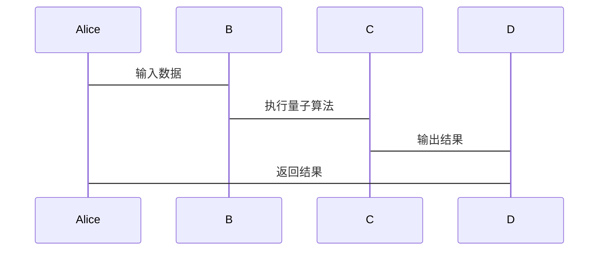

                 

# 芒格的"学习机器"理念在量子机器学习系统开发中的应用

## 关键词：芒格，学习机器，量子机器学习，量子计算，算法，系统架构

## 摘要：
芒格的"学习机器"理念强调通过持续学习和自适应能力来优化决策过程。本文探讨了如何将这一理念应用于量子机器学习系统开发中，结合量子计算的优势，提出了一种新的系统架构和算法设计。通过分析量子计算的核心原理、学习机器的数学模型，以及系统架构的设计，本文为量子机器学习的未来发展提供了新的思路和实践方案。

---

## 第1章: 芒格的"学习机器"理念

### 1.1 学习机器的基本概念

#### 1.1.1 学习机器的定义
学习机器是一种能够从数据中自动学习并改进性能的系统，其核心在于通过数据驱动的方式不断优化自身的决策或预测能力。与传统的基于规则的系统不同，学习机器通过训练数据来发现模式和规律。

#### 1.1.2 学习机器的核心特征
- **自适应性**：能够根据新数据动态调整模型参数。
- **数据驱动**：依赖于大量数据进行训练和优化。
- **泛化能力**：能够在未见过的数据上做出合理的预测或决策。

#### 1.1.3 学习机器与传统机器学习的区别
| 特性             | 学习机器                     | 传统机器学习                 |
|------------------|-----------------------------|------------------------------|
| 数据依赖性       | 高                           | 中                           |
| 自适应能力       | 强                           | 弱                           |
| 模型复杂度       | 高                           | 中                           |
| 应用场景         | 复杂、动态环境               | 稳定、规则明确的环境           |

### 1.2 芒格"学习机器"理念的背景

#### 1.2.1 芒格投资哲学的核心思想
芒格认为，投资决策的关键在于对知识的积累和对复杂系统的理解。他提倡构建一个“学习机器”，通过不断吸收新知识和调整决策策略，来应对复杂多变的市场环境。

#### 1.2.2 "学习机器"理念的提出与演变
- **提出背景**：芒格在投资实践中发现，传统的基于规则的投资策略在面对复杂市场时往往失效。
- **理念演变**：从最初的“知识网络”概念，逐步发展为一种动态学习和优化的系统模型。

#### 1.2.3 理念在现代科技中的应用价值
- **技术进步**：现代计算机技术的发展为“学习机器”的实现提供了可能性。
- **应用场景**：在金融、医疗、教育等领域，学习机器的理念可以帮助系统更好地适应复杂环境。

---

## 第2章: 量子机器学习的基础

### 2.1 量子计算的基本原理

#### 2.1.1 量子力学基础
量子计算基于量子力学的基本原理，包括：
- **量子叠加**：量子系统可以同时处于多个状态的叠加态。
- **量子纠缠**：两个或多个量子系统之间的强关联性，使得对其中一个系统的测量会立即影响另一个系统。

#### 2.1.2 量子计算的核心概念
- **量子位（qubit）**：量子计算的基本单位，可以同时表示0和1。
- **量子门（quantum gate）**：用于对量子位进行操作的基本逻辑单元。

#### 2.1.3 量子计算与经典计算的对比
| 特性             | 量子计算                     | 经典计算                     |
|------------------|-----------------------------|------------------------------|
| 并行性           | 高                           | 低                           |
| 状态空间         | 高维                         | 低维                         |
| 计算速度         | 在某些问题上远快于经典计算   | 在大多数问题上表现稳定       |

### 2.2 量子机器学习的定义与特点

#### 2.2.1 量子机器学习的定义
量子机器学习是指利用量子计算的特性，通过量子算法来实现机器学习任务的一种新兴技术。

#### 2.2.2 量子机器学习的核心优势
- **计算速度**：在某些特定问题上，量子机器学习可以显著提高计算速度。
- **数据处理能力**：量子系统能够处理高维数据，发现传统方法难以察觉的模式。

#### 2.2.3 量子机器学习的挑战与限制
- **技术成熟度**：目前量子计算技术尚未完全成熟。
- **算法复杂性**：量子机器学习算法的设计和实现相对复杂。

---

## 第3章: "学习机器"理念在量子机器学习中的应用

### 3.1 学习机器理念的核心要素

#### 3.1.1 知识表示与更新机制
- **知识表示**：通过量子计算的特性，构建一种动态的知识表示方式。
- **更新机制**：设计一种能够根据新数据动态调整模型的机制。

#### 3.1.2 自适应学习策略
- **在线学习**：系统能够实时处理数据并不断更新模型。
- **策略优化**：通过量子计算的特性，优化学习策略。

#### 3.1.3 知识网络的构建与优化
- **知识网络**：构建一个能够表示多种知识的网络结构。
- **网络优化**：通过量子计算的特性，优化网络的结构和参数。

### 3.2 量子计算在学习机器中的应用

#### 3.2.1 量子计算如何提升学习效率
- **并行处理**：量子计算的并行性可以显著提高数据处理效率。
- **模式识别**：量子计算能够快速识别数据中的复杂模式。

#### 3.2.2 量子计算在知识表示中的作用
- **高效表示**：通过量子叠加和纠缠，实现高效的知识表示。
- **动态更新**：量子计算能够实时更新知识表示，适应新数据的变化。

#### 3.2.3 量子计算与学习机器的结合案例
- **金融投资**：通过量子机器学习，构建一种能够实时调整投资策略的系统。
- **医疗诊断**：利用量子计算的特性，提高疾病诊断的准确性和效率。

---

## 第4章: 量子机器学习算法的核心原理

### 4.1 量子机器学习算法的分类

#### 4.1.1 基于量子叠加的算法
- **原理**：利用量子叠加的特性，同时处理多个数据点。
- **应用**：在模式识别和分类任务中表现优异。

#### 4.1.2 基于量子纠缠的算法
- **原理**：通过量子纠缠，实现数据之间的强关联性。
- **应用**：在复杂系统的建模和模拟中表现优异。

#### 4.1.3 基于量子测量的算法
- **原理**：通过量子测量，获取系统的状态信息。
- **应用**：在参数估计和优化任务中表现优异。

### 4.2 量子支持向量机的原理

#### 4.2.1 支持向量机的基本原理
支持向量机是一种监督学习算法，通过找到一个超平面，将数据分成不同的类别。

#### 4.2.2 量子支持向量机的数学模型
$$
\text{目标函数：} \quad \min_{w, b, \xi} \frac{1}{2}||w||^2 + C\sum_{i=1}^n \xi_i
$$
$$
\text{约束条件：} \quad y_i(w \cdot x_i + b) \geq 1 - \xi_i, \quad \xi_i \geq 0
$$

#### 4.2.3 量子支持向量机的实现步骤
1. 将数据映射到高维空间。
2. 使用量子计算的特性，优化目标函数。
3. 找到最优解，完成分类任务。

### 4.3 量子神经网络的原理

#### 4.3.1 神经网络的基本原理
神经网络是一种模仿人脑结构的计算模型，通过多层的神经元和权重，实现数据的非线性变换。

#### 4.3.2 量子神经网络的构建方法
- **量子神经元**：通过量子叠加和纠缠，构建量子神经元。
- **网络结构**：设计一种能够利用量子计算优势的网络结构。

#### 4.3.3 量子神经网络的训练过程
1. 初始化量子神经网络的参数。
2. 通过量子计算，优化网络的权重。
3. 验证网络的性能，调整参数。

---

## 第5章: 量子机器学习系统的架构与实现

### 5.1 量子机器学习系统的架构设计

#### 5.1.1 数据输入与处理模块
- **数据输入**：接收外部数据，进行预处理。
- **数据转换**：将数据转换为适合量子计算的格式。

#### 5.1.2 量子计算核心模块
- **量子计算单元**：执行量子算法，处理数据。
- **结果输出**：将量子计算的结果输出到后续模块。

#### 5.1.3 学习算法执行模块
- **算法选择**：根据任务选择合适的量子算法。
- **算法执行**：执行量子算法，完成学习任务。

#### 5.1.4 结果分析与反馈模块
- **结果分析**：对量子计算的结果进行分析，评估模型性能。
- **反馈机制**：根据分析结果，调整模型参数。

---

## 第6章: 项目实战

### 6.1 项目背景与目标
- **项目背景**：介绍项目的背景和意义。
- **项目目标**：明确项目的预期成果和目标。

### 6.2 系统功能设计

#### 6.2.1 功能模块划分
- **数据输入模块**：接收数据并进行预处理。
- **量子计算模块**：执行量子算法，处理数据。
- **学习算法模块**：选择和执行合适的量子算法。
- **结果分析模块**：分析结果并反馈到系统。

#### 6.2.2 功能流程图

### 6.3 系统架构设计

#### 6.3.1 系统架构图

### 6.4 系统接口设计

#### 6.4.1 系统接口
- **输入接口**：接收外部数据。
- **输出接口**：输出量子计算结果。

#### 6.4.2 交互流程图

### 6.5 项目实现与案例分析

#### 6.5.1 项目实现
- **环境配置**：介绍量子计算环境的配置。
- **代码实现**：提供量子算法的代码实现。
- **运行结果**：展示项目运行的结果。

#### 6.5.2 案例分析
- **案例背景**：介绍案例的背景和目标。
- **数据分析**：分析案例的数据。
- **结果解读**：解读项目的运行结果。

---

## 第7章: 总结与展望

### 7.1 全文总结
- **核心内容回顾**：总结全文的核心内容和主要观点。
- **技术总结**：总结量子机器学习技术的现状和发展。

### 7.2 未来展望
- **技术发展**：预测量子机器学习技术的未来发展方向。
- **应用前景**：探讨量子机器学习在更多领域的应用潜力。

### 7.3 最佳实践 tips
- **技术建议**：给出在量子机器学习开发中的一些技术建议。
- **实践建议**：提供一些实用的开发经验和技巧。

---

## 结语
芒格的"学习机器"理念为我们提供了一种新的思考方式，而量子机器学习技术则为我们提供了一种新的技术手段。通过将两者结合，我们可以构建一种更加智能和高效的系统，为未来的科技发展提供新的可能性。

