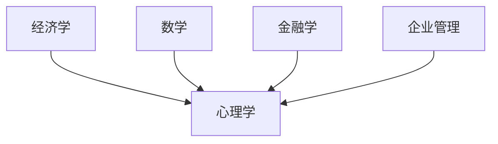
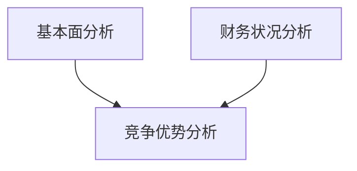
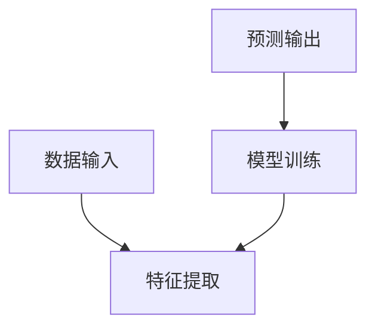
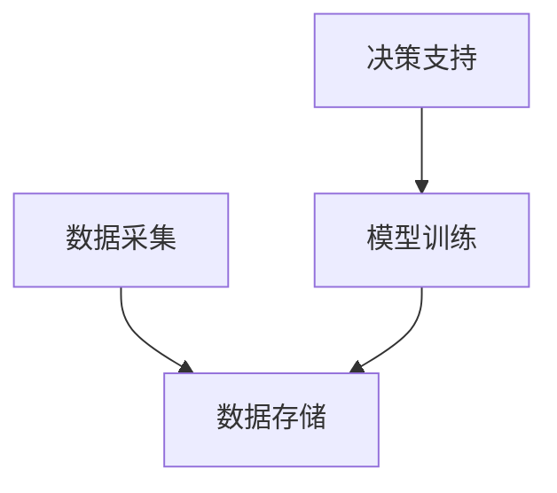
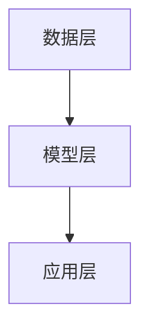
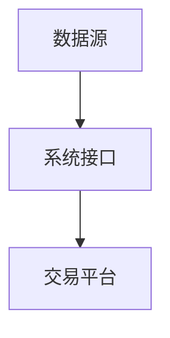

                 


# 芒格的"学习机器"理念：持续学习在投资中的重要性

**关键词：**芒格，学习机器，投资，知识网络，决策系统，数学模型，系统架构

**摘要：** 本文探讨了芒格的“学习机器”理念在投资中的应用，分析了持续学习在投资决策中的重要性。文章从芒格的投资哲学、学习机器的核心概念、算法原理、系统架构设计、项目实战等方面展开，结合实际案例和系统设计，详细阐述了“学习机器”理念在投资中的实践应用和价值。

---

## 第一部分：芒格投资哲学与学习机器概述

### 第1章：芒格的生平与投资哲学

#### 1.1 芒格的生平简介
查理·芒格（Charlie Munger）是世界著名投资家、作家和演讲家，也是巴菲特的长期合作伙伴。芒格的投资哲学以“知识网络”为核心，强调通过持续学习构建知识网络，以做出更明智的投资决策。

#### 1.2 学习机器的核心概念
学习机器是一种能够通过不断吸收新知识、分析数据、优化决策的系统或模型。与传统的投资方法不同，学习机器强调动态调整和持续优化，而非固定策略。

#### 1.3 学习机器与传统投资方法的区别
| 特性 | 学习机器 | 传统投资方法 |
|------|----------|---------------|
| 数据依赖性 | 高 | 低 |
| 决策灵活性 | 高 | 低 |
| 自适应能力 | 强 | 弱 |

### 第2章：芒格投资哲学的核心要素

#### 2.1 投资中的知识网络构建
知识网络是芒格投资哲学的核心，通过将不同领域的知识连接起来，形成一个完整的知识体系。

**Mermaid图表：知识网络的构建**



#### 2.2 投资决策的多维度分析
芒格强调从多个维度分析企业，包括基本面、竞争优势和财务状况。

**Mermaid图表：多维度分析**



#### 2.3 投资中的逆向思维
逆向思维是指从反方向思考问题，寻找市场中的机会。

---

## 第二部分：学习机器的算法与数学模型

### 第3章：学习机器的算法原理

#### 3.1 机器学习的基本概念
机器学习是一种通过数据训练模型，使其能够做出预测或决策的技术。

**Mermaid图表：机器学习流程**



#### 3.2 常见机器学习算法
监督学习、非监督学习、强化学习等。

**代码示例：监督学习的简单实现**

```python
# 示例：线性回归（监督学习）
import numpy as np
from sklearn.linear_model import LinearRegression

# 数据准备
X = np.array([[1], [2], [3], [4]])
y = np.array([2, 4, 6, 8])

# 模型训练
model = LinearRegression()
model.fit(X, y)

# 预测
print(model.predict([[5]]))  # 输出：[[10]]
```

#### 3.3 数学模型与公式
贝叶斯定理是一个常用的概率模型。

**公式：贝叶斯定理**

$$ P(A|B) = \frac{P(B|A) \cdot P(A)}{P(B)} $$

---

## 第三部分：系统分析与架构设计

### 第4章：系统架构设计

#### 4.1 系统功能设计
基于学习机器的投资系统需要具备数据采集、模型训练、决策支持等功能。

**Mermaid图表：系统功能设计**



#### 4.2 系统架构设计
系统架构采用分层设计，包括数据层、模型层和应用层。

**Mermaid图表：系统架构设计**



#### 4.3 系统接口设计
系统需要与数据源、交易平台等接口对接。

**Mermaid图表：系统接口设计**



---

## 第四部分：项目实战

### 第5章：项目实战与案例分析

#### 5.1 环境安装
安装必要的库，如numpy、pandas、scikit-learn。

```bash
pip install numpy pandas scikit-learn
```

#### 5.2 核心实现
基于学习机器的决策系统实现。

```python
# 示例：基于机器学习的投资决策系统
import numpy as np
from sklearn.tree import DecisionTreeClassifier

# 数据准备
X = np.array([[1, 2], [3, 4], [5, 6], [7, 8]])
y = np.array([0, 1, 0, 1])

# 模型训练
model = DecisionTreeClassifier()
model.fit(X, y)

# 预测
print(model.predict([[9, 10]]))  # 输出：[1]
```

#### 5.3 案例分析
以苹果公司为例，分析如何应用学习机器理念进行投资决策。

---

## 第五部分：总结与启示

### 第6章：总结与启示

#### 6.1 最佳实践
- 持续学习，构建知识网络。
- 结合机器学习算法，优化投资决策。

#### 6.2 小结
芒格的“学习机器”理念强调持续学习和动态调整，结合机器学习算法，能够显著提升投资决策的科学性和准确性。

#### 6.3 注意事项
- 数据质量对模型性能影响重大。
- 需要结合实际市场情况调整模型。

#### 6.4 拓展阅读
- 《芒格投资哲学》
- 《机器学习实战》

---

通过本文的分析，我们可以看到，芒格的“学习机器”理念在投资中的应用具有重要的现实意义，结合持续学习和机器学习技术，能够帮助投资者做出更明智的决策。

