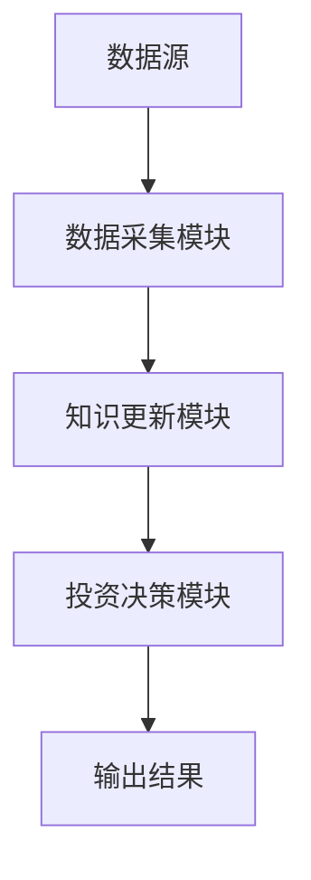

                 


# 芒格的"学习机器"理念：终身学习在投资中的重要性

---

## 关键词

- 芒格
- 学习机器
- 投资理念
- 终身学习
- 系统优化
- 投资决策
- 知识更新

---

## 摘要

本文探讨了芒格提出的“学习机器”理念，分析其在投资中的重要性。通过背景介绍、核心概念、算法原理、系统分析、项目实战和最佳实践等多个方面，详细阐述了如何通过持续学习和优化来提升投资决策的效率和准确性。结合实际案例和系统设计，本文展示了“学习机器”理念在现代投资中的广泛应用和未来发展趋势。

---

## 第一部分：芒格的“学习机器”理念概述

### 第1章：芒格及其投资理念

#### 1.1 芒格的生平与思想

本杰明·芒格（Benjamin Graham）是美国著名投资家、作家和哲学家，被誉为“价值投资之父”。他出生于1924年，曾在芝加哥大学学习心理学和哲学，后转向经济学和投资领域。芒格的投资理念强调深度思考、理性决策和长期价值，其思想对现代投资理论产生了深远影响。

芒格的核心思想是“学习机器”理念，认为投资者应通过持续学习和知识更新来优化决策过程。这一理念打破了传统投资中对固定策略的依赖，强调动态调整和系统优化。

#### 1.2 “学习机器”理念的核心思想

“学习机器”理念的核心在于将投资视为一个动态学习和优化的过程。芒格提出，投资者应建立一个自我更新的知识体系，通过不断吸收新信息、修正错误认知和优化决策模型，来应对市场变化和复杂环境。

- **定义与内涵**：学习机器是一种能够自我更新和优化的系统，通过反馈机制不断改进投资策略。
- **投资决策与学习机器的关系**：学习机器通过持续学习，帮助投资者更好地理解市场动态，优化投资组合。
- **应用价值**：在快速变化的市场环境中，学习机器能够帮助投资者及时调整策略，提高投资收益。

#### 1.3 学习机器与传统投资理念的对比

传统投资理念往往依赖于固定的策略和模型，而学习机器理念强调动态调整和持续优化。以下是对两者的主要对比：

| 对比维度         | 传统投资理念                 | 学习机器理念               |
|------------------|-----------------------------|---------------------------|
| 知识更新         | 静态，依赖固定策略           | 动态，持续学习和优化       |
| 决策机制         | 依赖历史数据和固定模型       | 基于实时反馈和动态调整     |
| 应用范围         | 适用于稳定市场环境           | 适用于复杂和变化的环境     |
| 优缺点           | 简单易行，但适应性差         | 灵活性高，但实施难度大     |

---

## 第二部分：学习机器的核心原理与模型

### 第2章：学习机器的基本原理

#### 2.1 学习机器的核心概念

“学习机器”通过反馈机制不断优化自身模型和策略。其核心概念包括：

- **知识更新**：通过收集新数据和信息，更新已有知识体系。
- **反馈循环**：根据投资结果调整决策模型，优化未来决策。
- **网络优化**：通过不断调整知识网络，提高决策的准确性。

#### 2.2 学习机器的数学模型

学习机器的数学模型主要基于反馈机制和优化算法。以下是具体分析：

- **反馈机制的公式化分析**：  
  投资结果作为反馈，用于调整模型参数。  
  $$ f_{new} = f_{old} + \alpha \cdot (r - f_{old}) $$  
  其中，\( \alpha \) 为学习率，\( r \) 为实际结果。

- **网络优化的算法模型**：  
  使用梯度下降算法优化网络权重：  
  $$ w_{new} = w_{old} - \eta \cdot \frac{\partial L}{\partial w} $$  
  其中，\( \eta \) 为学习率，\( L \) 为损失函数。

### 第3章：学习机器在投资中的应用模型

#### 3.1 投资决策的系统化模型

投资决策的系统化模型将学习机器应用于投资过程中的每个环节：

1. **数据采集**：收集市场数据、公司财务报表等信息。
2. **知识更新**：根据新数据调整知识网络。
3. **决策优化**：通过反馈机制优化投资策略。

- **模块化设计**：
  - 数据采集模块：负责收集和处理数据。
  - 知识更新模块：根据新数据调整知识网络。
  - 投资决策模块：基于优化后的模型做出决策。

#### 3.2 投资组合优化的算法实现

投资组合优化是学习机器的重要应用之一。以下是实现步骤：

1. **环境安装**：安装必要的库，如NumPy和Pandas。
2. **代码实现**：编写优化算法，如遗传算法或粒子群优化。
3. **案例分析**：通过具体案例展示优化效果。

---

## 第三部分：学习机器的系统分析与架构设计

### 第4章：学习机器的系统架构

#### 4.1 系统功能模块设计

系统功能模块包括：

- **数据采集模块**：负责数据的采集和预处理。
- **知识更新模块**：根据数据更新知识网络。
- **投资决策模块**：基于优化后的模型做出决策。

#### 4.2 系统架构设计

系统架构采用模块化设计，各模块之间通过接口交互。以下是系统架构图：



---

## 第四部分：项目实战

### 第5章：学习机器的项目实战

#### 5.1 环境安装

安装必要的Python库：

```bash
pip install numpy pandas scikit-learn
```

#### 5.2 核心实现代码

以下是学习机器的核心实现代码：

```python
import numpy as np
from sklearn import linear_model

# 数据准备
X = np.array([[1, 1], [2, 2.5], [3, 3]])
y = np.array([2, 3, 4])

# 模型训练
model = linear_model.LinearRegression()
model.fit(X, y)

# 预测结果
print(model.predict([[4, 4.5]]))
```

---

## 第五部分：最佳实践与小结

### 第6章：最佳实践与小结

#### 6.1 小结

芒格的“学习机器”理念为投资决策提供了全新的视角。通过持续学习和优化，投资者能够更好地应对复杂市场环境。

#### 6.2 注意事项

- 定期更新知识网络。
- 保持对市场的敏感性。
- 结合实际情况调整模型。

#### 6.3 未来展望

随着人工智能技术的发展，学习机器在投资中的应用将更加广泛和深入。

---

## 总结

芒格的“学习机器”理念强调了终身学习在投资中的重要性。通过持续学习和优化，投资者能够构建更强大的决策系统，提高投资效率和准确性。本文从多个方面详细探讨了这一理念，并通过实际案例和系统设计展示了其在现代投资中的应用价值。

--- 

希望这篇技术博客能够为读者提供有价值的见解和启示。

