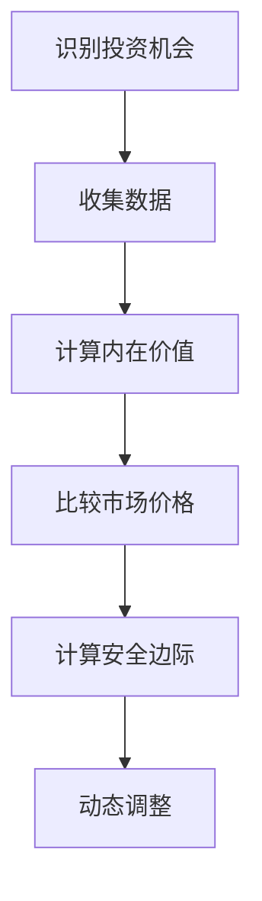

                 


# 第二部分: 安全边际理念的数学模型与算法实现

## 第4章: 安全边际理念的数学模型

### 4.1 内在价值的计算模型

#### 4.1.1 内在价值的定义
内在价值是指在考虑了所有相关信息后，资产的真正价值。它是投资者在评估资产时的重要依据，而安全边际则是内在价值与市场价格之间的差额。

#### 4.1.2 内在价值的计算公式
$$ V = \frac{CF}{(r - g)} $$
其中，\( V \) 是内在价值，\( CF \) 是未来现金流，\( r \) 是折现率，\( g \) 是增长率。

#### 4.1.3 内在价值计算的步骤
1. 预测未来的现金流。
2. 确定合适的折现率和增长率。
3. 使用上述公式计算内在价值。

### 4.2 安全边际的计算公式

#### 4.2.1 安全边际的定义
安全边际是市场价格与内在价值之间的差额。当市场价格低于内在价值时，存在安全边际。

$$ \text{安全边际} = \text{市场价格} - \text{内在价值} $$

#### 4.2.2 安全边际的百分比计算
有时，安全边际也可以用百分比来表示，即：

$$ \text{安全边际百分比} = \frac{\text{市场价格} - \text{内在价值}}{\text{内在价值}} \times 100\% $$

### 4.3 安全边际的动态调整模型

#### 4.3.1 市场价格波动对安全边际的影响
市场价格的波动会影响安全边际的大小。当市场价格下跌时，安全边际增加；当市场价格上升时，安全边际减少。

#### 4.3.2 内在价值变化对安全边际的影响
内在价值的变化通常较为缓慢，但当公司基本面发生变化时，内在价值也会相应调整，从而影响安全边际。

#### 4.3.3 动态调整的步骤
1. 定期重新评估公司的内在价值。
2. 调整市场价格与内在价值的差异。
3. 根据新的安全边际调整投资决策。

---

## 第5章: 安全边际理念的算法实现

### 5.1 安全边际分析的算法步骤

#### 5.1.1 识别投资机会
- 确定目标行业和公司。
- 进行初步筛选，排除不符合条件的公司。

#### 5.1.2 评估内在价值
- 收集公司的财务数据。
- 使用内在价值计算公式进行评估。

#### 5.1.3 计算安全边际
- 比较市场价格与内在价值。
- 计算安全边际的大小。

#### 5.1.4 动态调整
- 定期更新内在价值和市场价格。
- 根据安全边际的变化调整投资组合。

### 5.2 安全边际分析的流程图



### 5.3 安全边际分析的Python实现

#### 5.3.1 环境安装
- 安装必要的Python库，如`numpy`和`pandas`。

#### 5.3.2 核心代码实现

```python
import numpy as np
import pandas as pd

def calculate_intrinsic_value(cash_flows, discount_rate, growth_rate):
    """
    计算内在价值
    """
    # 计算未来现金流的现值
    pv = cash_flows / (discount_rate - growth_rate)
    return pv

def calculate_margin_of_safety(price, intrinsic_value):
    """
    计算安全边际
    """
    mos = price - intrinsic_value
    return mos

# 示例数据
cash_flows = 100  # 未来现金流
discount_rate = 0.1  # 折现率
growth_rate = 0.05  # 增长率
price = 80  # 市场价格

# 计算内在价值
intrinsic_value = calculate_intrinsic_value(cash_flows, discount_rate, growth_rate)
print("内在价值:", intrinsic_value)

# 计算安全边际
mos = calculate_margin_of_safety(price, intrinsic_value)
print("安全边际:", mos)

if mos > 0:
    print("存在安全边际，可以考虑投资")
else:
    print("没有安全边际，投资风险较高")
```

#### 5.3.3 代码解读与应用
- 该代码展示了如何计算内在价值和安全边际。
- 输入参数包括未来现金流、折现率和增长率。
- 根据计算结果，判断是否存在安全边际，从而做出投资决策。

### 5.4 实际案例分析

#### 5.4.1 案例背景
假设某公司的未来现金流为100，折现率为10%，增长率5%，市场价格为80。

#### 5.4.2 计算过程
1. 计算内在价值：
$$ V = \frac{100}{0.1 - 0.05} = 2000 $$
2. 计算安全边际：
$$ \text{安全边际} = 80 - 2000 = -1920 $$

#### 5.4.3 结论
由于安全边际为负，说明市场价格高于内在价值，存在较高的投资风险，应谨慎考虑投资。

---

### 5.5 项目小结

#### 5.5.1 核心实现
- 确定内在价值和市场价格。
- 计算安全边际并进行动态调整。

#### 5.5.2 注意事项
- 数据的准确性和及时性至关重要。
- 安全边际的计算需要结合实际情况进行调整。
- 投资决策应综合考虑多种因素，而不仅仅是安全边际。

#### 5.5.3 拓展阅读
- 《投资最重要的事情》——本杰明·格雷厄姆
- 《安全边际》——查理·芒格

---

通过以上步骤，我们可以系统地应用安全边际理念进行投资分析，确保在投资决策中考虑风险与收益的平衡。这种方法不仅能够帮助投资者做出更加理性的决策，还能在复杂多变的市场环境中提高投资的成功率。

