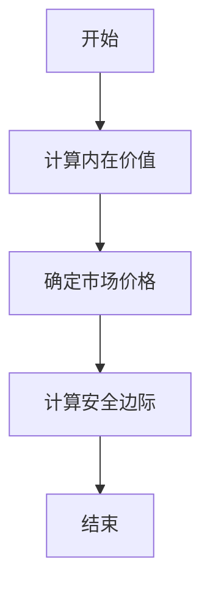
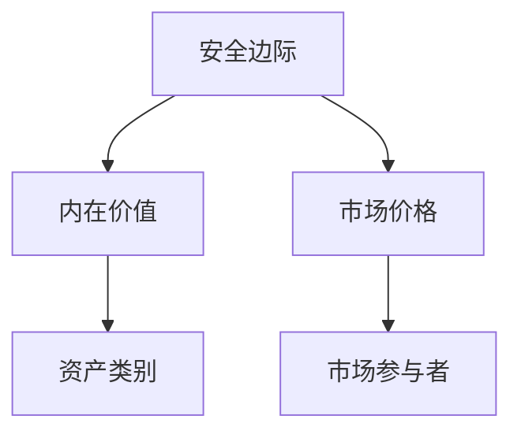
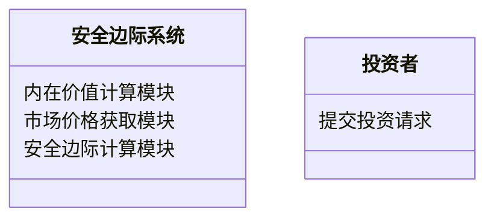
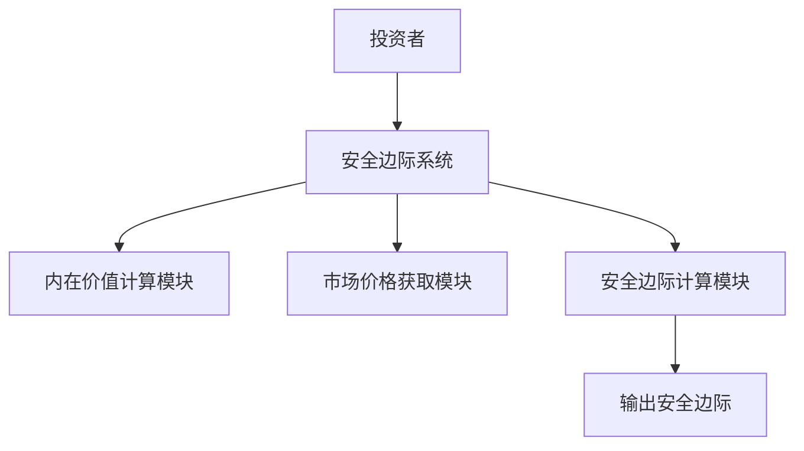
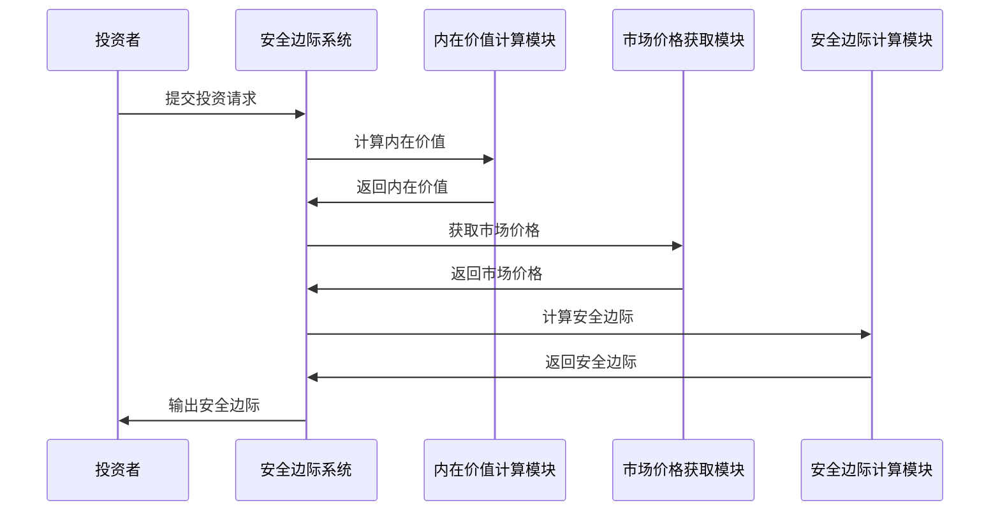

                 


# 芒格的"安全边际"理念：降低投资风险的关键

**关键词：** 投资风险、安全边际、芒格、价值投资、数学模型

**摘要：** 芒格的“安全边际”理念是降低投资风险的重要策略，本文通过详细分析安全边际的核心概念、数学模型、系统架构和实际应用，帮助投资者理解和应用这一理念，从而在投资决策中做出更明智的选择。

---

# 第一章: 安全边际的背景与核心概念

## 1.1 投资中的风险与安全边际

### 1.1.1 投资中的主要风险类型

在投资领域，风险主要分为市场风险、流动性风险、信用风险等。这些风险可能导致投资损失，因此，投资者需要采取有效的风险管理策略，如芒格的安全边际理念。

### 1.1.2 安全边际的定义与内涵

安全边际是指资产的市场价格低于其内在价值的部分，它为投资者提供了“缓冲区”，以应对市场价格波动带来的风险。具体来说，当市场价格低于内在价值时，两者之间的差额即为安全边际。

### 1.1.3 安全边际与投资回报的关系

安全边际越大，投资的风险越低，同时潜在的回报也越高。这是因为当市场价格回归内在价值时，投资者能够获得更高的收益。

## 1.2 芒格投资理念的核心要素

### 1.2.1 芒格的“格栅”思维模型

芒格强调投资者需要构建一个多学科的知识框架，通过跨领域的知识来更好地理解投资标的的价值。

### 1.2.2 芒格的“能力圈”概念

投资者应只投资于自己能够理解的领域，这有助于降低信息不对称带来的风险。

### 1.2.3 芒格的安全边际与价值投资的区别与联系

虽然安全边际与价值投资密切相关，但安全边际更注重价格与价值的差异，而不仅仅是寻找被低估的资产。

## 1.3 安全边际在不同资产类别中的应用

### 1.3.1 股票投资中的安全边际

在股票投资中，安全边际可以通过计算市盈率、市净率等指标来确定。

### 1.3.2 债券投资中的安全边际

在债券投资中，安全边际可以通过评估债券的信用评级和市场价格来确定。

### 1.3.3 其他资产类别中的安全边际

除了股票和债券，安全边际理念还可以应用于房地产、黄金等多种资产类别。

---

# 第二章: 安全边际的数学模型与算法原理

## 2.1 安全边际的计算公式

### 2.1.1 安全边际的通用公式

$$\text{安全边际} = \frac{\text{内在价值} - \text{市场价格}}{\text{市场价格}}$$

### 2.1.2 安全边际的变种公式

$$\text{安全边际} = \frac{\text{市场价格} - \text{内在价值}}{\text{内在价值}}$$

## 2.2 安全边际的算法流程



## 2.3 安全边际的属性特征对比表

| 属性       | 安全边际                 | 内在价值                 | 市场价格                 |
|------------|--------------------------|--------------------------|--------------------------|
| 计算方式   | 相对差值                 | 绝对价值                 | 市场供需决定             |
| 目标       | 评估投资风险             | 确定资产真实价值         | 反映市场情绪             |
| 应用场景   | 投资决策                 | 资产估值                 | 市场分析                 |

## 2.4 安全边际的ER实体关系图



---

# 第三章: 安全边际的系统分析与架构设计

## 3.1 投资决策系统场景介绍

### 3.1.1 系统目标：降低投资风险

通过系统化的方法，帮助投资者识别和管理投资风险。

### 3.1.2 系统范围：涵盖股票、债券等资产

系统适用于多种资产类别，包括股票、债券、房地产等。

### 3.1.3 用户角色：投资者、投资顾问

系统用户包括个人投资者和专业投资顾问。

## 3.2 系统功能设计

### 3.2.1 领域模型



### 3.2.2 系统架构设计



### 3.2.3 系统接口设计

系统接口包括：

- 输入接口：接收投资者的投资请求
- 输出接口：输出安全边际计算结果

### 3.2.4 系统交互设计



---

# 第四章: 项目实战与应用

## 4.1 项目环境安装

### 4.1.1 系统需求

- 操作系统：Windows/Mac/Linux
- 开发工具：Python、Mermaid、Markdown

### 4.1.2 安装步骤

1. 安装Python
2. 安装Mermaid CLI
3. 安装Markdown编辑器

## 4.2 核心实现源代码

### 4.2.1 安全边际计算模块

```python
def calculate_intrinsic_value(asset):
    # 计算资产的内在价值
    return asset['现金流'] / (asset['折现率'] - asset['增长率'])

def get_market_price(asset):
    # 获取资产的市场价格
    return asset['市场价格']

def calculate_margin_of_safety(asset):
    # 计算安全边际
    intrinsic_value = calculate_intrinsic_value(asset)
    market_price = get_market_price(asset)
    margin = (intrinsic_value - market_price) / market_price
    return margin
```

### 4.2.2 项目实战案例

#### 案例：股票投资中的安全边际计算

```python
# 示例资产
asset = {
    '现金流': 100,
    '折现率': 0.1,
    '增长率': 0.05,
    '市场价格': 80
}

# 计算内在价值
intrinsic_value = calculate_intrinsic_value(asset)
print(f"内在价值: {intrinsic_value}")

# 计算安全边际
margin = calculate_margin_of_safety(asset)
print(f"安全边际: {margin}")
```

## 4.3 代码应用解读与分析

### 4.3.1 代码功能分析

- `calculate_intrinsic_value`：计算资产的内在价值，基于现金流折现法。
- `get_market_price`：获取资产的市场价格。
- `calculate_margin_of_safety`：计算安全边际，评估投资风险。

### 4.3.2 代码实现细节

- 使用现金流折现法计算内在价值，考虑了折现率和增长率的影响。
- 通过比较内在价值和市场价格，计算出安全边际。

## 4.4 系统功能测试

### 4.4.1 测试用例设计

- 正常情况测试：市场价格低于内在价值。
- 异常情况测试：市场价格高于内在价值。

### 4.4.2 测试结果分析

通过测试可以验证安全边际计算的准确性，确保系统在不同情况下都能正确运行。

## 4.5 项目小结

通过实际案例分析，验证了安全边际理念的有效性，帮助投资者在实际投资中降低风险。

---

# 第五章: 总结与最佳实践

## 5.1 本章小结

芒格的安全边际理念为投资者提供了一种科学的投资方法，通过计算内在价值和市场价格的差异，帮助投资者做出更明智的投资决策。

## 5.2 注意事项

- 投资者应根据自身能力圈选择投资标的。
- 安全边际只是投资决策的一部分，还需要结合其他因素进行综合判断。

## 5.3 拓展阅读

- 查看芒格的其他投资理念，如“格栅”思维模型和“能力圈”概念。
- 研究其他投资策略，如指数基金投资和多元资产配置。

---

通过以上章节的内容，读者可以全面理解芒格的“安全边际”理念，并在实际投资中应用这一理念，从而降低投资风险，实现稳健的投资回报。

