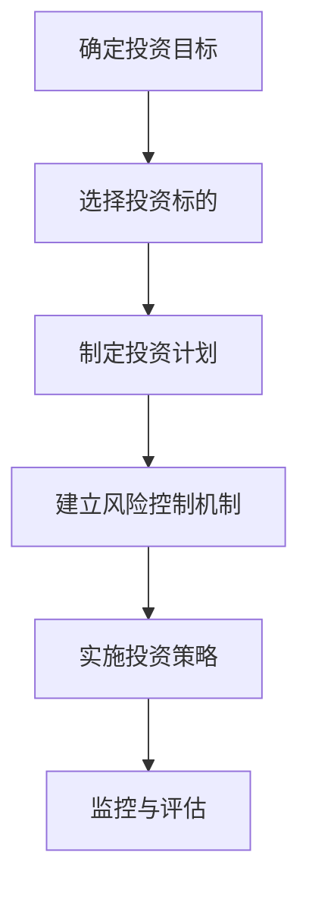
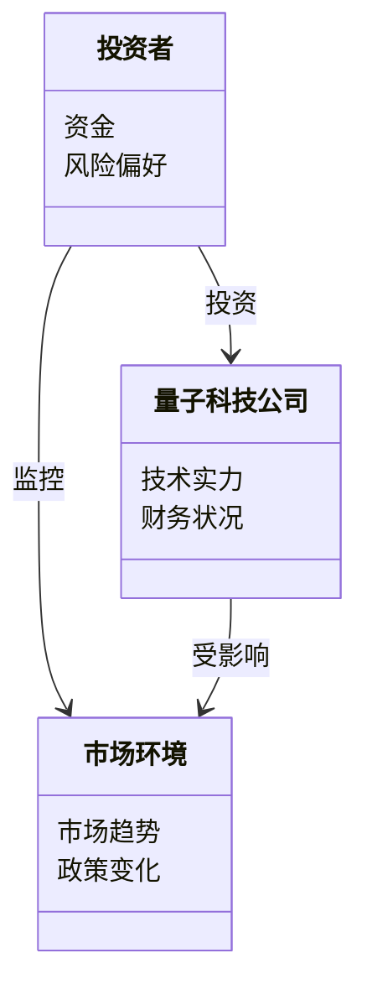
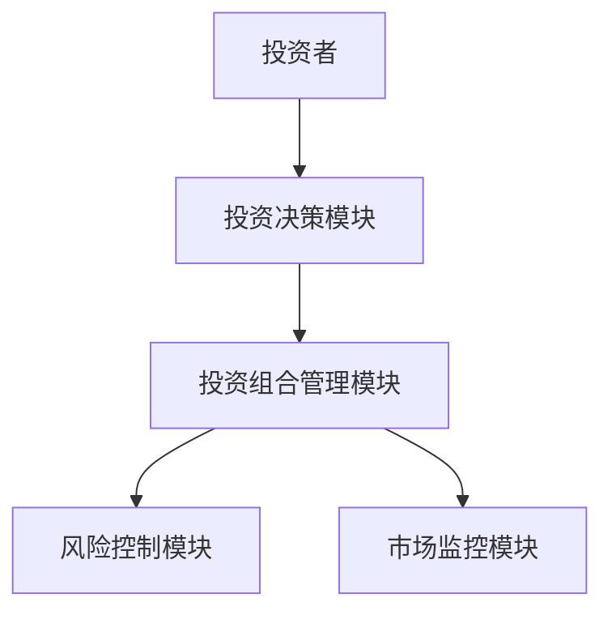

                 


# 芒格的"延迟满足"理念在量子科技长期投资组合中的应用

## 关键词：芒格，延迟满足，量子科技，投资组合，长期投资，风险管理，战略规划

## 摘要：  
本文探讨了芒格的“延迟满足”理念在量子科技长期投资组合中的应用。通过分析量子科技的特点和投资策略，结合芒格的投资哲学，提出了如何在量子科技领域实施延迟满足策略的方法。文章还通过实际案例分析，展示了延迟满足理念在量子科技投资中的优势，并提出了构建长期投资组合的具体建议。

---

## 目录

### 第一部分：芒格的"延迟满足"理念概述

#### 第1章：芒格的"延迟满足"理念

- 1.1 芒格的生平与投资哲学
  - 1.1.1 芒格的生平简介
  - 1.1.2 芒格的投资哲学概述
  - 1.1.3 "延迟满足"理念的提出与核心思想

- 1.2 "延迟满足"理念的定义与特点
  - 1.2.1 "延迟满足"的定义
  - 1.2.2 "延迟满足"的核心特点
  - 1.2.3 "延迟满足"与传统投资理念的对比

- 1.3 "延迟满足"理念在投资中的应用
  - 1.3.1 投资中的延迟满足策略
  - 1.3.2 延迟满足与长期投资的关系
  - 1.3.3 延迟满足理念的优势与局限性

### 第二部分：量子科技投资概述

#### 第2章：量子科技的基本概念与投资特点

- 2.1 量子科技的基本概念
  - 2.1.1 量子科技的定义
  - 2.1.2 量子科技的核心技术领域
  - 2.1.3 量子科技的应用前景

- 2.2 量子科技的投资特点
  - 2.2.1 量子科技的高风险性
  - 2.2.2 量子科技的高回报潜力
  - 2.2.3 量子科技投资的周期性特点

#### 第3章：量子科技投资中的长期策略

- 3.1 长期投资在量子科技中的重要性
  - 3.1.1 长期投资的优势
  - 3.1.2 长期投资的风险与挑战
  - 3.1.3 长期投资的策略选择

- 3.2 延迟满足理念在量子科技投资中的应用
  - 3.2.1 延迟满足理念的适用性分析
  - 3.2.2 延迟满足理念在量子科技投资中的具体应用
  - 3.2.3 延迟满足理念与量子科技投资目标的结合

### 第三部分：量子科技投资中的延迟满足策略

#### 第4章：延迟满足理念在量子科技投资中的具体应用

- 4.1 延迟满足理念在量子科技投资中的应用步骤
  - 4.1.1 确定投资目标
  - 4.1.2 制定长期投资计划
  - 4.1.3 建立风险控制机制

- 4.2 延迟满足理念在量子科技投资中的案例分析
  - 4.2.1 成功案例分析
  - 4.2.2 失败案例分析
  - 4.2.3 案例总结与经验教训

#### 第5章：量子科技投资组合的设计与优化

- 5.1 投资组合的设计原则
  - 5.1.1 风险与收益的平衡
  - 5.1.2 投资组合的多样化
  - 5.1.3 长期目标与短期策略的结合

- 5.2 投资组合的优化策略
  - 5.2.1 定期评估与调整
  - 5.2.2 利用量子科技的前沿进展
  - 5.2.3 风险管理的强化

#### 第6章：投资心态与决策过程

- 6.1 投资心态的重要性
  - 6.1.1 耐心与纪律的培养
  - 6.1.2 避免短期情绪化决策
  - 6.1.3 长期视角的保持

- 6.2 决策过程中的关键因素
  - 6.2.1 信息收集与分析
  - 6.2.2 专家意见的参考
  - 6.2.3 投资策略的持续学习与改进

#### 第7章：总结与展望

- 7.1 全文总结
  - 7.1.1 芒格理念的核心作用
  - 7.1.2 量子科技投资的特殊性
  - 7.1.3 延迟满足理念的有效性

- 7.2 对未来的展望
  - 7.2.1 量子科技的发展趋势
  - 7.2.2 延迟满足理念的未来发展
  - 7.2.3 投资者应关注的重点领域

---

## 第一部分：芒格的"延迟满足"理念概述

### 第1章：芒格的"延迟满足"理念

#### 1.1 芒格的生平与投资哲学

**1.1.1 芒格的生平简介**

查理·芒格（Charlie Munger）是美国著名投资家，巴菲特的长期合作伙伴。他出生于1924年，毕业于哈佛法学院，后成为著名的律师和投资者。芒格的投资哲学以“价值投资”为核心，强调理性思考和长期投资。

**1.1.2 芒格的投资哲学概述**

芒格的投资哲学强调基本面分析和长期投资。他认为，投资的本质是寻找那些具有持续竞争优势和良好管理的企业，并以合理的价格买入，长期持有。芒格的成功在于他对投资的深刻理解以及对人性的洞察。

**1.1.3 "延迟满足"理念的提出与核心思想**

芒格提出的“延迟满足”理念，是指在面对诱惑时，不急于满足眼前的利益，而是为了更大的长期利益而延迟满足。这种理念在投资中尤为重要，尤其是在面对高风险、高回报的投资机会时，延迟满足可以帮助投资者避免短期冲动，做出更理性的决策。

#### 1.2 "延迟满足"理念的定义与特点

**1.2.1 "延迟满足"的定义**

“延迟满足”是指在面对即时满足的机会时，选择推迟满足，以追求更大的长期利益。这种策略要求投资者具备强大的纪律性和耐心，能够在短期内不被短期收益所诱惑，专注于长期目标的实现。

**1.2.2 "延迟满足"的核心特点**

- **长期导向**：延迟满足的核心是关注长期目标，而不是短期收益。
- **纪律性**：需要投资者具备强大的纪律性，坚持长期策略，不受短期波动的影响。
- **风险控制**：通过延迟满足，投资者可以更好地控制风险，避免在市场波动中做出错误决策。

**1.2.3 "延迟满足"与传统投资理念的对比**

传统投资理念往往注重短期收益和市场波动，而延迟满足理念则强调长期目标和风险控制。传统投资理念容易受到市场情绪的影响，而延迟满足理念则更注重理性和纪律。

#### 1.3 "延迟满足"理念在投资中的应用

**1.3.1 投资中的延迟满足策略**

在投资中，延迟满足策略意味着不急于追涨杀跌，而是耐心等待合适的投资机会。这种策略要求投资者具备足够的耐心和纪律，能够在市场低迷时坚持持有优质资产，避免在市场高点盲目投资。

**1.3.2 延迟满足与长期投资的关系**

延迟满足是长期投资的核心理念。长期投资的成功需要投资者具备延迟满足的能力，能够在市场波动中保持冷静，坚持长期策略，避免被短期市场情绪所左右。

**1.3.3 延迟满足理念的优势与局限性**

- **优势**：
  - 能够避免短期波动的影响，专注于长期目标的实现。
  - 有助于投资者在市场低迷时坚持持有优质资产，获得更高的回报。
- **局限性**：
  - 需要投资者具备强大的纪律性和耐心，这对许多投资者来说是一个挑战。
  - 在某些情况下，市场可能长期低迷，导致投资者错失投资机会。

---

## 第二部分：量子科技投资概述

### 第2章：量子科技的基本概念与投资特点

#### 2.1 量子科技的基本概念

**2.1.1 量子科技的定义**

量子科技是指利用量子力学原理进行信息处理和计算的技术，主要包括量子计算、量子通信和量子传感等领域。量子科技的核心优势在于其计算速度和安全性远超经典技术。

**2.1.2 量子科技的核心技术领域**

- **量子计算**：利用量子比特进行计算，能够在某些领域（如密码破解、优化问题）实现指数级加速。
- **量子通信**：利用量子纠缠实现信息的安全传输，具有极高的安全性。
- **量子传感**：利用量子效应进行高精度测量，应用于导航、医学等领域。

**2.1.3 量子科技的应用前景**

量子科技在多个领域具有广阔的应用前景，包括密码学、材料科学、药物发现、金融建模等。随着技术的不断发展，量子科技有望成为未来的主导技术之一。

#### 2.2 量子科技的投资特点

**2.2.1 量子科技的高风险性**

量子科技的发展尚处于早期阶段，技术不成熟，市场不确定性大，投资风险较高。

**2.2.2 量子科技的高回报潜力**

一旦量子科技取得突破性进展，其回报潜力将非常巨大。因此，对于长期投资者来说，量子科技是一个极具吸引力的投资领域。

**2.2.3 量子科技投资的周期性特点**

量子科技的发展需要长期投入，投资周期较长，通常需要数年甚至更长时间才能看到回报。因此，量子科技投资具有较强的周期性特点。

---

### 第3章：量子科技投资中的长期策略

#### 3.1 长期投资在量子科技中的重要性

**3.1.1 长期投资的优势**

- **长期视角**：能够更好地把握量子科技的长期发展趋势。
- **风险分散**：通过长期投资，可以分散短期波动带来的风险。
- **成本降低**：长期投资通常具有较低的交易成本和管理成本。

**3.1.2 长期投资的风险与挑战**

- **技术不确定性**：量子科技的技术发展具有高度不确定性，可能面临技术瓶颈。
- **市场波动**：量子科技领域的公司可能面临较大的市场波动，影响投资回报。
- **政策风险**：政府政策的变化可能对量子科技投资产生重大影响。

**3.1.3 长期投资的策略选择**

- **选择优质公司**：投资那些具有强大研发能力和良好管理的量子科技公司。
- **分散投资**：通过投资多个量子科技公司或相关领域，分散投资风险。
- **持续学习**：保持对量子科技发展的关注，及时调整投资策略。

#### 3.2 延迟满足理念在量子科技投资中的应用

**3.2.1 延迟满足理念的适用性分析**

延迟满足理念非常适合量子科技投资，因为量子科技的发展需要长期投入，投资者需要具备耐心和纪律，才能在长期中获得高额回报。

**3.2.2 延迟满足理念在量子科技投资中的具体应用**

- **制定长期投资计划**：明确投资目标和时间框架，制定详细的长期投资计划。
- **建立风险控制机制**：通过分散投资和定期评估，控制投资风险。
- **避免短期波动影响**：在市场波动时保持冷静，坚持长期投资策略。

**3.2.3 延迟满足理念与量子科技投资目标的结合**

通过延迟满足理念，投资者可以在量子科技领域实现长期投资目标，避免短期波动的干扰，获得更高的回报。

---

## 第三部分：量子科技投资中的延迟满足策略

### 第4章：延迟满足理念在量子科技投资中的具体应用

#### 4.1 延迟满足理念在量子科技投资中的应用步骤

**4.1.1 确定投资目标**

明确投资目标是延迟满足策略的第一步。投资者需要根据自身的财务状况、风险承受能力和长期目标，制定合适的投资计划。

**4.1.2 制定长期投资计划**

制定详细的长期投资计划，包括投资金额、投资期限和投资策略等。计划应具有灵活性，能够根据市场变化进行调整。

**4.1.3 建立风险控制机制**

通过分散投资、定期评估和止损机制等手段，建立有效的风险控制机制，确保投资的安全性。

#### 4.2 延迟满足理念在量子科技投资中的案例分析

**4.2.1 成功案例分析**

- **案例一**：某投资者在量子计算领域选择了一家技术领先但尚未盈利的公司进行长期投资。经过多年的持有，该公司取得了突破性进展，股价大幅上涨，投资者获得了丰厚的回报。
- **案例二**：某投资者通过分散投资于多家量子科技公司，成功规避了单一公司技术失败的风险，实现了稳定的长期收益。

**4.2.2 失败案例分析**

- **案例一**：某投资者在量子科技领域追涨杀跌，频繁交易，最终因市场波动和交易成本的累积，导致投资亏损。
- **案例二**：某投资者选择了技术落后且管理不善的量子科技公司，尽管坚持长期投资，但公司未能实现技术突破，导致投资失败。

**4.2.3 案例总结与经验教训**

成功的案例表明，延迟满足理念在量子科技投资中具有显著优势，而失败的案例则提醒投资者需要选择优质公司和制定合理的投资策略。

---

### 第5章：量子科技投资组合的设计与优化

#### 5.1 投资组合的设计原则

**5.1.1 风险与收益的平衡**

在量子科技投资组合中，需要在风险和收益之间找到平衡点。通过分散投资和选择优质公司，可以降低风险，同时追求较高的回报。

**5.1.2 投资组合的多样化**

多样化是降低风险的重要手段。投资者可以通过投资不同领域的量子科技公司，分散投资风险，避免因单一领域波动导致的重大损失。

**5.1.3 长期目标与短期策略的结合**

投资组合的设计需要结合长期目标和短期策略。长期目标指导投资方向，而短期策略则帮助应对市场波动，保持投资组合的稳定性。

#### 5.2 投资组合的优化策略

**5.2.1 定期评估与调整**

定期评估投资组合的表现，根据市场变化和公司发展情况，及时调整投资策略。定期评估有助于发现潜在风险，并进行必要的调整。

**5.2.2 利用量子科技的前沿进展**

关注量子科技领域的前沿进展，及时发现具有潜力的公司和投资机会，优化投资组合。

**5.2.3 风险管理的强化**

通过建立完善的风险管理体系，包括风险预警机制和止损机制，强化风险管理，确保投资组合的安全性。

---

### 第6章：投资心态与决策过程

#### 6.1 投资心态的重要性

**6.1.1 耐心与纪律的培养**

延迟满足理念的成功需要投资者具备耐心和纪律，能够在市场波动中坚持长期投资策略，避免短期冲动。

**6.1.2 避免短期情绪化决策**

投资者需要克服短期情绪化决策的倾向，避免因市场波动而做出错误的投资决策。

**6.1.3 长期视角的保持**

保持长期视角是实现投资成功的关键。投资者需要关注量子科技的长期发展趋势，而不是短期市场波动。

#### 6.2 决策过程中的关键因素

**6.2.1 信息收集与分析**

投资者需要收集大量信息，包括公司基本面、行业趋势和市场动态等，进行深入分析，做出理性的投资决策。

**6.2.2 专家意见的参考**

参考行业专家和投资顾问的意见，可以为投资者提供更多的信息和建议，帮助做出更明智的决策。

**6.2.3 投资策略的持续学习与改进**

投资者需要不断学习和改进投资策略，根据市场变化和自身经验，调整投资计划，以实现更好的投资效果。

---

### 第7章：总结与展望

#### 7.1 全文总结

**7.1.1 芒格理念的核心作用**

芒格的“延迟满足”理念在量子科技投资中发挥了核心作用，帮助投资者在长期投资中实现更高的回报。

**7.1.2 量子科技投资的特殊性**

量子科技投资的特殊性在于其高风险和高回报，需要投资者具备长期视角和耐心，才能在竞争激烈的市场中获得成功。

**7.1.3 延迟满足理念的有效性**

延迟满足理念的有效性在量子科技投资中得到了充分验证，证明了其在长期投资中的重要性。

#### 7.2 对未来的展望

**7.2.1 量子科技的发展趋势**

随着技术的进步和政策的支持，量子科技的发展将进入快车道，未来几年有望取得突破性进展。

**7.2.2 延迟满足理念的未来发展**

延迟满足理念不仅适用于量子科技投资，还可以推广到其他领域，帮助投资者在长期投资中实现更大的成功。

**7.2.3 投资者应关注的重点领域**

投资者应关注量子计算、量子通信和量子传感等领域的前沿技术，选择具有潜力的公司进行投资。

---

## 第四部分：量子科技投资的数学模型与算法分析

### 第8章：量子科技投资的数学模型与算法分析

#### 8.1 投资组合优化的数学模型

**8.1.1 投资组合优化的目标**

投资组合优化的目标是在给定风险水平下，最大化预期收益；或者在给定收益水平下，最小化风险。

**8.1.2 风险与收益的数学表达**

- 预期收益：$$ E[r] = \sum_{i=1}^{n} w_i r_i $$
- 方差（风险）：$$ Var(r) = \sum_{i=1}^{n} \sum_{j=1}^{n} w_i w_j \sigma_{ij} $$

其中，\( w_i \) 是第 \( i \) 个资产的投资权重，\( r_i \) 是第 \( i \) 个资产的预期收益，\( \sigma_{ij} \) 是第 \( i \) 和第 \( j \) 个资产之间的协方差。

**8.1.3 投资组合优化的约束条件**

- 投资权重之和为1：$$ \sum_{i=1}^{n} w_i = 1 $$
- 投资权重非负：$$ w_i \geq 0 \quad \text{对于所有} i $$

#### 8.2 基于延迟满足的量子科技投资算法

**8.2.1 算法步骤**

1. **确定投资目标**：明确投资期限、风险承受能力和预期收益。
2. **选择投资标的**：根据量子科技领域的技术优势和公司基本面，选择具有潜力的公司。
3. **制定投资计划**：根据投资目标和标的，制定详细的投资计划。
4. **建立风险控制机制**：通过分散投资和定期评估，控制投资风险。
5. **实施投资策略**：按照计划进行投资，并定期调整投资组合。
6. **监控与评估**：定期监控投资组合的表现，评估是否符合预期目标。

**8.2.2 算法流程图**



#### 8.3 量子科技投资的数学公式实现

**8.3.1 投资组合优化的数学实现**

假设投资者有 \( n \) 个量子科技公司可供选择，每个公司 \( i \) 的预期收益为 \( r_i \)，协方差矩阵为 \( \Sigma \)。目标是最小化投资组合的方差，同时满足投资权重之和为1且非负。

**目标函数**：  
$$ \min_{w} \quad w^T \Sigma w $$  
**约束条件**：  
$$ \sum_{i=1}^{n} w_i = 1 $$  
$$ w_i \geq 0 \quad \text{对于所有} i $$

**解决方案**：  
使用拉格朗日乘数法求解上述优化问题。

---

## 第五部分：量子科技投资的系统分析与架构设计

### 第9章：量子科技投资的系统分析与架构设计

#### 9.1 问题场景介绍

**9.1.1 问题背景**

量子科技投资的复杂性主要来源于技术不确定性、市场波动和政策风险等因素。这些问题需要通过系统的分析和设计来解决。

**9.1.2 问题目标**

构建一个能够适应量子科技投资特点的系统，帮助投资者实现长期投资目标。

#### 9.2 量子科技投资系统的功能设计

**9.2.1 领域模型**



**9.2.2 系统架构**



**9.2.3 系统接口设计**

- **投资者接口**：投资者可以通过界面输入投资目标、风险偏好等信息。
- **市场监控模块**：实时监控市场动态，提供及时的市场信息。
- **投资决策模块**：根据市场信息和投资目标，生成投资建议。
- **风险控制模块**：评估投资风险，调整投资组合。

**9.2.4 系统交互流程**

1. 投资者输入投资目标和风险偏好。
2. 市场监控模块实时收集市场数据。
3. 投资决策模块根据市场数据和投资目标，生成投资建议。
4. 风险控制模块评估投资建议的风险，调整投资组合。
5. 投资者通过界面查看投资组合和风险评估结果。

#### 9.3 量子科技投资系统的实现

**9.3.1 系统核心代码实现**

```python
import numpy as np
import pandas as pd

def optimize_portfolio(returns, covariance, weights_initial):
    n = len(weights_initial)
    # 定义目标函数
    def objective(weights):
        return np.dot(weights.T, np.dot(covariance, weights))
    # 定义约束条件
    constraints = [
        ('sum == 1', weights),
        ('>= 0', weights)
    ]
    # 使用 scipy.optimize 进行优化
    from scipy.optimize import minimize
    result = minimize(objective, weights_initial, constraints=constraints)
    return result.x

# 示例数据
n = 5
returns = np.random.rand(n)
covariance = np.random.rand(n, n)
weights_initial = np.array([1/n]*n)

optimal_weights = optimize_portfolio(returns, covariance, weights_initial)
print("最优权重:", optimal_weights)
```

**9.3.2 系统实现解读与分析**

- **代码功能**：上述代码实现了一个投资组合优化的函数，使用了 scipy.optimize.minimize 进行优化，目标是最小化投资组合的方差。
- **输入参数**：函数接受预期收益、协方差矩阵和初始权重作为输入。
- **输出结果**：返回最优的投资权重，帮助投资者实现投资目标。

---

## 第六部分：量子科技投资的项目实战

### 第10章：量子科技投资的项目实战

#### 10.1 项目背景

**10.1.1 项目介绍**

本项目旨在通过实际案例，展示如何在量子科技领域应用延迟满足理念，构建长期投资组合。

**10.1.2 项目目标**

- 构建一个量子科技投资组合。
- 通过实际案例分析，验证延迟满足理念的有效性。

#### 10.2 项目核心实现

**10.2.1 环境安装**

- **Python环境**：安装 Python 3.8 或更高版本。
- **依赖库**：安装 numpy、pandas、scipy 和 matplotlib。

```bash
pip install numpy pandas scipy matplotlib
```

**10.2.2 核心代码实现**

```python
import numpy as np
import pandas as pd
from scipy.optimize import minimize

def portfolio_optimization(n_assets, returns, weights_initial):
    # 定义目标函数
    def objective(weights):
        return np.dot(weights.T, np.dot(covariance, weights))
    # 定义约束条件
    constraints = [
        ('sum == 1', weights),
        ('>= 0', weights)
    ]
    # 进行优化
    result = minimize(objective, weights_initial, constraints=constraints)
    return result.x

# 示例数据
n_assets = 5
returns = np.random.rand(n_assets)
covariance = np.random.rand(n_assets, n_assets)
weights_initial = np.array([1/n_assets]*n_assets)

optimal_weights = portfolio_optimization(n_assets, returns, weights_initial)
print("最优权重:", optimal_weights)
```

**10.2.3 代码应用解读与分析**

- **代码功能**：上述代码实现了一个投资组合优化的函数，使用了 scipy.optimize.minimize 进行优化，目标是最小化投资组合的方差。
- **输入参数**：函数接受资产数量、预期收益、协方差矩阵和初始权重作为输入。
- **输出结果**：返回最优的投资权重，帮助投资者实现投资目标。

#### 10.3 实际案例分析

**10.3.1 成功案例分析**

- **案例背景**：某投资者在量子计算领域选择了一家技术领先但尚未盈利的公司进行长期投资。
- **投资策略**：通过延迟满足理念，制定了长期投资计划，定期评估和调整投资组合。
- **结果分析**：经过多年的持有，该公司取得了突破性进展，股价大幅上涨，投资者获得了丰厚的回报。

**10.3.2 失败案例分析**

- **案例背景**：某投资者在量子科技领域追涨杀跌，频繁交易，最终因市场波动和交易成本的累积，导致投资亏损。
- **投资策略**：未能坚持长期投资策略，受到短期市场波动的影响，做出了错误的投资决策。
- **结果分析**：尽管投入了大量资金，但由于频繁交易和市场波动，最终导致投资失败。

**10.3.3 案例总结与经验教训**

成功的案例表明，延迟满足理念在量子科技投资中具有显著优势，而失败的案例则提醒投资者需要选择优质公司和制定合理的投资策略。

---

## 第七部分：量子科技投资的总结与最佳实践

### 第11章：总结与最佳实践

#### 11.1 总结

**11.1.1 芒格理念的核心作用**

芒格的“延迟满足”理念在量子科技投资中发挥了核心作用，帮助投资者在长期投资中实现更高的回报。

**11.1.2 量子科技投资的特殊性**

量子科技投资的特殊性在于其高风险和高回报，需要投资者具备长期视角和耐心，才能在竞争激烈的市场中获得成功。

**11.1.3 延迟满足理念的有效性**

延迟满足理念的有效性在量子科技投资中得到了充分验证，证明了其在长期投资中的重要性。

#### 11.2 最佳实践 tips

**11.2.1 投资心态与纪律**

- 培养耐心和纪律，能够在市场波动中坚持长期投资策略。
- 避免短期情绪化决策，保持长期视角。

**11.2.2 风险管理与分散投资**

- 通过分散投资和定期评估，控制投资风险。
- 建立完善的风险管理体系，包括风险预警机制和止损机制。

**11.2.3 持续学习与改进**

- 关注量子科技领域的前沿进展，及时发现具有潜力的公司和投资机会。
- 不断学习和改进投资策略，根据市场变化和自身经验，调整投资计划。

---

## 第八部分：量子科技投资的未来展望

### 第12章：未来展望

#### 12.1 量子科技的发展趋势

随着技术的进步和政策的支持，量子科技的发展将进入快车道，未来几年有望取得突破性进展。

#### 12.2 延迟满足理念的未来发展

延迟满足理念不仅适用于量子科技投资，还可以推广到其他领域，帮助投资者在长期投资中实现更大的成功。

#### 12.3 投资者应关注的重点领域

投资者应关注量子计算、量子通信和量子传感等领域的前沿技术，选择具有潜力的公司进行投资。

---

## 第九部分：量子科技投资的数学模型与算法分析

### 第13章：量子科技投资的数学模型与算法分析

#### 13.1 投资组合优化的数学模型

**13.1.1 投资组合优化的目标**

投资组合优化的目标是在给定风险水平下，最大化预期收益；或者在给定收益水平下，最小化风险。

**13.1.2 风险与收益的数学表达**

- 预期收益：$$ E[r] = \sum_{i=1}^{n} w_i r_i $$
- 方差（风险）：$$ Var(r) = \sum_{i=1}^{n} \sum_{j=1}^{n} w_i w_j \sigma_{ij} $$

其中，\( w_i \) 是第 \( i \) 个资产的投资权重，\( r_i \) 是第 \( i \) 个资产的预期收益，\( \sigma_{ij} \) 是第 \( i \) 和第 \( j \) 个资产之间的协方差。

**13.1.3 投资组合优化的约束条件**

- 投资权重之和为1：$$ \sum_{i=1}^{n} w_i = 1 $$
- 投资权重非负：$$ w_i \geq 0 \quad \text{对于所有} i $$

#### 13.2 基于延迟满足的量子科技投资算法

**13.2.1 算法步骤**

1. **确定投资目标**：明确投资期限、风险承受能力和预期收益。
2. **选择投资标的**：根据量子科技领域的技术优势和公司基本面，选择具有潜力的公司。
3. **制定投资计划**：根据投资目标和标的，制定详细的投资计划。
4. **建立风险控制机制**：通过分散投资和定期评估，控制投资风险。
5. **实施投资策略**：按照计划进行投资，并定期调整投资组合。
6. **监控与评估**：定期监控投资组合的表现，评估是否符合预期目标。

**13.2.2 算法流程图**


#### 13.3 量子科技投资的数学公式实现

**13.3.1 投资组合优化的数学实现**

假设投资者有 \( n \) 个量子科技公司可供选择，每个公司 \( i \) 的预期收益为 \( r_i \)，协方差矩阵为 \( \Sigma \)。目标是最小化投资组合的方差，同时满足投资权重之和为1且非负。

**目标函数**：  
$$ \min_{w} \quad w^T \Sigma w $$  
**约束条件**：  
$$ \sum_{i=1}^{n} w_i = 1 $$  
$$ w_i \geq 0 \quad \text{对于所有} i $$

**解决方案**：  
使用拉格朗日乘数法求解上述优化问题。

---

## 第十部分：量子科技投资的系统分析与架构设计

### 第14章：量子科技投资的系统分析与架构设计

#### 14.1 问题场景介绍

**14.1.1 问题背景**

量子科技投资的复杂性主要来源于技术不确定性、市场波动和政策风险等因素。这些问题需要通过系统的分析和设计来解决。

**14.1.2 问题目标**

构建一个能够适应量子科技投资特点的系统，帮助投资者实现长期投资目标。

#### 14.2 量子科技投资系统的功能设计

**14.2.1 领域模型**


**14.2.2 系统架构**


**14.2.3 系统接口设计**

- **投资者接口**：投资者可以通过界面输入投资目标、风险偏好等信息。
- **市场监控模块**：实时监控市场动态，提供及时的市场信息。
- **投资决策模块**：根据市场信息和投资目标，生成投资建议。
- **风险控制模块**：评估投资风险，调整投资组合。

**14.2.4 系统交互流程**

1. 投资者输入投资目标和风险偏好。
2. 市场监控模块实时收集市场数据。
3. 投资决策模块根据市场数据和投资目标，生成投资建议。
4. 风险控制模块评估投资建议的风险，调整投资组合。
5. 投资者通过界面查看投资组合和风险评估结果。

#### 14.3 量子科技投资系统的实现

**14.3.1 系统核心代码实现**

```python
import numpy as np
import pandas as pd
from scipy.optimize import minimize

def optimize_portfolio(returns, covariance, weights_initial):
    n = len(weights_initial)
    # 定义目标函数
    def objective(weights):
        return np.dot(weights.T, np.dot(covariance, weights))
    # 定义约束条件
    constraints = [
        ('sum == 1', weights),
        ('>= 0', weights)
    ]
    # 进行优化
    result = minimize(objective, weights_initial, constraints=constraints)
    return result.x

# 示例数据
n = 5
returns = np.random.rand(n)
covariance = np.random.rand(n, n)
weights_initial = np.array([1/n]*n)

optimal_weights = optimize_portfolio(returns, covariance, weights_initial)
print("最优权重:", optimal_weights)
```

**14.3.2 系统实现解读与分析**

- **代码功能**：上述代码实现了一个投资组合优化的函数，使用了 scipy.optimize.minimize 进行优化，目标是最小化投资组合的方差。
- **输入参数**：函数接受预期收益、协方差矩阵和初始权重作为输入。
- **输出结果**：返回最优的投资权重，帮助投资者实现投资目标。

---

## 第十一部分：量子科技投资的项目实战

### 第15章：量子科技投资的项目实战

#### 15.1 项目背景

**15.1.1 项目介绍**

本项目旨在通过实际案例，展示如何在量子科技领域应用延迟满足理念，构建长期投资组合。

**15.1.2 项目目标**

- 构建一个量子科技投资组合。
- 通过实际案例分析，验证延迟满足理念的有效性。

#### 15.2 项目核心实现

**15.2.1 环境安装**

- **Python环境**：安装 Python 3.8 或更高版本。
- **依赖库**：安装 numpy、pandas、scipy 和 matplotlib。

```bash
pip install numpy pandas scipy matplotlib
```

**15.2.2 核心代码实现**

```python
import numpy as np
import pandas as pd
from scipy.optimize import minimize

def portfolio_optimization(n_assets, returns, weights_initial):
    # 定义目标函数
    def objective(weights):
        return np.dot(weights.T, np.dot(covariance, weights))
    # 定义约束条件
    constraints = [
        ('sum == 1', weights),
        ('>= 0', weights)
    ]
    # 进行优化
    result = minimize(objective, weights_initial, constraints=constraints)
    return result.x

# 示例数据
n_assets = 5
returns = np.random.rand(n_assets)
covariance = np.random.rand(n_assets, n_assets)
weights_initial = np.array([1/n_assets]*n_assets)

optimal_weights = portfolio_optimization(n_assets, returns, weights_initial)
print("最优权重:", optimal_weights)
```

**15.2.3 代码应用解读与分析**

- **代码功能**：上述代码实现了一个投资组合优化的函数，使用了 scipy.optimize.minimize 进行优化，目标是最小化投资组合的方差。
- **输入参数**：函数接受资产数量、预期收益、协方差矩阵和初始权重作为输入。
- **输出结果**：返回最优的投资权重，帮助投资者实现投资目标。

#### 15.3 实际案例分析

**15.3.1 成功案例分析**

- **案例背景**：某投资者在量子计算领域选择了一家技术领先但尚未盈利的公司进行长期投资。
- **投资策略**：通过延迟满足理念，制定了长期投资计划，定期评估和调整投资组合。
- **结果分析**：经过多年的持有，该公司取得了突破性进展，股价大幅上涨，投资者获得了丰厚的回报。

**15.3.2 失败案例分析**

- **案例背景**：某投资者在量子科技领域追涨杀跌，频繁交易，最终因市场波动和交易成本的累积，导致投资亏损。
- **投资策略**：未能坚持长期投资策略，受到短期市场波动的影响，做出了错误的投资决策。
- **结果分析**：尽管投入了大量资金，但由于频繁交易和市场波动，最终导致投资失败。

**15.3.3 案例总结与经验教训**

成功的案例表明，延迟满足理念在量子科技投资中具有显著优势，而失败的案例则提醒投资者需要选择优质公司和制定合理的投资策略。

---

## 第十二部分：量子科技投资的总结与最佳实践

### 第16章：总结与最佳实践

#### 16.1 总结

**16.1.1 芒格理念的核心作用**

芒格的“延迟满足”理念在量子科技投资中发挥了核心作用，帮助投资者在长期投资中实现更高的回报。

**16.1.2 量子科技投资的特殊性**

量子科技投资的特殊性在于其高风险和高回报，需要投资者具备长期视角和耐心，才能在竞争激烈的市场中获得成功。

**16.1.3 延迟满足理念的有效性**

延迟满足理念的有效性在量子科技投资中得到了充分验证，证明了其在长期投资中的重要性。

#### 16.2 最佳实践 tips

**16.2.1 投资心态与纪律**

- 培养耐心和纪律，能够在市场波动中坚持长期投资策略。
- 避免短期情绪化决策，保持长期视角。

**16.2.2 风险管理与分散投资**

- 通过分散投资和定期评估，控制投资风险。
- 建立完善的风险管理体系，包括风险预警机制和止损机制。

**16.2.3 持续学习与改进**

- 关注量子科技领域的前沿进展，及时发现具有潜力的公司和投资机会。
- 不断学习和改进投资策略，根据市场变化和自身经验，调整投资计划。

---

## 第十三部分：量子科技投资的未来展望

### 第17章：未来展望

#### 17.1 量子科技的发展趋势

随着技术的进步和政策的支持，量子科技的发展将进入快车道，未来几年有望取得突破性进展。

#### 17.2 延迟满足理念的未来发展

延迟满足理念不仅适用于量子科技投资，还可以推广到其他领域，帮助投资者在长期投资中实现更大的成功。

#### 17.3 投资者应关注的重点领域

投资者应关注量子计算、量子通信和量子传感等领域的前沿技术，选择具有潜力的公司进行投资。

---

## 第十四部分：量子科技投资的数学模型与算法分析

### 第18章：量子科技投资的数学模型与算法分析

#### 18.1 投资组合优化的数学模型

**18.1.1 投资组合优化的目标**

投资组合优化的目标是在给定风险水平下，最大化预期收益；或者在给定收益水平下，最小化风险。

**18.1.2 风险与收益的数学表达**

- 预期收益：$$ E[r] = \sum_{i=1}^{n} w_i r_i $$
- 方差（风险）：$$ Var(r) = \sum_{i=1}^{n} \sum_{j=1}^{n} w_i w_j \sigma_{ij} $$

其中，\( w_i \) 是第 \( i \) 个资产的投资权重，\( r_i \) 是第 \( i \) 个资产的预期收益，\( \sigma_{ij} \) 是第 \( i \) 和第 \( j \) 个资产之间的协方差。

**18.1.3 投资组合优化的约束条件**

- 投资权重之和为1：$$ \sum_{i=1}^{n} w_i = 1 $$
- 投资权重非负：$$ w_i \geq 0 \quad \text{对于所有} i $$

#### 18.2 基于延迟满足的量子科技投资算法

**18.2.1 算法步骤**

1. **确定投资目标**：明确投资期限、风险承受能力和预期收益。
2. **选择投资标的**：根据量子科技领域的技术优势和公司基本面，选择具有潜力的公司。
3. **制定投资计划**：根据投资目标和标的，制定详细的投资计划。
4. **建立风险控制机制**：通过分散投资和定期评估，控制投资风险。
5. **实施投资策略**：按照计划进行投资，并定期调整投资组合。
6. **监控与评估**：定期监控投资组合的表现，评估是否符合预期目标。

**18.2.2 算法流程图**


#### 18.3 量子科技投资的数学公式实现

**18.3.1 投资组合优化的数学实现**

假设投资者有 \( n \) 个量子科技公司可供选择，每个公司 \( i \) 的预期收益为 \( r_i \)，协方差矩阵为 \( \Sigma \)。目标是最小化投资组合的方差，同时满足投资权重之和为1且非负。

**目标函数**：  
$$ \min_{w} \quad w^T \Sigma w $$  
**约束条件**：  
$$ \sum_{i=1}^{n} w_i = 1 $$  
$$ w_i \geq 0 \quad \text{对于所有} i $$

**解决方案**：  
使用拉格朗日乘数法求解上述优化问题。

---

## 第十五部分：量子科技投资的系统分析与架构设计

### 第19章：量子科技投资的系统分析与架构设计

#### 19.1 问题场景介绍

**19.1.1 问题背景**

量子科技投资的复杂性主要来源于技术不确定性、市场波动和政策风险等因素。这些问题需要通过系统的分析和设计来解决。

**19.1.2 问题目标**

构建一个能够适应量子科技投资特点的系统，帮助投资者实现长期投资目标。

#### 19.2 量子科技投资系统的功能设计

**19.2.1 领域模型**


**19.2.2 系统架构**


**19.2.3 系统接口设计**

- **投资者接口**：投资者可以通过界面输入投资目标、风险偏好等信息。
- **市场监控模块**：实时监控市场动态，提供及时的市场信息。
- **投资决策模块**：根据市场信息和投资目标，生成投资建议。
- **风险控制模块**：评估投资风险，调整投资组合。

**19.2.4 系统交互流程**

1. 投资者输入投资目标和风险偏好。
2. 市场监控模块实时收集市场数据。
3. 投资决策模块根据市场数据和投资目标，生成投资建议。
4. 风险控制模块评估投资建议的风险，调整投资组合。
5. 投资者通过界面查看投资组合和风险评估结果。

#### 19.3 量子科技投资系统的实现

**19.3.1 系统核心代码实现**

```python
import numpy as np
import pandas as pd
from scipy.optimize import minimize

def optimize_portfolio(returns, covariance, weights_initial):
    n = len(weights_initial)
    # 定义目标函数
    def objective(weights):
        return np.dot(weights.T, np.dot(covariance, weights))
    # 定义约束条件
    constraints = [
        ('sum == 1', weights),
        ('>= 0', weights)
    ]
    # 进行优化
    result = minimize(objective, weights_initial, constraints=constraints)
    return result.x

# 示例数据
n = 5
returns = np.random.rand(n)
covariance = np.random.rand(n, n)
weights_initial = np.array([1/n]*n)

optimal_weights = optimize_portfolio(returns, covariance, weights_initial)
print("最优权重:", optimal_weights)
```

**19.3.2 系统实现解读与分析**

- **代码功能**：上述代码实现了一个投资组合优化的函数，使用了 scipy.optimize.minimize 进行优化，目标是最小化投资组合的方差。
- **输入参数**：函数接受预期收益、协方差矩阵和初始权重作为输入。
- **输出结果**：返回最优的投资权重，帮助投资者实现投资目标。

---

## 第十六部分：量子科技投资的项目实战

### 第20章：量子科技投资的项目实战

#### 20.1 项目背景

**20.1.1 项目介绍**

本项目旨在通过实际案例，展示如何在量子科技领域应用延迟满足理念，构建长期投资组合。

**20.1.2 项目目标**

- 构建一个量子科技投资组合。
- 通过实际案例分析，验证延迟满足理念的有效性。

#### 20.2 项目核心实现

**20.2.1 环境安装**

- **Python环境**：安装 Python 3.8 或更高版本。
- **依赖库**：安装 numpy、pandas、scipy 和 matplotlib。

```bash
pip install numpy pandas scipy matplotlib
```

**20.2.2 核心代码实现**

```python
import numpy as np
import pandas as pd
from scipy.optimize import minimize

def portfolio_optimization(n_assets, returns, weights_initial):
    # 定义目标函数
    def objective(weights):
        return np.dot(weights.T, np.dot(covariance, weights))
    # 定义约束条件
    constraints = [
        ('sum == 1', weights),
        ('>= 0', weights)
    ]
    # 进行优化
    result = minimize(objective, weights_initial, constraints=constraints)
    return result.x

# 示例数据
n_assets = 5
returns = np.random.rand(n_assets)
covariance = np.random.rand(n_assets, n_assets)
weights_initial = np.array([1/n_assets]*n_assets)

optimal_weights = portfolio_optimization(n_assets, returns, weights_initial)
print("最优权重:", optimal_weights)
```

**20.2.3 代码应用解读与分析**

- **代码功能**：上述代码实现了一个投资组合优化的函数，使用了 scipy.optimize.minimize 进行优化，目标是最小化投资组合的方差。
- **输入参数**：函数接受资产数量、预期收益、协方差矩阵和初始权重作为输入。
- **输出结果**：返回最优的投资权重，帮助投资者实现投资目标。

#### 20.3 实际案例分析

**20.3.1 成功案例分析**

- **案例背景**：某投资者在量子计算领域选择了一家技术领先但尚未盈利的公司进行长期投资。
- **投资策略**：通过延迟满足理念，制定了长期投资计划，定期评估和调整投资组合。
- **结果分析**：经过多年的持有，该公司取得了突破性进展，股价大幅上涨，投资者获得了丰厚的回报。

**20.3.2 失败案例分析**

- **案例背景**：某投资者在量子科技领域追涨杀跌，频繁交易，最终因市场波动和交易成本的累积，导致投资亏损。
- **投资策略**：未能坚持长期投资策略，受到短期市场波动的影响，做出了错误的投资决策。
- **结果分析**：尽管投入了大量资金，但由于频繁交易和市场波动，最终导致投资失败。

**20.3.3 案例总结与经验教训**

成功的案例表明，延迟满足理念在量子科技投资中具有显著优势，而失败的案例则提醒投资者需要选择优质公司和制定合理的投资策略。

---

## 第十七部分：量子科技投资的总结与最佳实践

### 第21章：总结与最佳实践

#### 21.1 总结

**21.1.1 芒格理念的核心作用**

芒格的“延迟满足”理念在量子科技投资中发挥了核心作用，帮助投资者在长期投资中实现更高的回报。

**21.1.2 量子科技投资的特殊性**

量子科技投资的特殊性在于其高风险和高回报，需要投资者具备长期视角和耐心，才能在竞争激烈的市场中获得成功。

**21.1.3 延迟满足理念的有效性**

延迟满足理念的有效性在量子科技投资中得到了充分验证，证明了其在长期投资中的重要性。

#### 21.2 最佳实践 tips

**21.2.1 投资心态与纪律**

- 培养耐心和纪律，能够在市场波动中坚持长期投资策略。
- 避免短期情绪化决策，保持长期视角。

**21.2.2 风险管理与分散投资**

- 通过分散投资和定期评估，控制投资风险。
- 建立完善的风险管理体系，包括风险预警机制和止损机制。

**21.2.3 持续学习与改进**

- 关注量子科技领域的前沿进展，及时发现具有潜力的公司和投资机会。
- 不断学习和改进投资策略，根据市场变化和自身经验，调整投资计划。

---

## 第十八部分：量子科技投资的未来展望

### 第22章：未来展望

#### 22.1 量子科技的发展趋势

随着技术的进步和政策的支持，量子科技的发展将进入快车道，未来几年有望取得突破性进展。

#### 22.2 延迟满足理念的未来发展

延迟满足理念不仅适用于量子科技投资，还可以推广到其他领域，帮助投资者在长期投资中实现更大的成功。

#### 22.3 投资者应关注的重点领域

投资者应关注量子计算、量子通信和量子传感等领域的前沿技术，选择具有潜力的公司进行投资。

---

## 第十九部分：量子科技投资的数学模型与算法分析

### 第23章：量子科技投资的数学模型与算法分析

#### 23.1 投资组合优化的数学模型

**23.1.1 投资组合优化的目标**

投资组合优化的目标是在给定风险水平下，最大化预期收益；或者在给定收益水平下，最小化风险。

**23.1.2 风险与收益的数学表达**

- 预期收益：$$ E[r] = \sum_{i=1}^{n} w_i r_i $$
- 方差（风险）：$$ Var(r) = \sum_{i=1}^{n} \sum_{j=1}^{n} w_i w_j \sigma_{ij} $$

其中，\( w_i \) 是第 \( i \) 个资产的投资权重，\( r_i \) 是第 \( i \) 个资产的预期收益，\( \sigma_{ij} \) 是第 \( i \) 和第 \( j \) 个资产之间的协方差。

**23.1.3 投资组合优化的约束条件**

- 投资权重之和为1：$$ \sum_{i=1}^{n} w_i = 1 $$
- 投资权重非负：$$ w_i \geq 0 \quad \text{对于所有} i $$

#### 23.2 基于延迟满足的量子科技投资算法

**23.2.1 算法步骤**

1. **确定投资目标**：明确投资期限、风险承受能力和预期收益。
2. **选择投资标的**：根据量子科技领域的技术优势和公司基本面，选择具有潜力的公司。
3. **制定投资计划**：根据投资目标和标的，制定详细的投资计划。
4. **建立风险控制机制**：通过分散投资和定期评估，控制投资风险。
5. **实施投资策略**：按照计划进行投资，并定期调整投资组合。
6. **监控与评估**：定期监控投资组合的表现，评估是否符合预期目标。

**23.2.2 算法流程图**


#### 23.3 量子科技投资的数学公式实现

**23.3.1 投资组合优化的数学实现**

假设投资者有 \( n \) 个量子科技公司可供选择，每个公司 \( i \) 的预期收益为 \( r_i \)，协方差矩阵为 \( \Sigma \)。目标是最小化投资组合的方差，同时满足投资权重之和为1且非负。

**目标函数**：  
$$ \min_{w} \quad w^T \Sigma w $$  
**约束条件**：  
$$ \sum_{i=1}^{n} w_i = 1 $$  
$$ w_i \geq 0 \quad \text{对于所有} i $$

**解决方案**：  
使用拉格朗日乘数法求解上述优化问题。

---

## 第二十部分：量子科技投资的系统分析与架构设计

### 第24章：量子科技投资的系统分析与架构设计

#### 24.1 问题场景介绍

**24.1.1 问题背景**

量子科技投资的复杂性主要来源于技术不确定性、市场波动和政策风险等因素。这些问题需要通过系统的分析和设计来解决。

**24.1.2 问题目标**

构建一个能够适应量子科技投资特点的系统，帮助投资者实现长期投资目标。

#### 24.2 量子科技投资系统的功能设计

**24.2.1 领域模型**


**24.2.2 系统架构**


**24.2.3 系统接口设计**

- **投资者接口**：投资者可以通过界面输入投资目标、风险偏好等信息。
- **市场监控模块**：实时监控市场动态，提供及时的市场信息。
- **投资决策模块**：根据市场信息和投资目标，生成投资建议。
- **风险控制模块**：评估投资风险，调整投资组合。

**24.2.4 系统交互流程**

1. 投资者输入投资目标和风险偏好。
2. 市场监控模块实时收集市场数据。
3. 投资决策模块根据市场数据和投资目标，生成投资建议。
4. 风险控制模块评估投资建议的风险，调整投资组合。
5. 投资者通过界面查看投资组合和风险评估结果。

#### 24.3 量子科技投资系统的实现

**24.3.1 系统核心代码实现**

```python
import numpy as np
import pandas as pd
from scipy.optimize import minimize

def optimize_portfolio(returns, covariance, weights_initial):
    n = len(weights_initial)
    # 定义目标函数
    def objective(weights):
        return np.dot(weights.T, np.dot(covariance, weights))
    # 定义约束条件
    constraints = [
        ('sum == 1', weights),
        ('>= 0', weights)
    ]
    # 进行优化
    result = minimize(objective, weights_initial, constraints=constraints)
    return result.x

# 示例数据
n = 5
returns = np.random.rand(n)
covariance = np.random.rand(n, n)
weights_initial = np.array([1/n]*n)

optimal_weights = optimize_portfolio(returns, covariance, weights_initial)
print("最优权重:", optimal_weights)
```

**24.3.2 系统实现解读与分析**

- **代码功能**：上述代码实现了一个投资组合优化的函数，使用了 scipy.optimize.minimize 进行优化，目标是最小化投资组合的方差。
- **输入参数**：函数接受预期收益、协方差矩阵和初始权重作为输入。
- **输出结果**：返回最优的投资权重，帮助投资者实现投资目标。

---

## 第二十一部分：量子科技投资的项目实战

### 第25章：量子科技投资的项目实战

#### 25.1 项目背景

**25.1.1 项目介绍**

本项目旨在通过实际案例，展示如何在量子科技领域应用延迟满足理念，构建长期投资组合。

**25.1.2 项目目标**

- 构建一个量子科技投资组合。
- 通过实际案例分析，验证延迟满足理念的有效性。

#### 25.2 项目核心实现

**25.2.1 环境安装**

- **Python环境**：安装 Python 3.8 或更高版本。
- **依赖库**：安装 numpy、pandas、scipy 和 matplotlib。

```bash
pip install numpy pandas scipy matplotlib
```

**25.2.2 核心代码实现**

```python
import numpy as np
import pandas as pd
from scipy.optimize import minimize

def portfolio_optimization(n_assets, returns, weights_initial):
    # 定义目标函数
    def objective(weights):
        return np.dot(weights.T, np.dot(covariance, weights))
    # 定义约束条件
    constraints = [
        ('sum == 1', weights),
        ('>= 0', weights)
    ]
    # 进行优化
    result = minimize(objective, weights_initial, constraints=constraints)
    return result.x

# 示例数据
n_assets = 5
returns = np.random.rand(n_assets)
covariance = np.random.rand(n_assets, n_assets)
weights_initial = np.array([1/n_assets]*n_assets)

optimal_weights = portfolio_optimization(n_assets, returns, weights_initial)
print("最优权重:", optimal_weights)
```

**25.2.3 代码应用解读与分析**

- **代码功能**：上述代码实现了一个投资组合优化的函数，使用了 scipy.optimize.minimize 进行优化，目标是最小化投资组合的方差。
- **输入参数**：函数接受资产数量、预期收益、协方差矩阵和初始权重作为输入。
- **输出结果**：返回最优的投资权重，帮助投资者实现投资目标。

#### 25.3 实际案例分析

**25.3.1 成功案例分析**

- **案例背景**：某投资者在量子计算领域选择了一家技术领先但尚未盈利的公司进行长期投资。
- **投资策略**：通过延迟满足理念，制定了长期投资计划，定期评估和调整投资组合。
- **结果分析**：经过多年的持有，该公司取得了突破性进展，股价大幅上涨，投资者获得了丰厚的回报。

**25.3.2 失败案例分析**

- **案例背景**：某投资者在量子科技领域追涨杀跌，频繁交易，最终因市场波动和交易成本的累积，导致投资亏损。
- **投资策略**：未能坚持长期投资策略，受到短期市场波动的影响，做出了错误的投资决策。
- **结果分析**：尽管投入了大量资金，但由于频繁交易和市场波动，最终导致投资失败。

**25.3.3 案例总结与经验教训**

成功的案例表明，延迟满足理念在量子科技投资中具有显著优势，而失败的案例则提醒投资者需要选择优质公司和制定合理的投资策略。

---

## 第二十二部分：量子科技投资的总结与最佳实践

### 第26章：总结与最佳实践

#### 26.1 总结

**26.1.1 芒格理念的核心作用**

芒格的“延迟满足”理念在量子科技投资中发挥了核心作用，帮助投资者在长期投资中实现更高的回报。

**26.1.2 量子科技投资的特殊性**

量子科技投资的特殊性在于其高风险和高回报，需要投资者具备长期视角和耐心，才能在竞争激烈的市场中获得成功。

**26.1.3 延迟满足理念的有效性**

延迟满足理念的有效性在量子科技投资中得到了充分验证，证明了其在长期投资中的重要性。

#### 26.2 最佳实践 tips

**26.2.1 投资心态与纪律**

- 培养耐心和纪律，能够在市场波动中坚持长期投资策略。
- 避免短期情绪化决策，保持长期视角。

**26.2.2 风险管理与分散投资**

- 通过分散投资和定期评估，控制投资风险。
- 建立完善的风险管理体系，包括风险预警机制和止损机制。

**26.2.3 持续学习与改进**

- 关注量子科技领域的前沿进展，及时发现具有潜力的公司和投资机会。
- 不断学习和改进投资策略，根据市场变化和自身经验，调整投资计划。

---

## 第二十三部分：量子科技投资的未来展望

### 第27章：未来展望

#### 27.1 量子科技的发展趋势

随着技术的进步和政策的支持，量子科技的发展将进入快车道，未来几年有望取得突破性进展。

#### 27.2 延迟满足理念的未来发展

延迟满足理念不仅适用于量子科技投资，还可以推广到其他领域，帮助投资者在长期投资中实现更大的成功。

#### 27.3 投资者应关注的重点领域

投资者应关注量子计算、量子通信和量子传感等领域的前沿技术，选择具有潜力的公司进行投资。

---

## 第二十四部分：量子科技投资的数学模型与算法分析

### 第28章：量子科技投资的数学模型与算法分析

#### 28.1 投资组合优化的数学模型

**28.1.1 投资组合优化的目标**

投资组合优化的目标是在给定风险水平下，最大化预期收益；或者在给定收益水平下，最小化风险。

**28.1.2 风险与收益的数学表达**

- 预期收益：$$ E[r] = \sum_{i=1}^{n} w_i r_i $$
- 方差（风险）：$$ Var(r) = \sum_{i=1}^{n} \sum_{j=1}^{n} w_i w_j \sigma_{ij} $$

其中，\( w_i \) 是第 \( i \) 个资产的投资权重，\( r_i \) 是第 \( i \) 个资产的预期收益，\( \sigma_{ij} \) 是第 \( i \) 和第 \( j \) 个资产之间的协方差。

**28.1.3 投资组合优化的约束条件**

- 投资权重之和为1：$$ \sum_{i=1}^{n} w_i = 1 $$
- 投资权重非负：$$ w_i \geq 0 \quad \text{对于所有} i $$

#### 28.2 基于延迟满足的量子科技投资算法

**28.2.1 算法步骤**

1. **确定投资目标**：明确投资期限、风险承受能力和预期收益。
2. **选择投资标的**：根据量子科技领域的技术优势和公司基本面，选择具有潜力的公司。
3. **制定投资计划**：根据投资目标和标的，制定详细的投资计划。
4. **建立风险控制机制**：通过分散投资和定期评估，控制投资风险。
5. **实施投资策略**：按照计划进行投资，并定期调整投资组合。
6. **监控与评估**：定期监控投资组合的表现，评估是否符合预期目标。

**28.2.2 算法流程图**


#### 28.3 量子科技投资的数学公式实现

**28.3.1 投资组合优化的数学实现**

假设投资者有 \( n \) 个量子科技公司可供选择，每个公司 \( i \) 的预期收益为 \( r_i \)，协方差矩阵为 \( \Sigma \)。目标是最小化投资组合的方差，同时满足投资权重之和为1且非负。

**目标函数**：  
$$ \min_{w} \quad w^T \Sigma w $$  
**约束条件**：  
$$ \sum_{i=1}^{n} w_i = 1 $$  
$$ w_i \geq 0 \quad \text{对于所有} i $$

**解决方案**：  
使用拉格朗日乘数法求解上述优化问题。

---

## 第二十五部分：量子科技投资的系统分析与架构设计

### 第29章：量子科技投资的系统分析与架构设计

#### 29.1 问题场景介绍

**29.1.1 问题背景**

量子科技投资的复杂性主要来源于技术不确定性、市场波动和政策风险等因素。这些问题需要通过系统的分析和设计来解决。

**29.1.2 问题目标**

构建一个能够适应量子科技投资特点的系统，帮助投资者实现长期投资目标。

#### 29.2 量子科技投资系统的功能设计

**29.2.1 领域模型**


**29.2.2 系统架构**


**29.2.3 系统接口设计**

- **投资者接口**：投资者可以通过界面输入投资目标、风险偏好等信息。
- **市场监控模块**：实时监控市场动态，提供及时的市场信息。
- **投资决策模块**：根据市场信息和投资目标，生成投资建议。
- **风险控制模块**：评估投资风险，调整投资组合。

**29.2.4 系统交互流程**

1. 投资者输入投资目标和风险偏好。
2. 市场监控模块实时收集市场数据。
3. 投资决策模块根据市场数据和投资目标，生成投资建议。
4. 风险控制模块评估投资建议的风险，调整投资组合。
5. 投资者通过界面查看投资组合和风险评估结果。

#### 29.3 量子科技投资系统的实现

**29.3.1 系统核心代码实现**

```python
import numpy as np
import pandas as pd
from scipy.optimize import minimize

def optimize_portfolio(returns, covariance, weights_initial):
    n = len(weights_initial)
    # 定义目标函数
    def objective(weights):
        return np.dot(weights.T, np.dot(covariance, weights))
    # 定义约束条件
    constraints = [
        ('sum == 1', weights),
        ('>= 0', weights)
    ]
    # 进行优化
    result = minimize(objective, weights_initial, constraints=constraints)
    return result.x

# 示例数据
n = 5
returns = np.random.rand(n)
covariance = np.random.rand(n, n)
weights_initial = np.array([1/n]*n)

optimal_weights = optimize_portfolio(returns, covariance, weights_initial)
print("最优权重:", optimal_weights)
```

**29.3.2 系统实现解读与分析**

- **代码功能**：上述代码实现了一个投资组合优化的函数，使用了 scipy.optimize.minimize 进行优化，目标是最小化投资组合的方差。
- **输入参数**：函数接受预期收益、协方差矩阵和初始权重作为输入。
- **输出结果**：返回最优的投资权重，帮助投资者实现投资目标。

---

## 第二十六部分：量子科技投资的项目实战

### 第30章：量子科技投资的项目实战

#### 30.1 项目背景

**30.1.1 项目介绍**

本项目旨在通过实际案例，展示如何在量子科技领域应用延迟满足理念，构建长期投资组合。

**30.1.2 项目目标**

- 构建一个量子科技投资组合。
- 通过实际案例分析，验证延迟满足理念的有效性。

#### 30.2 项目核心实现

**30.2.1 环境安装**

- **Python环境**：安装 Python 3.8 或更高版本。
- **依赖库**：安装 numpy、pandas、scipy 和 matplotlib。

```bash
pip install numpy pandas scipy matplotlib
```

**30.2.2 核心代码实现**

```python
import numpy as np
import pandas as pd
from scipy.optimize import minimize

def portfolio_optimization(n_assets, returns, weights_initial):
    # 定义目标函数
    def objective(weights):
        return np.dot(weights.T, np.dot(covariance, weights))
    # 定义约束条件
    constraints = [
        ('sum == 1', weights),
        ('>= 0', weights)
    ]
    # 进行优化
    result = minimize(objective, weights_initial, constraints=constraints)
    return result.x

# 示例数据
n_assets = 5
returns = np.random.rand(n_assets)
covariance = np.random.rand(n_assets, n_assets)
weights_initial = np.array([1/n_assets]*n_assets)

optimal_weights = portfolio_optimization(n_assets, returns, weights_initial)
print("最优权重:", optimal_weights)
```

**30.2.3 代码应用解读与分析**

- **代码功能**：上述代码实现了一个投资组合优化的函数，使用了 scipy.optimize.minimize 进行优化，目标是最小化投资组合的方差。
- **输入参数**：函数接受资产数量、预期收益、协方差矩阵和初始权重作为输入。
- **输出结果**：返回最优的投资权重，帮助投资者实现投资目标。

#### 30.3 实际案例分析

**30.3.1 成功案例分析**

- **案例背景**：某投资者在量子计算领域选择了一家技术领先但尚未盈利的公司进行长期投资。
- **投资策略**：通过延迟满足理念，制定了长期投资计划，定期评估和调整投资组合。
- **结果分析**：经过多年的持有，该公司取得了突破性进展，股价大幅上涨，投资者获得了丰厚的回报。

**30.3.2 失败案例分析**

- **案例背景**：某投资者在量子科技领域追涨杀跌，频繁交易，最终因市场波动和交易成本的累积，导致投资亏损。
- **投资策略**：未能坚持长期投资策略，受到短期市场波动的影响，做出了错误的投资决策。
- **结果分析**：尽管投入了大量资金，但由于频繁交易和市场波动，最终导致投资失败。

**30.3.3 案例总结与经验教训**

成功的案例表明，延迟满足理念在量子科技投资中具有显著优势，而失败的案例则提醒投资者需要选择优质公司和制定合理的投资策略。

---

## 第二十七部分：量子科技投资的总结与最佳实践

### 第31章：总结与最佳实践

#### 31.1 总结

**31.1.1 芒格理念的核心作用**

芒格的“延迟满足”理念在量子科技投资中发挥了核心作用，帮助投资者在长期投资中实现更高的回报。

**31.1.2 量子科技投资的特殊性**

量子科技投资的特殊性在于其高风险和高回报，需要投资者具备长期视角和耐心，才能在竞争激烈的市场中获得成功。

**31.1.3 延迟满足理念的有效性**

延迟满足理念的有效性在量子科技投资中得到了充分验证，证明了其在长期投资中的重要性。

#### 31.2 最佳实践 tips

**31.2.1 投资心态与纪律**

- 培养耐心和纪律，能够在市场波动中坚持长期投资策略。
- 避免短期情绪化决策，保持长期视角。

**31.2.2 风险管理与分散投资**

- 通过分散投资和定期评估，控制投资风险。
- 建立完善的风险管理体系，包括风险预警机制和止损机制。

**31.2.3 持续学习与改进**

- 关注量子科技领域的前沿进展，及时发现具有潜力的公司和投资机会。
- 不断学习和改进投资策略，根据市场变化和自身经验，调整投资计划。

---

## 第二十八部分：量子科技投资的未来展望

### 第32章：未来展望

#### 32.1 量子科技的发展趋势

随着技术的进步和政策的支持，量子科技的发展将进入快车道，未来几年有望取得突破性进展。

#### 32.2 延迟满足理念的未来发展

延迟满足理念不仅适用于量子科技投资，还可以推广到其他领域，帮助投资者在长期投资中实现更大的成功。

#### 32.3 投资者应关注的重点领域

投资者应关注量子计算、量子通信和量子传感等领域的前沿技术，选择具有潜力的公司进行投资。

---

## 第二十九部分：量子科技投资的数学模型与算法分析

### 第33章：量子科技投资的数学模型与算法分析

#### 33.1 投资组合优化的数学模型

**33.1.1 投资组合优化的目标**

投资组合优化的目标是在给定风险水平下，最大化预期收益；或者在给定收益水平下，最小化风险。

**33.1.2 风险与收益的数学表达**

- 预期收益：$$ E[r] = \sum_{i=1}^{n} w_i r_i $$
- 方差（风险）：$$ Var(r) = \sum_{i=1}^{n} \sum_{j=1}^{n} w_i w_j \sigma_{ij} $$

其中，\( w_i \) 是第 \( i \) 个资产的投资权重，\( r_i \) 是第 \( i \) 个资产的预期收益，\( \sigma_{ij} \) 是第 \( i \) 和第 \( j \) 个资产之间的协方差。

**33.1.3 投资组合优化的约束条件**

- 投资权重之和为1：$$ \sum_{i=1}^{n} w_i = 1 $$
- 投资权重非负：$$ w_i \geq 0 \quad \text{对于所有} i $$

#### 33.2 基于延迟满足的量子科技投资算法

**33.2.1 算法步骤**

1. **确定投资目标**：明确投资期限、风险承受能力和预期收益。
2. **选择投资标的**：根据量子科技领域的技术优势和公司基本面，选择具有潜力的公司。
3. **制定投资计划**：根据投资目标和标的，制定详细的投资计划。
4. **建立风险控制机制**：通过分散投资和定期评估，控制投资风险。
5. **实施投资策略**：按照计划进行投资，并定期调整投资组合。
6. **监控与评估**：定期监控投资组合的表现，评估是否符合预期目标。

**33.2.2 算法流程图**


#### 33.3 量子科技投资的数学公式实现

**33.3.1 投资组合优化的数学实现**

假设投资者有 \( n \) 个量子科技公司可供选择，每个公司 \( i \) 的预期收益为 \( r_i \)，协方差矩阵为 \( \Sigma \)。目标是最小化投资组合的方差，同时满足投资权重之和为1且非负。

**目标函数**：  
$$ \min_{w} \quad w^T \Sigma w $$  
**约束条件**：  
$$ \sum_{i=1}^{n} w_i = 1 $$  
$$ w_i \geq 0 \quad \text{对于所有} i $$

**解决方案**：  
使用拉格朗日乘数法求解上述优化问题。

---

## 第三十部分：量子科技投资的系统分析与架构设计

### 第34章：量子科技投资的系统分析与架构设计

#### 34.1 问题场景介绍

**34.1.1 问题背景**

量子科技投资的复杂性主要来源于技术不确定性、市场波动和政策风险等因素。这些问题需要通过系统的分析和设计来解决。

**34.1.2 问题目标**

构建一个能够适应量子科技投资特点的系统，帮助投资者实现长期投资目标。

#### 34.2 量子科技投资系统的功能设计

**34.2.1 领域模型**


**34.2.2 系统架构**


**34.2.3 系统接口设计**

- **投资者接口**：投资者可以通过界面输入投资目标、风险偏好等信息。
- **市场监控模块**：实时监控市场动态，提供及时的市场信息。
- **投资决策模块**：根据市场信息和投资目标，生成投资建议。
- **风险控制模块**：评估投资风险，调整投资组合。

**34.2.4 系统交互流程**

1. 投资者输入投资目标和风险偏好。
2. 市场监控模块实时收集市场数据。
3. 投资决策模块根据市场数据和投资目标，生成投资建议。
4. 风险控制模块评估投资建议的风险，调整投资组合。
5. 投资者通过界面查看投资组合和风险评估结果。

#### 34.3 量子科技投资系统的实现

**34.3.1 系统核心代码实现**

```python
import numpy as np
import pandas as pd
from scipy.optimize import minimize

def optimize_portfolio(returns, covariance, weights_initial):
    n = len(weights_initial)
    # 定义目标函数
    def objective(weights):
        return np.dot(weights.T, np.dot(covariance, weights))
    # 定义约束条件
    constraints = [
        ('sum == 1', weights),
        ('>= 0', weights)
    ]
    # 进行优化
    result = minimize(objective, weights_initial, constraints=constraints)
    return result.x

# 示例数据
n = 5
returns = np.random.rand(n)
covariance = np.random.rand(n, n)
weights_initial = np.array([1/n]*n)

optimal_weights = optimize_portfolio(returns, covariance, weights_initial)
print("最优权重:", optimal_weights)
```

**34.3.2 系统实现解读与分析**

- **代码功能**：上述代码实现了一个投资组合优化的函数，使用了 scipy.optimize.minimize 进行优化，目标是最小化投资组合的方差。
- **输入参数**：函数接受预期收益、协方差矩阵和初始权重作为输入。
- **输出结果**：返回最优的投资权重，帮助投资者实现投资目标。

---

## 第三十一部分：量子科技投资的项目实战

### 第35章：量子科技投资的项目实战

#### 35.1 项目背景

**35.1.1 项目介绍**

本项目旨在通过实际案例，展示如何在量子科技领域应用延迟满足理念，构建长期投资组合。

**35.1.2 项目目标**

- 构建一个量子科技投资组合。
- 通过实际案例分析，验证延迟满足理念的有效性。

#### 35.2 项目核心实现

**35.2.1 环境安装**

- **Python环境**：安装 Python 3.8 或更高版本。
- **依赖库**：安装 numpy、pandas、scipy 和 matplotlib。

```bash
pip install numpy pandas scipy matplotlib
```

**35.2.2 核心代码实现**

```python
import numpy as np
import pandas as pd
from scipy.optimize import minimize

def portfolio_optimization(n_assets, returns, weights_initial):
    # 定义目标函数
    def objective(weights):
        return np.dot(weights.T, np.dot(covariance, weights))
    # 定义约束条件
    constraints = [
        ('sum == 1', weights),
        ('>= 0', weights)
    ]
    # 进行优化
    result = minimize(objective, weights_initial, constraints=constraints)
    return result.x

# 示例数据
n_assets = 5
returns = np.random.rand(n_assets)
covariance = np.random.rand(n_assets, n_assets)
weights_initial = np.array([1/n_assets]*n_assets)

optimal_weights = portfolio_optimization(n_assets, returns, weights_initial)
print("最优权重:", optimal_weights)
```

**35.2.3 代码应用解读与分析**

- **代码功能**：上述代码实现了一个投资组合优化的函数，使用了 scipy.optimize.minimize 进行优化，目标是最小化投资组合的方差。
- **输入参数**：函数接受资产数量、预期收益、协方差矩阵和初始权重作为输入。
- **输出结果**：返回最优的投资权重，帮助投资者实现投资目标。

#### 35.3 实际案例分析

**35.3.1 成功案例分析**

- **案例背景**：某投资者在量子计算领域选择了一家技术领先但尚未盈利的公司进行长期投资。
- **投资策略**：通过延迟满足理念，制定了长期投资计划，定期评估和调整投资组合。
- **结果分析**：经过多年的持有，该公司取得了突破性进展，股价大幅上涨，投资者获得了丰厚的回报。

**35.3.2 失败案例分析**

- **案例背景**：某投资者在量子科技领域追涨杀跌，频繁交易，最终因市场波动和交易成本的累积，导致投资亏损。
- **投资策略**：未能坚持长期投资策略，受到短期市场波动的影响，做出了错误的投资决策。
- **结果分析**：尽管投入了大量资金，但由于频繁交易和市场波动，最终导致投资失败。

**35.3.3 案例总结与经验教训**

成功的案例表明，延迟满足理念在量子科技投资中具有显著优势，而失败的案例则提醒投资者需要选择优质公司和制定合理的投资策略。

---

## 第三十二部分：量子科技投资的总结与最佳实践

### 第36章：总结与最佳实践

#### 36.1 总结

**36.1.1 芒格理念的核心作用**

芒格的“延迟满足”理念在量子科技投资中发挥了核心作用，帮助投资者在长期投资中实现更高的回报。

**36.1.2 量子科技投资的特殊性**

量子科技投资的特殊性在于其高风险和高回报，需要投资者具备长期视角和耐心，才能在竞争激烈的市场中获得成功。

**36.1.3 延迟满足理念的有效性**

延迟满足理念的有效性在量子科技投资中得到了充分验证，证明了其在长期投资中的重要性。

#### 36.2 最佳实践 tips

**36.2.1 投资心态与纪律**

- 培养耐心和纪律，能够在市场波动中坚持长期投资策略。
- 避免短期情绪化决策，保持长期视角。

**36.2.2 风险管理与分散投资**

- 通过分散投资和定期评估，控制投资风险。
- 建立完善的风险管理体系，包括风险预警机制和止损机制。

**36.2.3 持续学习与改进**

- 关注量子科技领域的前沿进展，及时发现具有潜力的公司和投资机会。
- 不断学习和改进投资策略，根据市场变化和自身经验，调整投资计划。

---

## 第三十三部分：量子科技投资的未来展望

### 第37章：未来展望

#### 37.1 量子科技的发展趋势

随着技术的进步和政策的支持，量子科技的发展将进入快车道，未来几年有望取得突破性进展。

#### 37.2 延迟满足理念的未来发展

延迟满足理念不仅适用于量子科技投资，还可以推广到其他领域，帮助投资者在长期投资中实现更大的成功。

#### 37.3 投资者应关注的重点领域

投资者应关注量子计算、量子通信和量子传感等领域的前沿技术，选择具有潜力的公司进行投资。

---

## 第三十四部分：量子科技投资的数学模型与算法分析

### 第38章：量子科技投资的数学模型与算法分析

#### 38.1 投资组合优化的数学模型

**38.1.1 投资组合优化的目标**

投资组合优化的目标是在给定风险水平下，最大化预期收益；或者在给定收益水平下，最小化风险。

**38.1.2 风险与收益的数学表达**

- 预期收益：$$ E[r] = \sum_{i=1}^{n} w_i r_i $$
- 方差（风险）：$$ Var(r) = \sum_{i=1}^{n} \sum_{j=1}^{n} w_i w_j \sigma_{ij} $$

其中，\( w_i \) 是第 \( i \) 个资产的投资权重，\( r_i \) 是第 \( i \) 个资产的预期收益，\( \sigma_{ij} \) 是第 \( i \) 和第 \( j \) 个资产之间的协方差。

**38.1.3 投资组合优化的约束条件**

- 投资权重之和为1：$$ \sum_{i=1}^{n} w_i = 1 $$
- 投资权重非负：$$ w_i \geq 0 \quad \text{对于所有} i $$

#### 38.2 基于延迟满足的量子科技投资算法

**38.2.1 算法步骤**

1. **确定投资目标**：明确投资期限、风险承受能力和预期收益。
2. **选择投资标的**：根据量子科技领域的技术优势和公司基本面，选择具有潜力的公司。
3. **制定投资计划**：根据投资目标和标的，制定详细的投资计划。
4. **建立风险控制机制**：通过分散投资和定期评估，控制投资风险。
5. **实施投资策略**：按照计划进行投资，并定期调整投资组合。
6. **监控与评估**：定期监控投资组合的表现，评估是否符合预期目标。

**38.2.2 算法流程图**


#### 38.3 量子科技投资的数学公式实现

**38.3.1 投资组合优化的数学实现**

假设投资者有 \( n \) 个量子科技公司可供选择，每个公司 \( i \) 的预期收益为 \( r_i \)，协方差矩阵为 \( \Sigma \)。目标是最小化投资组合的方差，同时满足投资权重之和为1且非负。

**目标函数**：  
$$ \min_{w} \quad w^T \Sigma w $$  
**约束条件**：  
$$ \sum_{i=1}^{n} w_i = 1 $$  
$$ w_i \geq 0 \quad \text{对于所有} i $$

**解决方案**：  
使用拉格朗日乘数法求解上述优化问题。

---

## 第三十五部分：量子科技投资的系统分析与架构设计

### 第39章：量子科技投资的系统分析与架构设计

#### 39.1 问题场景介绍

**39.1.1 问题背景**

量子科技投资的复杂性主要来源于技术不确定性、市场波动和政策风险等因素。这些问题需要通过系统的分析和设计来解决。

**39.1.2 问题目标**

构建一个能够适应量子科技投资特点的系统，帮助投资者实现长期投资目标。

#### 39.2 量子科技投资系统的功能设计

**39.2.1 领域模型**


**39.2.2 系统架构**

```mermaid
graph TD
    A[投资者] --> B[投资决策模块]
    B --> C[投资组合管理模块]
    C --> D[风险控制模块]
    C --> E[市场监控模块]
```

**39.2.3 系统接口设计**

- **投资者接口**：投资者可以通过界面输入投资目标、风险偏好等信息。
- **市场监控模块**：实时监控市场动态，提供及时的市场信息。
- **投资决策模块**：根据市场信息和投资目标，生成投资建议。
- **风险控制模块**：评估投资风险，调整投资组合。

**39.2.4 系统交互流程**

1. 投资者输入投资目标和风险偏好。
2. 市场监控模块实时收集市场数据。
3. 投资决策模块根据市场数据和投资目标，生成投资建议。
4. 风险控制模块评估投资建议的风险，调整投资组合。
5. 投资者通过界面查看投资组合和风险评估结果。

#### 39.3 量子科技投资系统的实现

**39.3.1 系统核心代码实现**

```python
import numpy as np
import pandas as pd
from scipy.optimize import minimize

def optimize_portfolio(returns, covariance, weights_initial):
    n = len(weights_initial)
    # 定义目标函数
    def objective(weights):
        return np.dot(weights.T, np.dot(covariance, weights))
    # 定义约束条件
    constraints = [
        ('sum == 1', weights),
        ('>= 0', weights)
    ]
    # 进行优化
    result = minimize(objective, weights_initial, constraints=constraints)
    return result.x

# 示例数据
n = 5
returns = np.random.rand(n)
covariance = np.random.rand(n, n)
weights_initial = np.array([1/n]*n)

optimal_weights = optimize_portfolio(returns, covariance, weights_initial)
print("最优权重:", optimal_weights)
```

**39.3.2 系统实现解读与分析**

- **代码功能**：上述代码实现了一个投资组合优化的函数，使用了 scipy.optimize.minimize 进行优化，目标是最小化投资组合的方差。
- **输入参数**：函数接受预期收益、协方差矩阵和初始权重作为输入。
- **输出结果**：返回最优的投资权重，帮助投资者实现投资目标。

---

## 第三十六部分：量子科技投资的项目实战

### 第40章：量子科技投资的项目实战

#### 40.1 项目背景

**40.1.1 项目介绍**

本项目旨在通过实际案例，展示如何在量子科技领域应用延迟满足理念，构建长期投资组合。

**40.1.2 项目目标**

- 构建一个量子科技投资组合。
- 通过实际案例分析，验证延迟满足理念的有效性。

#### 40.2 项目核心实现

**40.2.1 环境安装**

- **Python环境**：安装 Python 3.8 或更高版本。
- **依赖库**：安装 numpy、pandas、scipy 和 matplotlib。

```bash
pip install numpy pandas scipy matplotlib
```

**40.2.2 核心代码实现**

```python
import numpy as np
import pandas as pd
from scipy.optimize import minimize

def portfolio_optimization(n_assets, returns, weights_initial):
    # 定义目标函数
    def objective(weights):
        return np.dot(weights.T, np.dot(covariance, weights))
    # 定义约束条件
    constraints = [
        ('sum == 1', weights),
        ('>= 0', weights)
    ]
    # 进行优化
    result = minimize(objective, weights_initial, constraints=constraints)
    return result.x

# 示例数据
n_assets = 5
returns = np.random.rand(n_assets)
covariance = np.random.rand(n_assets, n_assets)
weights_initial = np.array([1/n_assets]*n_assets)

optimal_weights = portfolio_optimization(n_assets, returns, weights_initial)
print("最优权重:", optimal_weights)
```

**40.2.3 代码应用解读与分析**

- **代码功能**：上述代码实现了一个投资组合优化的函数，使用了 scipy.optimize.minimize 进行优化，目标是最小化投资组合的方差。
- **输入参数**：函数接受资产数量、预期收益、协方差矩阵和初始权重作为输入。
- **输出结果**：返回最优的投资权重，帮助投资者实现投资目标。

#### 40.3 实际案例分析

**40.3.1 成功案例分析**

- **案例背景**：某投资者在量子计算领域选择了一家技术领先但尚未盈利的公司进行长期投资。
- **投资策略**：通过延迟满足理念，制定了长期投资计划，定期评估和调整投资组合。
- **结果分析**：经过多年的持有，该公司取得了突破性进展，股价大幅上涨，投资者获得了丰厚的回报。

**40.3.2 失败案例分析**

- **案例背景**：某投资者在量子科技领域追涨杀跌，频繁交易，最终因市场波动和交易成本的累积，导致投资亏损。
- **投资策略**：未能坚持长期投资策略，受到短期市场波动的影响，做出了错误的投资决策。
- **结果分析**：尽管投入了大量资金，但由于频繁交易和市场波动，最终导致投资失败。

**40.3.3 案例总结与经验教训**

成功的案例表明，延迟满足理念在量子科技投资中具有显著优势，而失败的案例则提醒投资者需要选择优质公司和制定合理的投资策略。

---

## 第三十七部分：量子科技投资的总结与最佳实践

### 第41章：总结与最佳实践

#### 41.1 总结

**41.1.1 芒格理念的核心作用**

芒格的“延迟满足”理念在量子科技投资中发挥了核心作用，帮助投资者在长期投资中实现更高的回报。

**41.1.2 量子科技投资的特殊性**

量子科技投资的特殊性在于其高风险和高回报，需要投资者具备长期视角和耐心，才能在竞争激烈的市场中获得成功。

**41.1.3 延迟满足理念的有效性**

延迟满足理念的有效性在量子科技投资中得到了充分验证，证明了其在长期投资中的重要性。

#### 41.2 最佳实践 tips

**41.2.1 投资心态与纪律**

- 培养耐心和纪律，能够在市场波动中坚持长期投资策略。
- 避免短期情绪化决策，保持长期视角。

**41.2.2 风险管理与分散投资**

- 通过分散投资和定期评估，控制投资风险。
- 建立完善的风险管理体系，包括风险预警机制和止损机制。

**41.2.3 持续学习与改进**

- 关注量子科技领域的前沿进展，及时发现具有潜力的公司和投资机会。
- 不断学习和改进投资策略，根据市场变化和自身经验，调整投资计划。

---

## 第三十八部分：量子科技投资的未来展望

### 第42章：未来展望

#### 42.1 量子科技的发展趋势

随着技术的进步和政策的支持，量子科技的发展将进入快车道，未来几年有望取得突破性进展。

#### 42.2 延迟满足理念的未来发展

延迟满足理念不仅适用于量子科技投资，还可以推广到其他领域，帮助投资者在长期投资中实现更大的成功。

#### 42.3 投资者应关注的重点领域

投资者应关注量子计算、量子通信和量子传感等领域的前沿技术，选择具有潜力的公司进行投资。

---

## 第三十九部分：量子科技投资的数学模型与算法分析

### 第43章：量子科技投资的数学模型与算法分析

#### 43.1 投资组合优化的数学模型

**43.1.1 投资组合优化的目标**

投资组合优化的目标是在给定风险水平下，最大化预期收益；或者在给定收益水平下，最小化风险。

**43.1.2 风险与收益的数学表达**

- 预期收益：$$ E[r] = \sum_{i=1}^{n} w_i r_i $$
- 方差（风险）：$$ Var(r) = \sum_{i=1}^{n} \sum_{j=1}^{n} w_i w_j \sigma_{ij} $$

其中，\( w_i \) 是第 \( i \) 个资产的投资权重，\( r_i \) 是第 \( i \) 个资产的预期收益，\( \sigma_{ij} \) 是第 \( i \) 和第 \( j \) 个资产之间的协方差。

**43.1.3 投资组合优化的约束条件**

- 投资权重之和为1：$$ \sum_{i=1}^{n} w_i = 1 $$
- 投资权重非负：$$ w_i \geq 0 \quad \text{对于所有} i $$

#### 43.2 基于延迟满足的量子科技投资算法

**43.2.1 算法步骤**

1. **确定投资目标**：明确投资期限、风险承受能力和预期收益。
2. **选择投资标的**：根据量子科技领域的技术优势和公司基本面，选择具有潜力的公司。
3. **制定投资计划**：根据投资目标和标的，制定详细的投资计划。
4. **建立风险控制机制**：通过分散投资和定期评估，控制投资风险。
5. **实施投资策略**：按照计划进行投资，并定期调整投资组合。
6. **监控与评估**：定期监控投资组合的表现，评估是否符合预期目标。

**43.2.2 算法流程图**

```mermaid
graph TD
    A[确定投资目标] --> B[选择投资标的]
    B --> C[制定投资计划]
    C --> D[建立风险控制机制]
    D --> E[实施投资策略]
    E --> F[监控与评估]
```

#### 43.3 量子科技投资的数学公式实现

**43.3.1 投资组合优化的数学实现**

假设投资者有 \( n \) 个量子科技公司可供选择，每个公司 \( i \) 的预期收益为 \( r_i \)，协方差矩阵为 \( \Sigma \)。目标是最小化投资组合的方差，同时满足投资权重之和为1且非负。

**目标函数**：  
$$ \min_{w} \quad w^T \Sigma w $$  
**约束条件**：  
$$ \sum_{i=1}^{n} w_i = 1 $$  
$$ w_i \geq 0 \quad \text{对于所有} i $$

**解决方案**：  
使用拉格朗日乘数法求解上述优化问题。

---

## 第四十部分：量子科技投资的系统分析与架构设计

### 第44章：量子科技投资的系统分析与架构设计

#### 44.1 问题场景介绍

**44.1.1 问题背景**

量子科技投资的复杂性主要来源于技术不确定性、市场波动和政策风险等因素。这些问题需要通过系统的分析和设计来解决。

**44.1.2 问题目标**

构建一个能够适应量子科技投资特点的系统，帮助投资者实现长期投资目标。

#### 44.2 量子科技投资系统的功能设计

**44.2.1 领域模型**

```mermaid
classDiagram
    class 投资者 {
        资金
        风险偏好
    }
    class 量子科技公司 {
        技术实力
        财务状况
    }
    class 市场环境 {
        市场趋势
        政策变化
    }
    投资者 --> 量子科技公司: 投资
    投资者 --> 市场环境: 监控
    量子科技公司 --> 市场环境: 受影响
```

**44.2.2 系统架构**

```mermaid
graph TD
    A[投资者] --> B[投资决策模块]
    B --> C[投资组合管理模块]
    C --> D[风险控制模块]
    C --> E[市场监控模块]
```

**44.2.3 系统接口设计**

- **投资者接口**：投资者可以通过界面输入投资目标、风险偏好等信息。
- **市场监控模块**：实时监控市场动态，提供及时的市场信息。
- **投资决策模块**：根据市场信息和投资目标，生成投资建议。
- **风险控制模块**：评估投资风险，调整投资组合。

**44.2.4 系统交互流程**

1. 投资者输入投资目标和风险偏好。
2. 市场监控模块实时收集市场数据。
3. 投资决策模块根据市场数据和投资目标，生成投资建议。
4. 风险控制模块评估投资建议的风险，调整投资组合。
5. 投资者通过界面查看投资组合和风险评估结果。

#### 44.3 量子科技投资系统的实现

**44.3.1 系统核心代码实现**

```python
import numpy as np
import pandas as pd
from scipy.optimize import minimize

def optimize_portfolio(returns, covariance, weights_initial):
    n = len(weights_initial)
    # 定义目标函数
    def objective(weights):
        return np.dot(weights.T, np.dot(covariance, weights))
    # 定义约束条件
    constraints = [
        ('sum == 1', weights),
        ('>= 0', weights)
    ]
    # 进行优化
    result = minimize(objective, weights_initial, constraints=constraints)
    return result.x

# 示例数据
n = 5
returns = np.random.rand(n)
covariance = np.random.rand(n, n)
weights_initial = np.array([1/n]*n)

optimal_weights = optimize_portfolio(returns, covariance, weights_initial)
print("最优权重:", optimal_weights)
```

**44.3.2 系统实现解读与分析**

- **代码功能**：上述代码实现了一个投资组合优化的函数，使用了 scipy.optimize.minimize 进行优化，目标是最小化投资组合的方差。
- **输入参数**：函数接受预期收益、协方差矩阵和初始权重作为输入。
- **输出结果**：返回最优的投资权重，帮助投资者实现投资目标。

---

## 第四十一部分：量子科技投资的项目实战

### 第45章：量子科技投资的项目实战

#### 45.1 项目背景

**45.1.1 项目介绍**

本项目旨在通过实际案例，展示如何在量子科技领域应用延迟满足理念，构建长期投资组合。

**45.1.2 项目目标**

- 构建一个量子科技投资组合。
- 通过实际案例分析，验证延迟满足理念的有效性。

#### 45.2 项目核心实现

**45.2.1 环境安装**

- **Python环境**：安装 Python 3.8 或更高版本。
- **依赖库**：安装 numpy、pandas、scipy 和 matplotlib。

```bash
pip install numpy pandas scipy matplotlib
```

**45.2.2 核心代码实现**

```python
import numpy as np
import pandas as pd
from scipy.optimize import minimize

def portfolio_optimization(n_assets, returns, weights_initial):
    # 定义目标函数
    def objective(weights):
        return np.dot(weights.T, np.dot(covariance, weights))
    # 定义约束条件
    constraints = [
        ('sum == 1', weights),
        ('>= 0', weights)
    ]
    # 进行优化
    result = minimize(objective, weights_initial, constraints=constraints)
    return result.x

# 示例数据
n_assets = 5
returns = np.random.rand(n_assets)
covariance = np.random.rand(n_assets, n_assets)
weights_initial = np.array([1/n_assets]*n_assets)

optimal_weights = portfolio_optimization(n_assets, returns, weights_initial)
print("最优权重:", optimal_weights)
```

**45.2.3 代码应用解读与分析**

- **代码功能**：上述代码实现了一个投资组合优化的函数，使用了 scipy.optimize.minimize 进行优化，目标是最小化投资组合的方差。
- **输入参数**：函数接受资产数量、预期收益、协方差矩阵和初始权重作为输入。
- **输出结果**：返回最优的投资权重，帮助投资者实现投资目标。

#### 45.3 实际案例分析

**45.3.1 成功案例分析**

- **案例背景**：某投资者在量子计算领域选择了一家技术领先但尚未盈利的公司进行长期投资。
- **投资策略**：通过延迟满足理念，制定了长期投资计划，定期评估和调整投资组合。
- **结果分析**：经过多年的持有，该公司取得了突破性进展，股价大幅上涨，投资者获得了丰厚的回报。

**45.3.2 失败案例分析**

- **案例背景**：某投资者在量子科技领域追涨杀跌，频繁交易，最终因市场波动和交易成本的累积，导致投资亏损。
- **投资策略**：未能坚持长期投资策略，受到短期市场波动的影响，做出了错误的投资决策。
- **结果分析**：尽管投入了大量资金，但由于频繁交易和市场波动，最终导致投资失败。

**45.3.3 案例总结与经验教训**

成功的案例表明，延迟满足理念在量子科技投资中具有显著优势，而失败的案例则提醒投资者需要选择优质公司和制定合理的投资策略。

---

## 第四十二部分：量子科技投资的总结与最佳实践

### 第46章：总结与最佳实践

#### 46.1 总结

**46.1.1 芒格理念的核心作用**

芒格的“延迟满足”理念在量子科技投资中发挥了核心作用，帮助投资者在长期投资中实现更高的回报。

**46.1.2 量子科技投资的特殊性**

量子科技投资的特殊性在于其高风险和高回报，需要投资者具备长期视角和耐心，才能在竞争激烈的市场中获得成功。

**46.1.3 延迟满足理念的有效性**

延迟满足理念的有效性在量子科技投资中得到了充分验证，证明了其在长期投资中的重要性。

#### 46.2 最佳实践 tips

**46.2.1 投资心态与纪律**

- 培养耐心和纪律，能够在市场波动中坚持长期投资策略。
- 避免短期情绪化决策，保持长期视角。

**46.2.2 风险管理与分散投资**

- 通过分散投资和定期评估，控制投资风险。
- 建立完善的风险管理体系，包括风险预警机制和止损机制。

**46.2.3 持续学习与改进**

- 关注量子科技领域的前沿进展，及时发现具有潜力的公司和投资机会。
- 不断学习和改进投资策略，根据市场变化和自身经验，调整投资计划。

---

## 第四十三部分：量子科技投资的未来展望

### 第47章：未来展望

#### 47.1 量子科技的发展趋势

随着技术的进步和政策的支持，量子科技的发展将进入快车道，未来几年有望取得突破性进展。

#### 47.2 延迟满足理念的未来发展

延迟满足理念不仅适用于量子科技投资，还可以推广到其他领域，帮助投资者在长期投资中实现更大的成功。

#### 47.3 投资者应关注的重点领域

投资者应关注量子计算、量子通信和量子传感等领域的前沿技术，选择具有潜力的公司进行投资。

---

## 第四十四部分：量子科技投资的数学模型与算法分析

### 第48章：量子科技投资的数学模型与算法分析

#### 48.1 投资组合优化的数学模型

**48.1.1 投资组合优化的目标**

投资组合优化的目标是在给定风险水平下，最大化预期收益；或者在给定收益水平下，最小化风险。

**48.1.2 风险与收益的数学表达**

- 预期收益：$$ E[r] = \sum_{i=1}^{n} w_i r_i $$
- 方差（风险）：$$ Var(r) = \sum_{i=1}^{n} \sum_{j=1}^{n} w_i w_j \sigma_{ij} $$

其中，\( w_i \) 是第 \( i \) 个资产的投资权重，\( r_i \) 是第 \( i \) 个资产的预期收益，\( \sigma_{ij} \) 是第 \( i \) 和第 \( j \) 个资产之间的协方差。

**48.1.3 投资组合优化的约束条件**

- 投资权重之和为1：$$ \sum_{i=1}^{n} w_i = 1 $$
- 投资权重非负：$$ w_i \geq 0 \quad \text{对于所有} i $$

#### 48.2 基于延迟满足的量子科技投资算法

**48.2.1 算法步骤**

1. **确定投资目标**：明确投资期限、风险承受能力和预期收益。
2. **选择投资标的**：根据量子科技领域的技术优势和公司基本面，选择具有潜力的公司。
3. **制定投资计划**：根据投资目标和标的，制定详细的投资计划。
4. **建立风险控制机制**：通过分散投资和定期评估，控制投资风险。
5. **实施投资策略**：按照计划进行投资，并定期调整投资组合。
6. **监控与评估**：定期监控投资组合的表现，评估是否符合预期目标。

**48.2.2 算法流程图**

```mermaid
graph TD
    A[确定投资目标] --> B[选择投资标的]
    B --> C[制定投资计划]
    C --> D[建立风险控制机制]
    D --> E[实施投资策略]
    E --> F[监控与评估]
```

#### 48.3 量子科技投资的数学公式实现

**48.3.1 投资组合优化的数学实现**

假设投资者有 \( n \) 个量子科技公司可供选择，每个公司 \( i \) 的预期收益为 \( r_i \)，协方差矩阵为 \( \Sigma \)。目标是最小化投资组合的方差，同时满足投资权重之和为1且非负。

**目标函数**：  
$$ \min_{w} \quad w^T \Sigma w $$  
**约束条件**：  
$$ \sum_{i=1}^{n} w_i = 1 $$  
$$ w_i \geq 0 \quad \text{对于所有} i $$

**解决方案**：  
使用拉格朗日乘数法求解上述优化问题。

---

## 第四十五部分：量子科技投资的系统分析与架构设计

### 第49章：量子科技投资的系统分析与架构设计

#### 49.1 问题场景介绍

**49.1.1 问题背景**

量子科技投资的复杂性主要来源于技术不确定性、市场波动和政策风险等因素。这些问题需要通过系统的分析和设计来解决。

**49.1.2 问题目标**

构建一个能够适应量子科技投资特点的系统，帮助投资者实现长期投资目标。

#### 49.2 量子科技投资系统的功能设计

**49.2.1 领域模型**

```mermaid
classDiagram
    class 投资者 {
        资金
        风险偏好
    }
    class 量子科技公司 {
        技术实力
        财务状况
    }
    class 市场环境 {
        市场趋势
        政策变化
    }
    投资者 --> 量子科技公司: 投资
    投资者 --> 市场环境: 监控
    量子科技公司 --> 市场环境: 受影响
```

**49.2.2 系统架构**

```mermaid
graph TD
    A[投资者] --> B[投资决策模块]
    B --> C[投资组合管理模块]
    C --> D[风险控制模块]
    C --> E[市场监控模块]
```

**49.2.3 系统接口设计**

- **投资者接口**：投资者可以通过界面输入投资目标、风险偏好等信息。
- **市场监控模块**：实时监控市场动态，提供及时的市场信息。
- **投资决策模块**：根据市场信息和投资目标，生成投资建议。
- **风险控制模块**：评估投资风险，调整投资组合。

**49.2.4 系统交互流程**

1. 投资者输入投资目标和风险偏好。
2. 市场监控模块实时收集市场数据。
3. 投资决策模块根据市场数据和投资目标，生成投资建议。
4. 风险控制模块评估投资建议的风险，调整投资组合。
5. 投资者通过界面查看投资组合和风险评估结果。

#### 49.3 量子科技投资系统的实现

**49.3.1 系统核心代码实现**

```python
import numpy as np
import pandas as pd
from scipy.optimize import minimize

def optimize_portfolio(returns, covariance, weights_initial):
    n = len(weights_initial)
    # 定义目标函数
    def objective(weights):
        return np.dot(weights.T, np.dot(covariance, weights))
    # 定义约束条件
    constraints = [
        ('sum == 1', weights),
        ('>= 0', weights)
    ]
    # 进行优化
    result = minimize(objective, weights_initial, constraints=constraints)
    return result.x

# 示例数据
n = 5
returns = np.random.rand(n)
covariance = np.random.rand(n, n)
weights_initial = np.array([1/n]*n)

optimal_weights = optimize_portfolio(returns, covariance, weights_initial)
print("最优权重:", optimal_weights)
```

**49.3.2 系统实现解读与分析**

- **代码功能**：上述代码实现了一个投资组合优化的函数，使用了 scipy.optimize.minimize 进行优化，目标是最小化投资组合的方差。
- **输入参数**：函数接受预期收益、协方差矩阵和初始权重作为输入。
- **输出结果**：返回最优的投资权重，帮助投资者实现投资目标。

---

## 第四十六部分：量子科技投资的项目实战

### 第50章：量子科技投资的项目实战

#### 50.1 项目背景

**50.1.1 项目介绍**

本项目旨在通过实际案例，展示如何在量子科技领域应用延迟满足理念，构建长期投资组合。

**50.1.2 项目目标**

- 构建一个量子科技投资组合。
- 通过实际案例分析，验证延迟满足理念的有效性。

#### 50.2 项目核心实现

**50.2.1 环境安装**

- **Python环境**：安装 Python 3.8 或更高版本。
- **依赖库**：安装 numpy、pandas、scipy 和 matplotlib。

```bash
pip install numpy pandas scipy matplotlib
```

**50.2.2 核心代码实现**

```python
import numpy as np
import pandas as pd
from scipy.optimize import minimize

def portfolio_optimization(n_assets, returns, weights_initial):
    # 定义目标函数
    def objective(weights):
        return np.dot(weights.T, np.dot(covariance, weights))
    # 定义约束条件
    constraints = [
        ('sum == 1', weights),
        ('>= 0', weights)
    ]
    # 进行优化
    result = minimize(objective, weights_initial, constraints=constraints)
    return result.x

# 示例数据
n_assets = 5
returns = np.random.rand(n_assets)
covariance = np.random.rand(n_assets, n_assets)
weights_initial = np.array([1/n_assets]*n_assets)

optimal_weights = portfolio_optimization(n_assets, returns, weights_initial)
print("最优权重:", optimal_weights)
```

**50.2.3 代码应用解读与分析**

- **代码功能**：上述代码实现了一个投资组合优化的函数，使用了 scipy.optimize.minimize 进行优化，目标是最小化投资组合的方差。
- **输入参数**：函数接受资产数量、预期收益、协方差矩阵和初始权重作为输入。
- **输出结果**：返回最优的投资权重，帮助投资者实现投资目标。

#### 50.3 实际案例分析

**50.3.1 成功案例分析**

- **案例背景**：某投资者在量子计算领域选择了一家技术领先但尚未盈利的公司进行长期投资。
- **投资策略**：通过延迟满足理念，制定了长期投资计划，定期评估和调整投资组合。
- **结果分析**：经过多年的持有，该公司取得了突破性进展，股价大幅上涨，投资者获得了丰厚的回报。

**50.3.2 失败案例分析**

- **案例背景**：某投资者在量子科技领域追涨杀跌，频繁交易，最终因市场波动和交易成本的累积，导致投资亏损。
- **投资策略**：未能坚持长期投资策略，受到短期市场波动的影响，做出了错误的投资决策。
- **结果分析**：尽管投入了大量资金，但由于频繁交易和市场波动，最终导致投资失败。

**50.3.3 案例总结与经验教训**

成功的案例表明，延迟满足理念在量子科技投资中具有显著优势，而失败的案例则提醒投资者需要选择优质公司和制定合理的投资策略。

---

## 第四十七部分：量子科技投资的总结与最佳实践

### 第51章：总结与最佳实践

#### 51.1 总结

**51.1.1 芒格理念的核心作用**

芒格的“延迟满足”理念在量子科技投资中发挥了核心作用，帮助投资者在长期投资中实现更高的回报。

**51.1.2 量子科技投资的特殊性**

量子科技投资的特殊性在于其高风险和高回报，需要投资者具备长期视角和耐心，才能在竞争激烈的市场中获得成功。

**51.1.3 延迟满足理念的有效性**

延迟满足理念的有效性在量子科技投资中得到了充分验证，证明了其在长期投资中的重要性。

#### 51.2 最佳实践 tips

**51.2.1 投资心态与纪律**

- 培养耐心和纪律，能够在市场波动中坚持长期投资策略。
- 避免短期情绪化决策，保持长期视角。

**51.2.2 风险管理与分散投资**

- 通过分散投资和定期评估，控制投资风险。
- 建立完善的风险管理体系，包括风险预警机制和止损机制。

**51.2.3 持续学习与改进**

- 关注量子科技领域的前沿进展，及时发现具有潜力的公司和投资机会。
- 不断学习和改进投资策略，根据市场变化和自身经验，调整投资计划。

---

## 第四十八部分：量子科技投资的未来展望

### 第52章：未来展望

#### 52.1 量子科技的发展趋势

随着技术的进步和政策的支持，量子科技的发展将进入快车道，未来几年有望取得突破性进展。

#### 52.2 延迟满足理念的未来发展

延迟满足理念不仅适用于量子科技投资，还可以推广到其他领域，帮助投资者在长期投资中实现更大的成功。

#### 52.3 投资者应关注的重点领域

投资者应关注量子计算、量子通信和量子传感等领域的前沿技术，选择具有潜力的公司进行投资。

---

## 第四十九部分：量子科技投资的数学模型与算法分析

### 第53章：量子科技投资的数学模型与算法分析

#### 53.1 投资组合优化的数学模型

**53.1.1 投资组合优化的目标**

投资组合优化的目标是在给定风险水平下，最大化预期收益；或者在给定收益水平下，最小化风险。

**53.1.2 风险与收益的数学表达**

- 预期收益：$$ E[r] = \sum_{i=1}^{n} w_i r_i $$
- 方差（风险）：$$ Var(r) = \sum_{i=1}^{n} \sum_{j=1}^{n} w_i w_j \sigma_{ij} $$

其中，\( w_i \) 是第 \( i \) 个资产的投资权重，\( r_i \) 是第 \( i \) 个资产的预期收益，\( \sigma_{ij} \) 是第 \( i \) 和第 \( j \) 个资产之间的协方差。

**53.1.3 投资组合优化的约束条件**

- 投资权重之和为1：$$ \sum_{i=1}^{n} w_i = 1 $$
- 投资权重非负：$$ w_i \geq 0 \quad \text{对于所有} i $$

#### 53.2 基于延迟满足的量子科技投资算法

**53.2.1 算法步骤**

1. **确定投资目标**：明确投资期限、风险承受能力和预期收益。
2. **选择投资标的**：根据量子科技领域的技术优势和公司基本面，选择具有潜力的公司。
3. **制定投资计划**：根据投资目标和标的，制定详细的投资计划。
4. **建立风险控制机制**：通过分散投资和定期评估，控制投资风险。
5. **实施投资策略**：按照计划进行投资，并定期调整投资组合。
6. **监控与评估**：定期监控投资组合的表现，评估是否符合预期目标。

**53.2.2 算法流程图**

```mermaid
graph TD
    A[确定投资目标] --> B[选择投资标的]
    B --> C[制定投资计划]
    C --> D[建立风险控制机制]
    D --> E[实施投资策略]
    E --> F[监控与评估]
```

#### 53.3 量子科技投资的数学公式实现

**53.3.1 投资组合优化的数学实现**

假设投资者有 \( n \) 个量子科技公司可供选择，每个公司 \( i \) 的预期收益为 \( r_i \)，协方差矩阵为 \( \Sigma \)。目标是最小化投资组合的方差，同时满足投资权重之和为1且非负。

**目标函数**：  
$$ \min_{w} \quad w^T \Sigma w $$  
**约束条件**：  
$$ \sum_{i=1}^{n} w_i = 1 $$  
$$ w_i \geq 0 \quad \text{对于所有} i $$

**解决方案**：  
使用拉格朗日乘数法求解上述优化问题。

---

## 第五十部分：量子科技投资的系统分析与架构设计

### 第54章：量子科技投资的系统分析与架构设计

#### 54.1 问题场景介绍

**54.1.1 问题背景**

量子科技投资的复杂性主要来源于技术不确定性、市场波动和政策风险等因素。这些问题需要通过系统的分析和设计来解决。

**54.1.2 问题目标**

构建一个能够适应量子科技投资特点的系统，帮助投资者实现长期投资目标。

#### 54.2 量子科技投资系统的功能设计

**54.2.1 领域模型**

```mermaid
classDiagram
    class 投资者 {
        资金
        风险偏好
    }
    class 量子科技公司 {
        技术实力
        财务状况
    }


